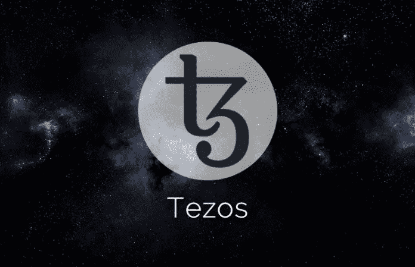

# 泰佐斯的冲突应该教给我们的 5 条原则

> 原文：<https://medium.com/hackernoon/5-principles-tezos-conflict-should-teach-us-fcc67db1ad9d>

Tezos 在 7 月份从投资者那里筹集了 2.32 亿美元。

Tezos 的“战斗”已经开始，投资者的回报受到质疑。

这令人望而生畏，因为 Tezos 最初的租户之一是一个更好的治理系统。

**原则 1:给自己一个赚钱的机会。**通过筹集 2.32 亿美元，Tezos 需要证明其长期估值至少为 2.32 亿美元。然而，作为承担风险的投资者，我们的最低期望是 Tezos 的价值需要达到 23 亿美元(初始投资的 10 倍)。事后看来，在没有客户、只有一张白皮书的情况下，这很难做到。

**原则二:牵引。**还是那句话，没有客户，没有采用，只是一张白纸。2 . 32 亿美元对一段漫长的路来说是一大笔钱。

**原则三:复制。**牵引给我们数据。允许 Tezos 扩展、优化和改进。没有什么能阻止不同的团队执行相似的想法。

**原则四:激励。金钱使人们的行为不同。面对有限的出路、生存、挑战，人们被激励去合作和解决问题。有了要失去的东西，我们担心保护他们所拥有的东西。**

**原则 5:久经考验。**在许多情况下，一年后最初的创始团队可能不是同一个团队。因此，我们看到一个团队成功地一起构建东西是非常重要的。