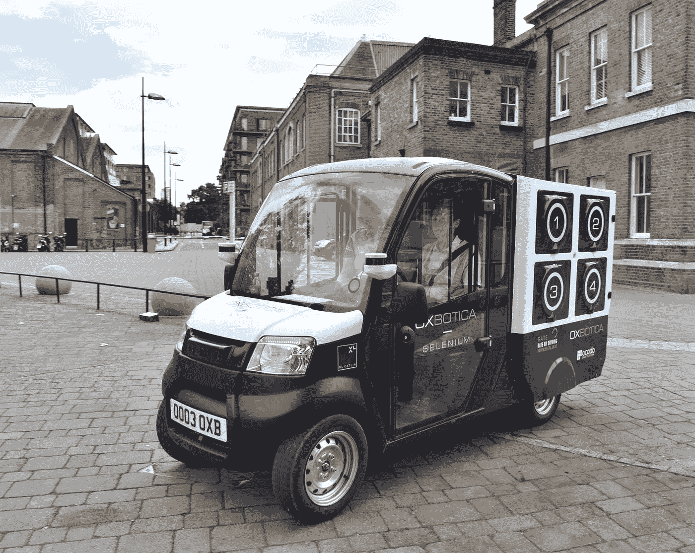

# 无人机送货要解决的 5 个现实问题(大)！

> 原文：<https://medium.com/hackernoon/5-real-problems-that-drone-delivery-is-going-to-solve-bigly-2542872c19b6>

## 对于消费者、零售商、电子商务公司和物流提供商

Credit: Matternet/Swisspost

无人机送货来了。现在的问题是何时，而不是是否。像亚马逊和谷歌这样的公司已经非常成功地围绕他们的无人机送货计划创造了轰动效应，现在普通消费者主要将无人机与可爱的飞行机器人联系起来，这些机器人将(有一天，最终)把他们的网上购物送到他们的家门口，而不是那些在中东逐一消灭 ISIS 领导人的机器人！

我自 2014 年以来一直在无人机行业工作，最近在无人送货领域进行了[市场调查](http://www.droneii.com)。我对无人机送货的经济和技术方面的深入研究使我相信，无人机送货的真正好处不仅仅是让你的披萨比送货员更快地送到你的阳台上！自主货运机器人将成为物流提供商和零售商的游戏规则改变者，特别是在最后一英里的交付方面。

**TL；你将在下面读到的博士版本可以归结为三个 T4 F T5！无人机将使送货作业 ***快速、流畅、灵活*** *。*你也可以在上面加第四个 F， ***Free*** ！之所以快，是因为无人机不会受到交通拥堵的困扰，并且可以利用整个天空来优化它们的路线，这在地面上是不可能的。送货无人机的舰队将形成由较小单位组成的流动网络，这些单位将并行工作，并可以重组，以满足物流网络的确切需求。对于客户和物流公司来说，能够提供更多(或完全)的交货时间灵活性将是一个巨大的胜利。不再有昂贵的第二次递送尝试和错过递送的恐惧(FOMD！？).最后，通过在物流价值链的各个环节使用自动化，从自动驾驶卡车到运送食品杂货的微型地面机器人，运输成本可以大幅降低。这对可怜的送货员和卡车司机会有什么影响是另一个问题！**

以下是无人机送货 c̶o̶u̶l̶d̶将解决的一系列问题(基于真实数据，例如[本报告](https://www.suasnews.com/2017/07/zto-successfully-completes-first-trial-delivery-using-drone/)):

1.  **应对高峰时期增加的需求。**在黑色星期五这样的高峰时段，物流供应商很难准时交货。我可以想象，在不久的将来，将会有一些初创公司专注于向其他公司出租送货无人机，以帮助他们补充有限的资源，包括人力和送货车辆。换句话说，我们将看到按需交付本身的按需认证！
2.  最后一英里送货的最大问题之一是**无法送货，因为客户在那个时候不在家**。为什么首先会出现这种情况，这是问题的根本原因。交付通常以固定的预定顺序发生。如果客户可以选择他们喜欢的递送时间(这已经是可能的，尽管有限)，不成功的递送尝试将成为过去。无人机送货本质上将比今天的送货卡车更加灵活，并将并行操作，而串行操作是今天唯一的方式。
3.  **自动化等于降低成本**。在世界上劳动力成本高到足以证明投资机器人是合理的地方，物流公司将实现巨大的节约。对成本节约程度的估计各不相同，但它们都指向降低的劳动力成本和更高的运营效率(参考第 2 点作为示例)。
4.  **降低或消除包装成本。很可能无人机和地面机器人对每个包裹都有单独的隔间。这不仅能为零售商在即将被丢弃的纸箱上节省一些钱，还能帮助物流公司避免处理包装不良造成的问题。**
5.  **接近 30%的服装网上订单被** [**退回**](https://www.quora.com/What-is-the-average-return-rate-for-apparel-online) **。这些退货中的很大一部分是由卖家支付的，目的是让他们的顾客满意，并减少网上购买服装时的摩擦。如果退货成为交付过程中不可或缺的一部分会怎样？你可以让无人机等待顾客试穿衣服，并退回不合身的衣服。再往前一步，实体零售空间可能会变得按需和可移动。小型无人驾驶卡车可以带着根据你的品味和体型定制的最新最热的时尚物品来到你身边！**

Oxbotica’s driverless pods, driver for safety reasons only! Credit: Oxbotica/Ocado/GATEway project

虽然成本仍然是促使客户决定选择交付方式的主要因素[，**服务质量和以客户为中心**也是影响整体客户满意度的重要因素。无人机送货将允许电子商务和物流公司以更低的成本向客户提供更多选择，并消除本地购买或在线购买之间的最后障碍。由于智能软件和机器人的出现，就像科技触及的其他事物一样，送货将成为网上购物体验中不可见的一部分。](http://www.mckinsey.com/industries/travel-transport-and-logistics/our-insights/how-customer-demands-are-reshaping-last-mile-delivery)

> 由于智能软件和机器人，送货将成为网上购物体验的一个无形部分。

> ❤如果你喜欢这篇文章，别忘了分享！