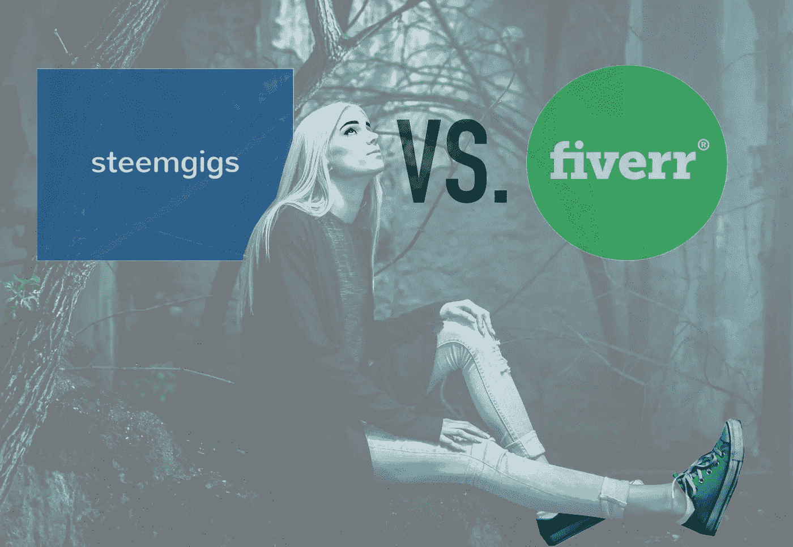
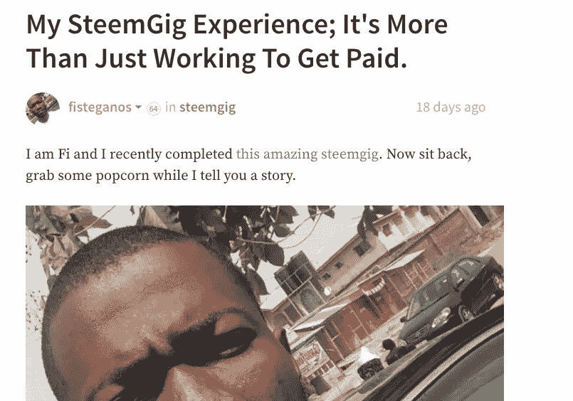
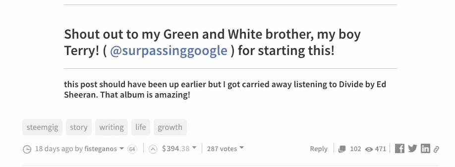
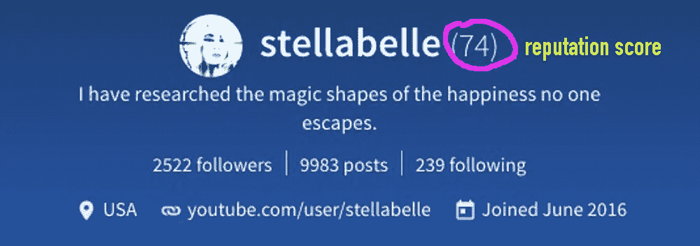
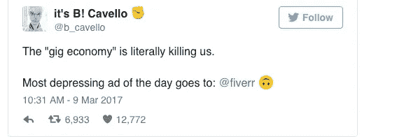
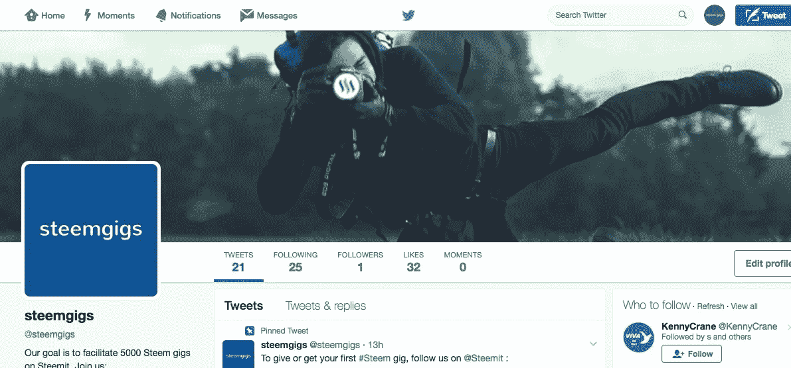
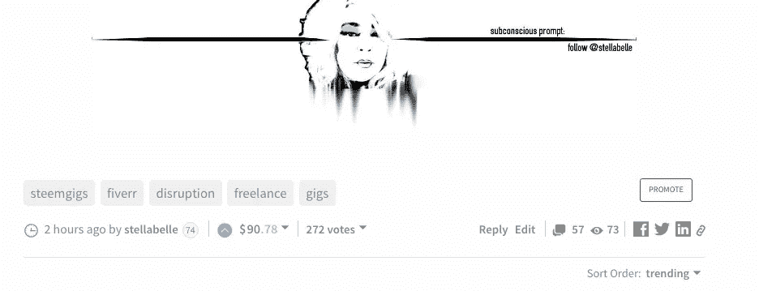

# 钢铁可能扰乱 Fiverr 的 5 个原因

> 原文：<https://medium.com/hackernoon/5-reasons-steemgigs-could-disrupt-fiverr-f303a505b478>

# 我用过 Fiverr 和 Steemit 来雇人和被雇。

我在斯提米特雇佣了作家和翻译，也在斯提米特被聘为斯提姆维基的作家。嗯，我雇佣自己为 [Steem Wiki](https://www.steem.center/index.php?title=Main_Page) 贡献一些文章，我收到的 Steem 的报酬是基于我所做的工作量。我在 Steemit 的大部分收入来自我的文章。我在 Medium 上发表文章后，会把它们复制到 Steemit 上，以赚取数字货币 Steem。现在，按照最新的汇率，1 Steem 的价值略低于 1 美元。我每篇文章赚的钱不尽相同，但我平均每篇文章赚 75 美元。

作为一名自由职业者和一名雇主，我对零工经济的未来有了很好的认识。Steemit 平台是货币化的，这意味着我在那里写的每一篇文章都会产生一定数量的钱。但是现在在 Steemit 也有兼职，还有一个官方的 [Steemgigs 账户](https://steemit.com/@steemgigs)，将寻找工作的人和提供工作的人联系起来。Steemit 是一个非常新的平台(1 岁)，但它包含 Fiverr 和其他集中化公司无法与之竞争的独特功能。

# 以下是我认为 Steemgigs 在不久的将来会颠覆 Fiverr 的五个坚实的理由。

## 1.自由职业者在 Steemit 能比 Fiverr 赚更多的钱。

我给你举一个 Steemit 用户名为 [Fi Steganos](https://medium.com/u/bf28306fb6eb?source=post_page-----f303a505b478--------------------------------) 的例子。他住在尼日利亚，那里的平均工资是每月 60 美元。他受雇于@kus-knee，为丹·拉里默的演讲写一份抄本。这是[的原始演出说明。](https://steemit.com/promotion/@kus-knee/the-old-dog-presents-my-gift-to-the-community-a-transcript-of-dan-s-awesome-interview-where-he-lauds-steem)因此，演出结束后，@kus-knee 付给[Fi Steganos](https://medium.com/u/bf28306fb6eb?source=post_page-----f303a505b478--------------------------------)50 SBD(50 美元)作为他将视频转录成文本的报酬。这两个人是由一个了不起的 Steemit 社区成员@surpassinggoogle 联系在一起的，他发起了 Steemgigs 项目。他有很好的交际能力，所以他充当中间人来帮助人们找到彼此。好了，有趣的地方来了:在 [Fi Steganos](https://medium.com/u/bf28306fb6eb?source=post_page-----f303a505b478--------------------------------) 完成他的 [Steemgig](https://steemit.com/@steemgigs) 并由@kus-knee 支付报酬后，他写了一篇关于他的经历的深度 Steemit 帖子，该帖子在网上传播开来。他从详细描述他正面经历的文章中额外获得了 394 美元。下面是这篇文章的截图:

by [Fi Steganos](https://medium.com/u/bf28306fb6eb?source=post_page-----f303a505b478--------------------------------)

这是在他的帖子底部找到的支付信息。如你所见，这篇文章赚了 394 美元，获得了 287 张选票。

关于为什么 Fi Steganos 如此成功，有几件事需要理解:他是一个非常有激情的作家，努力工作，值得信赖，透明，谦逊，也有一颗宽广的心。当我发现他的故事时，我也几乎热泪盈眶。原因如下，这是来自 [Fi 隐写术](https://medium.com/u/bf28306fb6eb?source=post_page-----f303a505b478--------------------------------)的故事:

> 我在 Steemit 上看到人们对我写的东西赞不绝口，我想知道为什么(因为，我真的不认为我做了什么特别的事情)，但也许这种感觉是因为像 [@kus-knee](https://steemit.com/@kus-knee) 这样的人主动帮助我变得更好，所以我自己都没有注意到我正在变得更好。
> 
> 今天早上早些时候，他带我回到我的[介绍岗位](https://steemit.com/introduceyourself/@fisteganos/every-creatives-story)，我有些畏缩。我以为谁会读到那篇格式糟糕的帖子呢？嗯，我现在可以说多亏了 [@kus-knee](https://steemit.com/@kus-knee) 。不幸的是，我在这里慢了下来，但我没有忘记我一直以来得到的善意。
> 
> 为了 [@kus-knee](https://steemit.com/@kus-knee) ，我会毫不犹豫地免费演出！

所以，你看到了 Steemit 的社区方面负责将人们聚集在一起？Fiverr 没有社区方面。好了，下面是[雇佣](https://steemit.com/nigeria/@kus-knee/the-old-dog-reports-in-africa-steemit-is-changing-one-life-at-a-time-meet-fisteganos) [Fi 隐写](https://medium.com/u/bf28306fb6eb?source=post_page-----f303a505b478--------------------------------)的人的推荐。我知道很多读到这里的人会因为互联网上存在的诈骗数量而持怀疑态度，但我会向你展示 Steemit 的声誉系统是如何优于 Fiverr 的。

## 2.Steemit 的信誉系统允许容易地发现值得信任的个人来雇佣。

每个用户的名字旁边是一个数字，代表他们的信誉分数。受欢迎的人、为社区做好事的人或成功的博客作者往往有较高的声誉得分。当别人给你的博客和评论投票时，代表分数就会上升。代表分数非常高的人可以通过投票让代表分数低的人大幅上升。

每个人都从 25 岁开始。事情是这样的:如果你试图拉骗局，社区会否决你，这使得你的分数更低。有一些剽窃机器人(一种叫做 Cheetah)可以检测网页上的剽窃内容。还有一个专门的团队每天搜索抄袭的帖子。一旦你的声望降到 0 分以下，你的帖子就会变灰，这意味着人们只有“取消隐藏”后才能看到它们。基本上，这是斯提米特监狱的形式。有很多方法可以摆脱困境，但这需要做很多工作，而且必须由一个声誉很高的人来做。

如你所见， [Fi Steganos](https://medium.com/u/bf28306fb6eb?source=post_page-----f303a505b478--------------------------------) 的 rep 分数为 64，考虑到他是 5 个月前加入的，这个分数已经很高了。这个信誉体系更好，因为它更全面。在 Steemit 很容易区分好人和坏人，这是因为人们会在社交网络上展示他们的真实面目。Steemit 允许人们建立远远超出“商业”范围的友谊纽带。这更类似于部落形成的方式，首先是友谊纽带，然后是商业。这是一种更自然的寻找商业伙伴的方式。此外，如果有人没有履行他们的 Steemgig，他们会立即失去他们的声誉，没有人会再与他们在 Steemit 工作。消息传得很快。

## 3.任何人都可以成为 Steemit 的股东。

因为每个人都有机会赢得 Steem 代币，任何人都可以投资 Steem 的未来财富。有了 Fiverr，你只是别人金钱梦想中的一个齿轮。你没有机会成为 Fiverr 的股东。你的选择非常有限。

每个人都可以选择是将他们的 Steem 代币放在 Steemit 内，还是换成其他货币(通常是比特币和菲亚特)。当你决定将他们留在 Steemit 内时，你会对 Steem 的价值上升更感兴趣。正因为如此，你最终想要与你的朋友和家人分享 Steemit。当利己主义占据主导地位时，你就成了斯蒂米特的有机延伸。如果 Steemit 是健康的，那么你的投资也是健康的。每个人都赢了。

## 4.Steemit 不是剥削。

[from Why I’m Leaving Fiverr For Good](/@Vortac/why-im-leaving-fiverr-for-good-7d2ed88a89c4) by [Vortac](https://medium.com/u/3976c3cb3201?source=post_page-----f303a505b478--------------------------------)

上面的图片基本上美化了剥削，许多记者在 Twitter 和他们各自的媒体渠道上对 Fiverr 进行了抨击:

Fiverr 的价格是剥削。虽然理论上尼日利亚的一些人可以在 Fiverr 上赚很多钱，但是美国的一些人却不能。对不起，但是一堆 5 美元的演出对大多数人来说是不够的。Steemit 在许多方面创造了公平的竞争环境，因为它允许任何人赚钱，而且不利用低价。一个人成功的程度很大程度上取决于许多因素，但它不是限制性的，而是更全面的。这是因为一个人的成功在于社区，而不仅仅是雇员和雇主两个人。你为整个 Steemit 社区做的越多，你赚的钱就越多(一般来说)。这就是为什么许多最成功的帖子，价格高达数千美元，都是由程序员编写的，他们花了几周甚至几个月的时间为 Steemit 编写应用程序。当他们发布他们努力工作的成果时，社区会对他们进行补偿。它确保程序员继续为斯蒂姆·区块链构建应用程序。斯提米特可以是一个孵化、培养和释放梦想的地方。这是一个完全不同于互联网上其他事物的范例。

## 5.在 Steemit 上交流不像在 Fiverr 上那样受到限制。

## 我最近读到一篇关于 Fiverr 的报道，这篇报道非常糟糕，主要原因是 Fiverr 限制性的交流规则。

显然，你只能使用 Fiverr 的平台进行交流，这意味着你不能进行 Skype 通话、电子邮件或视频会议。Steemit 在沟通方面没有任何限制，所以你可以自由地以任何方式进行沟通，无论是 Skype、电话、电子邮件、视频会议还是其他方式。这种自由让你能够深入挖掘，找到与你的商业理念产生深刻共鸣的人。我通过脸书信使与 Steemgigs 的创作者进行了长时间的交谈，以了解我们是否符合未来项目的愿景、目标和梦想。事实证明，我们的电话交谈是一种催化剂，让我意识到 Steemgigs 在改善社会方面的真正力量。如果没有那次谈话，我仍会试图评估@surpassinggoogle 的个性和品质。现在我知道，就使命、激情、同理心和动力而言，他是真材实料。

## 您现在可以在 Twitter 上关注 [Steemgigs，了解 Steemgigs 的最新动态。](https://twitter.com/steemgigs)

如果你想雇佣钢铁工人或者被钢铁工人雇佣，注册一个[Steemit.com](https://steemit.com/)账户，关注[@钢铁工人](https://steemit.com/@steemgigs)。@surpassinggoogle 和我正在共同努力扩大 Steemgigs，为自由职业者和雇主创造一些真正的价值。@surpassinggoogle 有一个帮助 5000 个 Steemgigs 的梦想，我认为一旦理解了好处，这个数字可能会高得多。

我得到通知，目前 Steemit.com 的注册有所延迟，因为有大量的人想要一个帐户。有一些其他的方法来获得一个帐户，所以为了进一步了解这个，[去这里。](https://steemit.com/news/@timcliff/new-tool-from-busy-org-create-new-steem-blockchain-accounts-with-steemconnect)以前没有这种情况，据我了解，这是因为 Steemit 在过去几个月里越来越受欢迎，所以流量比以前大了。他们正在努力解决这个瓶颈。作为一个完整的披露，我在 Steem 投入了时间和金钱。

## 我认为 Steemit 会扰乱 Fiverr 的最后一个原因是因为 Steemit 更有趣。

为通过这篇冗长的帖子而欢呼。我甚至没有涵盖所有的原因，只有主要的原因。

感谢阅读，
*Stellabelle*

阅读 Steemit 上的这篇文章，了解活跃的社区反应。

## 看看这篇文章到目前为止在 Steemit 上赚了多少，90.78 美元:

> [黑客中午](http://bit.ly/Hackernoon)是黑客如何开始他们的下午。我们是阿妹家庭的一员。我们现在[接受投稿](http://bit.ly/hackernoonsubmission)并乐意[讨论广告&赞助](mailto:partners@amipublications.com)机会。
> 
> 如果你喜欢这个故事，我们推荐你阅读我们的[最新科技故事](http://bit.ly/hackernoonlatestt)和[趋势科技故事](https://hackernoon.com/trending)。直到下一次，不要把世界的现实想当然！

