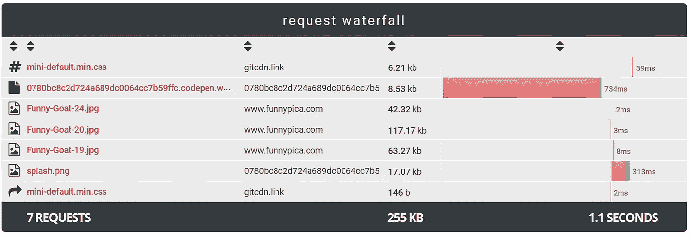
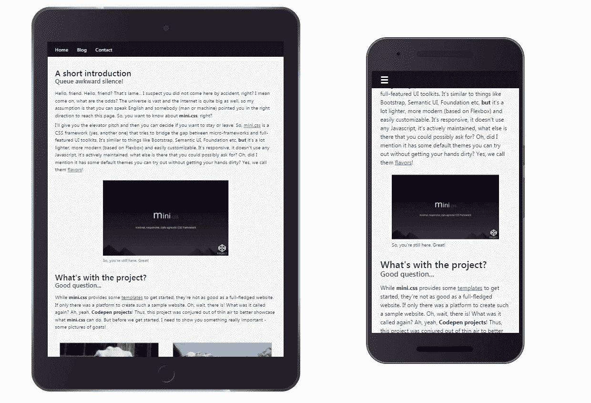
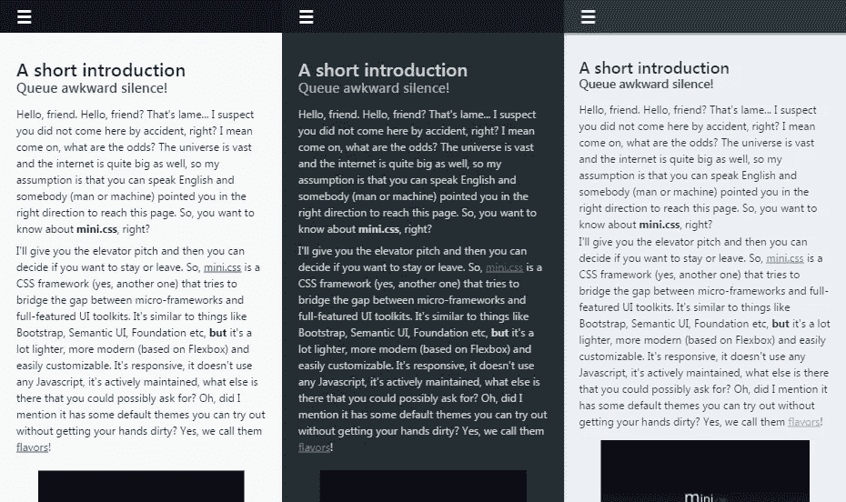

# 试用 mini.css 的 5 个理由

> 原文：<https://medium.com/hackernoon/5-reasons-to-try-out-mini-css-62ddb47b9370>

在这篇文章中，我将解释为什么 [mini.css](http://minicss.org) 是 css 框架生态系统的一个有价值的补充，以及将从使用它中受益最多的项目类型。

# 1.小尺寸

mini.css 的主要卖点在于，它是由一个单独的 css 文件**组成的，文件大小在 7KB gzipped** 之下，比许多功能齐全的竞争对手要轻很多。然而，从某种意义上说，它并不是一个真正的微框架，它提供的不仅仅是基本的样式，还有成熟的模块，可以支持复杂的网站设计和 UI 模式。

如果你对微框架不是很感兴趣，让我来解释一下:你是否曾经想在手机上用慢速连接阅读一篇文章或查看一些在线内容，却发现网站花了很长时间才加载，你最终放弃了尝试查看页面？当网站使用一个微框架来创建他们的用户界面和设计他们的内容时，这是不会发生的！

Framework load times are under 50ms

除此之外，请记住，随着物联网成为现实，对轻量级网站的需求比以往任何时候都更加迫切。在不删减任何必要内容的情况下，让你的网站更轻便的最好方法是优化 UI 风格和布局，这两者都可以通过使用 mini.css 的[模块化架构](http://minicss.org/modules.html)来实现。

# 2.适用于所有设备

对于任何网站来说，移动友好都是必须的，mini.css 旨在通过响应网格、卡片和导航来解决这个问题，这些将完全改变你的网站在移动设备上的布局，以提供更好的以内容为中心的体验，而 UI 不会妨碍用户。

Responsive layout on different devices

某些组件，如吐司消息和汉堡菜单，是为移动而构建的，在移动上提供了功能更丰富的用户体验，这与原生移动应用程序非常相似。与类似[服务人员](https://developers.google.com/web/fundamentals/getting-started/primers/service-workers)的东西搭配，mini.css 可以成为渐进式网络应用的基础构建块，感觉很像原生应用。

除了移动友好之外，可访问性是最近另一个关键的关注点，一个许多框架都难以解决的问题。虽然并不完美，但 mini.css 尽可能地为常见问题提供了可访问的解决方案，而许多功能都是基于可访问性准则而不是相反来构建的。

# 3.大量文档

大多数框架都会给你一个概述，告诉你它们能做什么，不能做什么，以及你能使用的组件列表，仅此而已。但是许多开发者需要的不仅仅是这些，更多。文档必须尽可能的广泛，即使有些事情对于库的维护者和开发者来说是微不足道的。

mini.css 采用的方法是非常清晰和一致地记录每个可能的设计模式，提供每个组件的基本和高级使用示例，同时以“该做什么”和“不该做什么”的形式添加最佳和最差的实践，使新人更容易理解他们应该如何使用框架及其所有部分。还提供了一个方便的[备忘单](http://minicss.org/quick_reference.html)来帮助有经验的用户在紧要关头找到他们需要的东西。

Multiple examples are provided for every component

此外，该框架的网站上还提供了一些[模板](http://minicss.org/templates.html)，以及一个使用 Codepen 项目构建的[演示网站](https://codepen.io/chalarangelo/project/editor/DzvxKa/)，以更好地展示该框架在现实世界示例中的使用。

# 4.易于定制

我读到的对 CSS 框架的很多批评是缺乏定制和提供的看起来普通的调色板和样式。虽然这在许多情况下是不可避免的，因为人们更喜欢约定胜于配置，但 mini.css 以[风格](http://minicss.org/flavors.html)的形式提供了不止一种默认样式，让开发人员选择更喜欢的主题，至少在某种程度上减轻了使用它所造成的损害。

Flavors can provide customization out of the box

对于那些想要完全定制他们的品牌网站的人来说，定制框架的各种模块的[文档是相当广泛的，这使得理解代码库的内部工作更加容易。改变颜色、间距和屏幕断点真的很简单，一旦你对结果满意，你就可以很容易地把它变成一种风格供他人使用。](http://minicss.org/customization/index.html)

如果你是一个超级用户，想要一个能让你改变几乎所有东西的框架，mini.css 允许你调整数百个变量到类的命名约定，这样你就可以在旧的网站上改造它或者定制它到你选择的 CMS。

# 5.为未来而建

许多 CSS 框架被构建为在遗留浏览器上工作良好，并支持过时的技术和设计模式。另一方面，mini.css 使用最新的 css 技术，只要它们得到足够的支持，就可以在所有设备上提供现代体验，同时将遗留功能保持在最低限度，确保旧浏览器可以显示一个看起来不太好，但至少是可服务的网站。

该框架设计的核心是 [Flexbox 模块](https://css-tricks.com/snippets/css/a-guide-to-flexbox/)，支持复杂的设计模式，能够在所有屏幕尺寸上快速响应和扩展。CSS 计算和图像裁剪等功能也被用来让网站看起来像是在 2017 年设计的。

 [## 3 分钟学会 CSS Flexbox

### 在这篇文章中，你将学习 CSS 中 flexbox 布局的最重要的概念，这将使你的生活更容易，如果…

medium.com](/learning-new-stuff/learn-css-flexbox-in-3-minutes-c616c7070672) 

当然，某些项目会回避这种现代方法，因为它们需要在移动设备上完全支持 Internet Explorer 和某些代理浏览器，然而，未来不需要遗留支持，随着时间的推移，越来越多的网站将不必支持过时的功能和模式，因此从长远来看，mini.css 是更好的选择。

如果这篇文章引起了你的兴趣，一定要查看框架的[网站](http://minicss.org/)和[资源库](https://github.com/Chalarangelo/mini.css)，并在下面的评论中分享你的观点和评论。

> [黑客中午](http://bit.ly/Hackernoon)是黑客如何开始他们的下午。我们是 [@AMI](http://bit.ly/atAMIatAMI) 家庭的一员。我们现在[接受投稿](http://bit.ly/hackernoonsubmission)并乐意[讨论广告&赞助](mailto:partners@amipublications.com)机会。
> 
> 如果你喜欢这个故事，我们推荐你阅读我们的[最新科技故事](http://bit.ly/hackernoonlatestt)和[趋势科技故事](https://hackernoon.com/trending)。直到下一次，不要把世界的现实想当然！

