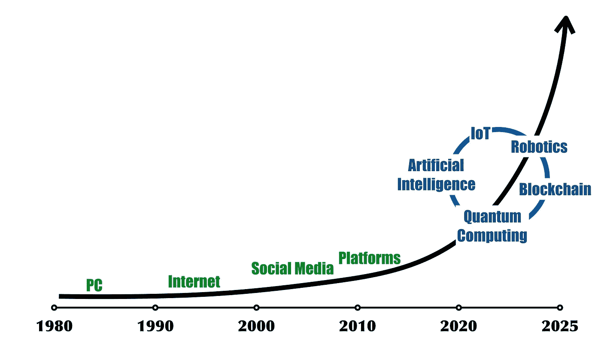
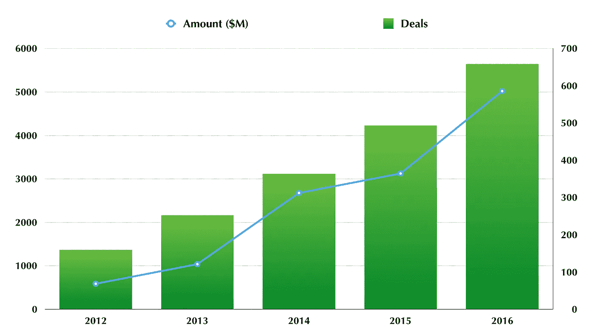
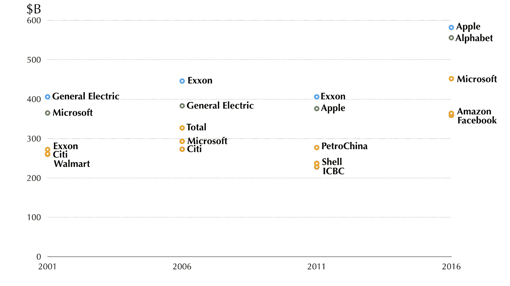
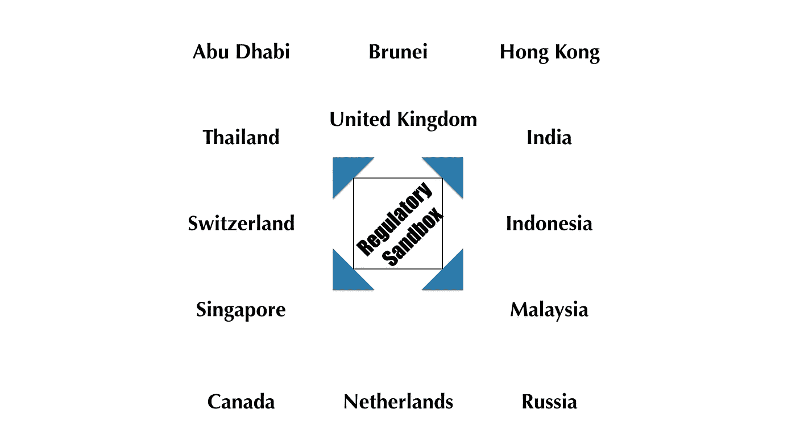

# 我们应该学习和拥抱人工智能的 5 个理由！

> 原文：<https://medium.com/hackernoon/5-reasons-why-we-should-study-and-embrace-artificial-intelligence-8ba31c4d0c7f>

## 或者，为什么怀疑论者对即将到来的人工智能革命是错误的

人工智能和深度学习背后的技术耐人寻味。但让我着迷的是，人工智能算法和应用如何迫使我们重新思考我们所知道的关于生活和工作的意义和目的的一切。

以下是我上周与同事和学生讨论过的一些问题:

> 人工智能将如何改变我们对隐私的理解？
> 
> *人工智能将如何影响我们对“所有权”的认知？*
> 
> *对人工智能指数式增长的最佳回应是什么？*

本文以金融科技为例，探讨了最后一个问题。

# 不是每个人都有同样的感觉

人工智能、机器学习和深度学习正在做一些曾经看起来不可想象的事情。他们正在改变受到严格监管的行业，如“金融服务和贸易行业”或“医疗保健和生命科学行业”。

然而，有趣的是，这些行业的“内部人士”似乎对这些新的颠覆性技术的到来做出了非常不同的反应。

以医疗保健和生命科学为例。

人工智能扮演着经验丰富的临床助理的角色，帮助医生做出更快、更可靠的诊断。我们已经看到人工智能在成像和诊断以及肿瘤学领域的应用。

机器学习有可能改善远程患者监控。人工智能算法能够从电子健康记录、处方、保险记录甚至可穿戴传感器设备中获取信息，为患者设计个性化的治疗计划。

这些人工智能相关技术加速了新药和药物的发现和创造。

业内人士有一个广泛的共识，即由于人工智能，医疗保健正在向好的方向转变。机会和潜力是无限的。

> *医疗保健将成为通过机器学习和人工智能提升和改善的行业之一。*

 [## 医疗保健如何为人工智能、机器学习做准备

### 来源:Thinkstock“人工智能”一词经常让人联想到世界末日般的景象，被…

healthitanalytics.com](http://healthitanalytics.com/features/how-healthcare-can-prep-for-artificial-intelligence-machine-learning) 

同样，新技术正在扰乱金融服务业。金融科技(Fintech)被广泛定义为利用新技术提高从在线贷款到数字货币等金融服务的效率，可以在一系列金融服务中看到。例如:

> *使用算法和机器学习评估借款人信用度的点对点借贷平台。*
> 
> *“机器人顾问”有可能实现个人理财和财富管理的自动化。他们可以帮助个人管理他们的个人账户、债务、资产和投资。*

然而，与医疗保健行业相比，金融服务行业的大多数从业者似乎对这项技术的可能性和前景持更加谨慎甚至怀疑的态度。

尽管医疗保健行业普遍认为人工智能、机器学习和深度学习将提高医疗保健的质量并改变行业，但这一观点在传统银行家和其他金融专业人士和顾问(如会计师)中并未得到广泛认同。

尽管技术正在改变行业，但对新技术潜在好处的抵制还是发生了。

# **金融行业的 AI**

“抵制”的最重要原因似乎是金融内部人士对其服务的人性或情感方面的强调。

金融服务提供商喜欢强调，金融和财富管理是一种根植于与客户打交道的个人方式的职业。一个经验丰富、知识渊博的顾问了解与他/她的客户的关系是一个深刻的、持续的和动态的过程。

根据这种观点，重要的是让客户知道，他们把钱托付给了一个真正的人，这个人理解人类的情感，并相信投资和金融服务不仅仅是投资组合优化。

在这种背景下，很容易否认一个冷冰冰的计算机器智能的潜在好处。机器缺乏人类的同理心和情感理解，这在内部人士看来是它们提供的服务的一个关键要素。

 [## 为什么机器人顾问不让我担心

### 我们经常如此痴迷于将个人投资描绘成一种产品或技术的延伸，以至于我们…

www.forbes.com](https://www.forbes.com/sites/robclarfeld/2017/05/05/why-robo-advisors-dont-worry-me/) 

> *即使我们非常注意了解客户的情感优势和局限性，但我们仍然非常不完美，因此，即使是最好的人工智能模型，有多大可能实现既可靠又可信的结果？*

这种对人工智能和自动化在金融服务领域的潜力持更怀疑态度的观点，并没有完全否认技术的作用。每个人都承认计算机算法在投资过程中有一席之地。但这个作用是“有限的”；技术是情感直觉型人类顾问手中的辅助设备。

> 这正是为什么最近对机器人顾问(自动化投资解决方案)的大量兴趣并不是我的大问题。在最好的情况下，技术可以帮助战略的实施，而不是其目的或相关性。

此外，这种对金融科技前景更为谨慎的观点似乎得到了金融科技领域初创公司命运的支持。这些公司获得了巨额投资，但通常难以扩大规模。引人注目的例子有*改善*和*财富前沿*。

在试图理解*为什么*扩大基于人工智能的金融科技初创企业的规模如此困难时，怀疑或许是最重要的原因。

许多金融专业人士似乎认为，人工智能是科幻小说，未来十年不需要适当关注。即便如此，它在我们日常生活中的实施和整合仍将受到监管挑战、恐惧和成本的阻碍。

在这种情况下，金融服务的情感和人的方面也经常被提及。根据一些研究表明，在可预见的未来，人们不太可能使用纯粹的自动财务咨询系统。

有一些经验证据支持这种说法。

根据 GfK 的一项调查，只有 10%的参与者表示，他们可能会更相信计算机算法而不是人类来给他们提供财务建议。50%的参与者不同意这种说法。45%的人表示，他们不愿意为了支付更少的费用而放弃实时客户服务。在各种各样的金融产品中，消费者最不愿意接受高影响力投资和个人抵押贷款的完全自动化客户服务。

 [## 这场辩论似乎终于结束了:机器人顾问对人类

### 在这里阅读完整的故事。

medium.com](/@LetsTalkPayments/the-debate-finally-seems-to-have-ended-robo-advisors-vs-humans-df3e0b0ae6db) 

这种对金融服务的意义的强调，无论是对客户还是对提供者来说，都不应该被轻视。它显然影响了该领域的许多思考和讨论。

## 毫无疑问，有一些问题需要克服，但这里有五个理由说明为什么这种对基于人工智能的金融科技的怀疑态度是错误的。

# (1)相互促进的颠覆性技术呈指数级增长

技术发展的速度意味着变革将比预期来得更快。

大数据和几乎无穷无尽的信息无疑将人工智能改造到了前所未有的水平。区块链技术和智能合约只会延续这一趋势。

计算能力的巨大增长，“物联网”应用的突破以及智能机器的进一步发展只会加速人工智能的发展和全球采用。

创新的不断加速将增加人工智能适应新情况和解决目前似乎不可能解决的问题的能力。

Exponential Growth of Technology

# **(2)把金融服务中对“人性”的需要视为自私的欺骗**

银行家、金融服务提供商及其顾问经常使用“个人”方面(特别是对人类情感的理解)作为反对在行业中广泛采用人工智能、机器学习和深度学习的主要论据。

然而，具有讽刺意味的是，对金融服务的意义和人性方面的强调，可能会给人以傲慢和自私的印象。对金融的欺骗、声名狼藉和庸俗的描述在今天仍然适用——特别是在 2008 年金融危机之后。

“傲慢”的银行家和金融专业人士在进行一场不真实的表演，这让我怀疑他们对人工智能和智能机器的不屑一顾。银行的等级组织和结构似乎是与银行家和他们的顾问进行“非个人的”、耗时和繁琐的互动的一个重要原因。

# (3)对新技术的投资达到“创纪录”的水平

金融行业中创新型初创公司提供的扁平层级和“点对点”机会，使它们比传统银行拥有巨大优势。

创新的人工智能应用程序(有可能减少对训练有素的专业人员的需求)只会促进“点对点交易”。

 [## 金融科技中的人工智能市场地图:100 多家公司使用人工智能算法来改善金融服务…

### 初创公司正在使用人工智能来改善和扩展信贷产品、保险选项、个人金融服务和…

www.cbinsights.com](https://www.cbinsights.com/blog/ai-fintech-startup-market-map/) 

聪明的创新者继续吸引创纪录的资金这一事实通常意味着有大事发生。这只是我们不能忽视人工智能在金融行业的另一个原因。

Global Venture Capital Investments in AI (Source: CB Insights)

# (4)人工智能和算法热门

基于算法并拥抱人工智能的公司是消费者和流行文化的宠儿。

Siri(苹果)、谷歌助手(Alphabet)、Cortana(微软)和 Alexa(亚马逊)目前已经准备好协助你完成越来越困难的任务。

人工智能、机器学习、深度学习只是一场革命的开始，这场革命将改变日常生活以及我们与技术的互动方式。

投资者和消费者看重拥抱这些新技术并逐渐将它们推向市场的公司。因此，苹果、Alphabet、微软和亚马逊最近取代传统金融机构(和石油企业)成为世界上最大的公司也就不足为奇了，至少从它们的市值来看是如此。

这些公司将不同类型的人工智能视为未来最重要的商业机会。

Source: Visual Capitalist

# (5)颠覆不需要“西部世界”——人工智能类型

在思考智能机器时，区分四种类型的人工智能是有帮助的:

***1 型*******AI***指专攻一个领域的无功机。例如，起草和审查商业贷款协议。*

* [## 摩根大通软件在几秒钟内完成了律师需要 36 万小时才能完成的工作

### 在摩根大通公司，一台学习机器正在解析曾经让法律团队忙碌了数千年的金融交易…

www.bloomberg.com](https://www.bloomberg.com/news/articles/2017-02-28/jpmorgan-marshals-an-army-of-developers-to-automate-high-finance) 

更“著名”的例子是 IBM 的深蓝国际象棋软件或谷歌的 AlphaGo 算法，对围棋棋手来说太强了。

***2 型人工智能*** 机器拥有刚好足够的记忆或“经验”，可以在特定的情况或背景下做出正确的决定并执行适当的行动。

自动驾驶汽车、聊天机器人或个人数字助理是最常用的例子。

3 型人工智能具有理解影响人类行为的思想和情感的能力。

*软银机器人*的“Pepper”可以组织大量数据和信息，进行“类似人类”的对话。

***4 型 AI*** 好莱坞电影或电视剧中典型描绘的那样。使用这种人工智能的机器具有自我意识、超级智能、感知和意识。想想*西部世界*。

 [## 理解人工智能的四种类型

### 对于人工智能研究中的最新突破，一个常见的、反复出现的观点是，有知觉的和…

www.govtech.com](http://www.govtech.com/computing/Understanding-the-Four-Types-of-Artificial-Intelligence.html) 

这里的关键点是，金融服务业中对金融科技(和人工智能)持怀疑态度的人认为，在我们拥有第 4 类人工智能(比人类更像人类的人工智能)之前，我们不能完全信任或依赖这项技术。

但这种观点是基于一种误解。对于金融服务来说，有许多已经由机器执行的核心任务。1 型人工智能可以比人类更有效地做某些事情(例如，审查标准格式的合同)。第四类人工智能还有很长的路要走，但这并不意味着金融服务业不会被其他更简单的机器智能形式彻底颠覆。

# 如何应对？

我们必须研究人工智能、机器学习和深度学习技术，以及它们的应用。

是的，我们可能仍处于开发阶段，但围绕这些新技术的各种技术和安全问题将很快得到解决。其他相关技术的发展将加快解决方案的速度。

忽视行业变革技术的到来似乎违背了我们对数字世界技术变革的所有认识。

并且，学习和理解人工智能的建议不仅仅针对技术专家、数学家和计算机科学家。每个人都应该参与这些发展。

尽管有些人表达了对人工智能的担忧，但它实际上正带领我们走向一个与我们目前经历的非常不同的未来。

我们不应该继续依赖旧的想法、原则、概念和经验。我们必须研究新的世界，以便保持相关性，并更好地理解我们周围正在出现的新的数字现实。

在金融行业，这种颠覆性技术的参与式方法最好通过建立“监管沙箱”来实现

2016 年 4 月，英国金融行为监管局(Financial Conduct Authority)宣布推出“监管沙箱”，允许初创公司和老牌公司试验和测试金融科技领域的新想法、产品和商业模式。

当然,“监管实验室”的建立在时间和用户数量上有限制。尽管如此，这一想法很快被其他希望通过允许新技术、产品和服务在监督和安全的环境中开发和测试来促进创新的司法管辖区所效仿。

Countries with Regulatory Sandboxes (or Regulatory Sandbox Intentions)

在与其他银行和金融专家讨论监管沙盒时，我听到的观点是，它们的部署只不过是一个国家表明其对创新和技术开放的战略。

在他们看来，“沙盒”并没有提供任何新的东西。监管机构通常能够免除公司和技术遵守适用的一套规则和法规，而无需将它们提交给沙箱。澳大利亚的“金融科技”豁免就是一个例子。

然而，这些观点似乎忽略了“监管沙箱”的主要优势。

让这些举措如此吸引人的不仅仅是监管者通过降低监管壁垒(以及测试颠覆性创新技术的成本)来鼓励技术创新这一事实。

监管沙盒的潜力远不止于此。

只要技术能对日常生活产生影响，这种技术就会受到讨论和民主监督与控制。通过这种方式，公众参与监管辩论的权利有助于创造一种新的合法性感，证明监管是合理的。

更重要的是，监管沙盒提供了生成与监管新数字世界相关的信息和数据的机会。它们允许沙盒中的参与者，即监管机构、现有公司、初创企业、投资者、消费者，了解新技术(如人工智能)。

他们可以创造必要的对话，帮助我们理解新技术。

它们允许协作和共同发现。

但或许最重要的是，它们创造了一个改变金融服务行业从业者思维模式的机会，让他们拥抱与人工智能、机器学习和深度学习相关的新可能性。

这是一件令人兴奋的事情。

*感谢您的阅读！请按下“心脏按钮”或留下评论。*

每周三都有一个新故事。因此，如果你关注我，你不会错过我关于颠覆性技术的指数增长如何改变我们生活和工作方式的最新见解。

> [黑客中午](http://bit.ly/Hackernoon)是黑客如何开始他们的下午。我们是 [@AMI](http://bit.ly/atAMIatAMI) 家庭的一员。我们现在[接受投稿](http://bit.ly/hackernoonsubmission)并乐意[讨论广告&赞助](mailto:partners@amipublications.com)机会。
> 
> 如果你喜欢这个故事，我们推荐你阅读我们的[最新科技故事](http://bit.ly/hackernoonlatestt)和[趋势科技故事](https://hackernoon.com/trending)。直到下一次，不要把世界的现实想当然！

*