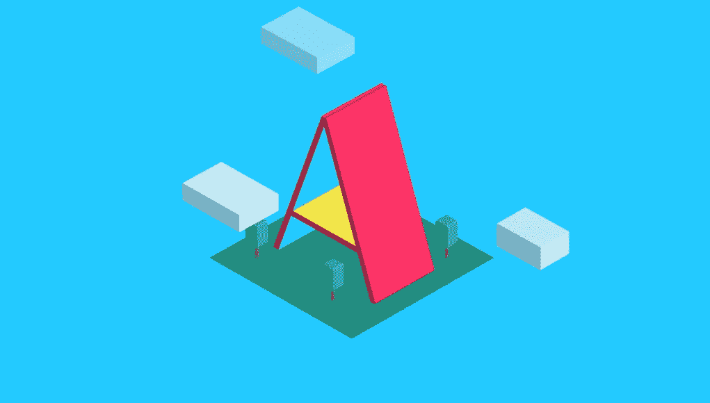
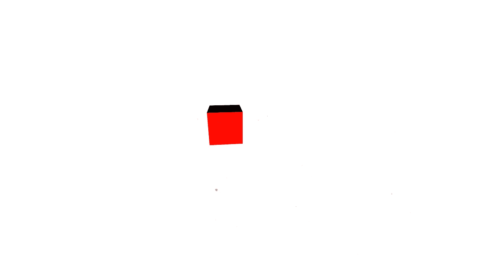

# 快速启动新虚拟现实项目的 5 个简单步骤

> 原文：<https://medium.com/hackernoon/5-simple-steps-to-quickly-start-a-new-vr-project-d9e201aa8b78>

## 在 React 中建立新的 A-Frame 项目的分步指南



A-Frame 是进入开发 [VR](https://hackernoon.com/tagged/vr) 的一个很好的方式，尤其是对于那些来自 [Javascript](https://hackernoon.com/tagged/javascript) 背景的人来说。对于那些不知道什么是 A-Frame 的人来说，下面是直接取自他们网站上“什么是 A-Frame”第一段的官方描述:

> A-Frame 是一个用于构建虚拟现实(VR)体验的 web 框架。作为 WebVR 的创始人， [Mozilla VR 团队](https://mozvr.com/)开发了 A-Frame 作为开发 WebVR 内容的最简单也是最强大的方法。作为一个完全开放的项目，A-Frame 已经发展成为最大、最受欢迎的 VR 社区之一。

本教程的目的是帮助你尽快开始使用 A-Frame，这样你就不必浪费时间去弄清楚如何设置。如果您已经设置了 react，请跳到最后一部分。如果你想看最终的设置，这里有一个 github 的链接。

如果你想看他们的官方文件，点击这个[链接](https://aframe.io)。

## 第一步:创建一个空的存储库

在本教程中，我们将这个项目称为 vr-hello-world。要创建文件夹，您可以使用终端中的`mkdir`命令或右键单击>新建文件夹。

*   在你的硬盘上创建一个文件夹，命名为 vr-hello-world。
*   前往“终端”中的 vr-hello-world 文件夹目录
*   接下来，通过键入:`git init`初始化存储库中的 git 和 yarn，在它完成设置后，`yarn init`，并按照步骤操作。
*   `touch .gitignore`创建一个*’。gitignore'* 文件
*   打开刚刚创建的`.gitignore`文件，将`node_modules`和`client/dist/bundle.js`添加到文件中。这将告诉 git 忽略 node_modules 文件夹和最终捆绑的 javascript 文件。

## 步骤 2:创建文件结构

在 project 中，将有两个主要组件，一个客户端和一个服务器。因此创建两个文件夹，并将其命名为'*客户端*和'*服务器*'。

由于该项目将使用 webpack 来捆绑 react 代码，因此在客户端文件夹中添加另外两个文件夹，并将其命名为' *src* 和' *dist*

## 步骤 3:创建服务器

这将创建一个节点/Express 服务器，无论何时调用 url，它都将为客户机提供服务。

*   在服务器文件夹中创建一个文件，并将其命名为`index.js`。
*   在终端内，键入`yarn install`并按回车键。这将安装 yarn，一个节点包管理器。
*   `yarn add express nodemon path`这将告诉 yarn 添加 express、nodemon 和 path 作为依赖项。
*   在脚本中添加`"start": "nodemon server/index.js`
*   通过将以下代码片段添加到 index.js 来设置您的服务器:

```
const express = require('express');
var app = express();app.use(express.static(__dirname + '/../client/dist'));app.listen(5000, () => {
  console.log(`listening on port 5000!`);
});
```

现在在终端中运行`yarn start`，你应该会在控制台中看到`listening on port 5000!`。

## 第四步:反应和网络打包

现在我们可以从客户端开始了。

*   首先，我们需要添加 react 的所有依赖项，并捆绑和传输我们的代码:
    `yarn add webpack babel-core babel-loader babel-polyfill babel-preset-react babel-preset-es2015 react react-dom`
*   接下来，我们来配置巴别塔。在端子类型:
    `touch .babelrc`中，在`.babelrc`内添加此:
    `{ "presets": ["latest"] }`
*   我们仍然需要配置 webpack。在终端内输入:
    `touch webpack.config.js`，然后将此添加到文件中:

```
var path = require('path');
var SRC_DIR = path.join(__dirname, '/client/src');
var DIST_DIR = path.join(__dirname, '/client/dist');module.exports = {
  entry: `${SRC_DIR}/index.jsx`,
  output: {
    filename: 'bundle.js',
    path: DIST_DIR
  },
  module : {
    loaders : [
      {
        test : /\.jsx?/,
        include : SRC_DIR,
        loader : 'babel-loader',
        query: {
          presets: ['react', 'es2015']
        }
      }
    ]
  }
};
```

*   转到“package.json”并添加以下内容:

```
"scripts": {
  "start": "nodemon server/index.js",
  "build": "webpack -w"
},
```

*   我们终于完成了设置。让我们创建一个文件来使用。进入客户端> src 并创建`index.jsx`文件。将此添加到文件中:

```
import React from 'react';
import ReactDOM from 'react-dom';class App extends React.Component {
  render () {
    return (<div>hello world</div>)
  }
}ReactDOM.render(<App />, document.getElementById('app'));
```

*   然后我们需要创建一个 index.html 文件。转到客户端>分发，创建`index.html`并添加以下内容:

```
<!DOCTYPE html>
<html>
  <head>
    <title>VR Hello World</title>
  </head>
  <body>
    <div id="app"></div>
    <script type="text/javascript" src="bundle.js"></script>
  </body>
</html>
```

*   现在我们准备好了。转到终端并键入`yarn build`，完成后，键入`yarn start`。您应该会在终端中看到`listening on port 5000!`。打开你的浏览器，输入`localhost:5000`，你会看到“hello world”印在屏幕上。

## 第五步:建立一个三角框架

*   首先安装 A-Frame 依赖项。在终端中，键入:
    `yarn add aframe aframe-react aframe-particle-system-component`
*   然后把这个加入 index.jsx(这个代码直接从 [aframe-react](https://github.com/aframevr/aframe-react) 官方回购复制过来):

```
import React from 'react';
import ReactDOM from 'react-dom';
import 'aframe';
import {Entity, Scene} from 'aframe-react';
import 'babel-polyfill';
import 'aframe-particle-system-component';class App extends React.Component {
  render () {
    return (
      <Scene>
        <Entity geometry={{primitive: 'box'}} material={{color: 'red'}} position={{x: 0, y: 0, z: -5}}/>
        <Entity particle-system={{preset: 'snow'}}/>
        <Entity light={{type: 'point'}}/>
        <Entity gltf-model={{src: 'virtualcity.gltf'}}/>
        <Entity text={{value: 'Hello, WebVR!'}}/>
      </Scene>
    )
  }
}ReactDOM.render(<App />, document.getElementById('app'));
```

现在转到`localhost:5000`，这应该会呈现在页面上:



就是这样。祝你在 VR 中玩得开心！