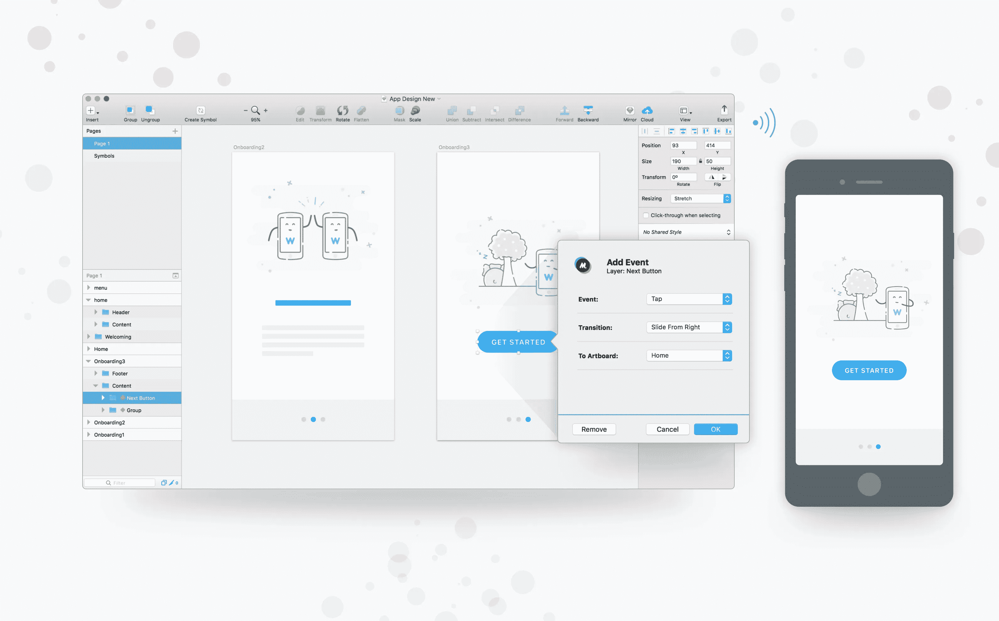
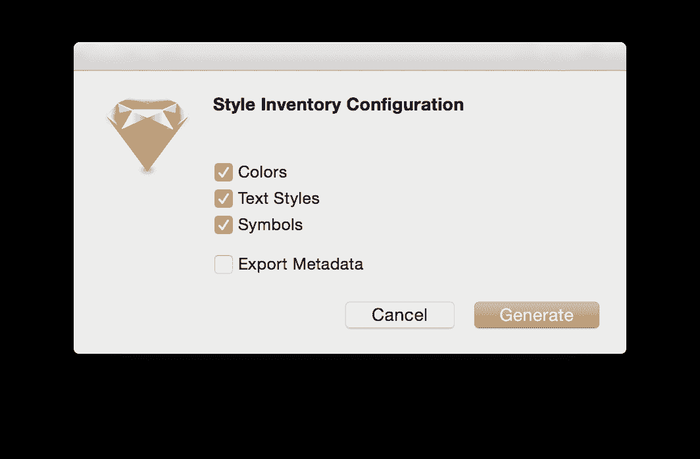

# 5 个出色的草图插件支持您的 Sympli 工作流程

> 原文：<https://medium.com/hackernoon/5-smashing-sketch-plugins-to-bolster-your-sympli-workflow-fc0cdeb963cd>

如果你是一个使用 Sketch 的 Sympli 用户，我不需要告诉你 Sketch 的 Sympli 插件有多漂亮。当你可以自信地对开发者说:“嘿，设计出来了。此外，这里还有完整的设计规格、十六进制/RGBA 色码、使用的字体列表、可下载的图像资源和简明的“品牌手册/风格指南”，以防您需要参考。然后你接着说:“尽管如此，如果有些东西看起来很奇怪或被忽略了，请在 Sympli 上对设计发表评论，并在里面给我加上标签。”—这就是生产力。

但话虽如此，如果你和我一样，你仍然会寻找方法来改善你的设计工作流程，所以让我们来看看 5 个最好的 Sketch 插件，用 Sketch 和 Sympli 提高你的设计效率。

# 1.像素完美器

我们将从[像素完美器](https://sketchapphub.com/resource/pixel-perfecter/)开始。当使用 Sympli 交付设计时，我们不希望图层在*子像素*(例如 17.3487px)上对齐。这很难看，如果开发人员在开发阶段提取这个值，代码也会很难看。此外，大多数编程语言会尝试舍入十进制数，因此这也会降低 web 或应用程序的性能，这并不理想。

Pixel Perfecter 将所有层和对象对齐到最近的*全像素*上，以实现更清晰的规格和设计移交，具有非常快速的 n' easy 键盘快捷键( **cmd + alt + P** )，还会告诉您它重新对齐了多少层/对象。

# 2.镜像 io

许多设计师都是单独工作的，因此需要像漫威应用程序或 InVision 应用程序这样的大型协作原型应用程序似乎有点不必要，尤其是当 Sympli 已经提供协作工具的时候。在一些核心功能基本相同的情况下，为两份订阅付费是没有意义的。

但是话虽如此，原型仍然很重要，即使测试只由设计师、开发人员和其他几个队友来完成。 [Mirr.io](https://mirr.io/) 是一款免费的、轻量级的、令人印象深刻的镜像应用程序，它允许你从你的草图画板中构建交互和用户流的原型，然后与你的团队分享它们，他们可以测试原型，就像它是一个完成的应用程序一样。

显然，动画功能非常基本(我的意思是，这是一个免费的应用程序)，但复杂的动画很少需要，因为它们往往弊大于利。事实上，他们在很多时候会成为障碍。

*注意:Mirr.io 需要一个桌面应用程序以及 Sketch 插件。*

# 3.草图查找和替换

不管反馈有时有多“烦人”，Sympli 都是收集有用的上下文反馈的好方法。有时，即使变化很小，也很不方便，例如，一个常用短语拼写错误。

虽然，在这种情况下，您可以使用 [Sketch Find & Replace](https://github.com/thierryc/Sketch-Find-And-Replace) ，这可以让您找到/替换那些错误(而手动方法涉及双击层，突出显示单词，重写单词，然后对每个错误实例重复这一步骤)。很糟糕，对吧？

草图查找和替换是一种更快、更有效的解决方案。

**cmd + shift + F** 是运行它所需的键盘快捷键。

# 4.给我排序

通过使用一种称为“自然排序”的方法更改画板在 Sketch 中的顺序，可以定义画板从 Sketch 导出到 Sympli 的顺序，自然排序就是它们在草图画布上出现的顺序。虽然，在重新排列画板后重新排列它们有点耗时，这就是为什么[给我排序](https://github.com/romashamin/sort-me-sketch)在这里如此有用。

相反，以一个数字开始重命名每个画板( **cmd + R** )，这样“启动屏幕”将变成“1 启动屏幕”。然后，在使用用于草图的 Sympli 插件将设计导出到 Sympli 之前，点击“排序我”键盘快捷键( **control + shift + P** )自动对画板进行排序。之后，使用 Sympli 键盘快捷键导出画板。快多了，快多了！

# 5.草图风格清单

就我个人而言，我认为没有什么比收到一份带有大量不必要的、未使用的、有时甚至几乎相同的风格的设计更糟糕了。我是说，在这种情况下你能做什么？你需要联系设计师，一个一个地澄清风格，看看两个(或更多)相似的风格中哪一个是“正确的”。

[草图样式清单](https://github.com/getflourish/Sketch-Style-Inventory)自动创建设计中使用的颜色和文本样式的视觉清单。然后，设计人员可以找到任何不一致的地方并纠正错误，然后开发人员就可以微笑着接受移交。素描风格清单使用了一系列的快捷键来选择层的颜色，名称，类似的风格等等，所以一定要记住这些！

— — —

*如果我错过了什么(我可能错过了)，当与插件配对时，草图是无止境的有用！)，让* [*我*](https://twitter.com/mrdanielschwarz) *或官方* [*的*](https://twitter.com/sympli_io) *账号在推特上知道。我们非常乐意讨论工作流程技巧，尤其是当涉及到 Sympli 时！*

***喜欢你读的东西吗？使用下面的♥按钮，将它扩展到更多的地方。跟随我们在*** [***推特***](https://twitter.com/sympli_io) ***和*** [***脸书***](https://www.facebook.com/sympli.io) ***上获取更多关于移动和 web 应用 UX/UI 的提示和小窍门并开发。***

***和，查看***[***symboli 平台***](https://sympli.io) ***帮助您通过设计版本控制加速数字产品开发过程；资产、风格、定位移交；草图、Photoshop、Xcode & Android Studio 集成；还有更多。***