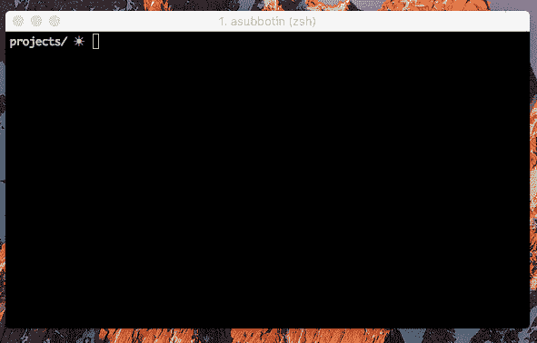
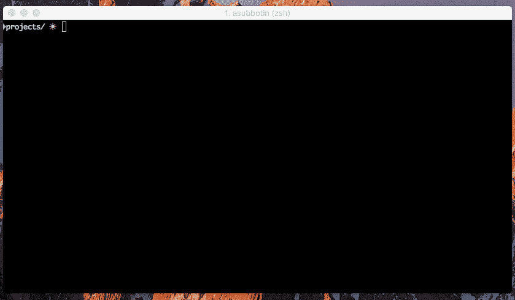
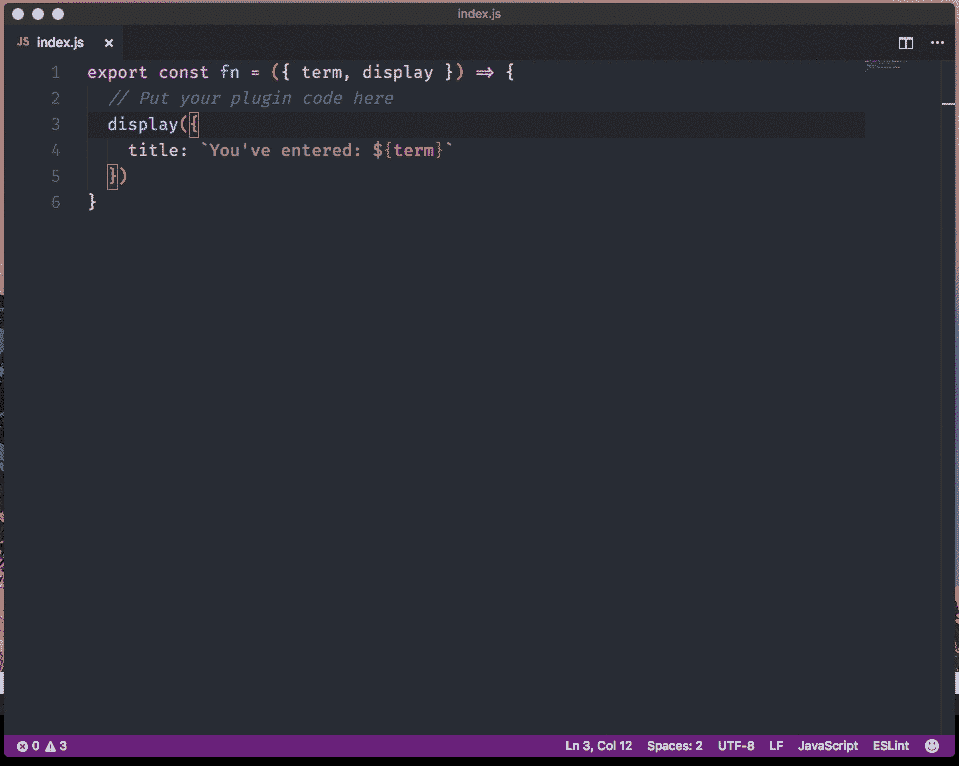

# 为你的应用建立完美插件系统的 5 个步骤

> 原文：<https://medium.com/hackernoon/5-steps-to-build-perfect-plugin-system-for-your-application-8a9dba25328a>

你曾经尝试过为桌面应用程序创建一个插件吗？那么你就会知道，这往往是一个漫长而不舒服的过程。你的插件 API 就是你的界面，这个界面越简单，使用它的人就越多，你的插件就越多。

在[为](https://hackernoon.com/tagged/development)[脑波机](https://cerebroapp.com/)开发插件系统的过程中，我定义了几个步骤来构建一个完美的插件系统。既然是[电子](https://electron.atom.io/)应用，我就分享一些 [javascript](https://hackernoon.com/tagged/javascript) 相关的细节，但主要思路适合任何种类的 app。

# 步骤 1:生成代码

在大多数情况下，当你想创建一个插件时，你可以下载一个档案，并把它作为你插件的框架。通常它包含一些混乱，这实际上与你的代码无关。有时候你不得不花时间去寻找最新的版本。所以，要做的工作太多了。

脑波强化器插件是一个简单的 npm 包。有什么方法可以生成 javascript？当然有[约曼](http://yeoman.io/)，但不是标配。[纱线](https://yarnpkg.com)更接近标准，它包括[创建](https://yarnpkg.com/blog/2017/05/12/introducing-yarn/)命令。其实很简单:`yarn create something`只是寻找名为`create-something`的 npm 包，全局安装并运行这个包中的二进制文件。最流行的例子是 [create-react-app](https://github.com/facebookincubator/create-react-app) 。

使用这句话的时间:

> 好的艺术家借，伟大的艺术家偷

如果你想做一个伟大的 javascript 包生成器——只要从 [create-react-app](https://github.com/facebookincubator/create-react-app) 那里偷点灵感就行了。React 社区在这方面做得很好！

这就是我们如何构建 [create-cerebro-plugin](https://github.com/KELiON/create-cerebro-plugin) 的，它可以生成框架并安装插件的所有依赖项，只需简单的命令:

`yarn create cerebro-plugin demo`

# 第二步:隐藏细节

create-react-app 的另一个很酷的地方是，它对开发者隐藏了所有的配置和构建过程，所以你只需要关心你的代码，而不是环境。

和插件开发有什么关系？有时应用程序需要把插件放到某个目录下才能启动。但是如果我想把我所有的代码项目都存储在一个目录中，比如`~/projects`呢？我们必须手动符号链接目录，再次:关心太多的东西…

在准备好环境的情况下，我们对开发人员隐藏这些细节和配置，只给他们一个简单的命令:`yarn start`初始化准备好的环境，因此您可以立即开始开发:

# 步骤 3:自动更新

你还记得每次修改插件代码后重启或重新加载应用程序时的那种感觉吗？真是浪费时间！特别是当你使用带有[热模块替换](https://webpack.js.org/concepts/hot-module-replacement/)的现代前端堆栈时，你会忘记刷新按钮。只要为你的插件开发者提供相同的用户体验。他们会很高兴看到即时反馈:

# 第四步:准备积木

大部分脑波强化器插件与搜索相关。每个开发人员都可以找到 npm 包来获取数据和搜索，但在这种情况下，用户体验会不一致。如果应用程序搜索会变得[模糊](https://en.wikipedia.org/wiki/Approximate_string_matching)，但其他的都不会，那会怎样？如果每个插件都有自己的 UI 元素和风格会怎样？

Photo by [Kelly Sikkema](http://unsplash.com/@kellysikkema) / [Unsplash](http://www.unsplash.com)

让我们准备好构建模块:主要功能(如果是 Cerebro，是为了更快的响应和搜索的记忆)和 UI 元素。只是把它作为一个单独的[包](https://github.com/kelion/cerebro-tools) [包](https://github.com/KELiON/cerebro-ui)提供:插件开发者会很乐意关心他们的代码*，而不是 UI 和实现细节。*

# *步骤 5:统一发布和分发*

*我记得这个时候，我不得不在论坛、GitHub 或其他地方搜索一些应用程序的扩展，而这些扩展不受应用程序创建者的支持。但是当你在一个地方看到所有插件时，我会更相信。如果你不需要离开应用程序来管理它们，那就更好了。*

*开发者也一样:提供统一的发布方式。当您使用 node 时，最好的地方是(不可预测！)npm。由于插件是简单的节点包，它可以发布到全局 npm 注册表，并通过关键字使用 [npm 搜索 API](https://registry.npmjs.com/-/v1/search?from=0&size=500&text=keywords:cerebro-plugin) 找到。*

*没有额外的工具和命令，只有一个简单的已知命令`npm publish ./`，所有用户都可以在注册表中找到新的插件:*

**

# *结论*

*看起来这篇文章的主要思想适用于一切，不仅仅是桌面应用程序和扩展:*

*   *简化一切:从想法到出版的过程应该平稳、快速、简单；*
*   *围绕你的产品改善生态系统；*
*   *珍惜开发人员的时间，并加快他们的速度；*
*   *提供一致性:开发过程、ui、行为。*

******

> *[黑客中午](http://bit.ly/Hackernoon)是黑客如何开始他们的下午。我们是 [@AMI](http://bit.ly/atAMIatAMI) 家庭的一员。我们现在[接受投稿](http://bit.ly/hackernoonsubmission)并乐意[讨论广告&赞助](mailto:partners@amipublications.com)机会。*
> 
> *如果你喜欢这个故事，我们推荐你阅读我们的[最新科技故事](http://bit.ly/hackernoonlatestt)和[趋势科技故事](https://hackernoon.com/trending)。直到下一次，不要把世界的现实想当然！*

**