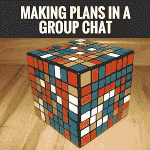
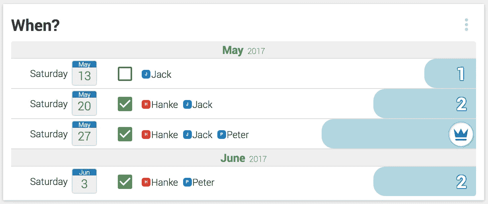
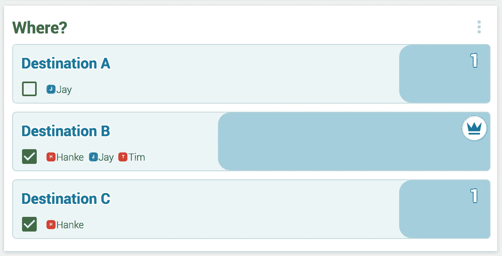
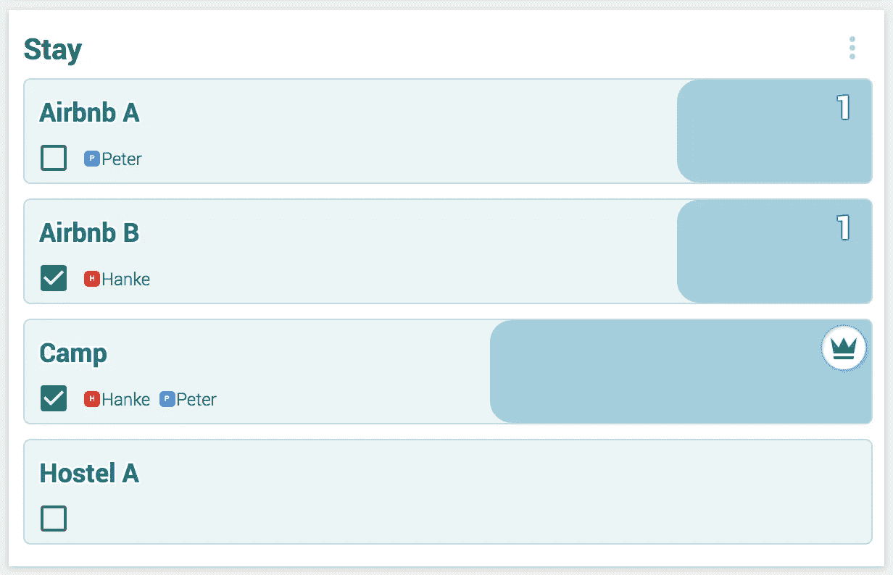
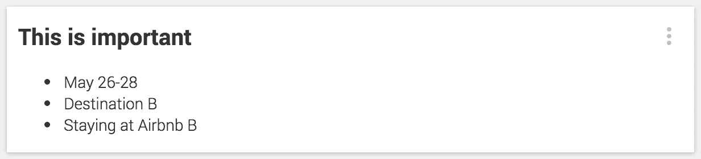

# 用 5 个步骤来计划你的下一次周末旅行

> 原文：<https://medium.com/hackernoon/5-steps-to-plan-your-next-weekend-trip-in-a-jaypad-789535bde73>

## 令人神经崩溃的群聊和邮件列表的末日到了。

每年团队 [JayPad](https://jaypad.de/) 和一群朋友去周末旅行。这成了一个美好的传统，我们一直期待着它。直到最近，我们还没有期待的是安排好整个事情:找到一个日期，一个目的地，住房，谁什么时候来。只需要无数封电子邮件和一个迅速崩溃的 WhatsApp 团队。

这就是我们建造 [JayPads](https://jaypad.de/) 的确切原因。我们想结束这种无休止的混乱沟通，认真地开始在一个团队中完成事情。它所需要的是建立一个基本上零摩擦的产品，以及一个与我们当时所知的协作软件略有不同的[概念](https://hackernoon.com/how-jaypads-help-us-build-jaypads-c66c07c6c3ae#.pcj42aavu): JayPads 在群聊中添加了第二层，可以存储更永久的信息，此外，Jay pads 不需要下载应用程序或设置帐户，这使它们成为在小组中制定计划的完美解决方案。

找到一个约会对象。这通常是任何周末旅行中最令人痛苦的部分:找到相聚的最佳时间。有相当多的工具旨在单独解决这个问题——有时还会取得巨大成功。不幸的是，这些工具似乎遵循一定的业务发展战略:免费构建一个消费产品，并交叉销售到 B2B 领域。这很少导致所述消费产品的显著发展，而消费产品更像是销售 B2B 解决方案的支柱。

我们发现，在一个团队中制定计划很少是一个一维的协调问题(寻找约会)，而是同时伴随着多个问题。

Looking to find a date? Just poll and find the time that works for everyone.

因此，当我们最终通过 WhatsApp 和 Doodle 找到周末旅行的日期时，不可避免的下一个问题是:“我们要去哪里？”。这个问题也可以是“我们看哪部电影？”，“我们去哪家餐厅？”，或者“谁在开车？”。

因此，既然我们现在已经确定，在一个团队中制定计划通常需要在不止一件事情上进行协调，如果能在一个屋檐下完成，那将会非常方便。这个屋顶是由 [JayPads](https://jaypad.de/) 提供的。

2 找到目的地。就像寻找约会一样，找到你想去的目的地非常适合民主投票——只需对想到的选项进行投票，然后作为一个群体做出决定。鳍。

Poll the destination and save time otherwise wasted with arguing.

3 寻找住房。到目前为止，你应该注意到一个模式:对主观意见重要的选项进行投票比通过聊天讨论要方便得多。当然，你可以参与到关于 Airbnb 的热烈讨论中，一个简单的旅舍或者普通的野营会是什么样子。但是，如果你只需点击一下鼠标就能决定，那么你会更快地达到目标。平局可以讨论。可以讨论增加的选项。但是拜托:投票给最终结果就好。

Looking to find consensus on where to stay? Again, a simple poll comes in handy.

4 存储重要信息。在人类历史上每一次与朋友计划周末旅行的群聊中，总有人会问“这是否与投票约会有关”或“我们要去哪个地址？”或者……这些信息可以而且应该整齐地放入一个便笺中。这可以作为你整个努力的一个贴子，帮助你们保持理智。

Make a sticky note of important information — this will keep others from asking the same questions over and over.

祝你玩得开心！愿你的周末之旅像计划的那样天衣无缝。我们建议通过[创建你自己的 JayPad](https://jaypad.de/besukaflwxumjdvy#) 直接投入其中——总有一个机会让大家聚在一起，现在你手上有了一个工具来快速设置它。

*如果你喜欢这篇文章——****请务必给我们一个关注此处的上媒以及*** [***推特***](https://twitter.com/TalkAboutJack) ***和*** [***脸书******。*** *我们将发表关于其他用例场景的文章，以及我们对协作软件的一般看法和一个年轻创业公司的历程。*](https://www.facebook.com/talkaboutjack)

> [黑客中午](http://bit.ly/Hackernoon)是黑客如何开始他们的下午。我们是 [@AMI](http://bit.ly/atAMIatAMI) 家庭的一员。我们现在[接受投稿](http://bit.ly/hackernoonsubmission)并乐意[讨论广告&赞助](mailto:partners@amipublications.com)机会。
> 
> 如果你喜欢这个故事，我们推荐你阅读我们的[最新科技故事](http://bit.ly/hackernoonlatestt)和[趋势科技故事](https://hackernoon.com/trending)。直到下一次，不要把世界的现实想当然！

