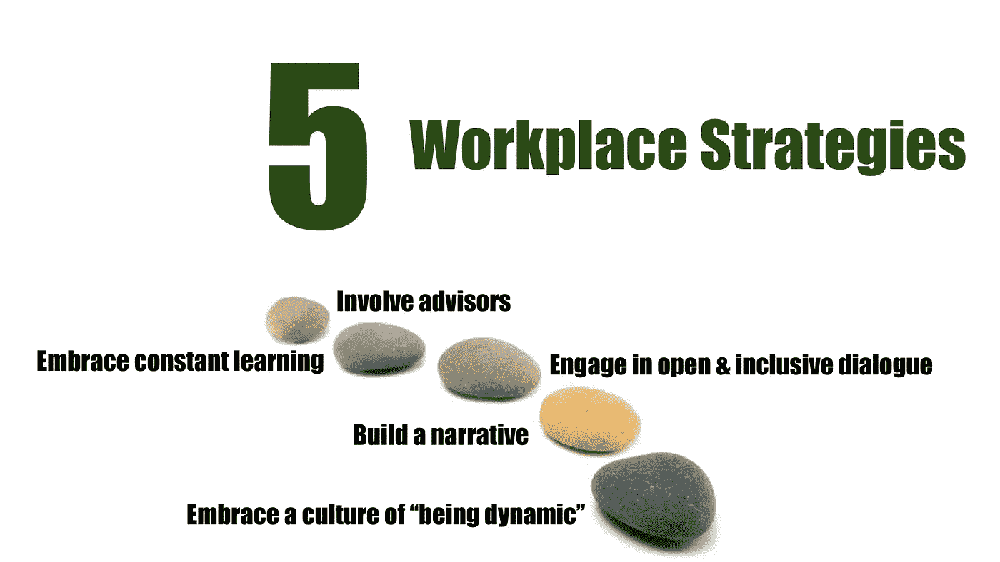

# 让您的业务更成功的 5 个策略

> 原文：<https://medium.com/hackernoon/5-strategies-that-make-businesses-teams-more-successful-eea80ded4856>

## 为什么忽视组织会让你走向失败

关于工作场所的“组织、过程和价值观”以及它们对任何成功机构的重要性，已经写了很多。例如，我们听到很多关于“良好的治理”对大公司和小公司有多重要的说法。

> 那么，为什么我们还需要关于这个话题的另一篇文章呢？

嗯，在我与初创公司和成长型公司以及该领域其他专家的讨论中，我越来越得出这样的结论:我们做错了什么。我们真的犯了一个错误。

> 简而言之，“工作场所组织”仍然被忽视或误解。

在某些方面，这并不奇怪。

拿一家年轻的公司来说。似乎很明显，创始人想把精力集中在开发他们的产品或服务上。毕竟，这是他们的兴趣和专长所在。“组织”这个词本身就是情绪杀手。这一点很明显。

尽管如此，“组织”确实很重要，我将使用这个术语作为工作场所的流程、价值观甚至文化的简称。

# **哪里出了问题**

今天的普遍观点是工作场所组织很重要。

当“做得对”时，它可以防止业务失败，但也可以帮助创造价值并为任何业务的成功做出贡献。

> 我会更进一步说，任何组织或机构都可以从更多地思考它是如何组织起来的中受益。

即使是较小的“单位”——例如团队或关系——也可以从花时间和精力思考他们如何组织自己中受益。

问题在于*我们如何应对这一关键挑战。我们经常试图找到一个“一刀切”的解决方案，一个无需过多考虑时间或情况就可以应用的成功“清单”。*

这就是事情出错的地方。

在这方面，我们必须更加明智。首先，工作场所的组织、流程和价值观是动态的，不能用“样板”解决方案来捕捉。

标准化的指导方针、政策或模板行不通有几个原因，但一个重要的原因是我们现在运作的环境。

我们都生活在一个数字时代，在这个时代，一切都在不断被打破，创新既是预期也是要求。

代替静态解决方案，我们需要设计和实施*动态*流程，帮助*审核*、*学习*和*调整*工作场所组织。

> 昨天有效的东西今天可能无效(我们甚至不谈明天)。

 [## 亚马逊杰夫·贝索斯的领导力课程

### "杰夫，第二天是什么样子的？"

medium.com](/the-mission/lessons-in-leadership-from-amazons-jeff-bezos-8144105fd62c) 

# **障碍**

大多数人同意“一刀切”的观点，认为工作场所的组织需要更有活力。但是，在实践中，说起来容易做起来难。

所有企业都发现很难实施变革，而活力的概念意味着接受一种彻底开放和变革的哲学。

当公司变得更大，或者已经存在了一段时间，并且已经形成了固定的做事方式时，变革就变得特别困难。

> 所有的组织似乎都有保守主义的自然倾向。

但是，*为什么今天的公司似乎很难对他们的组织、流程和价值观做出必要的改变？*

一般有三种回答(取决于公司所处的阶段，以及所经营的行业和市场)。

首先，大型企业通常必须遵循如何组织、治理和管理自己的“规则”。虽然偏离“规则”通常是可能的，但是大的和已建立的公司倾向于更舒适地遵守已建立的惯例。

第二，商业顾问和专家通常不愿意“跳出框框”思考。他们还倾向于推荐样板式的安排，遵循一刀切的“最佳实践”，而不是为客户提供定制的解决方案。这就是为什么专家和咨询行业经常与不符合任何“标准”商业模式的公司斗争。

第三，即使企业(尤其是年轻的高科技企业)确实偏离了方向，并且能够保持创业的感觉(通过确保创始人能够继续控制企业活动)，也不能保证长期的成功。

最近与*优步*的问题表明，“创业文化”可能在其发展的早期阶段运作得非常好。但是，同样的文化似乎对处于成长阶段的企业产生了毁灭性的影响。

 [## 优步高管:我们不能再像初创公司那样行事了

### 该公司在亚洲和拉丁美洲的首席执行官、创始人特拉维斯·卡兰尼克的朋友安德鲁·迈克唐纳如是说。…

money.cnn.com](http://money.cnn.com/2017/07/13/technology/uber-startup-culture-asia-andrew-macdonald/index.html) 

# **一种“五大战略”方法**

为了让企业和团队更好地为未来做好准备，他们必须采用有助于他们更快适应新环境的流程。

以下是克服各种障碍和迎接挑战的 5 个关键策略:

## #1 —拥抱“充满活力”的文化

首先，我们需要放弃这样的想法，即组织一个成功的企业有一个“最佳实践”的蓝图。

> 我们必须认识到，组织、团队和关系本质上是动态的，需要根据环境的需要和情况不断调整。

例如，企业的组织需要适应其发展下一阶段的具体需求。

或者，在危机期间，即在困难时期，审查和调整组织、流程和价值观以使业务再次健康发展是有意义的。

此外，企业需要适应它所面临的具体挑战。这可能涉及扩展到新的地区/国家，或处理数字时代的新商机(如人工智能、机器人和“首次发行硬币”)。

在每种情况下，组织的问题与如何应对业务挑战的实质性问题一样重要。事实上，我甚至认为组织和业务问题是密不可分的。

## # 2——建立一个叙述

为了持续评估组织，提供关于组织及其宗旨、文化和价值观的共享叙述或故事非常重要。

例如，这种叙述不仅对管理层和创始人是必要的，对企业的所有利益相关者也是必要的。

在评估企业的内部组织时，这种“个性化”的组织故事可能更有帮助——至少与“仅仅”遵循“最佳实践”相比是如此。

如果每个人都理解该组织的目标，那么每个人都可以更好地对该组织的结构和管理做出判断。

太多时候，组织叙事变成了形式主义的、打勾的练习，从某种意义上说，它们会分散人们对工作场所组织是否有助于企业目标的真正讨论的注意力。

## #3 参与开放和包容的对话

为了获得快速而有意义的反馈，重要的是任何关于工作场所组织的讨论都要开放和包容。

也就是说，它涉及到所有相关的利益相关者参与到诚实的评估中，评估事情目前是如何完成的，以及如何改进。

这意味着创造一个让每个人都感到被重视的环境。至少，每个人都觉得他们的意见会被听到。

## #4 拥抱不断的学习

这种开放和包容的对话可以为变革提供动力和投入。

它可以帮助公司了解需要做什么，并以这种方式更好地适应快速变化的环境需求。

这似乎对那些经常努力适应新现实的老牌公司尤为重要。

## #5 让顾问参与

所有公司——无论大小——都从多种渠道不断获得建议。这些顾问也很重要，至少在区分好的建议和可以安全忽略的建议时是如此。

在最好的情况下，顾问可以作为企业的一面镜子。他们有潜力在反映和检验关于企业的组织、文化和价值观的想法方面发挥至关重要的作用。

> 顾问有各种形状和大小。

他们可以是信任的“朋友”组成的非正式团体，也可以是更正式的团体，比如董事会。

无论哪种方式，这些顾问都有可能对工作场所的组织和需要解决的各种问题提供有价值的“外部”观点。

这类顾问的重要性可以通过一个关于苹果公司的故事来说明。1997 年，史蒂夫·乔布斯回归后，*苹果*处于极度危险之中，前途未卜。然而，在 1997 年 8 月 6 日于 T4 举行的 Macworld Expo(T5)的主题演讲中，乔布斯明确地回避了新产品的发布，而是在演讲中披露了四名他亲自挑选的新董事会成员(顾问)的任命。

 [## 重要的史蒂夫·乔布斯时刻:Macworld，1997 年 8 月

### 视频在过去的一周里，有很多人向史蒂夫·乔布斯致敬，并播放了他著名演讲的精彩片段…

www.forbes.com](https://www.forbes.com/sites/connieguglielmo/2012/10/07/a-steve-jobs-moment-that-mattered-macworld-august-1997/#74e667173edd) 

乔布斯坚信，改变董事会的组成是关键且必要的第一步，可以让公司重新获得关注、愿景和相关性。

只有这样，它才能“开始”向潜在客户推出颠覆性创新和创造性产品的旅程。

二十年后，*苹果*是世界上最大和最有影响力的公司之一，拥有多条创新和改变生活的产品线。

> 这种成功的部分原因是对“五项战略”的重要性的认识，特别是顾问的关键作用。

# **那么，接下来呢？**

> 工作场所的组织对建立一个成功的企业至关重要。

事实上，任何机构、团队或工作关系都可以从思考它们是如何组织起来的中受益。

然而，现在有一种趋势，要么忽视这个问题(口头上支持这些想法，但实际上没有做任何事情)，要么把工作场所组织的不同元素——流程、文化和价值观——视为或多或少的静态概念。

这两种反应都是错误的，因为它们正在为未来制造问题。

迟早，忽视组织或不欣赏其动态特征会回来困扰一个企业(单位、团队或关系)。

在这方面，确保叙事构建、开放对话、动态学习和自我反思成为一家公司 DNA 的一部分要好得多。

我不期望“组织”的问题突然变得令人兴奋。但是，我确实相信，通过更多地关注组织的“为什么”、“如何”和“是什么”，我们可以在一个以不断创新和颠覆为特征的数字时代增加真正的价值。

这很重要，我敢说也很激动人心。

*感谢您的阅读！请点击*👏*(想点多少次就点多少次)下面，或者留言评论。*

每周都有新的故事。因此，如果你关注我，你不会错过我关于数字时代如何改变我们生活和工作方式的最新见解。