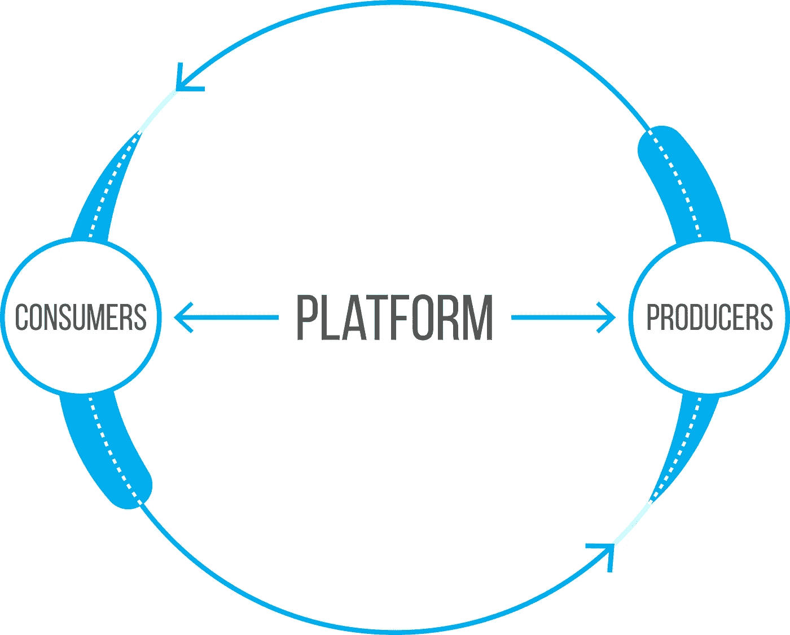

# 一家大型平台企业的 5 名租户

> 原文：<https://medium.com/hackernoon/5-tenants-of-a-monster-platform-business-d02697f45298>

最有价值的业务一直是平台业务，并将继续是平台业务。谷歌、脸书、优步、亚马逊都是平台。

并非所有的平台都是一样的。我们如何识别一个伟大的平台业务？

1.  **数据丰富。**收集大量数据。
2.  **自我变异。**利用数据，随着时间的推移变得更好。想想数据科学和机器学习。易用性、转换率、粘性随着时间的推移而增加。
3.  **网络效应。**增加一个用户可以增强所有其他用户的体验。
4.  **一对多。**多一对多关系不多一对一关系。Snapchat 还是 1:1。Instagram 是一对多。苹果应用商店一对多(开发者对消费者)。
5.  **可扩展性。**增加更多用户可以线性增加收入/利润，而几乎不增加成本。

➞Please **分享**这篇文章，如果你认为它会帮助别人。

➞Get 我最擅长的写作， [**报名参加我的简讯**](https://docs.google.com/forms/d/e/1FAIpQLSeX8Hu86LMIIBiya-9jijTXgKVNLUOHUue_hOAO3uPIxt0NfA/viewform?usp=sf_link) 。