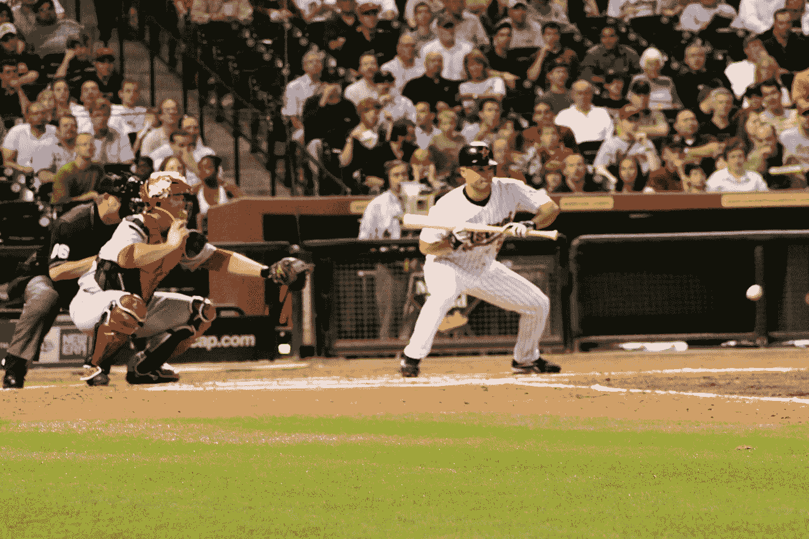

# 我从看棒球中学到的关于生产力和成功的 5 件事

> 原文：<https://medium.com/hackernoon/5-things-baseball-taught-me-about-productivity-and-success-70ad273a4aa9>

credit: [Ed Schipul](https://www.flickr.com/people/eschipul/)

类比是有帮助的。它们可以帮助我们用新的有用的方式思考问题。他们帮助我们理解复杂的事情，我们对这些事情有很大的偏见，通过使用一些我们几乎没有偏见的东西。每当我找到一个有用的类比，我都会试着分享它。因此，当我今年非常关注棒球的时候(当然是为了看我心爱的球队赢得世界职业棒球大赛)，我观察到了一些在球场上非常有用的建议。

下面是几个特别好的。

1.  **生产力并不等同于高容量、高频率的输出。对于击球手来说，4 次击球中有 1 次成功被认为是好的。这意味着即使是最优秀、最有效率和最成功的击球手，失败的几率也是成功的 3 倍。**
2.  **积极忙碌并不是成功的关键**。游戏中的大部分体力活动在任何给定时间都集中在 2-3 名玩家身上。场上的其他人在观察、准备和等待。他们知道什么时候该采取行动，并且时刻准备着。
3.  **大的、炫耀性的行动很少比小的、战略性的行动更有价值。一个棒球有力地击打 450 英尺，赢得观众的欢呼，可以获得与在正确的时间在本垒板前 10 英尺击中的短打相同或更少的分数。一种更罕见，需要更多的力量和能量。另一种需要准备、智慧和时机，但几乎没有力量和精力。**
4.  ***你什么时候*行动和*如何*行动**一样重要。在投球时提前或推迟 0.3 秒的摆动可能是成功击球和失败击球的区别。花时间感受时间和条件是非常值得的。
5.  **在许多情况下，有纪律地*而不是*行动比采取快速行动**更有价值。对于击球手来说，最好的击球往往是站着看着球飞过而不采取任何行动。它们包括克制采取迅速果断行动的冲动。

喜欢你读的书吗？通过 [*订阅我每周一次的简讯*](http://tinyletter.com/mike_sturm)*——*羊毛采集*获取更多。没有垃圾邮件，我不会淹没你的收件箱。*

> [黑客中午](http://bit.ly/Hackernoon)是黑客如何开始他们的下午。我们是 [@AMI](http://bit.ly/atAMIatAMI) 家庭的一员。我们现在[接受投稿](http://bit.ly/hackernoonsubmission)，并乐意[讨论广告&赞助](mailto:partners@amipublications.com)机会。
> 
> 如果你喜欢这个故事，我们推荐你阅读我们的[最新科技故事](http://bit.ly/hackernoonlatestt)和[趋势科技故事](https://hackernoon.com/trending)。直到下一次，不要把世界的现实想当然！

