# 我从对 Spotify、Apple Music 和 Deezer 的比较研究中学到的 5 件事

> 原文：<https://medium.com/hackernoon/5-things-i-learned-from-my-comparative-study-of-spotify-apple-music-and-deezer-fe8512022ae1>

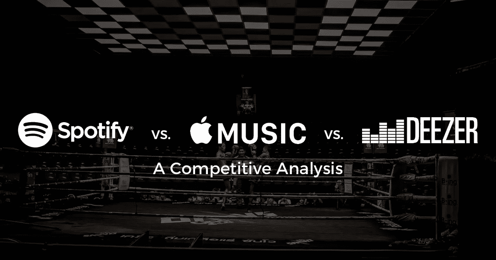

Original photo by Frida Aguilar Estrada at [Unsplash](https://unsplash.com/photos/tSiDSZEr4UQ); Logos are from the respective companies

最近为了我们的信息技术创业课，我们学生被分成小组，每组要对比分析一套相关的 app。

我们小组决定分析音乐应用程序，特别是那些最受欢迎但在菲律宾也可以访问的应用程序。所以我们选择了 Spotify，Apple Music 和 Deezer。

我们分析了每个应用程序的历史、功能、UX 设计和营销策略。以下是我从我们作为一个小组所做的研究中学到和发现的五个教训。

# #1:你的用户数量和成功与你运营的时间长短无关。

> “成功不会自己跑来找你，你必须走出去获得它。”

Spotify 于 2006 年由丹尼尔·埃克和马丁·洛伦佐在瑞典正式创立。从那时起，截至 2017 年 7 月，它已经发展到拥有超过**1.4 亿活跃用户**和**6000 万付费用户**。

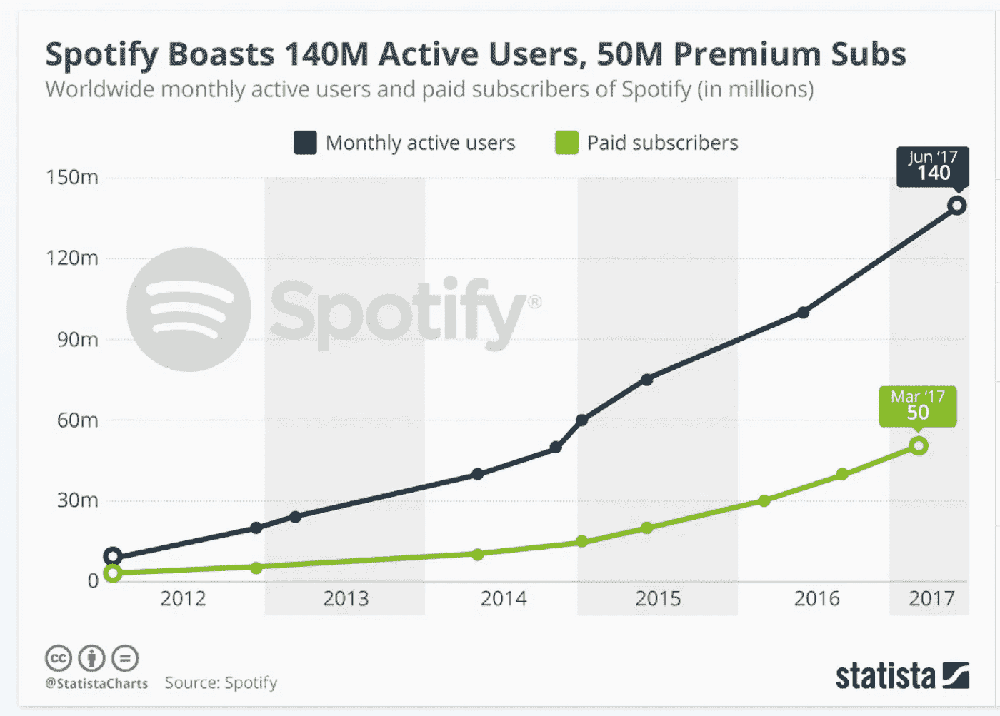

[Spotify’s user growth](https://www.statista.com/chart/3131/active-users-and-subscribers-of-spotify/)

另一方面，Deezer 差不多也是同时成立的。早在 2007 年，丹尼尔·马尔赫利和乔纳森·本纳撒亚就创建了这家公司，并在巴黎运营。Deezer 在功能方面也与 Spotify 相似。

然而，Deezer 目前**截至 2016 年 12 月只有 1000 万活跃用户，**截至 2017 年 1 月有 690 万付费用户。它现在主要专注于拉丁美洲、非洲和亚洲的选定市场。

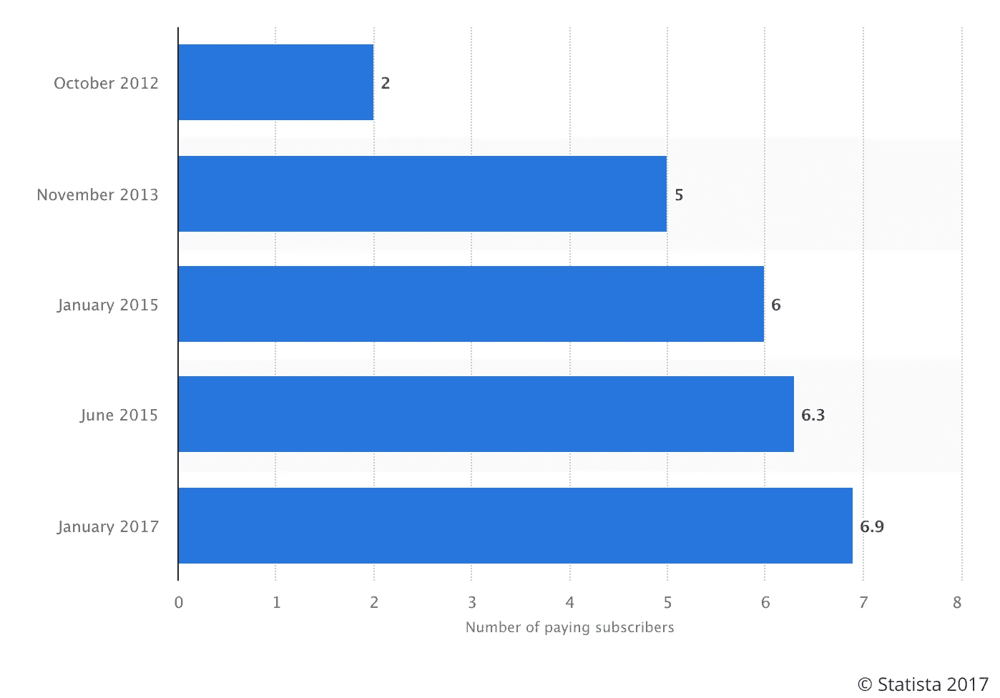

[Deezer’s paid subscribers](https://www.statista.com/statistics/321559/deezer-paying-subscribers/) are growing, but not growing that fast

同时，Apple Music 在 2015 年 6 月 30 日才**推出。然而，截至 2017 年 9 月**，它已经拥有了**3000 万付费用户。**

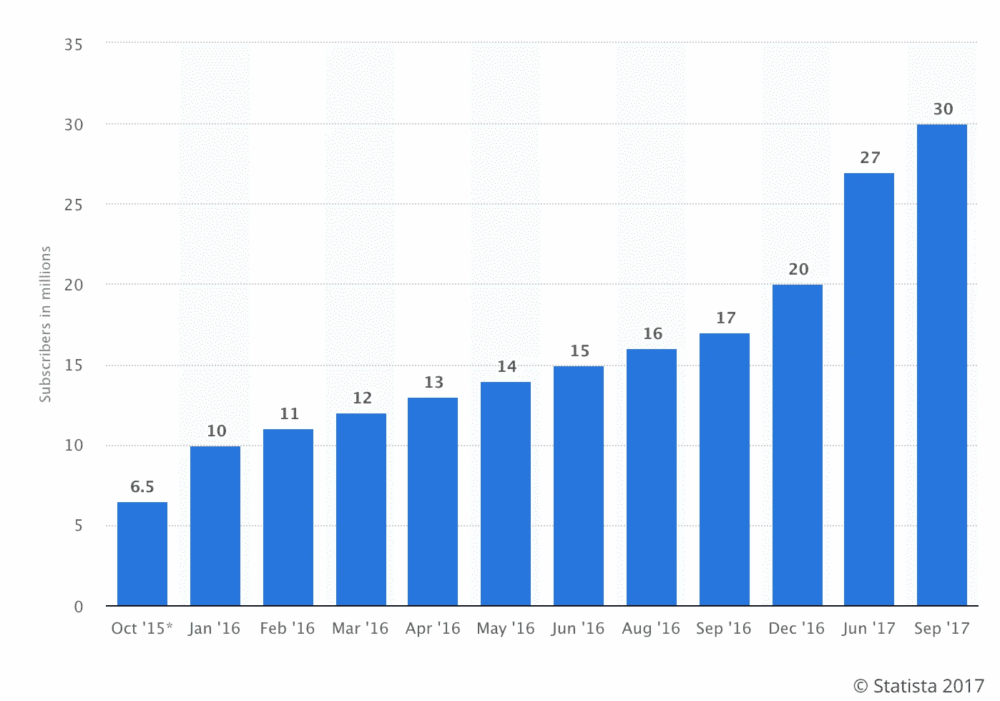

Apple Music is catching up to Spotify. In just 2 years, they have [half as many paid subscribers](https://www.statista.com/statistics/604959/number-of-apple-music-subscribers/) as Spotify.

当然，Apple Music 受益于苹果的品牌及其与唱片公司的合作关系，此外，它在推出后，所有新 iPhones 上都可以使用该应用程序。但当我得知他们在短短两年内就有这么多付费用户时，我还是很惊讶。

# #2:应用程序不能不互相复制

> "别人能给你的最好的赞美就是模仿你."

正如我们在脸书和 Instagram 如何复制 Snapchat 的功能中看到的那样，音乐应用也喜欢复制彼此的功能。他们甚至互相抄袭对方的定价:

P129 = 129 Philippine Pesos, which is only 2.54 USD. Spotify is way cheaper in the Philippines than in the US.

正如你在上面看到的，所有三个音乐应用程序的高级和家庭计划价格相同。唯一的关键区别是 1) Apple Music 没有免费计划，2) Spotify 在菲律宾将他们的家庭计划定价便宜了 5 比索。

此外，这三个音乐应用程序的免费和付费版本都有相同的基本功能(苹果音乐除外，因为它没有免费版本):

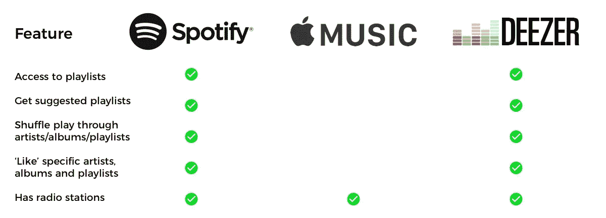

Spotify and Deezer’s free plans have the same features

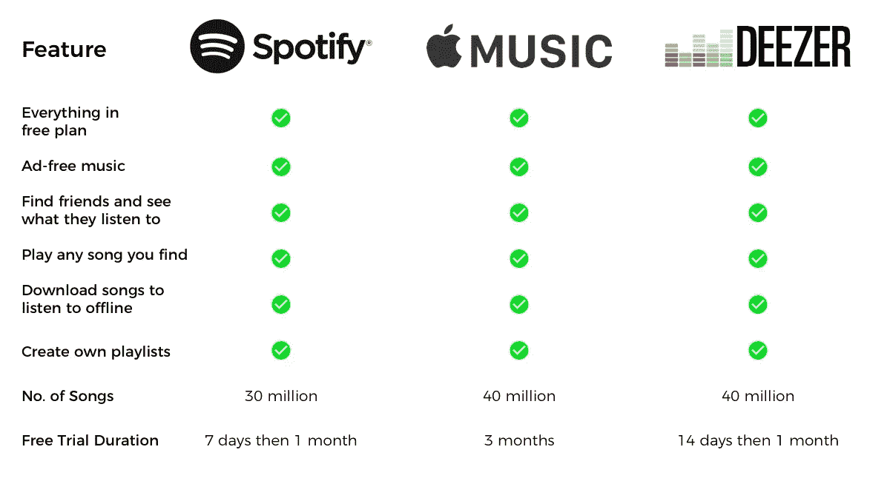

All 3 apps have the same base set of features for their paid plans

Spotify 在其定价和功能方面是真正的潮流引领者，他们是这一领域的领导者，所以 Apple Music 和 Deezer 复制他们的定价和功能是明智的。但这引出了我的下一个观点:

# #3:如果没有什么能让你的应用与众不同，我就没有理由把它放在手机上

> “不要害怕与众不同；怕和别人一样。”

对于小组工作，我们将研究的不同部分分开，这样我们小组中的每个人都有工作要做。我自愿分析每个应用程序的 UX 和功能，因为我对它们的差异非常好奇。

我自己是一名 UI/UX 设计师，最近也实习过，我想用这个练习来评论每个应用的 UX 和特性。

我已经是 Spotify 的用户 3 年了，也是几个月的高级用户，但是我没有用过 Apple Music 和 Deezer。

所以在这项研究中，我下载并注册了每个应用程序，就好像我是一个新用户一样，即使是 Spotify。我尝试了所有应用程序的免费版本和付费版本。

以下是我发现的每个应用在付费计划中的差异化特征:

## Spotify 的独特功能(4):

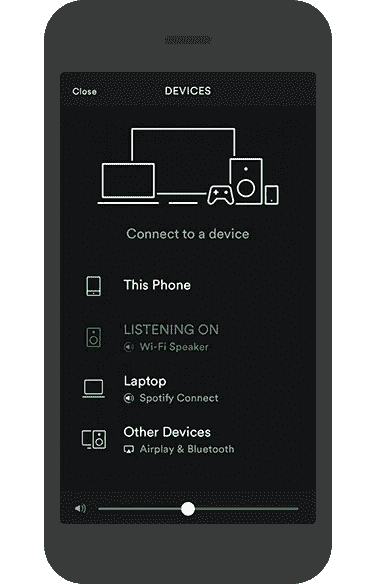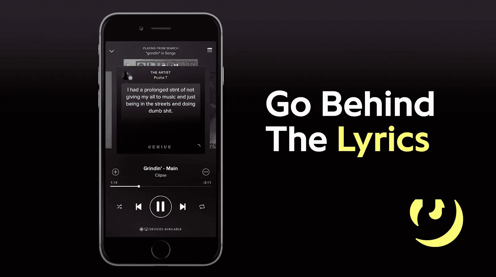

[Connect](https://www.scdn.co/i/connect/rockout.png) and [Behind The Lyrics](https://i.ytimg.com/vi/nbzcUUCfY9Q/maxresdefault.jpg)

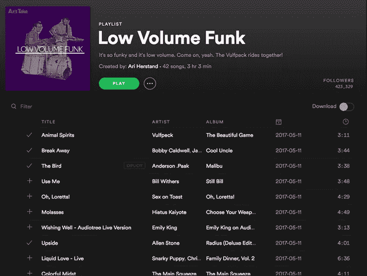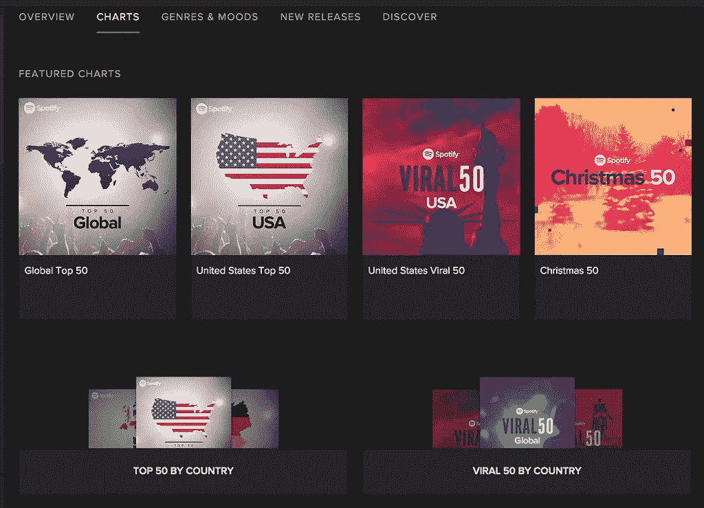

[Public Playlists](https://www.digitalmusicnews.com/wp-content/uploads/2017/06/spotify-playlists-5.jpg) and [Top Charts](https://spotify.i.lithium.com/t5/image/serverpage/image-id/32319iDE2F0CFAD6209BEA?v=1.0) for your country

Spotify 有四个与众不同的特点。Spotify Connect 允许您将一台设备用作另一台设备的 Spotify 遥控器。在歌词后面，您可以查看歌曲的歌词和琐事。虽然 Apple Music 也可以让你听朋友或其他人的播放列表，但 Spotify 的公共播放列表肯定更受欢迎，使用也更广泛，所以我会称之为 Spotify 的差异化功能。

## **Apple Music 的差异化特色(1):**

与此同时，Apple Music 只有一个与众不同的特点:它的“连接”功能。此功能可让您在 Apple Music 上看到您喜欢的艺术家的更新。事实上，当你第一次进入苹果音乐时，你会看到他们最近的帖子。也可以评论和点赞。

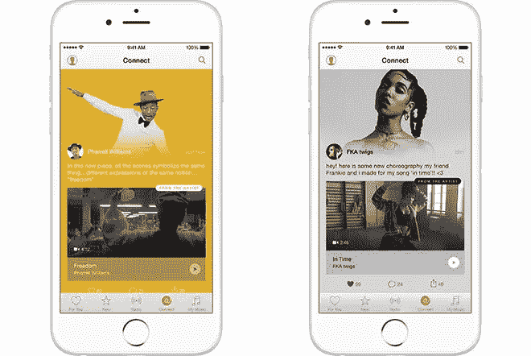

Apple Music’s [Connect](http://photos2.insidercdn.com/gallery/13411-8120-13215-7794-150610-Connect-l-l.jpg) feature

虽然其他应用程序没有这样的功能，但大多数粉丝习惯于在 Twitter、Instagram 和 Snapchat 等其他平台上看到他们的艺术家的更新，所以很难看到这种方式流行起来。

## Deezer 的独特功能(2):

最后，Deezer 实际上有 2 个与众不同的功能:它的流播放列表和它的“卡拉 ok 风格”的歌词功能。

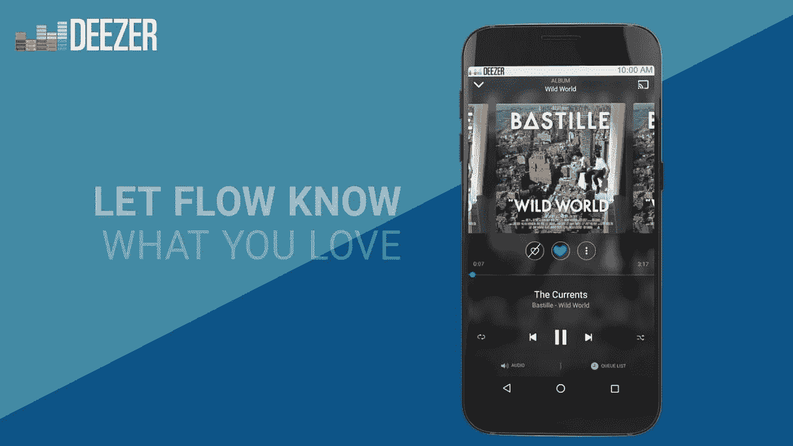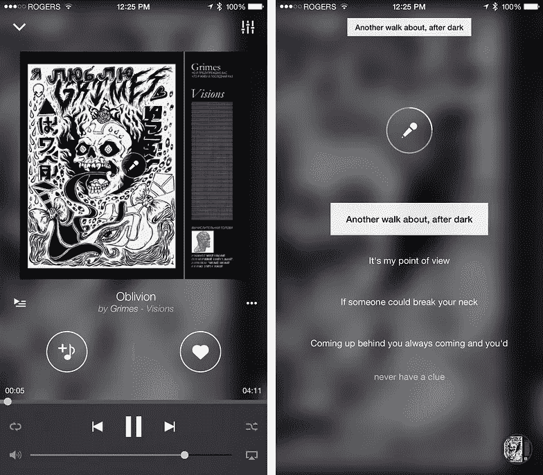

Deezer’s [Flow Playlist](https://i.ytimg.com/vi/ykbaMNaGLgc/maxresdefault.jpg) and [Lyrics](https://cdn.mobilesyrup.com/wp-content/uploads/2015/01/deezerlyrics-ios.jpg) Features

Deezer 的流播放列表基本上是该应用程序的主要播放列表。它会根据你在 Deezer 上“喜欢”的艺术家、歌曲和专辑，播放它认为你会喜欢的歌曲。

当我使用它的时候，它确实播放了我喜欢的歌曲，我喜欢它的简洁。当你打开应用程序时，Deezer 将 Flow 作为主要部分，因此它不会让你迷失在其他播放列表中。如果你对你听的东西不太挑剔，不想迷失在选择中，这是非常完美的，我在 Spotify 经常这样做。

此外，Deezer 的卡拉 ok 风格的歌词是独一无二的。基本上，歌词在歌曲中唱的时候会被突出显示，这样更容易记忆和跟着唱。Spotify 只向你展示了一些歌词，而 Apple Music 只是在底部以文本块的形式向你展示歌词，所以 Deezer 在这方面肯定是赢家。

# 我如何给他们排名:

因此，如果我必须根据 UX 和功能对这三款应用进行排名，我会将 Spotify 排在第一位，Deezer 排在第二位，Apple Music 排在第三位。

虽然 Apple Music 是一款制作非常精良的 app，但是 Deezer 的卡拉 ok 风格的歌词和 Flow 播放列表使其与 Apple Music 有所区别，比 Apple Music 更有用。

也就是说，我不明白为什么有人会永久地从 Spotify 转向 Deezer 或 Apple Music，原因就在于此:

# #4: Spotify 的功能和网络效果让用户很难切换到新的应用程序。

> “一家未来拥有大量现金流的公司会是什么样子？…它们通常具有以下特征的某种组合:专有技术、网络效应、规模经济和品牌效应。”—彼得·泰尔

2009 年，马克·扎克伯格在脸书发布了一条著名的状态:

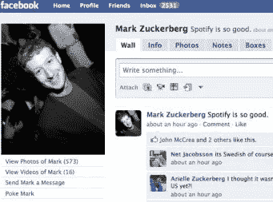

mhmm, Spotify is so good

两年后，Spotify 启动了与脸书的整合。这对 Spotify 的流行至关重要，因为用户现在可以在脸书上看到他们的朋友在听什么，然后去 Spotify 听。

Spotify 在那之后起飞了，正如你在下面看到的，他们已经成倍地增加了付费 Spotify 用户的数量。这是网络效应的真实结果。随着越来越多的人使用 Spotify，它变得越来越有价值和有用，所以它一直在增长。

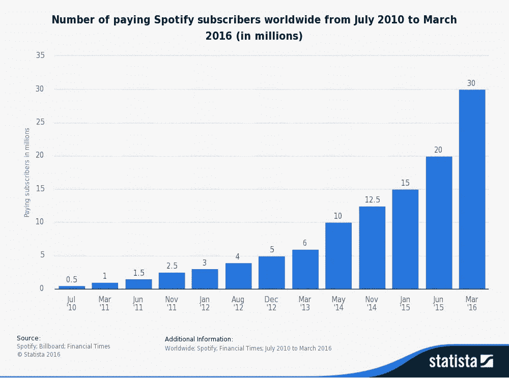

[Picture credit](http://gaetanosacco.net/wp-content/uploads/gaetanosacco-net/sites/1456/statistic_id244995_number-of-paying-spotify-subscribers-worldwide-2010-2016.png)

因此，如果你现在是 Spotify 的用户，你的大多数朋友可能也是。转换音乐应用程序的成本如此之高，以至于你永远都不想离开 Spotify。你必须重新下载所有你喜欢的歌曲，重新创建你所有的播放列表，而且你将无法在新的音乐应用程序上访问你在 Spotify 上关注的播放列表。

这让我想到了我的最后一个观点:

# #5: Spotify 未来将继续成为音乐应用中的领导者。

虽然在这项研究之前，我就有预感 Spotify 会有最好的 UX 和功能，但做这项比较研究让我意识到为什么它们更好。

他们的特色、网络效应、营销策略都很出彩。当然，他们仍然有他们的问题——毕竟，[他们仍然没有盈利](https://www.cnbc.com/2017/10/12/report-on-spotify-earnings-h1-2017-revenue-loss-margins-growth.html)，并且每年继续亏损数百万。但只要他们继续创新，接触到更多用户，Spotify 将永远是这里的市场领导者。

# 连接更深

如果你喜欢这篇文章，请点击这个按钮或者在下面留下你的回复！每一次鼓掌都让我的作品接触到更多的人:)

Brian Tan 是一名来自菲律宾的 20 岁的作家、UI/UX 设计师和前端 web 开发人员。他还是 [*HangTime*](http://hangtimeapp.com) *的联合创始人兼首席执行官，这是一款帮助学生创建并相互分享课程表的网络应用。在 brian@hangtimeapp.com 和他联系。*