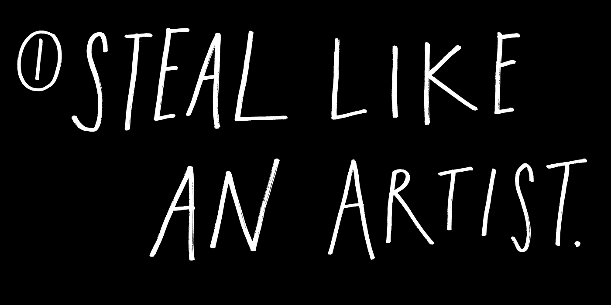
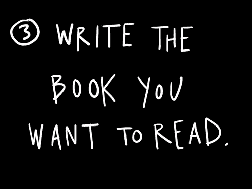
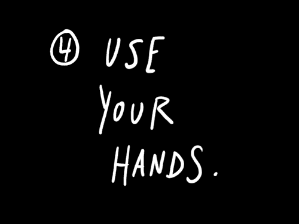
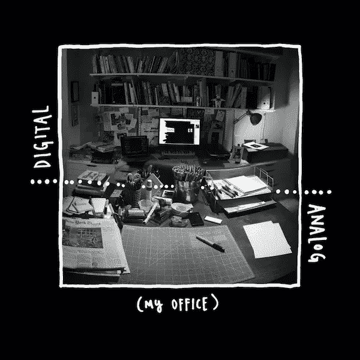
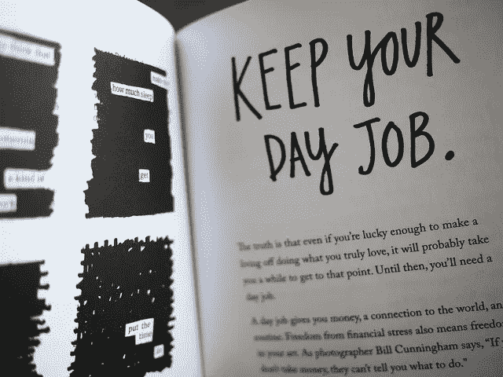
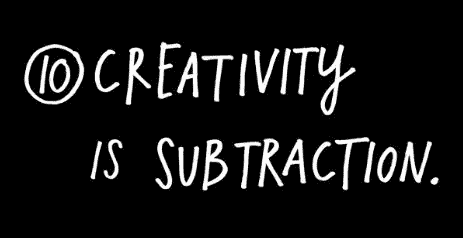
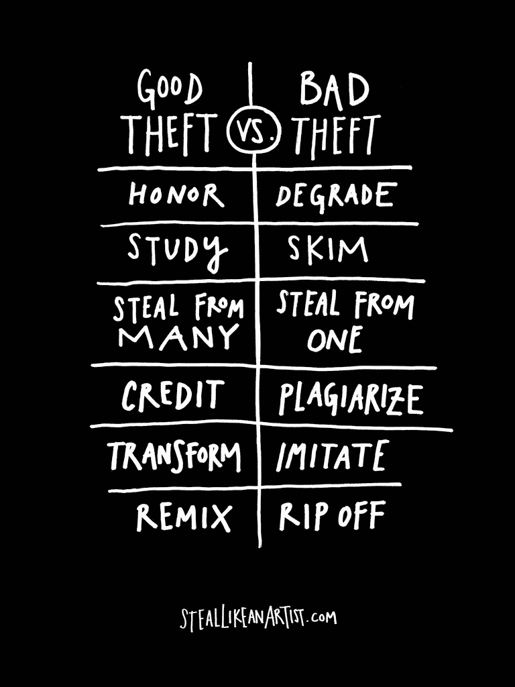

# 我从像艺术家一样偷窃中学到的 5 件事

> 原文：<https://medium.com/hackernoon/5-things-i-learnt-from-steal-like-an-artist-1b2edcd03d3>

前一段时间，我写了一篇关于奥斯汀·克莱恩的 [**偷得像个艺术家**](https://amandeepmittal.wordpress.com/2014/07/18/book-review-steal-like-an-artist-by-austin-kleon/) **的评论。书评中没有太多关于这本书的内容可以满足我对它的迷恋。在克莱恩** 发表他的宣言之前，很多人已经就创造力和获得想法说过很多话。作为一名作家和艺术家，他是这个数字化时代创意经济的敏锐观察者和参与者。因此，我认为，作为创意经济的一部分，克里昂的宣言是他智慧的更好体现。因此，我决定，为什么不把我从书中学到的、我倾向于在日常生活中执行的五件事贴出来。

克里昂敦促通过开始行动向你的创造性目标迈进一步。他解释说，每个人都害怕开始一些事情，这是一种自然的感觉。没有人知道如何做这件事。但这里重要的是你必须去做。要做到这一点，我们必须开始。

> 假装自己不是，直到你成功，直到每个人都以你希望的方式看待你。

*“我该写什么？”这是每个作家在职业生涯的某个阶段都会问自己的问题。他们中的大多数人，试着写下他们所知道的，但是 Kleon 在这个问题上有其他想法:*

> 最好的建议不是写你知道的，而是写你喜欢的。写你最喜欢的那种故事——写你想读的故事。

Kleon 建议不时地离开屏幕，因为我们都一动不动地坐在笔记本电脑或台式机前。我们的思想做了所有的工作，但是我们的身体变得不存在了。保持我们的身体运动让我们的大脑以更高的速度思考。克里昂描述了自己保持身体运动的工作模式:

> 我的办公室里有两张桌子——一张是“模拟”的，一张是“数字”的模拟桌除了马克笔、钢笔、铅笔、纸张、索引卡和报纸之外什么都没有。那张桌子上不允许有任何电子产品。这是我大部分作品诞生的地方，桌子上到处都是我创作过程中的物理痕迹、碎片和残留物。数字桌上有我的笔记本电脑、显示器、扫描仪和绘图板。这是我编辑和发布作品的地方。

Kleon 强调保持你的日常工作，这给你钱和一个常规。手里有钱会给你自由去做你喜欢做的事情，有规律的生活会成为你创造性工作的动力，因为你会有足够的时间去实现你的创造性目标。

> ***诀窍是找一份报酬体面、不会让你想吐、让你有足够精力在业余时间做事情的白天工作。***

克里昂说:

> **克服创意障碍的方法就是简单地给自己设置一些约束。看似矛盾，但说到创造性工作，限制就意味着自由。在你的午休时间写一首歌。只用一种颜色画一幅画。在没有任何启动资金的情况下创业。用你的 iPhone 和你的几个朋友拍摄一部电影。用备用零件制造一台机器。不要为不工作找借口——现在就用你拥有的时间、空间和材料做事情。**

这一点被*杰克·怀特:*总结得很好

> 告诉自己你拥有世界上所有的时间，世界上所有的金钱，调色板上所有的颜色，你想要的任何东西——这只会扼杀创造力。

在所有这些创造性的讨论中，奥斯汀·克里昂在他的宣言中强调了组合创意和混合文化，我们是其中的一部分。

***感谢阅读。如果你觉得这篇文章有用，请点击*** 💚 ***按钮，这样这个故事就能接触到更多的*读者*。如果你想谈论更多，请在***[***Twitter***](https://twitter.com/amanhimself)***|***[***Goodreads***](https://goodreads.com/amandeepmittal)***|***[***书博***](https://amandeepmittal.wordpress.com/)

> [黑客中午](http://bit.ly/Hackernoon)是黑客如何开始他们的下午。我们是 [@AMI](http://bit.ly/atAMIatAMI) 家庭的一员。我们现在[接受投稿](http://bit.ly/hackernoonsubmission)并乐意[讨论广告&赞助](mailto:partners@amipublications.com)机会。
> 
> 如果你喜欢这个故事，我们推荐你阅读我们的[最新科技故事](http://bit.ly/hackernoonlatestt)和[趋势科技故事](https://hackernoon.com/trending)。直到下一次，不要把世界的现实想当然！

