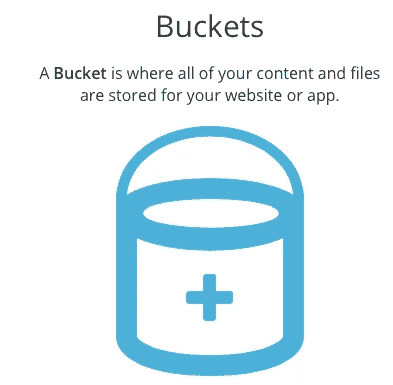
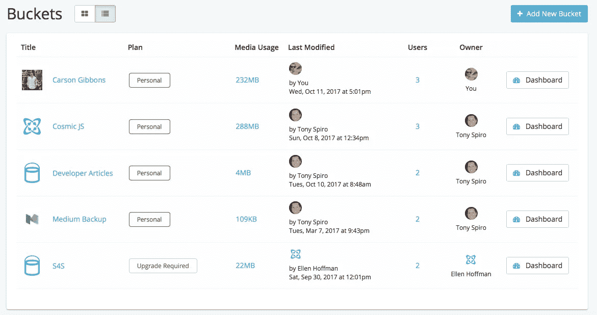
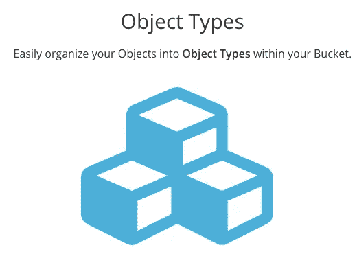
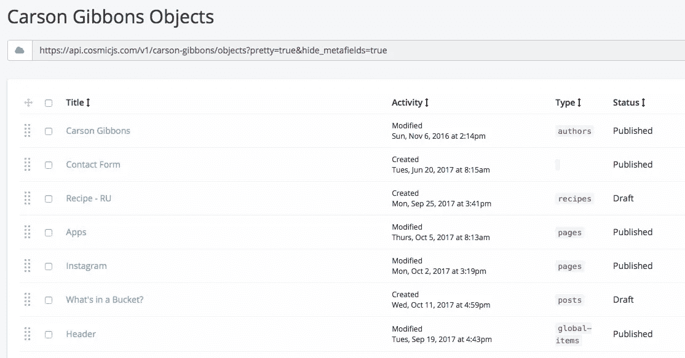
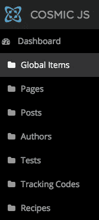
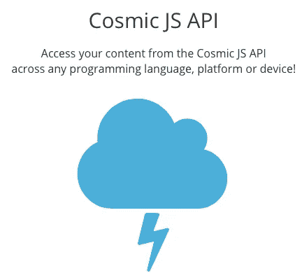
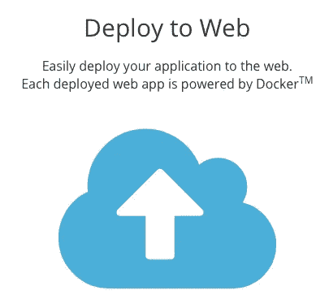
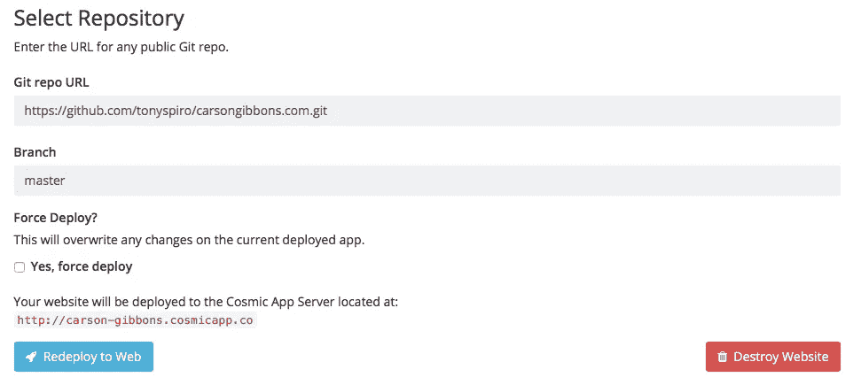
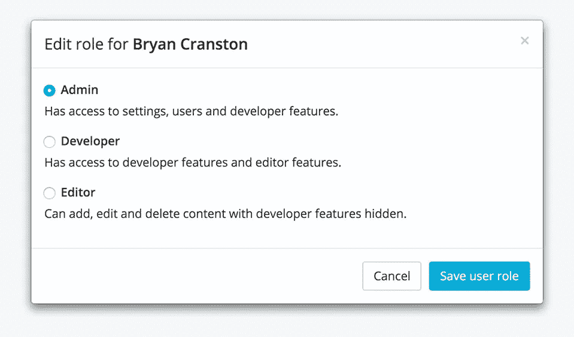
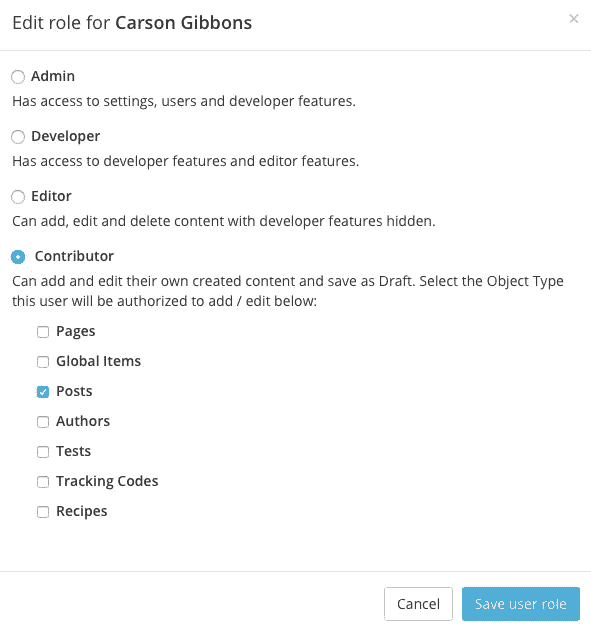

# 构建内容驱动的应用程序时要知道的 5 件事

> 原文：<https://medium.com/hackernoon/5-things-to-know-when-building-a-content-driven-application-8624af2da8cd>

内容驱动的应用程序实际上是一个时髦的词，因为所有正在构建的应用程序通常都围绕着一个核心，即内容。在我担任代理客户经理和互动制作人的那些年里，我曾经是已安装内容管理系统的受害者。像 WordPress 这样的已安装系统将要求我以比客户愿意为我们想要交付的质量支付的更高的成本来确定项目范围，因为我们必须在一个代码和内容的盒子中奠定基础。正是在该机构的这段时间里，已安装的内容管理系统的痛点真正开始形成一种说法，即必须有更好的方法。

在这篇文章中，我将讲述为什么宇宙 JS T1 是构建应用程序和管理内容的梦想 T2 CMS API T3 的 5 个原因。我将按时间顺序推进正常的网站开发过程，包括内容存储和媒体组织，使用您喜欢的工具构建您的应用程序，访问您的内容，部署您的应用程序的代码库，最后，将用户添加到您的桶中以帮助管理内容。

[Cosmic JS](https://cosmicjs.com) 是一个 API 优先的 CMS，帮助开发者和内容编辑团队更快地构建应用。Cosmic JS 提供了一个直观的 API，可以向任何网站或应用程序提供内容。这使您可以自由地使用任何编程语言来构建应用程序，并允许在您的开发团队中更容易地扩展。

使用不同技能和技术的团队可以围绕一个独立于语言的 API 轻松协作，获得直观的内容编辑体验。构建内容并将其发布到您的网站、iOS 和 Android 应用程序。你的内容也为你未来的手表、汽车或虚拟现实应用做好了准备。

# 1.将内容存储在云中的便携桶中

一个桶是[宇宙 JS](https://cosmicjs.com) 内容结构中的主要部分。它非常灵活，可以为整个网站或网站的一部分内容提供动力。由于您的 Bucket 内容是通过 API 端点交付的，因此您的 Bucket 还可以为任何应用程序提供内容，包括 iOS、Android、tvOS、Apple Watch、IOT、AR/VR 或您想要分发内容的任何其他方式。

[Cosmic JS](https://cosmicjs.com) 让你能够从一个简洁的仪表板管理你所有的桶(网站或应用程序)。我的桶仪表板如下图。请记住，所有这些存储桶都是针对不同的客户或用例的，每个存储桶都有不同的用户、媒体和相关的 GitHub repos。

# 1.1 将内容分类到存储桶中的对象类型

下面提供了我的存储桶中的对象的快速截图。这是全局对象视图，显示了我的存储桶中的所有对象。

您将看到在“类型”列下面列出了对象类型。这为我的左手导航提供了框架，而在我的实际桶中(所有对象类型都作为导航条存储在 Cosmic JS 中。)

# 2.使用任何编程语言构建您的应用程序

Cosmic JS 采用 API 优先的方法进行内容管理，不依赖于任何编程语言。这使得您的内容可以在任何网站或应用程序上以及跨设备使用。开发者可以更自由地开发他们想要的应用。通过避免 CMS 安装、配置和维护，节省宝贵的开发时间。

# 3.通过 Cosmic JS API 访问云中的内容

Cosmic JS 为开发人员提供了强大的 API，内容编辑器提供了直观的编辑体验，为您的应用程序提供了强大的内容。今天就安装[官方 Cosmic JS JavaScript 客户端](https://www.npmjs.com/package/cosmicjs)来整合你的应用。

# 4.将您的代码库部署到 Cosmic JS 应用服务器上

Cosmic JS 使得从任何公共 Git 存储库部署您的 web 应用程序变得容易。只需点击几下鼠标，即可添加自定义域和 SSL。查看我们的[应用页面](https://cosmicjs.com/apps)，看看您能在几分钟内创建和部署什么。宇宙 JS 是你的 API，内容管理和网站托管解决方案于一体！

这是我的“部署 Web 应用程序”页面的详细视图。它允许我选择我的 Git repo URL 和分支，当我将我的应用程序部署到我指定的 slug 上的 Cosmic JS 应用程序服务器时，在下面的 URL 中提供“重新部署到 Web”。

# 5.添加用户以管理云中的内容

Cosmic JS 允许您添加团队成员进行无缝协作。轻松地将他们的角色设置为管理员、开发人员、编辑或协作者，让每个团队成员只看到他们完成工作所需的内容。

您甚至可以限制参与者只能管理属于他们的对象类型。为了便于说明，我将自己作为用户添加到我自己的存储桶中:

# 结论

[Cosmic JS](https://cosmicjs.com/) 提供了一个基于云的解决方案，支持快速应用开发，可扩展以满足现代业务的需求。您将立即看到节省项目时间、成本以及团队内部更高级别的协作带来的好处。

旁注:如果你已经在 WordPress 中构建了你的内容驱动应用程序，不要担心。这个插件(如下)帮助你从你的 WordPress 站点导出内容和文件到一个 JSON 文件。然后这个文件可以上传到 Cosmic JS。🚀

 [## cosmicjs/cosmicjs-wp-export

### cosmicjs 的导出插件。

github.com](https://github.com/cosmicjs/cosmicjs-wp-export)  [## 报名|宇宙 JS

### Cosmic JS 是一个云托管的内容平台，提供了一个灵活而直观的 CMS API。建立网站和…

cosmicjs.com](https://cosmicjs.com/signup)