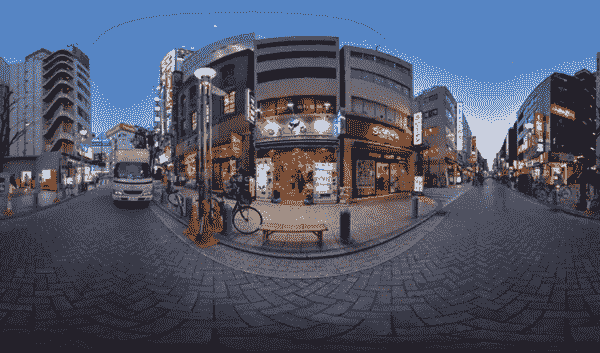
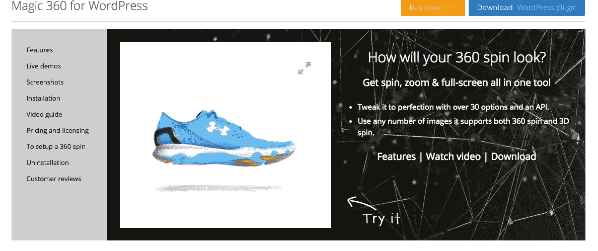
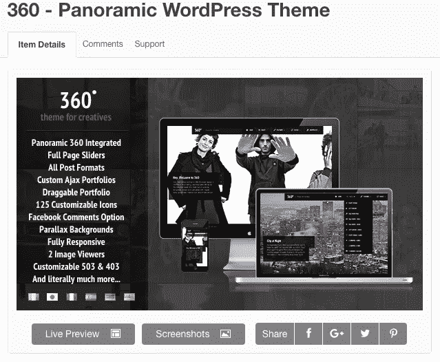
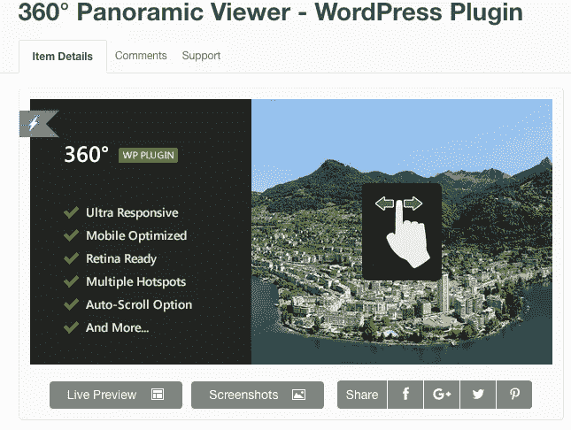
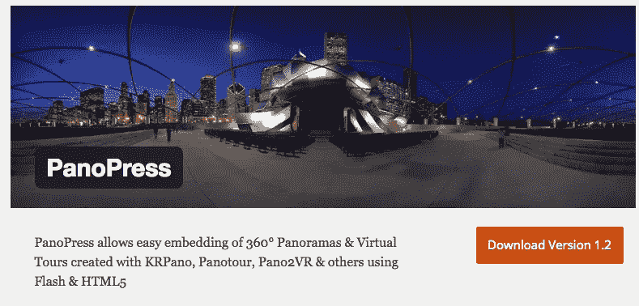

# WordPress 的 5 大 360 度插件

> 原文：<https://medium.com/hackernoon/5-top-360-degree-plugins-for-wordpress-1f6dda86fdb7>

Photo source [www.hardwarezone.com](http://www.hardwarezone.com)

既然我们已经成功地开始为社交媒体[制作 360 度视频](http://www.avalon.host/blog/how-to-create-and-publish-a-360-degree-video/)，是时候在你的 [**WordPress**](https://hackernoon.com/tagged/wordpress) 网站上谈论更多关于 **360 度内容了。随着 360 度内容慢慢成为一种可行的营销工具，营销人员现在正朝着一种新的方式来代表他们的品牌。一个 360 度的内容有什么吸引人的地方？**

> 每次看的时候，你都会看到上次没有注意到的东西。—马特·罗威尔，360 实验室的创始人

但这还不是全部。由于广告都是为了获得关注，而 360 度的内容，事实上，获得了很多关注，营销人员现在不再提供典型的广告，而是更加注重提供体验，作为与消费者沟通的新方式。用 360 度全方位的内容来建立知名度和引发兴趣，为品牌提供了一个独特的机会来控制观众，从而为双方创造一个双赢的解决方案，让客户得到娱乐，同时让营销人员得到认可。

# 360 度图片的 Wordpress 插件

今天，我想和你分享一个 360 度视频的 5 个插件[,它将帮助你把它们整合到你公司的网站上，并创建一个有吸引力的、时髦的、吸引人的在线作品集。](https://hackernoon.com/tagged/plugins)

## WordPress 的 Magic 360

如果你的业务是**电子商务**，你可能会喜欢 [Magic 360 插件](http://www.magictoolbox.com/magic360/modules/wordpress/)作为你将**旋转、缩放和全屏效果**集成到你的 Wordpress 网页的专业方式。此外，这个插件将为您提供自动缓存，图像大小调整和搜索引擎优化。

## 全景 WordPress 主题

将 360 度全景布局与 360 度全景布局整合在一起，使你的网页变得 360 度响应、有吸引力和有趣，而不会失去传统的博客布局和页面模板。有了这个插件，你将能够展示你所做的任何类型的业务，并创建各种 360 度的内容，从简单的图片到 360 度的游览。

## 360 度全景观察器

使用 [360 度全景查看器](http://codecanyon.net/item/360-panoramic-viewer-wordpress-plugin/5054590)插件呈现艺术品和摄影作品，该插件包括用于旋转和热点的 jQuery，支持在手机和触摸板上进行 360 度查看，而不仅仅是在 web 浏览器上。客户对这个插件的评价是非常积极的。

## 全景出版社

这个[免费的 WordPress 插件](http://www.panopress.org/)用于显示 360 度全景图，支持 Flash、HTML5 和 WebGL 全景图，并提供深度变焦多分辨率 gigapanos，以及多 pano 虚拟旅游。全景图与 [Pano2VR](http://gardengnomesoftware.com/pano2vr.php) 、 [KRPano](http://krpano.com/) 、 [Panotour Pro](http://www.kolor.com/panotour-pro-profesionnal-360-virtual-tour-software-home.html) 、 [Flashificator & FPP](http://flashificator.com/) 、 [PTGui](http://www.ptgui.com/) 、 [OpenPano SaladoPlayer](http://openpano.org/) 以及类似的应用程序一起工作。

## 为什么 360 度内容很重要？

我们不要忘记，今天的消费者精通技术，因此希望能够选择如何参与媒体内容。公司正在寻找一种从传统向时尚转变的方式，因此使用各种创新媒体以及多平台策略是在精通技术的消费者中进行整合的唯一方式。

360 度内容具有创造消费者价值的潜力，因此符合当今消费者的期望，为我们提供了一个以最个性化的方式与品牌和公司合作的独特机会。不用说， **fun** 是与社交媒体、创新技术和内容完美融合的终极词汇。

因此，我们每天都能看到像 **360 度图像和视频**这样的内容越来越受欢迎，从而吸引了世界各地的消费者，影响了我们消费内容的方式，尤其是我们对内容的反应方式。

*本文原载于* [*阿瓦隆博客*](http://www.avalon.host/blog/5-top-360-degree-plugins-for-wordpress/) *。*

> [黑客中午](http://bit.ly/Hackernoon)是黑客如何开始他们的下午。我们是 [@AMI](http://bit.ly/atAMIatAMI) 家庭的一员。我们现在[接受投稿](http://bit.ly/hackernoonsubmission)，并乐意[讨论广告&赞助](mailto:partners@amipublications.com)机会。
> 
> 如果你喜欢这个故事，我们推荐你阅读我们的[最新科技故事](http://bit.ly/hackernoonlatestt)和[趋势科技故事](https://hackernoon.com/trending)。直到下一次，不要把世界的现实想当然！

