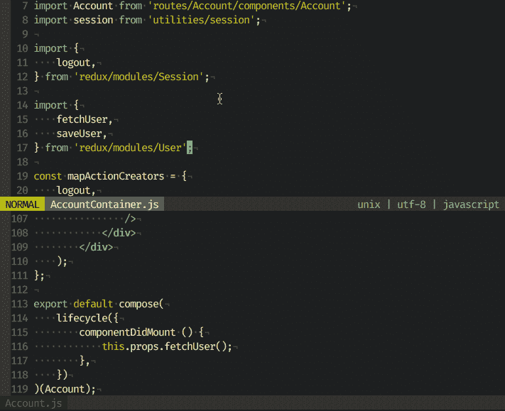
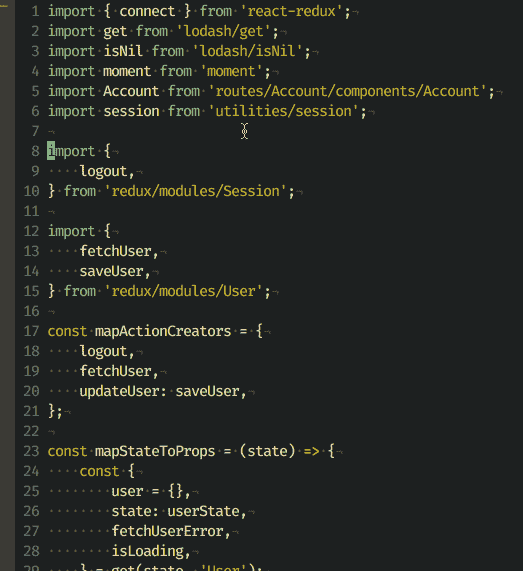
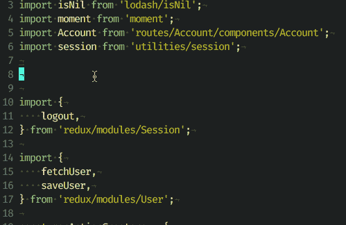

# Javascript 开发离不开的 5 个 Vim 插件

> 原文：<https://medium.com/hackernoon/5-vim-plugins-i-cant-live-without-for-javascript-development-f7e98f98e8d5>

我一直在寻找可以改进我的工作流程和开发环境的方法。在我称自己为程序员之前，我着迷于让我的终端看起来很酷，即使我还不知道如何使用它！这几年来一直困扰着我，我想分享一些我最近最喜欢的:

## **1。更漂亮——固执己见的 Javascript 格式化程序**

漂亮会自动格式化你的代码，所以你不必。花更少的时间和你的同事讨论风格，这样你就可以花更多的时间写你的应用。


A random Javascript file I saved. See how it automatically formatted it for me?

NeoVim 和 Vim 的安装非常简单:

*   通过 npm 安装`npm install -g prettier`
*   `yarn global add prettier`或纱(推荐)
*   将以下内容添加到您的 init.vim 或 vimrc 文件中:
    `autocmd FileType javascript set formatprg=prettier\ --stdin`
*   如果要格式化保存:
    `autocmd BufWritePre *.js :normal gggqG`
*   如果你想在保存时恢复光标位置(可能会出错):
    `autocmd BufWritePre *.js exe "normal! gggqG\<C-o>\<C-o>"`

**为什么我个人喜欢这个:** 我不再担心是否有正确的格式。我开始习惯让电脑控制我的源代码，这样我就可以优化花在应用相关更改上的时间。

在[https://github.com/prettier/prettier](https://github.com/prettier/prettier)查看更多

## **2。NrrwRgn —窄区域插件**

选择你的代码的一部分，在一个新的缓冲区中打开它！当你准备好返回到原始文件时，只需保存它，你隔离的改变就会立即出现！


Someone accidently made this FRIEND instead of USER. I loaded it up with NR, made the changes I wanted to make and brought them back to the original file!

使用你选择的插件管理器安装。我喜欢 Vim Plug。

```
Plug 'chrisbra/NrrwRgn'
```

**我最常用的命令:**

```
:NR - open selection in a new window
:NW - open current visuaul window in a new window
:NRP - mark a selection so you can open multiple parts of a file
:NRM - after using NRP, run this so you can open those parts! 
[https://github.com/wesQ3/vim-windowswap](https://github.com/wesQ3/vim-windowswap)
```

为什么我个人喜欢这个:
有时候我会因为处理非常大的文件而感到沮丧。如果可以的话，我喜欢专注于其中的一部分。眼睛更容易看到 5-15 行，而不是 150 行。

更多请看[https://github.com/chrisbra/NrrwRgn](https://github.com/chrisbra/NrrwRgn)

## 3.WindowSwap —轻松交换窗格

按下`<leader>ww`你可以在屏幕上切换窗口，而不必重新布局。



See how I swapped the two windows in this simple example?

使用你选择的插件管理器安装。我喜欢 Vim Plug。

```
Plug '[https://github.com/wesQ3/vim-windowswap](https://github.com/wesQ3/vim-windowswap)'
```

为什么我个人喜欢这个:
当我的 ADD 超速时，我打开了 15 个窗格。有时候，我想移动东西，而不必关闭并重新打开它。这让我可以做到这一点。

更多请看[https://github.com/wesQ3/vim-windowswap](https://github.com/wesQ3/vim-windowswap)

## 4.ALE —异步 Lint 引擎

Neovim 和 Vim 8 的林挺插件。这将自动挂钩到你的配置，并显示你的错误！



I took a project I did before using Prettier. Saved it. Whoah! See all that red on the left hand side? That’s Ale doing its magic! You’ll also get the rule instructions at the bottom of the window so you know exactly what to change!

使用你选择的插件管理器安装。我喜欢 Vim Plug。

```
Plug 'w0rp/ale'
```

**为什么我个人喜欢这个:** 更漂亮地处理你的源代码样式，但还有很多 eslint 可以为你做的！诸如可访问性和移除未使用的模块和变量之类的事情仍然应该由 eslint 来处理。与像 Kent C. Dodds & friends 的[beautiful-eslint](https://github.com/prettier/prettier-eslint)这样的库配对，会使它成为你工作流程中令人敬畏的一部分！

在[https://github.com/w0rp/ale](https://github.com/w0rp/ale)看更多

## 5.de complete—自动完成框架

这将为您的文件添加一个自动完成下拉列表。它异步工作。您*将*需要安装 Neovim 和 Python 3 才能工作。



Look! Autocomplete!

Vim 插头安装:

```
Plug 'Shougo/deoplete.nvim', { 'do': ':UpdateRemotePlugins' }
```

在继续下一步之前，请确认您需要。打开 Neovim 运行`:echo has("python3")`如果返回值为 1，其他的就不用做了！否则，继续跟随:

```
pip3 install neovim
pip3 install --upgrade neovim (0.1.8 is required)
```

将以下内容添加到 Neovim init.vim 文件中:

```
let g:deoplete#enable_at_startup = 1
```

在[https://github.com/Shougo/deoplete.nvim](https://github.com/Shougo/deoplete.nvim)查看更多

## 附加 5.5 —带 Deoplete 的流自动完成

喜欢流类型，并希望您可以使用自动完成？Wojtek Czekalski*刚刚创建了一个很棒的库来实现它！

```
" Place deoplete first, then autocomplete-flow
Plug 'Shougo/deoplete.nvim', { 'do': ':UpdateRemotePlugins' }
Plug 'wokalski/autocomplete-flow'" You will also need the following for function argument completion:
Plug 'Shougo/neosnippet'
Plug 'Shougo/neosnippet-snippets'
```

更多详情请见[https://github.com/wokalski/autocomplete-flow](https://github.com/wokalski/autocomplete-flow)

## 结束语

就像我说的，我一直在寻找提高自己流量的方法。我错过了什么吗？你想了解更多吗？

欢迎[发微博给我](https://twitter.com/peterpme)或[在这里查看我所有的 Vim 插件。](https://github.com/peterpme/dotfiles/blob/master/config/nvim/plugins.vim)

[](http://bit.ly/HackernoonFB)[](https://goo.gl/k7XYbx)[](https://goo.gl/4ofytp)

> [黑客中午](http://bit.ly/Hackernoon)是黑客如何开始他们的下午。我们是 [@AMI](http://bit.ly/atAMIatAMI) 家庭的一员。我们现在[接受投稿](http://bit.ly/hackernoonsubmission)，并乐意[讨论广告&赞助](mailto:partners@amipublications.com)机会。
> 
> 如果你喜欢这个故事，我们推荐你阅读我们的[最新科技故事](http://bit.ly/hackernoonlatestt)和[趋势科技故事](https://hackernoon.com/trending)。直到下一次，不要把世界的现实想当然！

