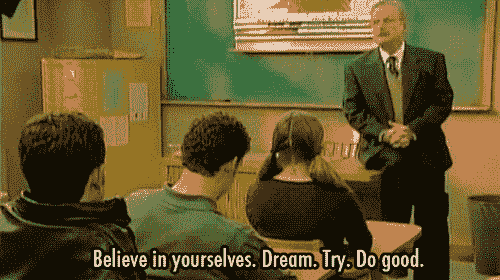
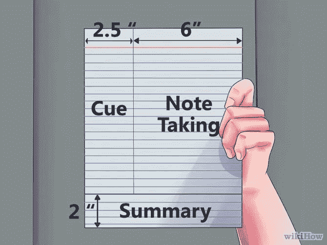
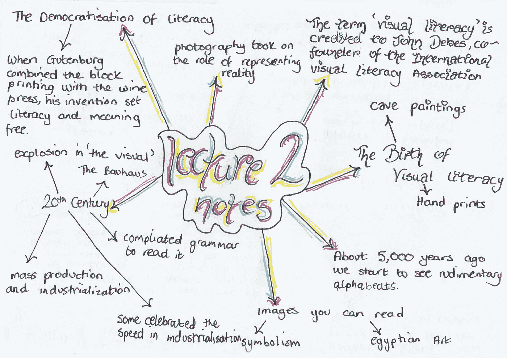
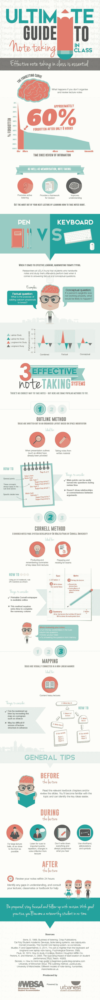
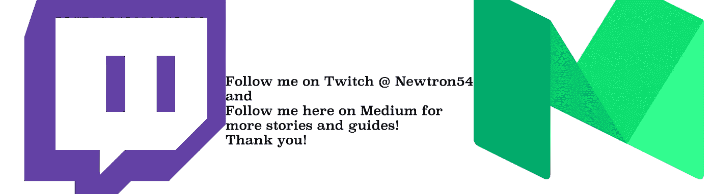

# 提高课堂笔记的 5 种方法

> 原文：<https://medium.com/hackernoon/5-ways-to-improve-your-in-class-note-taking-a928910900c1>

你们中的许多人已经上了大学或者目前正在上大学，你们中的一些人可能还在读高中，如果是这样的话，那么很好的一个开始。不管怎样，你都明白记笔记有多重要。这不仅对你的理解是必要的，而且可以说是通过一门课程/一门课的最好方法，可能会让你在未来成为一名更好的员工！现在每门课程都不一样，你记笔记的方式也不一样，但总的来说，规则和指导方针应该始终遵循。

1。 **保持专注**！这意味着放下你的手机，如果你坐在你的朋友旁边，不要理会他们，或者关掉你的笔记本电脑或平板电脑的网络。在任何设备上唯一应该打开的是文本编辑器(emacs，word，notepad 等。)通常我会建议先手写笔记，然后打印出来组织它们，不管怎样，现在不要担心让它们变得漂亮。在我的情况下，我可以写得比打字快，但如果你是相反的，那么就这样做，无论哪种方式，只要担心接受信息并把它写在纸上！
**顺便提一下，如果你在纸上写字，确保你用清晰的颜色书写，当然也要确保你知道你写的是什么，如果你用缩写，但不知道你的缩写是什么意思，那就没用了。*

You know who you are.. I am jealous

2。 **逐字逐句是你的敌人**，我认为这是不言而喻的，可能看起来有点落后，但如果你把课堂的每一分钟都花在教授说的每个词上，那么你就会落后……**他们说的比你写的还快**。这也适用于在幻灯片上写下每个单词！你能做的最好的事情就是总结，用你自己的话来表达，这不仅能帮助你跟上讲座和笔记，还能在你的头脑中形成一种理解，这使得回忆起来更容易。只有当教授“不做记录”并给出一条信息时，逐字逐句才有用，这条信息要么使主题更容易，要么是他忘记添加到幻灯片中的信息。通常，“这将会在考试中”这句话很好地表明了重要性！

FeeeHeeeeeny

3。 **组织是关键**，“可是罗柏，你说不用担心组织！”虽然这是正确的，但重要的是以后再组织它们，如果你有时间的话，课后再组织就更好了！当你写作的时候，确保你用标题把笔记分开，这样你就有上下文来组织它们。这甚至可以像你强调重要的方面或者用点号或破折号标注主题变化一样简单。另一个建议是在不同的页面上开始每一个讲座，这将为你进一步分离一切。如果你在考试前一天晚上临时抱佛脚，避免开夜车，这也会有所帮助，就像你通过将重要的考试信息与其他无关紧要的信息分开来帮助未来的你一样。

Cornell Note Method.. Seriously fantastic way to take notes

4。 **想想语境**，这在我看来是一个大的。这不仅很重要，这样你就能知道老师为什么关注它，而且还能帮助你将这些信息与主题联系起来。这可以通过几种方式来完成，很多时候老师会浏览笔记并强调主题。或者在讲课前做一件好事，做一些可选的阅读材料，看看本周的作业，或者如果有幻灯片的话，读一读！很多时候，把它们打印出来，加上一个用来写笔记的部分是很有帮助的。只要你能把你写下的信息和整体画面联系起来，那就是你的主要目标。

An explanation of the cornell note method and how to effectively use it to it’s fullest

5。可视化映射笔记！这最终会把这些点连得更远。如果你能从电脑或笔记本上直观地记下笔记，并把它们从一个要点映射到另一个要点，这将为你铺平道路。这也适用于你正在服用的任何药物！你可以用编程语言来练习历史论文，我这么说是因为我在读历史本科时就开始用它了，现在我用它来学习编程。这种想法在任何地方都是有效的，你可以用它来决定买什么车，或者你的初创公司下一步该做什么，这是一种永恒的方法。

lecture mapping

Really long [infograph](http://www.lifehack.org/articles/productivity/the-ultimate-guide-note-taking-infographic.html)… looked cool

> [黑客中午](http://bit.ly/Hackernoon)是黑客如何开始他们的下午。我们是阿妹家庭的一员。我们现在[接受投稿](http://bit.ly/hackernoonsubmission)并乐意[讨论广告&赞助](mailto:partners@amipublications.com)机会。
> 
> 如果你喜欢这个故事，我们推荐你阅读我们的[最新科技故事](http://bit.ly/hackernoonlatestt)和[趋势科技故事](https://hackernoon.com/trending)。直到下一次，不要把世界的现实想当然！

