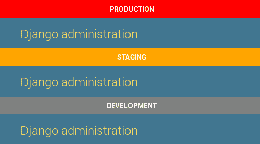
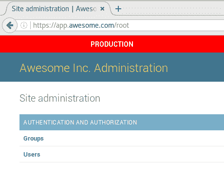
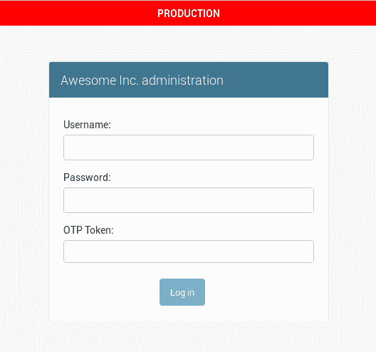
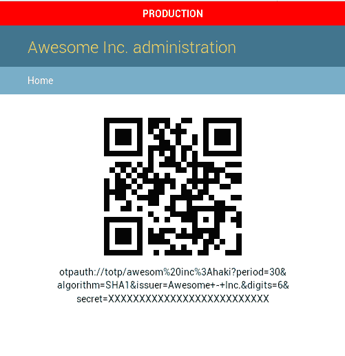

# 让 Django 管理员更安全的 5 种方法

> 原文：<https://medium.com/hackernoon/5-ways-to-make-django-admin-safer-eb7753698ac8>

为了更好的阅读体验，请在我的网站上查看[的这篇文章。](https://hakibenita.com/5-ways-to-make-django-admin-safer)

权力越大，责任越大。你的 Django 管理员越强大，它就应该越安全。

**在这篇文章中，我提出了 5 种方法来保护 Django 管理员免受人为错误和攻击者的攻击。**


A “safe” looking castle ([source](http://hbdesign.deviantart.com/art/p50-253391408))

# 更改 URL

每个框架都有一个指纹，Django 也不例外。一个熟练的开发人员、攻击者甚至一个精通技术的用户都可以通过查看 cookies 和 auth URLs 来识别 Django 站点。

一旦一个站点被识别为 Django 站点，攻击者很可能会尝试/admin。

为了让访问变得更加困难，我们可以把“推荐”的网址改成更难猜的。

在应用程序的基本 url.py 中，[在不同的 url 下注册管理站点](https://docs.djangoproject.com/en/1.11/ref/contrib/admin/#hooking-adminsite-instances-into-your-urlconf):

```
urlpatterns += i18n_patterns(
    **url(r’^super-secret/’, admin.site.urls, name=’admin’),** )
```

把*【超级秘密】*改成你和你的团队能记住的就完事了！这绝对不是你应该采取的唯一预防措施，但这是一个好的开始。

# 视觉上区分环境

用户和管理员并不完美，错误时有发生。当您有多个环境，如开发、QA、试运行和生产时，管理员很可能会意外地在错误的环境中执行破坏性操作([只要问 gitlab](https://about.gitlab.com/2017/02/01/gitlab-dot-com-database-incident/) )。

为了减少出错的机会，我们在 admin 中明确标记了不同的环境:



Indicator in different environments

首先，你需要知道你所处的环境。我们在部署过程中填充了一个名为 ENVIRONMENT_NAME 的变量。我们有另一个名为 ENVIRONMENT_COLOR 的变量来表示指示器颜色。

要将环境指示器添加到管理中的每个页面，请覆盖基本管理模板:

```
# app/templates/admin/base_site.html****<style type=”text/css”>
    body:before {
        display: block;
        line-height: 35px;
        text-align: center;
        font-weight: bold;
        text-transform: uppercase;
        color: white;
        **content: “{{ ENVIRONMENT_NAME }}”;
        background-color: {{ ENVIRONMENT_COLOR }};**
    }
</style>
```

为了使来自`settings.py`的环境变量在模板中可用，我们使用了一个上下文处理器:

```
# app/context_processors.pyfrom django.conf import settingsdef from_settings(request):
    return {
        'ENVIRONMENT_NAME': settings.ENVIRONMENT_NAME,
        'ENVIRONMENT_COLOR': settings.ENVIRONMENT_COLOR,
    }
```

要注册上下文处理器，在`settings.py`中添加以下内容:

```
TEMPLATES = [{
    …
    'OPTIONS': {
        'context_processors': [
            …
            'app.context_processors.from_settings',
        ],
    …
    },
}]
```

现在，当你打开 Django Admin 时，你应该会看到顶部的指示器。

# 命名您的管理站点

如果你有多个看起来一样的 Django 服务，管理员很容易混淆。为了帮助管理员更清楚自己的位置，请更改标题:

```
# urls.pyfrom django.contrib import adminadmin.site.**site_header** = ‘Awesome Inc. Administration’
admin.site.**site_title** = ‘Awesome Inc. Administration’
```

你会得到:



Django Admin site with a name and a title

如需更多奇特的选项，请查看文档中的[。](https://docs.djangoproject.com/en/1.11/ref/contrib/admin/#adminsite-attributes)

# 将 Django 管理与主站点分开

使用相同的代码库，您可以部署同一个 Django 应用程序的两个实例——一个仅用于管理员，一个仅用于应用程序的其余部分。

这是有争议的，不像其他技巧那么容易。实现依赖于配置(例如，如果您使用 gunicorn 或 uwsgi ),所以我不会进入细节。

您可能希望将管理拆分到它自己的实例中的一些原因是:

*   **在 VPN(虚拟专用网络)内部署管理员—** 如果管理员仅在内部使用，并且您有一个 VPN，那么最好将其部署在专用网络内。
*   **从主站点删除不必要的组件—** 例如，Django 管理员使用消息框架。如果主站点没有，您可以删除该中间件。另一个例子是身份验证——如果主站点是使用令牌身份验证的 API 后端，您可以删除许多模板配置、会话中间件等。并从请求-响应循环中剔除一些脂肪。
*   **更强的认证** —如果你想加强 Django 管理员的安全，你可能想为管理员提供一个不同的认证机制。这在具有不同设置的不同实例上要容易得多。

我们只在面向公众的网站中从主网站分离管理员。我们不关心内部应用程序，因为它会使部署变得复杂，并且没有更安全的好处。

# 添加二元身份验证(2FA)

双因素身份验证最近变得非常流行，因为许多网站开始提供这一选项。2FA 使用两种方法执行身份验证:

1.  你知道的东西——通常是密码。
2.  **你有的东西**——通常是每 30 秒生成一个随机数的手机 app(比如 Google 的 [Authenticator)。](https://play.google.com/store/apps/details?id=com.google.android.apps.authenticator2&hl=en)

首次注册时，用户通常会被要求使用验证器应用程序扫描条形码。完成初始设置后，应用程序将开始生成一次性代码。

我通常不推荐第三方软件包，但是几个月前我们开始使用 [django-otp](https://pypi.python.org/pypi/django-otp) 在我们的管理站点中实现 2FA，它对我们来说非常有效。它托管在 Bitbucket 上，所以你可能已经错过了。

设置非常简单:

```
pip install django-otp
pip install qrcode
```

将 django-otp 添加到已安装的应用程序和中间件中:

```
# settings.pyINSTALLED_APPS = (
   ...
   ‘django_otp’,
   ‘django_otp.plugins.otp_totp’,
   ...
)...MIDDLEWARE = (
   ...
   ‘django.contrib.auth.middleware.AuthenticationMiddleware’,
   ‘django_otp.middleware.OTPMiddleware’,
   ...
)
```

命名发行者——这是用户将在 authenticator 应用程序中看到的名称，因此要使其可区分。

```
# settings.pyOTP_TOTP_ISSUER = ‘Awesome Inc.’
```

向管理站点添加 2FA 身份验证:

```
# urls.pyfrom django_otp.admin import OTPAdminSiteadmin.site.__class__ = OTPAdminSite
```

现在，您有了一个如下所示的安全管理页面:



Django Admin login with OTP token

要设置新用户，从 Django Admin 创建一个“TOTP 设备”。完成后，单击 QR 链接，您将看到这样一个屏幕:



QR for setting up a new user

让用户在个人设备上用 authenticator 应用程序扫描二维码，他们将每 30 秒生成一个新代码。

# 最后的话

让 Django 管理员变得更加安全并不困难——你只需要集中注意力。这里提到的一些技巧非常容易建立，而且它们有很大的帮助。

更多 Django 管理宝石，请查看

[](/@hakibenita/things-you-must-know-about-django-admin-as-your-app-gets-bigger-6be0b0ee9614) [## 随着你的应用变得越来越大，关于 Django Admin 你必须知道的事情

### Django admin 是一个非常强大的工具。我们用它进行日常操作、浏览数据和支持。随着我们的成长…

medium.com](/@hakibenita/things-you-must-know-about-django-admin-as-your-app-gets-bigger-6be0b0ee9614) [](/@hakibenita/how-to-turn-django-admin-into-a-lightweight-dashboard-a0e0bbf609ad) [## 如何将 Django Admin 变成一个轻量级仪表板

### Django Admin 是一个管理应用程序数据的强大工具。但是，它没有设计汇总表和…

medium.com](/@hakibenita/how-to-turn-django-admin-into-a-lightweight-dashboard-a0e0bbf609ad) [](/@hakibenita/how-to-add-custom-action-buttons-to-django-admin-8d266f5b0d41) [## 如何向 Django Admin 添加自定义操作按钮

### 我们是 Django 管理界面的忠实粉丝。这对 Django 来说是一个巨大的卖点，因为它减轻了开发的负担…

medium.com](/@hakibenita/how-to-add-custom-action-buttons-to-django-admin-8d266f5b0d41) [](http://bit.ly/HackernoonFB)[](https://goo.gl/k7XYbx)[](https://goo.gl/4ofytp)

> [黑客中午](http://bit.ly/Hackernoon)是黑客如何开始他们的下午。我们是 [@AMI](http://bit.ly/atAMIatAMI) 家庭的一员。我们现在[接受投稿](http://bit.ly/hackernoonsubmission)，并乐意[讨论广告&赞助](mailto:partners@amipublications.com)机会。
> 
> 如果你喜欢这个故事，我们推荐你阅读我们的[最新科技故事](http://bit.ly/hackernoonlatestt)和[趋势科技故事](https://hackernoon.com/trending)。直到下一次，不要把世界的现实想当然！

