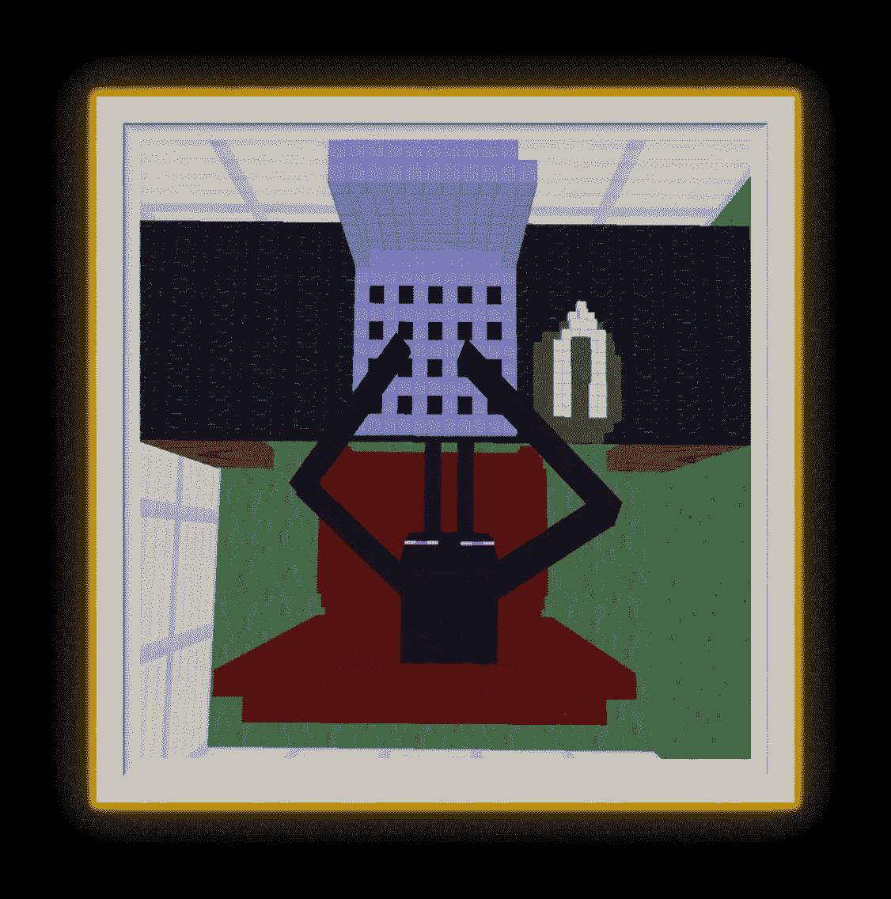

# 让你的案头工作不那么痛苦的 5 种方法

> 原文：<https://medium.com/hackernoon/5-ways-to-make-your-desk-job-less-painful-3d57a1fe4053>

如果你的工作让人头疼，那我可能帮不上忙。但是如果你的工作令人讨厌，那么请继续。

> 如果你有持续的背部或颈部疼痛，你的坐姿可能是一个因素。使用以下建议来评估你的姿势。

# 鸡胳膊是用来跳舞的，不是用来工作的

You’ve got two bones in your forearm, the radius and ulna. When you angle your arms inwards as you type, those bones cross, making an X over your nerves.