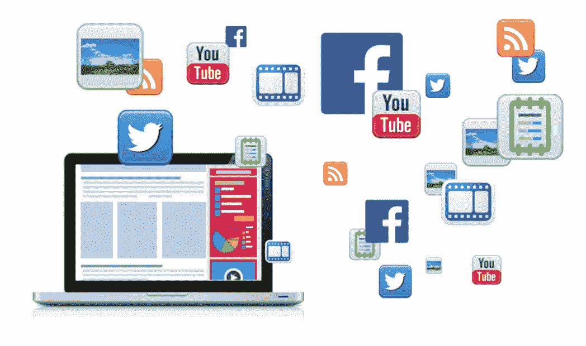
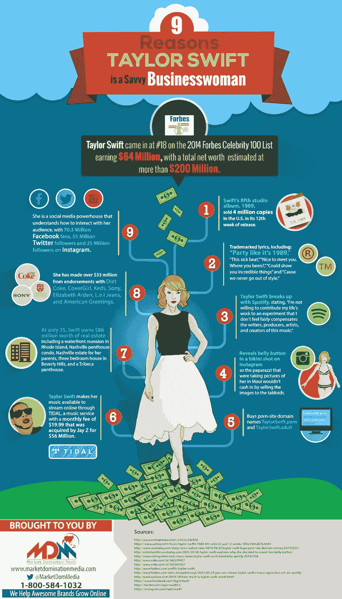
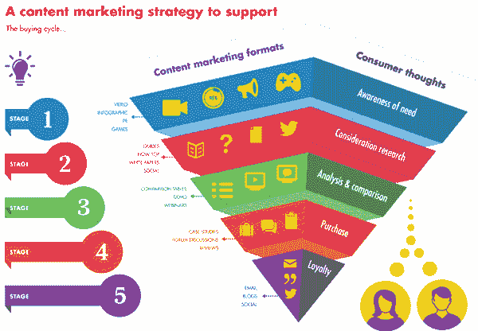

# 成功破解精彩数字内容的 5 种方法

> 原文：<https://medium.com/hackernoon/5-ways-to-successfully-hack-your-awesome-digital-content-6390125a379c>

如果你最近一直在阅读[阿瓦隆的博客](http://www.avalon.host/blog/)，你会注意到许多有趣的案例和想法，为你的小企业钉上**在线** [**内容**](https://hackernoon.com/tagged/content) 。无论你是从事电子商务、时尚、旅游、食品还是任何其他行业，确实有办法在激烈的竞争中脱颖而出，并吸引有趣的观众访问你的网页。

**创造内容**听起来很容易，然而研究表明，实际上有一小部分营销人员真正理解内容及其策略的重要性。事实上，战略正是大多数营销人员未能执行的事情。让我们来看看如何总结你的[数字](https://hackernoon.com/tagged/digital)活动的 5 种方法，并开始黑客一个令人敬畏的数字内容活动。

## 1.选择您的数字营销模式

你是那种想要**推动在线流量以转化更多销售额的企业吗**？在这种情况下，整合你的网站、移动应用、社交媒体和搜索引擎优化将是正确的开始。

如果您对您提供的产品的**消费者参与度**感兴趣，那么您会想办法为您的客户提供卓越的数字多媒体体验，以吸引新客户，并让现有客户满意(忠诚度计划)。

如果你的企业提供**数字产品或服务**，那么你需要更加关注与目标受众的数字互动，以便收集数据和见解，帮助你塑造创新渠道，增加公司价值。

你喜欢旅游业还是零售业？在这种情况下，你很可能需要创造一种品牌体验，这将有助于你建立一个精致的客户服务和忠诚客户名单。

## 2.选择您的内容类型

在内容类型的巨大多样性中，你应该把重点放在适合你的业务类型并容易分发给你的目标受众的内容上。有很多不同的内容类型，如博客、视频、图像、信息图、广告、插件、动画、事件等等，公司通常会从中选择一种以上的内容来开始他们的数字内容之旅。

在你对你的目标受众做了调查之后，你现在知道他们喜欢什么，什么类型的内容适合他们。此外，您知道他们最喜欢的分销渠道是什么。

## 3.选择正确的分销渠道

你的内容必须是你的观众所在的地方！

这就是为什么选择正确的分销渠道至关重要。从 Snapchat、You Tube、Twitter 或脸书到电子邮件、Vimeo、谷歌广告或 Tumblr，通过选定的分发渠道简化您的内容需要内容支柱方法。

**什么是内容支柱方法？**当你决定最终发布一个内容时，你可以将它分成许多相似的部分和材料，通过不同的渠道发布。这给了你一个机会，将你的大块内容分割成小块，有效地将每块内容传递给目标受众。

## 4.创建智能内容战略

从你准备的内容中创建一个**智能内容策略**，考虑你的**消费者的想法**，如上图所示。他们要经历 5 个阶段，从认知到忠诚，这可不是一个简单的过程。

## 你在第一阶段的工作是向你的目标受众展示他们有问题或需求

你是怎么做到的？简单:忘掉你自己，专注于你的目标受众——给他们一个他们可以理解的信息(情绪反应通常是一个成功的解决方案),并提出一个将与他们脑海中的这个问题相关联的解决方案。

## 你在第二阶段工作是为他们的问题或需求提供足够的指导

准备足够的材料(作为你的内容策略的一部分),这些材料可以在线下载、获取和共享，更不用说是免费的，这样你的受众就可以更好地了解问题或需求。这对你来说特别重要，因为这是你应该积累他们的兴趣，慢慢地但稳步地引导他们走向你的业务(解决方案)的阶段。

## 你在第三阶段的工作是证明你的解决方案比竞争对手的更好

准备演示和客户/客户陈述，证明您的解决方案正是他们真正需要的。在这个阶段，你的观众会将你与竞争对手进行比较，所以你有一个艰巨的任务来证明自己比别人更好。这对于忠诚的客户来说尤其困难，因此在这个阶段你可能需要深入的研究和精确的基准测试。

## 你在阶段 4 的工作是确保你有最好的案例研究和评论

当然，假评论也帮不了你。您需要真实的分析和报告，以便能够提供您业务的可信情况。

## 你在第五阶段的工作是娱乐现有的观众

这个阶段可能需要一点不同的策略，因为你需要留住你现有的客户，并保持他们的忠诚度。与吸引阶段不同，在这里你需要有趣和有用，因为他们确实会有你需要满足的巨大期望，否则他们会在其他地方找到它。

## 5.计划你的预算

不管你是一家完全成立的创业公司还是一家国际公司，你都需要从查看你的钱包开始。并不是每一个内容策略都需要高成本。你需要做的就是做一个预算计划，并充分利用它。在朋友和亲戚的帮助下，你可以迈出第一步，比如在社交媒体或博客上分享。在你开始行动之后，就更容易开始在频繁的内容活动和策略上投资，因此破解代码以更具成本效益的方式分发你的内容。

> 当一家公司确定如何整合所需的流程，让消费者有一种完成工作的感觉时，它就能击败竞争对手。产品很容易复制，但经验很难复制。—克莱顿·M·克里斯坦森

祝你们好运！这都是关于聪明的计划和轻快的态度。🙂

*本文原载于* [*阿瓦隆博客*](http://www.avalon.host/blog/5-ways-successfully-hack-awesome-digital-content/) *。*

> [黑客中午](http://bit.ly/Hackernoon)是黑客如何开始他们的下午。我们是 [@AMI](http://bit.ly/atAMIatAMI) 家庭的一员。我们现在[接受投稿](http://bit.ly/hackernoonsubmission)并乐意[讨论广告&赞助](mailto:partners@amipublications.com)机会。
> 
> 如果你喜欢这个故事，我们推荐你阅读我们的[最新科技故事](http://bit.ly/hackernoonlatestt)和[趋势科技故事](https://hackernoon.com/trending)。直到下一次，不要把世界的现实想当然！

