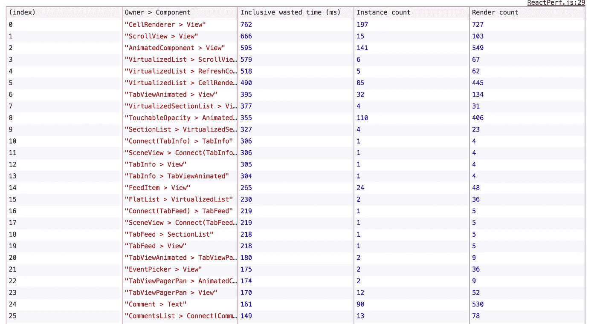
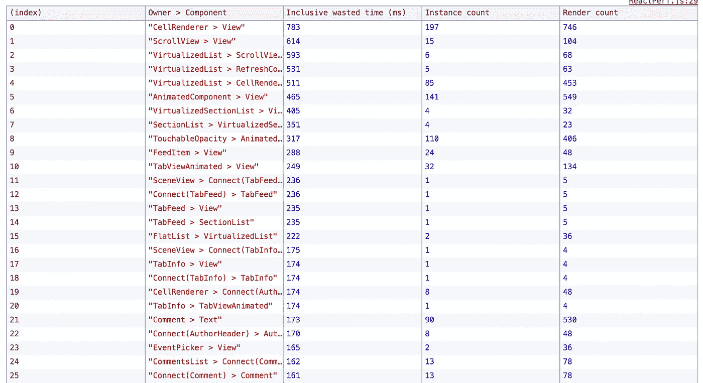
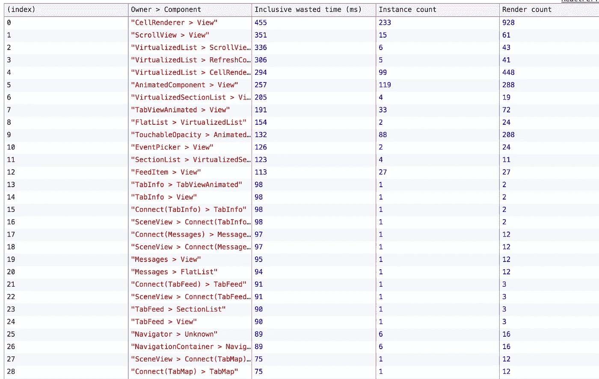
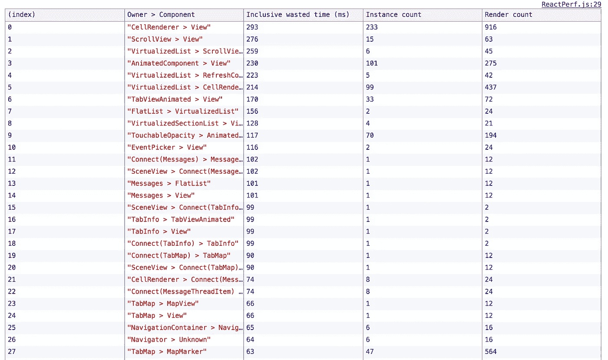
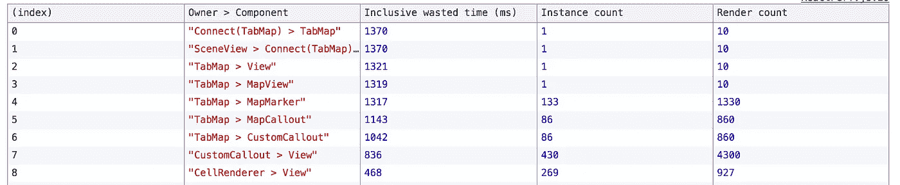
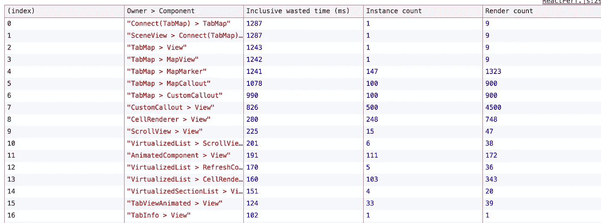
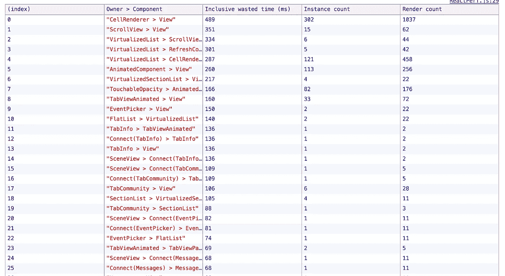

# 我们改进 React 原生应用的 5 种方式

> 原文：<https://medium.com/hackernoon/5-ways-we-improved-our-react-native-app-2704d5098b20>

## 提高性能的真实场景

[unsplash](https://unsplash.com/photos/5DigPgSH27U)

在过去的几天里，我有机会专注于改善我们公司开发的 React 原生应用程序的性能:由于已经在两个市场(iOS/Android)上市，我采取的方法主要是以 JS 为重点，以便能够通过微软的 [Codepush](https://github.com/Microsoft/react-native-code-push) 工具部署调整。

我必须承认，我对这些改变的有效性感到非常惊讶——这就是为什么我与你们分享它们，希望帮助你们理解提高绩效可以是简单的**；正如我在上周之前所想的那样，这不是只有铁杆老兵才能完成的事情。**

## **起点:需要基准**

**正如任何从事表演工作的人都会告诉你的那样，在开始改善表演之前，你需要给自己配备一些 with…🥁来衡量它们🎉**

**在`react-native`基础项目中，有一个名为`PerfMonitor`的基准测试工具。根据我的理解，这基本上是同一个标准的 React Perf 工具——你可以在这里阅读更多关于[的内容。基本上，它为你提供了一个关于你的应用程序在无用的重新渲染中浪费了多少时间的分析；但是它有一个缺陷，那就是它只能在调试器模式下运行，这是没有优化的。](https://facebook.github.io/react/docs/perf.html)**

**无论如何，它仍然是一段非常有价值的代码——我是这样设置它的:**

**我将这几行代码放在我们的根组件之一的 ComponentDidMount 中，这个根组件叫做 Logged——它基本上“拥有”登录用户的主导航。在这些行未被注释的情况下，在“启动”时，该工具将开始记录发生的一切，并在 20 秒后(在我看来，这是将一切正确加载到应用程序中的良好“平稳”时间)，它将打印出关于渲染的分析。**

**我不能进入我们的应用程序架构的细节，但我认为你应该知道的是，提到的日志组件包含主导航标签栏(由 4 个标签组成)，第一个主标签包含自己的标签栏导航，也是 4 个标签(其中一个使用 Airbnb 的[地图](https://github.com/airbnb/react-native-maps)组件)。
*(对了，我们用* [*反应-导航*](https://github.com/react-community/react-navigation) *)***

****

**The actual starting point**

**这是我使用的基线:在应用任何优化之前，这是 Perf 工具提供的基准。**

## **改进 1:强制执行无绑定规则**

**作为一个已经在 v2.x 中的应用程序，经过一年多的开发，难怪代码库没有在每个角落都得到完善——谢天谢地，我们使用 [Eslint](https://github.com/yannickcr/eslint-plugin-react/blob/master/docs/rules/jsx-no-bind.md) 成功地找到并更新了所有不遵守规则的文件。**

****

**我们在前 10 名中获得了不错的~ *50ms* (只有几个例外，比如 CellRenderer)。很好，但没什么大问题——所以我继续挖。**

## **改进 2:改变比较器**

**由于我们的一些组件有大量的项目要显示(*像大多数应用程序*)，我们需要以特定的方式对道具的变化做出反应。我们在 componentWillReceiveProps 中做的一项检查是对列表的数据集进行的，当我们将数组比较从 standard ===更改为 [lodash](https://lodash.com/docs/4.17.4#isEqual) _ 时。isEqual()方法，事情是这样的:**

****

**这是最有效的优化之一:显然 lodash 方法更适合比较数组——或者也许我只是个菜鸟，除了我之外，每个人都知道它😇**

## **改进#3:功能组件 FTW**

**使用我不久前读过的这篇文章作为基线，我们决定重构许多组件，以使它们具有功能性。结果让我大吃一惊:**

****

**另一个巨大的性能改进，通过简单的代码重构！我非常兴奋:我们在最重的组件上浪费的时间从大约 750 毫秒减少到了不到 300 毫秒！但是就在我准备🍾…**

> **现实。**击杀**。回来了。**

**任何人都不会感到惊讶，因为应用程序会不断地与后端进行通信，后端提供了需要在整个应用程序中显示的大多数数据。**

**结果是，在我所有的调整和修复以及对性能改进感到兴奋的过程中…我们的后端并没有完全工作👾**

**因此，就在我准备运行最后一个基准测试时，我的老板通过 Slack 通知我，他已经修复了后端的一个 bug，地图上的大头针终于又出现了。**

> **哦，不…**

**我运行基准。**

********

**My reaction #truefact**

**拥有(再次)满是大头针的地图创造了一个全新层次的浪费 ms。**

> **(小免责声明:不要认为这是对那些创建和维护地图组件的开发人员的咆哮，好吗！？这些巨大的数字肯定是由我缺乏经验造成的)**

**所以，基本上，我又回到了起点…但我现在不能停下来，我离表演天堂是如此之近！**

## **改进 4:让我们关注 TabMap**

**多亏了这个工具，很容易发现包含地图组件的选项卡根本没有优化。因此，我集中了我的智慧，为 tabMap 组件添加了一些小的修正，并把一些部分转移到了功能上:**

****

**我们又有了一些改进。但是还不够…是最后一次尝试的时候了💪**

## **改进 5:修改 TabMap 的逻辑**

**通过改变 tabMap 的`render()`方法中的逻辑，我设法只在组件实际“显示”时才加载引脚&标记——代码类似于:**

**考虑到所有这些测量都是在一个 *20000 ms* 的时间跨度内进行的，这最后的改进设法让我们“回到了良好的表现”:**

****

**我最终对这些改进感到满意:一旦我们将它们代码化，⚛️应用程序发布版本的差异就可以感觉到了。**

****

**this MAY have been my boss reaction**

**当然还可以做得更多:我不是 JS 专家，当然 [Tal Kol](https://medium.com/u/83a4f96844d0?source=post_page-----2704d5098b20--------------------------------) 能够编写出更多的性能代码(*如果你从未听说过他或读过他关于 React Native performances 的文章，请访问* ***现在***)——但是，嘿，仍然得到了一些可靠的结果😊**

***我真诚地希望这篇文章可以帮助你开发自己的 React 原生应用，并且我上面写的没有重大错误。
从这个意义上来说，我真的很期待你的反馈和/或建议:请随意发表评论或推文* [*me*](https://twitter.com/Kelset) *我很乐意与你们交谈*🤓**

***和一如既往的***

****快乐编码！🤖****

************

> **[黑客中午](http://bit.ly/Hackernoon)是黑客如何开始他们的下午。我们是阿美族家庭的一员。我们现在[接受投稿](http://bit.ly/hackernoonsubmission)并乐意[讨论广告&赞助](mailto:partners@amipublications.com)机会。**
> 
> **如果你喜欢这个故事，我们推荐你阅读我们的[最新科技故事](http://bit.ly/hackernoonlatestt)和[趋势科技故事](https://hackernoon.com/trending)。直到下一次，不要把世界的现实想当然！**

****