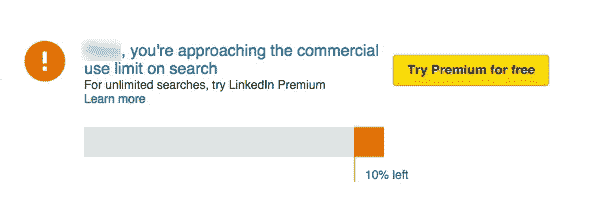
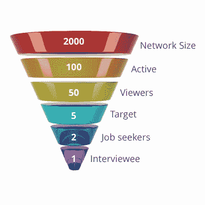

# LinkedIn 上创业公司招聘挑战的 5 种变通方法

> 原文：<https://medium.com/hackernoon/5-workarounds-to-a-startup-s-hiring-challenges-on-linkedin-949039921781>

你是创始人、管理者还是招聘人员？你是否参与了公司的招聘？你很有可能在用 LinkedIn 招聘员工，但并没有达到最佳效果。

LinkedIn 不是唯一的平台，但却是你开始招聘时第一个求助的平台。LinkedIn 拥有世界上最大的专业人士数据库，拥有超过 4 亿用户，然而如果你使用 LinkedIn 进行招聘，你会错过很多优秀的人才，当然还有你的时间。这是一个严重的问题，也是对您业务成功的威胁。你的竞争对手会很乐意知道的。是人决定了一个企业的成败，因此人们应该非常小心他们的招聘过程。

> “没有伟人的伟大愿景是不相关的。”—吉姆·科林斯

以下是导致 LinkedIn 招聘效率低下的五点原因。好消息是，我在这里列出了一些解决方法。

## 问题 1:我没有庞大的人际网络

LinkedIn 吹嘘的庞大用户群实际上对你没有任何用处。LinkedIn 将你的人才发现限制在你的三级人际网络之内。即使购买 LinkedIn 的高级订阅也不能让你接触到你的三级网络之外的人的个人资料。以平均每个用户 300 人的 LinkedIn 网络规模为例，您可以连接到大约 90，000 个 LinkedIn 简档，并访问 26，910，000 个 LinkedIn 简档。也就是说，你错过了 373，090，000 份个人资料，占 LinkedIn 个人资料总数的 92.7%。不管你用什么方法，你只会看到 7.3%的 LinkedIn 个人资料。

LinkedIn First Degree Network Size

*让我来帮你解决这个问题:*拓展你的人际网络！你只能在 LinkedIn 上扩展你的网络，以获得更大的可访问网络。这可以通过两种方式实现:1)联系更多的人，2)加入团体。不要通过向看到的任何人发送连接请求来连接，这是 LinkedIn 提倡的。那会给你带来糟糕的结果。有一个高效的方法。在 LinkedIn 搜索栏中搜索“LION”。不，他们既不是动物，也不是狮子俱乐部的成员。简而言之，他们是 LinkedIn 开放网络用户。他们大多有庞大的关系网。他们努力工作来建立他们庞大的网络。向他们发送连接请求。一旦连接，他们的第一级网络成为你的第二级网络，他们的第二级网络成为你的第三级网络。然后加入 50 个群组(这是 LinkedIn 上加入群组数量的上限)，在那里你可以找到你正在寻找的那类人。来自不同群体的人可能超出了你的第三级网络，但你可以看到他们的个人资料，因为你们都属于同一个群体。如果我要雇用一名 Android 开发人员，我会搜索 Android 开发相关的小组。尽可能多的和他们联系。如果你能够在 LinkedIn 上与你的第三等级网络之外的人联系，你将在扩大你的 LinkedIn 网络规模方面取得巨大的飞跃。

## 问题 2:我现在有一个巨大的网络，但是 LinkedIn 的搜索结果限制令人沮丧

尽管 LinkedIn 在你的搜索结果中显示了数百万人的总数，但它只允许你查看前 100 页。这意味着拥有一个庞大的网络只会让你获得前 1000 个与你的搜索查询相匹配的最受欢迎的个人资料。在这里，你会发现很多人已经从你寻找的位置回到了一个更高的位置。这些人现在没用了。即使你找不到几个你感兴趣的人，你也会错过很多其他人，仅仅因为他们在 LinkedIn 上不活跃。

又一个倒霉蛋。查看前 300 个搜索结果，LinkedIn 会提示你购买高级帐户或下个月再来。你想要什么？

The message LinkedIn shows after reaching the 300 search result limit under free subscription

*让我来帮你解决另一个问题:*过滤器！试试过滤器，找到更多你感兴趣的人。这有所帮助，但仍然不能帮助你找到 LinkedIn 上不太活跃的人才。

如何超越 300 个人资料搜索结果限制？买溢价！最贵的那种。别担心。它不会花费你。高级订阅在头 30 天是免费的。请记住在 30 天内取消，否则您将被收取接下来 30 天的费用。使用 Google 日历，注册一个从现在起第 29 天的提醒事件。充分利用这 29 天的高级帐户会员资格。会员资格不允许您查看任何搜索结果的前 100 页以外的个人资料，但可以保证无限制的搜索尝试。

## 问题 3: LinkedIn 现在可以用了，但是我联系的人没有回应

LinkedIn 不仅仅是一个招聘平台——一个专业的网络平台——各种背景的人都来这里，创建他们的个人资料，做他们自己。他们中的一些人肯定在积极寻找工作，但大多数人只是在那里——建立关系网，创造销售线索，消磨时间，或者几个月或几年不活跃。

*我来帮你解决一个有点贵的问题:*在 LinkedIn 上发布一份工作。每份工作每月花费你大约 1700 卢比，让积极的求职者联系你。

## 问题 4:我在 LinkedIn 上发布了一份工作，收到了 300 份申请，但大多数都是不相关的

在我揭示为什么无关的申请会通过之前，让我告诉你，如果每个潜在的人都知道你的职位空缺，这个数字(300)可能会高得多。LinkedIn 上有数百个类似的招聘信息。对于一些求职者来说，你的工作很有可能被放在他们搜索结果的第 10 页，而他们永远也不会看到。这是一个问题。另一个原因是，对于一些求职者来说，你的招聘启事会出现在头版，吸引所有人的眼球。你试过在 LinkedIn 上申请工作吗？只需点击一下按钮就可以完成。申请工作的简单性是你收到大多数不相关申请的原因。现在你的负担是从相关的内容中过滤掉不相关的内容。你可能从来没有收到过那些没见过你的工作的优秀人才的申请，或者那些没有尝试在 LinkedIn 上找工作的人的申请。

*找到解决这些问题的方法:*在你的网站上发布工作，引导人们在 LinkedIn 上申请。大多数不认真的人会跳过申请你的工作，因为它需要更多的点击按钮。不幸的是，对于那些一开始没有发现你的工作的人，没有别的解决办法。

## 问题 5:我在 LinkedIn 上发布了一张很酷的关于职位空缺的图片，但即使这样也没有用

我喜欢看到一些吸引求职者的很酷的海报。也有助于塑造公司良好的品牌形象。但可悲的是，它也吸引了崇拜者。对很酷的东西感到兴奋的不合格的人也申请。那只是一个小问题。最大的问题是，关于职位空缺的信息只到达了你 LinkedIn [网络](https://hackernoon.com/tagged/network)的一部分活跃用户。让我们假设一个情况，有所有最好的可能性。比方说，你发布了一张图片，告诉人们有一个“业务开发人员”的职位空缺。你的网络规模是 2000 人，其中当天在 LinkedIn 上活跃的人是 100 人，其中看到你发布的图片的人只有 50 人，在这一小部分人中，业务开发人员是 5 人，其中只有 2 人是活跃的求职者，只有 1 人愿意在上述地点工作。他申请了。你面试了解到他不太适合这家公司。你将不得不连续发布几天才能看到一些积极的成果。

Conversion funnel of a creative LinkedIn post for a job opening

*下面是这个问题的解决方法:*在你创建的图片帖子中，问一个问题，人们可以在评论中做出回应。如果一个人喜欢、分享或评论一个帖子，她/他的网络也能够看到该帖子。你可以这样说:“喜欢或评论以示兴趣”。通过这种方式，你可以接触到比一篇简单的帖子更多的人。不幸的是，没有变通办法可以避免这些崇拜者通过你的帖子来申请。

# 一个更好的招聘方案: [SocialHelpouts](http://socialhelpouts.com/)

我宁愿建议你使用 SocialHelpouts，而不是一系列的解决方法。这是一个用于招聘的人才发现平台。这是最有效的雇佣方式之一。原因如下:

## 100%积极求职者

你会发现 SocialHelpouts 上只有活跃的求职者，他们在平台上的最后活跃日期信息是他们寻求改变的意愿的指标。

## 按照你喜欢的顺序查看所有匹配的人

你不会错过任何一个合适的、有可能成为雇员的人。事实上，你看到它们的顺序是从最相关和最可能的开始，到最不相关和最可能的结束(不是基于流行度)。该平台不仅匹配你在候选人身上寻找的技能，还匹配你和候选人的个人偏好。所以如果万一你是一个产品[创业](https://hackernoon.com/tagged/startup)有小团队，你可以看到愿意加入你的人。

## 对应该看到的人 100%可见

在 SocialHelpouts 上，你的工作 100%的用户都可以看到，他们正在寻找一个像你在产品中一样的角色。你去的次数越多，你的知名度就越高。

## 很少但没有不相关的应用

申请社会救济金的工作不像在其他地方那么容易。申请工作必须花学分。学分是有限的，所以 a 小心翼翼地只申请她/他认为合适的学分。这并不限制任何人申请更多的工作，但他们必须有更多的学分，可以通过做一些工作来获得。这减少了你收到与工作无关的申请的可能性。

## 让你的关系网帮助你寻找候选人

在 SocialHelpouts 上有两种简单的方法可以做到:

1.  比方说，你的一个朋友也在招聘职位上。他与一名候选人交谈，发现他很有才华，但由于某种原因无法雇用他。如果这个朋友告诉你他喜欢的这个候选人不是很好吗？你会立刻找到一个好的候选人。节省你寻找优秀人才的大量时间和精力。这种情况只发生在社交网站上。传递优秀人才的人会将他们推荐给他们网络中的其他招聘人员。
2.  *网络求助:*比如说，你有一个职位空缺。你一般做什么？你告诉你遇到的人这个职位空缺，请他们推荐一个人，或者简单地在他们的关系网中传播这个消息。他们确实会帮助一些人，但是只帮助那些在那个时候他们最想帮助的人。如果你能看到你的人际网络中所有能提供帮助的人，并且只需点击一个按钮就能联系到他们，这不是很棒吗？如果你的朋友可以看到他们网络中的每个人，并选择与他们分享信息，这不是很棒吗？好吧，即使这样也发生在社交网站上。

SocialHelpouts 的使命是为全球雇主解决招聘问题，他们已经做到了。如果这对你有帮助，请大方点赞和推荐。也请与朋友分享这些平静的信息:)一如既往#祝你幸福！

> [黑客中午](http://bit.ly/Hackernoon)是黑客如何开始他们的下午。我们是 [@AMI](http://bit.ly/atAMIatAMI) 家庭的一员。我们现在[接受投稿](http://bit.ly/hackernoonsubmission)并乐意[讨论广告&赞助](mailto:partners@amipublications.com)机会。
> 
> 如果你喜欢这个故事，我们推荐你阅读我们的[最新科技故事](http://bit.ly/hackernoonlatestt)和[趋势科技故事](https://hackernoon.com/trending)。直到下一次，不要把世界的现实想当然！

