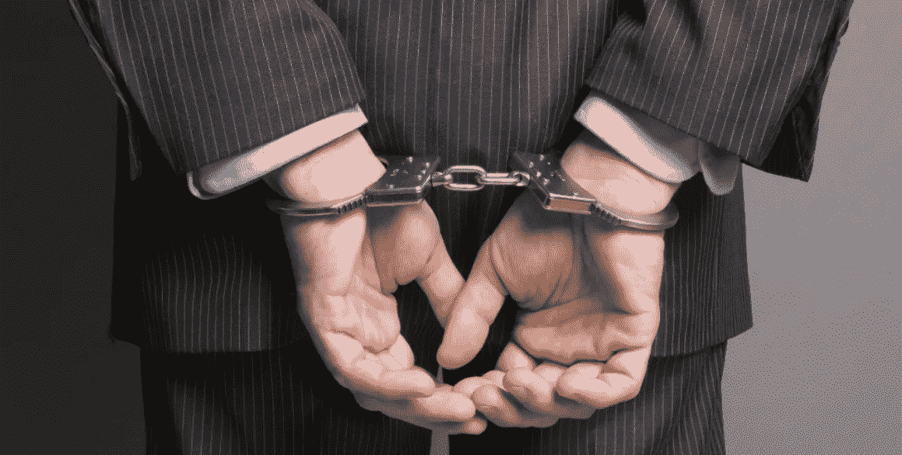
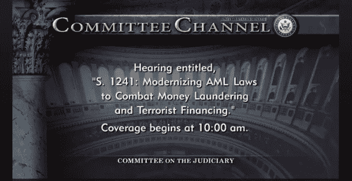
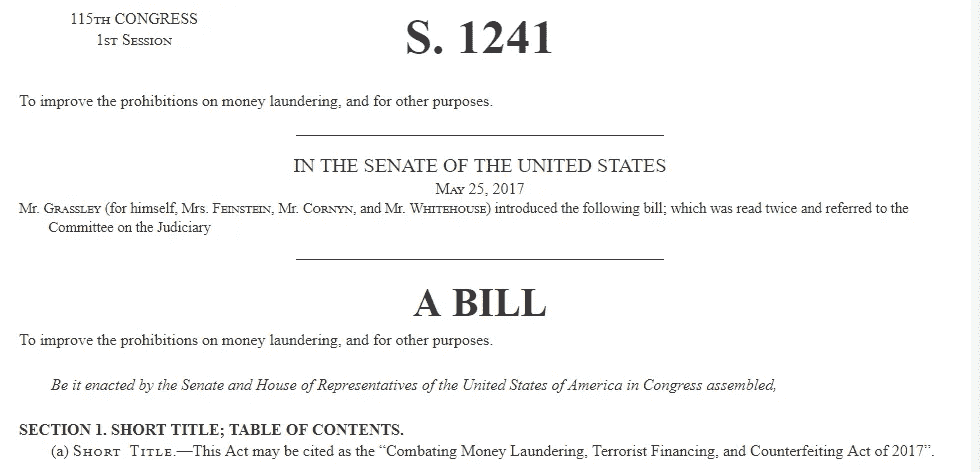
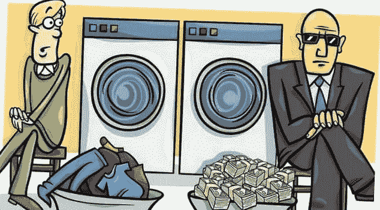
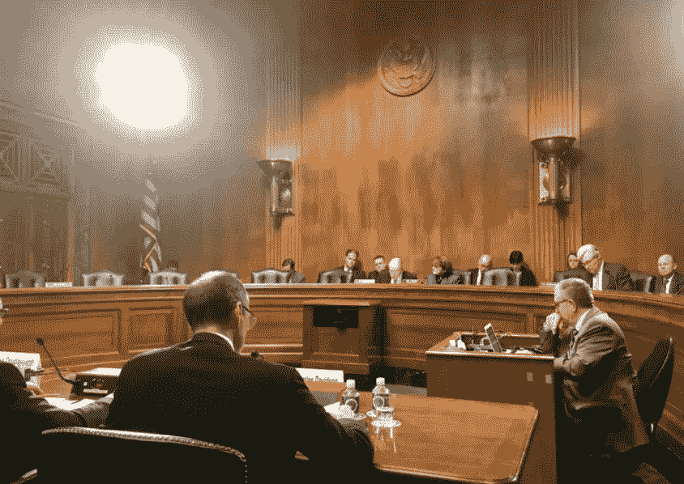
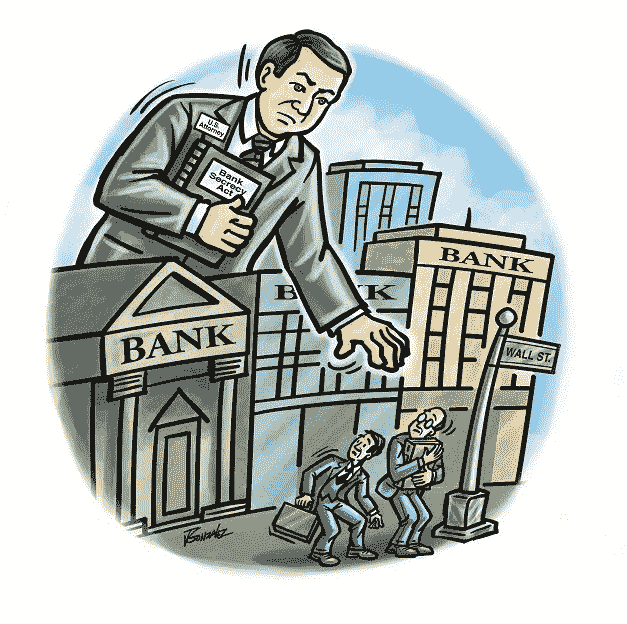
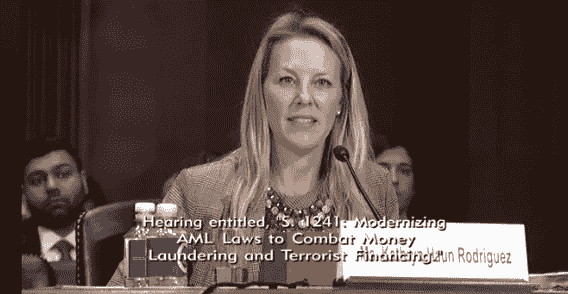
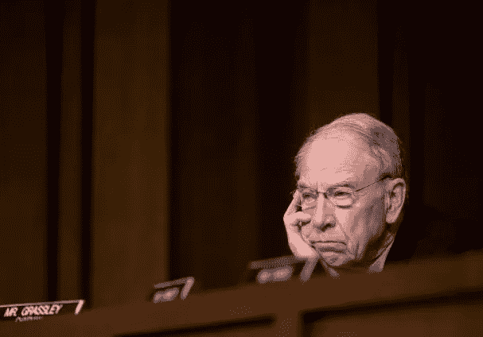
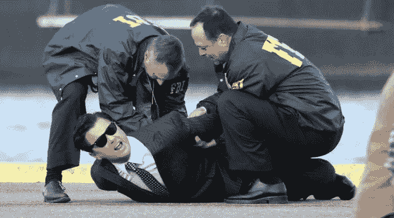
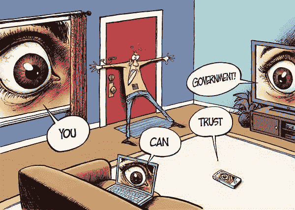

# 《50 度灰》:比特币制造者应该了解 S.1241 的哪些内容

> 原文：<https://medium.com/hackernoon/50-shades-of-grey-what-bitcoiners-should-know-about-s-1241-fd6c0d7f296d>

我首先要澄清的是，我不支持任何形式的罪犯、犯罪活动或恐怖主义。我完全支持让这些类型的组织更难存在和运作的法律。令人沮丧的是，所有法律都会对像你我这样的守法公民产生影响。不管你对此事的哲学意识形态如何，最好是了解和理解事实。法律制度对无知是不宽容的。比特币和加密货币的法规和法律是目前世界上最热门的话题。各国政府正迅速试图理解和应对比特币将继续存在的现实。

[Watch Hearing Here](https://www.judiciary.senate.gov/meetings/s1241-modernizing-aml-laws-to-combat-money-laundering-and-terrorist-financing)

上周，一位朋友给我转发了一个 slack 小组后巷的链接。他说我需要查一些对比特币有法律影响的东西。这与[美国司法委员会于 2017 年 11 月 28 日举行的听证会](https://www.judiciary.senate.gov/meetings/s1241-modernizing-aml-laws-to-combat-money-laundering-and-terrorist-financing)有关，该听证会由主席参议员查克·格拉斯利主持，题为“ [S.1241](https://www.congress.gov/bill/115th-congress/senate-bill/1241/text#toc-idea0e9489fc8f46379f95bb56c8bbbda5) :更新反洗钱法律以打击洗钱和恐怖融资。”简而言之，听证会持续了两个多小时，一群官员和几个“证人”，其中一个明显来自比特币基地，其他人来自各种公共和私人组织提供证词。听证会充满了令人信服的事实和统计数据，说明犯罪组织是如何逃脱数万亿美元的洗钱。

随着所有关于这将如何影响 Crypto 的猜测、假设和谣言的出现，我想弄清楚这一点。我不是法律鹰派，但拥有一家公司多年，我确实理解了解参与规则的重要性。我还了解到，在这些规则中，有 50 种灰色色调，律师们为此花费了数百个小时的准备时间，并在法庭上进行辩论。这就是为什么你需要做你的研究。我在这篇文章中的目标是尽我最大的努力来分解 S.1241，并展示这条法律**对比特币制造者和密码持有者可能意味着什么的事实。**

此外，我想增加另一层洞察力，并询问了比特币和加密社区中的一些声音，以获得他们的意见。希望这一信息将有助于教育人们什么处于危险之中。

# **什么是法案 S.1241？**

S .1241:打击洗钱恐怖融资，2017 年假币法案正是 is 所说的那样；旨在更新过时的反洗钱法律(AML)的法案。

反洗钱法律最初是针对“可卡因牛仔”制定的，旨在防止当时猖獗的洗钱活动。随着时间的推移，我们正处于一个新的时代，目前的法律需要现代化，以处理毒品卡特尔、跨国犯罪企业和恐怖组织。

S.1241 旨在帮助实现反洗钱法律的现代化，为执法部门提供更多起诉和堵塞法律漏洞的工具。它还将为检察官和法官澄清证据规则，这反过来将有助于增加定罪。直截了当地说，使用古老的说法“跟着钱走”会使追捕毒枭、贩毒集团和恐怖组织变得更容易然而，现在他们将能够更容易地抓住那些钱。

S.1241 还更新了反洗钱法律，以涵盖“新型资金”这就是第 13 节对比特币和加密持有者的警告。预付费接入设备、数字货币或其他类似工具。

# **世界上有多少洗钱活动？**

T 在本次听证会上作证的参议员和个人提供了非常令人信服的统计数据，证明我们当前的反洗钱法律在美国和全球的无效性。99.99%的洗钱犯罪没有被起诉。他们反复强调通过 S.1241 法案对我们的国家安全很重要。我直接从证人的证词中引用了这些话，如果你想深入了解的话，可以把它们链接起来。

> *"* [*【国际货币基金组织(IMF)*](https://www.judiciary.senate.gov/imo/media/doc/Cassara%20Testimony.pdf) *估计，洗钱每年约占全球国内生产总值(GDP)的 2%至 5%，2015 年约为 1.5 万亿至 3.7 万亿美元，几乎相当于美国联邦预算的规模。同样，联合国毒品和犯罪问题办事处(UNODC)进行了一项研究，以确定非法资金的规模。根据 UNODC 的数据，2009 年的犯罪收益相当于全球 GDP 的 3.6%，约为 2.7 万亿美元–*[*约翰·卡萨拉，制裁和非法金融中心*](https://www.judiciary.senate.gov/imo/media/doc/Cassara%20Testimony.pdf)
> 
> *“世界银行和国际货币基金组织估计，每年有 2.17 至 3.61 万亿美元被洗钱。犯罪分子愿意尝试新的洗钱方法，并且是新技术的早期采用者。因此，我们的反洗钱法律也必须不断发展，特别是考虑到洗钱者、恐怖主义融资者、贩毒者、跨国有组织犯罪分子和网络罪犯越来越多地利用全球金融系统来进行他们无法触及的金融交易。”——*[*【凯瑟琳·霍恩】*比特币基地董事会成员](https://www.judiciary.senate.gov/imo/media/doc/Haun%20Testimony.pdf)

Committee on the Judiciary meeting on November 28, 17

# 【S.1241 到底给反洗钱法律增加了什么？

填补了现行反洗钱法律的空白。

更强的检察官权力

向银行撒谎构成犯罪

对不响应执法部门记录要求的银行进行民事处罚

采取措施改善银行之间的沟通，使举报可疑活动更加容易。

将个人在美国境内外走私超过 1 万美元的刑期从 5 年增加到 10 年。

阐明了将资金转移进出美国以逃税的规则。

阐明了关于空壳公司和试图利用复杂的业务结构匿名隐藏资金的人的规则。

增加了针对基于贸易的洗钱、房地产洗钱和其他现代洗钱计划的规则

改变“数字货币”的地位，将其定义为“货币工具”。(第 13 条)

# **为什么第 13 条对比特币制造者和替代币持有者很重要？**

第 13 条为比特币和替代货币在美国的进出制定了监管框架。通俗地说，S.1241 在金融机构的定义中增加了数字货币，并将其与数字交易所或不倒翁一起纳入为**货币工具**。这一定义开启了关于什么是“数字货币”的辩论，逻辑上说，美国政府会将比特币和加密货币视为一种“数字货币”。如果是这样，这可能会要求比特币和加密持有者、企业和交易所遵守 BSA 报告规则。这意味着任何时候你进出美国超过 10，000，你可能必须报告。撒谎是一种犯罪。他们没有出来特别提到比特币或替代币，但我预见到随着我们的前进，他们自己定义的灰色阴影。

这是我从 LLP Steptoe & Johnson 的区块链博客上找到的。它很好地分解了 S.1241 中的三个重大拟议变化以及对“区块链和数字货币的[影响。“如果你有时间，请阅读整篇文章。](https://www.lexology.com/library/detail.aspx?g=c77ee460-b1a6-4335-86cb-a8f7effe579e)

> 1.“将数字货币纳入《美国法典》第 31 卷第 5312(a)条第款下的金融机构和货币工具的定义:将对《银行保密法》的这一条款进行修订，规定“(2)“金融机构”是指—[……](K)旅行支票、支票、汇票的发行人、赎回人或出纳员、**预付存取设备、**或类似工具、**或任何数字货币的数字交换器或不倒翁**【变更
> 
> 2.高报告:该法案要求总审计长向国会提交一份报告，内容涉及:(1)修正案对执法、预付费接入行业和消费者的影响；以及(2)财政部银行保密法(“BSA”)条例( [76 Fed)的实施和执行。注册。45403](https://www.gpo.gov/fdsys/pkg/FR-2011-07-29/pdf/2011-19116.pdf))；和
> 
> 3.国土安全部和海关及边境保护局(“CBP”)报告:该法案要求国土安全部部长和 CBP 专员向国会提交一份报告，内容涉及:(1)在边境口岸拦截和检测预付费接入设备、数字货币和类似工具的战略；以及(2)对该策略所需的基础设施的评估。"

# **BSA 是什么，如果 S.1241 通过，为什么这对美国的比特币和替代币持有者意义重大？**

这里有一个来自谷歌的 BSA 的基本定义。[《银行保密法(BSA)](http://searchfinancialsecurity.techtarget.com/definition/Bank-Secrecy-Act-BSA) **，**也称为《货币和外国交易报告法》，是美国国会于 1970 年通过的一项立法，要求美国金融机构在涉嫌洗钱和欺诈的情况下与美国政府合作。

通过将“数字货币”纳入货币工具，这意味着加密交易可以被视为“数字货币”随后可能需要遵守 BSA 对 10K 境内任何“数字货币”流动的报告。如果超过 10k 的任何和所有比特币或替代比特币移动都必须报告，这可能会打开一个蠕虫病毒的罐子。

我将再次遵从 LLP Steptoe & Johnson 的[区块链博客](https://www.lexology.com/library/detail.aspx?g=c77ee460-b1a6-4335-86cb-a8f7effe579e)来简明地解释 BSA。

> “根据银行保密法，正在、将要或已经向美国、从美国或通过美国运输超过 10 000 美元的“货币工具”的个人或代理人或受托人必须提交货币或货币工具国际运输报告。如[法案摘要](mailto:https://www.grassley.senate.gov/sites/default/files/judiciary/upload/Money%20Laundering%2C%2005-24-17%2C%20Bill%20Section-by-Section.pdf)中所述，将数字货币纳入“货币工具”的定义将使这些设备遵守 BSA 下的反洗钱报告要求。”

Senator Feinsten checking her Blockfolio during the hearing

# **在听证会上，关于“数字货币”、“比特币”或“替代币”具体说了些什么？**

在这次听证会上，很少有人谈到“数字货币”。我曾希望听到更多关于这项立法对比特币和加密持有者的影响的澄清。每个人都应该花点时间，听听参议员格拉斯利的问题和霍恩女士在听证会 1:54:57 的回应。Haun 女士讨论了财政部金融犯罪网络部(FinCEN)在 2013 年提出的定义“货币与虚拟货币”的指导方针的演变。[这些指导方针建立了一个框架](https://www.fincen.gov/sites/default/files/shared/FIN-2013-G001.pdf)来规范管理、兑换或使用虚拟货币的人。该准则要求从事虚拟货币交易的交易所遵守 BSA 的规则和条例，并报告可疑交易。目前在美国开展业务的合法交易所应该会追随 BSA。

Ms. Kathryn Haun Rodiguez, Member, Coinbase Board of Directors testifying.

在她的声明的最后，你会注意到，当她谈到不受监管和未注册的交易所的问题时，Haun 女士的前检察官一方开始出现。她突然停下来，不再详述追踪不受监管的交易所的必要性。人们只能假设，如果比特币基地董事会成员主张对其它交易所提起刑事诉讼，那就不太好了。这对一些人来说可能会被解释为利益冲突，这也不是大企业第一次帮助撰写和倡导有助于规范竞争的法律。

我相信焕女士的动机是纯洁的，她没有恶意。我想每个人都会同意，追查黑幕交易所和坏演员是一件好事。问题是什么和谁来定义黑幕交易和坏演员？

Senator Grassley of Iowa, Chairman, Senate Judiciary Committee

对于那些想听听听证会上说了些什么的人来说，这里有一份备忘单。

**1:47:57** — [凯瑟琳·桓·罗德里格斯从开始作证。](https://www.judiciary.senate.gov/meetings/s1241-modernizing-aml-laws-to-combat-money-laundering-and-terrorist-financing)

**1:54.47**——[来自爱荷华州的参议员格拉斯利提问开始](https://www.judiciary.senate.gov/meetings/s1241-modernizing-aml-laws-to-combat-money-laundering-and-terrorist-financing):

> *“焕小姐因为你触及到了与货币有关的起诉问题。应该做些什么来确保执法部门能够识别、预防和起诉利用数字货币获利和为其运营提供资金的犯罪分子。”*

**2:16:57**——[明尼苏达州参议员艾米·克洛布查尔的提问开始](https://www.judiciary.senate.gov/meetings/s1241-modernizing-aml-laws-to-combat-money-laundering-and-terrorist-financing):

> “我*我们看到的从现金到数字的转变会让执法部门更容易或更难追踪这些洗钱案件吗？你认为这些贩毒集团会开始不用现金吗？你会怎么做？”*

# 谁是比特币基地董事会成员 Kathryn Haun Rodriguez？

在比特币的传说中，athryn 有点像一个传奇。你可能不知道她的名字，但你肯定听说过她的作品。她帮助成功起诉了腐败的联邦特工，他们在丝绸之路调查中窃取了 21000 个比特币。难怪比特币基地邀请她加入董事会，她现在是审计和风险委员会主席。她还为科技公司和投资基金提供建议。我当然希望比特币基地能好好补偿她，因为她显然是一名忍者律师，知道如何在反洗钱和数字货币的浑水中航行。这还不算她在 DOJ 的人脉。

Kathryn Haun Rodriguez was a federal prosecutor for 10 years before Coinbase

郑重声明，这不是焕女士第一次代表比特币基地作证。与她在 2017 年 6 月 8 日在美国众议院金融服务委员会和恐怖主义和非法金融小组委员会前所做的证词相比，她在 2017 年 11 月 28 日听证会上所做的证词很无聊。Haun 在比特币基地工作仅两周，她深入研究了比特币和加密货币，并参与起诉网络犯罪。

让我们看看她的简历。

旧金山前助理检察官

曾在美国司法部国家安全司担任高级职务

美国司法部首位数字货币协调员。

斯坦福大学网络犯罪、金融技术和加密货币客座讲师

前最高法院书记官安东尼·肯尼迪

起诉了腐败的缉毒署和丝绸之路特别工作组的特工，他们在调查期间窃取了 21，000 比特币。

最近加入比特币基地全球公司董事会

# **s . 1241 有哪些挑战？**

整合是当前和未来最大的挑战。执法部门、银行和交易所已经很难跟上当前执行和遵守法律法规的要求。S.1241 将使起诉犯罪活动变得更容易，但它也将使更多的案件堵塞系统。听证会上有人提到，银行在报告可疑活动时采取了防御性措施，以避免因不遵守规定而受到处罚。我看到的另一个挑战是 S.1241 中使用的语言的灰色阴影。律师将有一个争论法律每个字母的白天。

LLP 的 T2 区块链博客在打破其他一些挑战方面做得很好。

> “当然，挑战在于当今许多金融工具都是这样运作的。如果你可以在手机上使用网上银行，或者可以从信用卡中提取现金，并且金额超过 1 万美元，那么你同样可以携带数字可访问的货币跨境。此外，这些数字能力使一个人能够获得犯罪分子首选的压倒性货币:现金。
> 
> 这一挑战与其说是关于虚拟货币，不如说是关于如何调整为早期时代设计的监管结构，以适应当今数字化经济。在边境挑出虚拟货币不会对洗钱或恐怖主义融资的风险产生实质性影响。虽然犯罪分子正在使用比特币等数字货币，但大多数数字货币活动并不涉及非法活动(参见 chain analysis[的乔纳森·莱文的书面证词](https://financialservices.house.gov/uploadedfiles/hhrg-115-ba01-wstate-jlevin-20170608.pdf))。事实上，根据新美国安全中心(CNAS)最近的一份报告,“没有证据表明恐怖组织使用虚拟货币来支持他们自己”该技术确实具有可能吸引犯罪分子的功能，包括实现低成本、高效的点对点交易，但这些功能正是该技术可能为无数行业带来巨大利益的原因(例如，数字身份、智能合同、制药)。"

The Crypto community reminds me of a mosh pit at times.

# **比特币和加密社区对此有什么看法？**

比特币和加密世界极其多样化。可以肯定地说，不是每个人都同意或相处。我想增加另一层视角，并问了密码界的几位思想领袖同样的问题。回复无处不在。有些人保持简短和甜蜜，有些人选择退出，而其他人则全场紧逼。你将要阅读的观点是未经编辑和过滤的。

**你如何看待美国参议院将不披露加密货币所有权定为犯罪的举动？**

**Ari Paul，CIO Block Tower Capital，** [@aridavidpaul](https://twitter.com/AriDavidPaul) **，美国**

*“参议院司法委员会面前的法案主要是现有规则对加密货币的延伸——这并不奇怪。然而，今年加密货币的抛物线式飙升引起了全球监管机构的注意，我预计未来会有更多严厉的监管规定。今年年初，加密货币价值 180 亿美元，太小，不足以被视为对政府的威胁；3300 亿美元，他们现在认为这是一个需要控制的重要现象。”*

**漩涡，世界加密网，比特币新闻秀，**[@ theonevortex](https://twitter.com/theonevortex)**，美国**

许多人都预见到了这一天的到来。我们都知道，在民族国家之外创造一种货币会引发这种恐惧。然而，我非常希望继续采取温和的监管方式。可能看起来不像，但美国政府中有许多人看到了比特币之类东西的必要性和重要性。在我看来，美国政府将尽力监管，我们将有地方使用和消费我们的比特币。还会有一整个空间是任何政府都无法监管的。对我来说，这是最令人兴奋的部分，因为这是真正释放金钱的地方。”

**狼，臭名昭著的密码交易员**[@ WolfOfPoloniex](https://twitter.com/WolfOfPoloniex)**，美国**

"*祝你好运！"*

**Julian Hosp 博士，TenX 联合创始人** [@julianhosp](https://twitter.com/julianhosp) **，新加坡**

这么做的问题是，为什么他们不把持有的每一份法定现金都列为犯罪。这将对美国经济产生非常不利的影响，我认为美国不会这么做。”

**瑞安·迪普曼，阿兹特克联合创始人，**[@瑞安·迪普曼](https://twitter.com/RyanDippmann) **，美国**

*“比特币是软件即服务(SaaS)，或者用户之间交换的安全数据；这将没有银行账户的 4B+和没有互联网接入的 4B+连接到新的全球电子商务。美国参议院 S.1241 法案将比特币错误地描述为“加密货币”，只会限制美国的企业家和软件开发商参与巨大的全球机遇。我认为他们(黛安·范斯坦及其同事)应该被告知，试图阻止比特币就像试图阻止内燃机、t 型车或收音机的发明一样。所有这些都让美国变得更加美好，比特币也是如此。”*

**Bitfinex'ed，加密交易员，告密者，** [@Bitfinexed](https://twitter.com/Bitfinexed)

我认为这不会通过，即使通过了，也会被否决

**莱昂纳多·德·巴罗斯，创始人 PymiAlimentos，BitcoinZuela**[@ bitconzuela](https://twitter.com/Bitcoinzuela)**，Venzuela**

*“加密货币就是钱，政府总是想知道钱在哪里，谁有它，你拿它做什么。所以，依我看，这项措施是意料之中的。好的一面是，比特币是抗审查的！”*

**Akin Fernandez，阿兹特克** [@beautyon](https://twitter.com/Beautyon_) **，英国**

这完全不符合美国宪法，将会被否决。第五修正案保护所有美国人免于自证其罪，所以这是不可能的。没有人“拥有加密货币”；你只知道一段文字，受保护的文字。参议院中那些倒霉的过度工作的人完全搞错了，因为一些坏演员(货币中心)欺骗了他们。

这就说明了一切。”

[https://hacker noon . com/Senate-bill-s-1241-a-threat-to-America-456873 D4 eccc](https://hackernoon.com/senate-bill-s-1241-a-threat-to-america-456873d4eccc)

 [## “比特许可证”是一个必须废除的坏主意

### 有人说比特币就是钱。还有人说不是钱。没关系。任何人都不应该被授权使用或…

hackernoon.com](https://hackernoon.com/the-bitlicense-is-a-bad-idea-that-must-die-cb413c076d85) 

**Gabriel D Vine，音乐家，未来主义者，未来狂言者，世界密码网**[@ Gabriel D Vine](https://twitter.com/GabrielDVine)**，美国**

*“二十年来，赛弗朋克们一直期待着这一举动。鼓励“禁止现金”的持续宣传一直是一个信号，表明这一过程已经在进行中，而这一最新举措只是证实了威权政府监控的愿望延伸到了最小单位的交易。这项立法的公然将是对比特币生态系统的一个很好的唤醒，正如该领域的长期思想家多年来一直宣称的那样，隐私(以及可替代性)是目前发展创新的第一要务，特别是在隔离见证(支持二级扩展)正在使用的情况下。幸运的是，过去几年对比特币交易的发送者、接收者和金额进行完全加密和保密的研究取得了很大进展，这种立法只会加速这种技术的采用，以逃避暴力国家行为者的检测。”*

**Jimmy Song，比特币开发者兼企业家，**[**@ Jimmy Song**](https://twitter.com/jimmysong)**，美国** 
*“法律往往需要很长时间，这是好事。”*

# **结论**

从各方面考虑，我不担心这个。随着时间的推移，我们不可避免地会看到更多关于比特币和加密货币的监管和新法律。什么都没有改变，在不久的将来也不会改变。如果有的话，这些法律已经写在现行法律的灰色地带。所有这些都赋予执法部门和检察官更多的权力。

我看到的问题是它设定的优先顺序。我们倾向于将针对罪犯的法律合理化为，“我没有做错任何事。这是针对坏人的，所以一切都很好。”不幸的是，在“国家安全”的幌子下，美国人的隐私和自由被蚕食了。每年，我们都会因针对罪犯或恐怖分子的法律而失去更多的公民自由和隐私。我认为这种情况不会很快改变。

许多人的误解是 S.1241 将改变游戏。这可能会帮助他们定罪一些更大的鱼，但可悲的是什么都不会改变。不管你是谁，也不管你认为自己有多狡猾，如果政府或执法部门想扳倒你，他们就会扳倒你。书本上写的是什么法律并不重要。

我很想知道这一切在未来会如何发展。有一件事我可以肯定，我会遵从他们的任何要求。我鼓励你也这样做。没有理由因为密码而冒失去一切或坐牢的危险。你能做的最好的事情就是阅读、研究和保持消息灵通。#知识力量

感谢所有帮助撰写本文的贡献者。请通过与你的朋友分享来支持独立内容制作者…如果你不认为这很糟糕的话！

*关注*[@ piratebachbum](https://twitter.com/piratebeachbum)*，* [@coin_strategy](https://twitter.com/coin_strategy) *，* www.coinstrategy.io