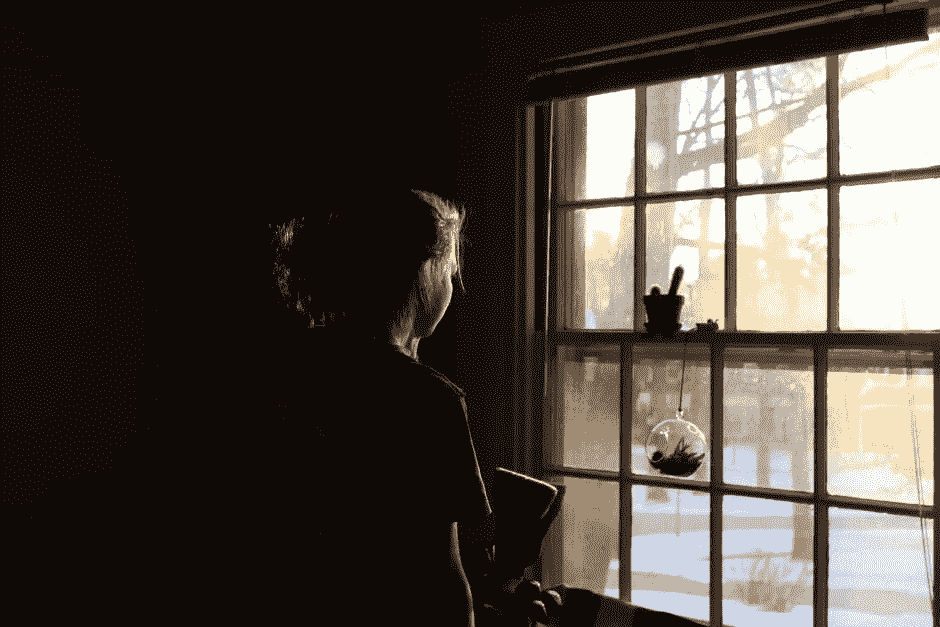

# 编程的 50 层阴影:如果克里斯蒂安·格雷是一名程序员会怎样？

> 原文：<https://medium.com/hackernoon/50-shades-of-programming-what-if-christian-grey-were-a-programmer-36ad195cdeac>

> 这个故事最初发表在 danielkmak.com/blog/。请记住，这是一个思想实验和讽刺。

> 第一章

> ——“你随时可以离开。直升机随时待命，随时带你去，你可以住一夜，第二天早上回家。无论你做什么决定都没问题。你还不知道你在做什么。你仍然可以逃之夭夭。来，我想让你看看我的游戏室。”
> 
> -"打开这该死的门，克里斯汀"

他打开门，退后让我进去。我再次凝视着他。我真想知道这里面有什么。我深吸一口气走进去。

感觉就好像我在 NASA 总部迷失了自我。到处都是电子设备。在红色房间的中央有一张床。在暮色中，我能看到监视器发出的光。很柔软，略带红色。他肯定在用焊剂。他整晚都呆在这个房间里吗？*神圣的操。*

> -“你们这里有这么多技术。你家里为什么需要这么大量的电子设备？”
> 
> ——“我只信任电脑。我喜欢和他们一起玩。他们的思考背后是有逻辑的…有时候我在想是不是我有什么问题。也许我在计算机程序公司呆的时间太长了，因此我的理想和期望太高了。”

我很害怕。他是某种反社会者吗？我同意电脑比人类更容易预测，但是为什么你的卧室里会有一大群电脑呢？有些不对劲。我一直站在那里。我从入口到房间中央只走了几步。我应该回头吗？这里不安全。突然，我听到一个声音把我从我的脑海中拉回现实。

> ——“你看起来吓坏了。别担心。我不是什么独裁者。我不想用一大群机器人来控制世界。这…这只是我放松的方式…我在工作后编程。我不想吓着你。”

我决定大胆一试，留下来，但我已经转向了出口。他站在门边观察我的一举一动。我走近他。我把手伸进他的口袋，抓住电话，猛地拔出来，因为它很烫。我发短信给我的朋友凯特，说我今晚不回家了。

> ——“好吧。打开编辑器，克里斯蒂安。”—我说等我冷静下来。

他打开了一个 Vim。我知道没有出口。

> 第二章

我们已经见面两个月了。他想让我签一份合同。他给了我一份协议。我们要协商条款。他要我做他的“跟班”。他还不知道我是那个要在合同上得到他签名的人。

我对他了解得更多了。他很迷人，但大部分时间呆在家里或办公室。他不想像正常人那样去约会。他不信任第三方，甚至不信任开源。

> -我不再相信开源了。你也不应该。每次想起 OpenSSL 失败，我的心都在滴血。

我以前不知道有人能像他一样了解[编程](https://hackernoon.com/tagged/programming)。

> -你是个有品位的人。过去我见过各种各样的男人，但没有一个像你一样。你很特别。
> 
> -永远不要相信一个不知道 Java 和 [JavaScript](https://hackernoon.com/tagged/javascript) 的区别的人，Anastasia。当你遇到卑鄙的雇佣兵，或者编程巨魔 Q &时，你很难成长为优秀的开发人员。你应该在 StackOverflow 上寻找一个真正的男人。

是时候让他看看我的真面目了。我喜欢他，但是他对我要求太多了…

> -我没有告诉你，但我是一个招聘人员。我想让你签一份合同。
> 
> -不，它走另一条路。你是一个签署合同的人，你愿意把你自己交给我，在所有的事情上。你为什么不早点告诉我？我必须惩罚你。我们将用 COBOL 语言编程。

他真的很生气。我无法忍受。我永远不会用 COBOL 编程。是时候放弃他了。至少一段时间，给他时间重新考虑他的行为…

> 第三章

我站在窗户旁边。外面暴风雨肆虐。克里斯蒂安正坐在椅子上编程。我知道他不喜欢被打扰，但我受够了这种沉默。

> ——“为什么不喜欢别人碰你的代码？”——我问他。
> 
> ——“不再一样了，阿纳斯塔西娅。”——他回答道，甚至没有看我一眼。然后他停顿了一会儿。他站了起来。他的眼神很悲伤。他在过去经历过什么可怕的事情吗？他看着我，继续说道:
> 
> ——“你必须通过大量的代码才能找到你的完美项目。我找到了一个。我不会让任何人歪曲它的架构。例如，使用异常作为常规控制流。我已经看到了那些东西，阿纳斯塔西娅……我不再是以前的我了。”
> 
> ——“这太疯狂了。怎么会有人这样编程？你呢？你使用异常吗，克里斯蒂安？”
> 
> ——“是的，有时候我会破例回答愚蠢的问题。”——他粗鲁地回答。然后他变得安静了。他很困惑。他隐瞒了什么吗？
> 
> -“你真的想看我他妈的 50 个墨镜吗，阿纳斯塔西娅？”
> 
> ——“全部给我看，只有这样我才能完全理解你。”
> 
> -“当我还是个孩子的时候，我习惯于使用变量名的快捷键:a，I，evt，tmp，arr。我做到了。我用这样的方式编程，没人能理解我写的东西。我认为自己是魔术师。这是关于我自己的残酷事实。我用过 go-to 编程…他们说很好。意大利面是我的第二个名字，我为此感到自豪。当我不得不使用 TDD 时——我在其中使用了超时……我甚至使用 sleep()来解决弹性搜索索引刷新问题。最后…我真的是个坏人…我…我…我是那个抛出异常并利用它们来控制流程的人。”
> 
> -“那就把我扔出去，好像我是你的例外一样。”

> [黑客中午](http://bit.ly/Hackernoon)是黑客如何开始他们的下午。我们是 [@AMI](http://bit.ly/atAMIatAMI) 家庭的一员。我们现在[接受投稿](http://bit.ly/hackernoonsubmission)，并乐意[讨论广告&赞助](mailto:partners@amipublications.com)机会。
> 
> 如果你喜欢这个故事，我们推荐你阅读我们的[最新科技故事](http://bit.ly/hackernoonlatestt)和[趋势科技故事](https://hackernoon.com/trending)。直到下一次，不要把世界的现实想当然！

