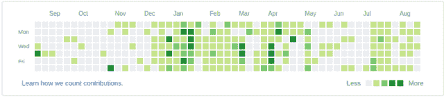

# 500 个夏天的承诺:我的自由/开源软件和 GSoC 的故事

> 原文：<https://medium.com/hackernoon/500-commits-of-summer-my-story-of-foss-and-gsoc-40bb8b325f65>

这个夏天的故事开始于家里一个灰暗的冬天。无聊之余，我开始在 IRC 频道徘徊，就像《爱丽丝梦游仙境》一样，无意中进入了 [FOSS](https://en.wikipedia.org/wiki/Free_and_open-source_software) 的奇妙世界。我不知道，这将是发生在我身上最好的事情之一。下面是一个关于 bug、PRs、repos、commits 和更多 commits 的故事。但这也是一个关于好奇心、学习、挫折(很多)、适应力(比你想象的要多)和这个社区中一些了不起的人的故事。如果要我为你总结的话，我想不出比这更好的方法了。所以现在开始…

声明:这是一个漫长的旅程，因此有了这篇长长的博客。

# 故事

## [#1: PICARD-851:保存时正确更新父项目](https://github.com/metabrainz/picard/pull/496/commits/40d934250b53395232e5cfbe79d45959ac9500d8)

我开始很慢。把事情弄清楚。Picard 在 python 中有一个组织良好且漂亮的[代码库](https://github.com/metabrainz/picard)。这是我一直钦佩的东西，也是我为这个项目做出贡献的动力。我检查了票，发现了一些我认为可以解决的问题。我花了整整一天的时间来理解这些代码。虽然有一段时间我感到很无助，快要失去耐心，但我最终还是找到了逻辑断裂的地方并修复了它。给 Picard 做第一份贡献感觉很棒。

## [#7: PICARD-546，287:添加标签移除支持](https://github.com/metabrainz/picard/pull/501/commits/eddee11fa3e45e61d1f5d44a56b69faad1c49dba)

我的第一个大拉请求，我实际上是在实现一个特性，而不是修复一个 bug。整个拉取请求花了一周时间完成，包括代码审查。我不得不钻研 Picard 的文件和标签处理模块并添加代码。

## [#120:返回空元数据而不是空字典](https://github.com/metabrainz/picard/commit/e42944e8f4ce51000533ee33a85a02ccd91e95bf)

距离我开始给 Picard 投稿终于过去了一个月。我定期投稿的最大动机之一是我们的组织管理员 ruaok 在 GSoC '15 开始前发的这篇文章。我想让自己保持同样的标准，所以我做到了:一天 1 PR。我很快就尽可能多的搞定了，确保我能让我的导师 zas 忙于代码评审。每一天对我来说都是令人兴奋的，因为我会浏览吉拉寻找当天可以买到的票。我第一个月就搞定了 20 多张票。

## [#228:添加 Picard 1.4 发行说明](https://github.com/metabrainz/picard/commit/195091fcaa9780501627beba35135d6f8e55288d)

那天是情人节，天哪，对我的代号——瓦伦丁——皮卡德来说，这是一个值得纪念的日子吗？经过两年多的时间和 1000 多次提交，我们终于发布了 Picard 的主要版本。我还在[发布的博客帖子](https://blog.musicbrainz.org/2017/02/14/picard-1-4-released/)上得到了特写，这让我对我迄今为止所做的所有工作感到非常自豪。这也是我开始想象我的 [GSoC](https://summerofcode.withgoogle.com/) 项目会是什么样子的时候。我开始向 Picard 推荐 v2，我希望前进的方向得到了很多支持。如果你想详细了解我最终的 GSoC 提案是什么样的，[你可以在 MetaBrainz 社区论坛](https://community.metabrainz.org/t/gsoc-2017-picard-v2-0/227579)上看到。

## [#249:来自 lalinsky/master 的合并拉取请求# 632](https://github.com/metabrainz/picard/commit/5b7178d4711e80b8a0a3c712049bf55a9d8964c5)

几天后，另一个惊喜等待着我——我终于获得了 Picard 主回购的推送权限。这是我合并的第一个拉请求。这个拉请求和 PR #633 一起是我第一次涉足跨平台问题的世界。我相信这是我修复的第一个与 OSX 相关的 bug，得到了 luks 和他可信赖的老 Mac 的帮助。在 luks 为我设置的 Mac 上进行了几个小时的远程会议后，我们终于解决了一个影响 OSX 版本的令人讨厌的 bug。

## [#279:更新 Qt5 端口](https://github.com/metabrainz/picard/pull/503/commits/559d5dd657be9f7134d4bfd800c6de866f4a84cb)

这大约是我开始按照我的建议工作的时间。我们已经发布了 Picard 1.4.1 来修复 1.4 中的第 0 天错误。开发工作已经开始转向 Picard 2.0。

【GSoC 的第一个主要任务是:将整个代码库移植到 Qt5。

花了[大量的拉请求](https://github.com/metabrainz/picard/pull/503)和多个后续补丁，Picard 终于在 Qt5 上启动并运行了。这个移植的主要挑战是缺乏关于 PyQt5 的[移植的文档。](http://pyqt.sourceforge.net/Docs/PyQt5/pyqt4_differences.html)除了 PyQt 移植指南，我还必须依赖为 C++ 编写的 [Qt5 移植指南，并找出等价的 python 绑定。对我来说幸运的是，河岸那边的人(制作 PyQt 绑定的人)在尽可能保持绑定接近 C++ API 方面做得非常好。这一点，加上堆栈溢出和精彩记录的 Qt5 代码，使得移植工作变得容易得多。](https://wiki.qt.io/Transition_from_Qt_4.x_to_Qt5)

我面临的另一个挑战是确保上述代码通过我们的 CI 测试。Picard 使用 Travis CI，它使用 Ubuntu 14.04 容器来构建代码。不幸的是，14.04 没有 Py2 的 PyQt5 包，而且从源代码构建它需要很长时间。结果，我不得不在 Travis CI 的一个可信的容器中的 docker 中对 repo 进行 dockerize 并运行 Ubuntu 16.04 中的测试。谈论代码异常。

## [#280:替换已弃用的 __builtin__](https://github.com/metabrainz/picard/pull/664/commits/995ff42cc9956e666d55813e789043ad51ed1ab8)

我 GSoC 清单上的下一个任务同样重要。我必须将所有代码移植到 Python 3。我的目标是 Python 3.5 的移植。这次对我帮助很大的是 Python 工具，`pylint`和`python-modernize`。我用它们来找出 Python 第 2 版中已经废弃的代码片段，并用等同的 Python 第 3 版代码替换它们。我在这里面临的主要问题是编码问题。相信我，只有当你的应用是跨平台和多语言的，它们才会被放大。

将上述与 PyQt5 的表现[稍微](https://github.com/metabrainz/picard/pull/664/commits/028369ca048c1f59c084182a61f898e88e198419) [不同](https://github.com/metabrainz/picard/pull/664/commits/1d658bb8c353eae3c7b503a106ed533b4a915922)结合起来，Python 3 与 Python 2 相比，我不得不费力地解决许多编码/解码/字符串/字节问题。将[诱变剂](https://mutagen.readthedocs.org/)(Picard 所依赖的 Python 音频标记库)堆在这一团乱麻之上，你就有了一个编码/解码灾难的配方。

在进行了大量的字符串/字节修复和碰壁[移植](https://github.com/metabrainz/picard/commit/0a1ded3f4afcb28abc2b0cdc87cecaa64180bc7c#diff-36fbf8a3a6bddcafa7a341560181f2f5)这个[黑魔法代码](https://github.com/metabrainz/picard/blob/master/picard/util/filenaming.py)之后，我终于设法将 Picard 移植到 Python 3，并通过了所有测试。\o/

你可以在[这个大规模的 PR](https://github.com/metabrainz/picard/pull/664) 中找到以上所有的提交。

## [#382:更新安装脚本以允许提交 pip 包](https://github.com/metabrainz/picard/pull/721/commits/b1271c2f8e13d7651dbf30a563de4a47b33d1ef5)

接下来，为了清除更多的 bug，我想要尽可能多的 alpha 测试人员。为了让他们的任务更容易，我将 Picard 打包成一个 pip 包，并在 PyPi 上发布。

## [#393: PICARD-817:为 PICARD 启用高 DPI 支持](https://github.com/metabrainz/picard/commit/868432badc9cbb1cfb4b1fa31e641e3a76d53c91)

我进一步解决了 Picard 在高 DPI 屏幕上无法正常显示的问题。这个问题主要影响我们的 OSX 用户，随着 Qt5 的移植，它很容易缓解。虽然在 Qt5 文档中没有明确提到，但是我能够找到[几篇](http://blog.qt.io/blog/2013/04/25/retina-display-support-for-mac-os-ios-and-x11/) [博客文章](http://blog.davidedmundson.co.uk/blog/kde_apps_high_dpi)帮助我成功地实现了它。基本上，我需要在 Qt 资源中添加 Picard 使用的图标的放大版本，并添加一个特殊的后缀，Qt 负责剩下的工作。

由于 Picard 使用的升级版图标不见了，我最终[亲自为 Picard](https://github.com/metabrainz/picard/pull/727) 设计了一套全新的图标。这是我第一次使用 Inkscape，但我认为我做得很好。

## [#404:添加 codacy 的覆盖报告](https://github.com/metabrainz/picard/commit/e09d86fd7e0f815c8b604e52ad52801a2795149d)

我的 GSoC 项目的一部分包括广泛测试 Picard 代码。为了帮助我继续工作，我在 Picard 存储库上设置了 [Codacy](https://www.codacy.com/) 来显示所有构建的覆盖率和林挺问题。这确实有助于审查代码，并保持 Picard repo 的贡献干净并达到预期的质量。覆盖报告还允许我们找出 Picard 代码的哪些关键部分没有被测试，并有针对性地确保尽可能少的回归。

## [#442:将代码迁移到 json API](https://github.com/metabrainz/picard/commit/a79d05efa7d07cc87788d94f91df040928c3f67d)

我的下一个大挑战是将 webservice API 调用从 XML 转移到 JSON。最初，这意味着重构 Picard webservice 模块的代码。我解开代码，把它分成一个容易添加的`WebService`和`APIHelper`类。

接下来是实际的移植部分。我必须手动找出 Picard 使用的所有 API 的 JSON 和 XML 输出的差异(主要是 [MusicBrainz API](https://musicbrainz.org/ws/2/) 和[acoustic id API](https://acoustid.org/webservice))。

这个端口还有助于找出 MB JSON API 中缺少的部分或与 XML API 行为不同的部分。位图，我们的常驻 MB 开发者很快修复了阻碍 Picard 向 JSON API 过渡的所有问题。Picard 切换到 JSON API 也是测试我们即将推出的 MB WebService 2.5 的一个好方法，它应该只支持 JSON。

## [#485:为 windows 测试添加 appveyor 配置](https://github.com/metabrainz/picard/commit/d7223f81a73c3e8ff6e0c54103c1a3df5c8aef7b)

测试一个跨平台的应用程序意味着你需要接触所有 3 个操作系统。作为一名 Linux 用户，我不得不盲目地为 Windows 和 OSX 编写配置项配置。对于 Windows 测试，我还没有找到比 [AppVeyor](https://ci.appveyor.com/) 更好的平台。它对自由/开源软件项目是免费的，在排队和构建速度方面令人惊叹。

我没有任何选择，当它来到 OSX 建立。尽管 Travis 确实提供了该功能，但是与提交的作业数量相比，可用的 OSX 容器数量很少。结果，我面临了很长的排队时间，这使得盲目编写配置和使用 Travis 进行测试的部分变得非常困难。我用一点点耐心和 OSX 的狂欢成功做到了这一点。

## [#500:添加 v2 插件清单兼容性](https://github.com/metabrainz/picard/commit/9260201071d83802858d03d94de7418ca61d78d6)

一切都很顺利，我终于完成了我的 GSoC 项目的最后一步。剩下的工作就是整理代码，修复任何遗留的错误，切换到更强大的插件打包和分发 API。我为此写了一个 CLI 工具，你可以在这里找到。

**链接以上所有提交:** [**夏季 500 次提交**](https://gist.github.com/sambhav/10513f004ae4439bd96cab3710332177)

# 事后思考

由于某种命运的安排，在这篇文章发表时，我提交给 Picard 库的总数正好是 500。我摇摇头，难以置信和惊讶，因为我让它下沉。我已经走了很长很长的路。在整个旅程中，我学到了很多新东西:版本控制、制作跨平台桌面应用程序、适当的单元测试、i18n、CI、制作 CLI 工具、设计 API、记录和审查代码，最重要的是**编写模块化、可管理和可维护的代码**。

## 预期

How I expected my GitHub contribution graph would look like

## 现实

How it actually looked like

坦白地说，去年我从没想过我的 GitHub 会看起来这么绿。今年我已经为自由/开源软件贡献了 1200 多英镑。与去年相比，我的编码技能有了巨大的飞跃。我建议每个程序员在他们的一生中至少尝试为一个大型开源项目做一次贡献。它教会了你很多东西，坦白地说，这些东西在别的地方是学不到的，整个经历是完全值得的！

GSoC 是一个孵化开源世界贡献者的绝佳平台。我要感谢我的导师 [zas (Laurent Monin)](https://metabrainz.org/team) 和我的组织管理员 [ruaok (Robert Kaye)](https://metabrainz.org/team) 在整个过程中帮助我，确保我有一个令人惊叹的 GSoC 体验，并感谢谷歌使这一切成为可能。

这对我来说是一个非常好的机会。 [MetaBrainz](http://metabrainz.org/) 社区对我来说简直太棒了，我期待着为 MetaBrainz 做出更多贡献，并探索其他自由/开源软件项目。

*原载于 2017 年 8 月 31 日*[*blog.musicbrainz.org*](https://blog.musicbrainz.org/2017/08/31/500-commits-of-summer-my-story-of-foss-and-gsoc/)*。*