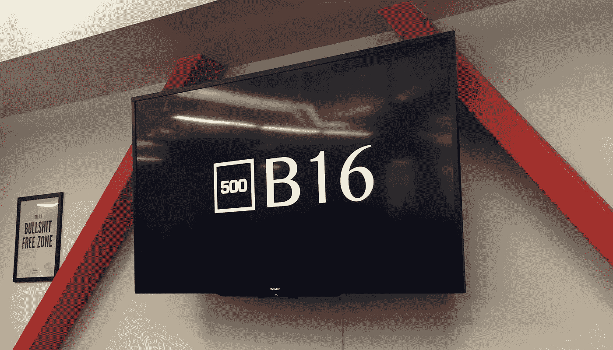
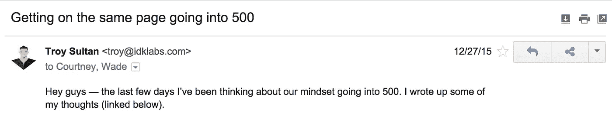

# [500]第 0 周:给我们团队的公开信

> 原文：<https://medium.com/hackernoon/500-week-0-an-open-letter-to-our-team-7712e89d7670>

## 揭开启动加速器内部生命的面纱

*这是我们公司在旧金山经历 500 家初创公司第 16 批的每周系列报道的第一篇帖子。内容、学到的东西、欢笑、哭泣、秘密——我们将全部揭开。遵循* [*中*](/@destroysultan) *和* [*推特*](https://twitter.com/destroysultan) *。*

## *在第 16 批开始前 3 周，向我们团队发送了一封电子邮件:*

*【续】*

在开始穿越 500 英里的旅程之前，我们必须达成共识，这一点至关重要——真的，真的达成共识。所有大象都离开了房间，痛点减轻，并为我们的成功制定了坚实的计划。

这从我和我的领导和沟通能力开始。我现在发誓要做得更好，让我们团结一致。这是我工作和责任的一大部分。我会投入工作，我需要你也这样做。我们应该保持开放的心态，明白这将是一个[成长](https://hackernoon.com/tagged/growth)的时期——不仅对公司如此，对我们每个人都是如此。随着成长而来的是不适，所以让我们拥抱它。

这很粗糙，但掩盖了我心中的想法。它会进化的。加入你对它的强烈感觉，让我们通过[计划](https://hackernoon.com/tagged/program)细化到一个指导我们行为/成长的列表。指导原则？我们只需要通过一次加速器，所以让我们充分利用它。

我们是来加快增长的，所以让我们计划一下，不要太舒服。

> ***1。*想长远**

持续的长期思考会把看似艰难的决定变成容易的决定。问题不在于我们在接下来的几个月里会处于什么位置，而在于我们在 10 年、20 年、30 年后会处于什么位置。我们在玩一个漫长的游戏。

让我们庆祝小小的胜利，但不要忘记我们还有多年的工作要做。

> ***2。我们要搞砸***

我们对这一点还不熟悉，会犯错误——很多错误。让我们创造他们，向他们学习，继续前进。互相帮助:如果你不是那个让我们陷入困境的人，那就做那个让我们摆脱困境的人。

> **3。TOE:团队战胜一切**

是我们对抗世界。我们应该用我们的周期与试图杀死我们的力量战斗，而不是互相战斗。随着我们的成长，我们现在形成的习惯会被加入我们的每个人所接受。

让我们不断地问:“我们之间的事情不舒服吗？”如果答案是肯定的，那就是我们开始讨论的原因。掩盖问题会危及我们长期创造的东西。让我们“拥抱房间里的大象”

> ***4。即兴表演的第一法则:让别人看起来更好***

韦德——这是我最喜欢的你给我上的商业课。总是让别人看起来很好。永远互相支持。这一点在 500 期间尤其重要，因为我们会遇到很多人，不会每次谈话都在场。

> ***5。发挥我们的长处***

做我们最擅长的事情；其余的雇佣。

我们将继续在任何需要的地方提供价值，但重要的是，我们要认识到自己的优势，并随着我们的成长发展我们的角色，在我们的薄弱之处雇佣优秀的人才。

> ***6。投资我们自己***

一个公司只不过是一群人的集合。因此，要发展我们的公司，我们必须发展自己。这意味着保持我们的身心健康。如果你需要一天时间来清醒头脑，那就去吧——我们会帮你的。

我们会坐在椅子上，喝咖啡，盯着屏幕。如果你觉得身体不好，你会觉得精神不好。

去跑步，参加步行会议，做任何感觉正确的事情。变得舒适。让你的怪癖发展吧。

> ***7。不要陷入 SV 圈的急拉***

许多闪亮的东西会乞求我们的注意。让我们不要忘记为什么我们在这里:建立一个有影响力的公司。让我们超级支持我们的 batchmates，但避免陷入什么是时尚。我们准备好了就加注。当我们准备好了的时候，我们会招聘——不管其他人在做什么或说什么。

让我们玩得开心，但我们要保持专注。

> ***8。什么都听，但有选择地行动***

我们会被有好主意的聪明人包围。如果我们都听他们的，我们会淹死的。我们每个人都必须选择使用什么，忽略什么。

让我们成为出色的倾听者，但只为做重要的事情而自豪。

> ***9。*永远被招募**

我们三个只是种子。我们能够花费时间的最有效的方式是说服我们认识的最聪明、最团结的人加入我们的旅程。让我们永远不要让招聘被“外包”给角落里的一个团队。

如果我们成功地将这一点融入公司的 DNA，从长远来看，这将是一个竞争优势。

> ***10。相信我们的直觉***

数据很重要，我们会非常依赖它。同样重要的是视觉。但是改变游戏规则的想法不是来自微观实验。

相信我们看到的未来。测试和用户反馈只会有助于优化我们的路线。我们知道我们的业务将会改变，所以让我们为使命而建，而不仅仅是今天的迭代。

> ***11。保持主动***

如果我们听之任之，每天的交火会偷走我们的周期。让我们分配时间来获得成功——并保护它。

让我们花点时间来谈论未来。定期把我们的头从杂草中拔出来，让我们自己去梦想，这将被证明是极其重要的。

> ***12。为了故事而做***

不管我们是成功还是失败，我们现在一起度过的时光，将会是我们人生故事中的一个篇章。让我们用以后会引以为豪的东西填满它。

**总结**

会很难。我们会搞砸的。让我们抬起头来，继续努力，我们会完成我们所追求的目标。只是时间问题。

特洛伊

> 你的公司在招人吗？查看 [**Resource 的**](http://www.getresource.io/) **智能候选人寻找和拓展，加速您的招聘流程。**

> 如果你喜欢这篇文章，点击下面的推荐将会很有意义。要跟随我们穿越 500 的全程，跟着我上 [*中*](/@destroysultan) *或者* [*推特*](https://twitter.com/destroysultan) *，或者跟着我的队友* [*考特尼*](https://twitter.com/courtneysultan) *和* [*韦德*](https://twitter.com/wade) *。*

PS。如果你想聊天(或者只是打个招呼)，给我发个电子邮件到 troy@idklabs.com。

> [黑客中午](http://bit.ly/Hackernoon)是黑客如何开始他们的下午。我们是 [@AMI](http://bit.ly/atAMIatAMI) 家庭的一员。我们现在[接受投稿](http://bit.ly/hackernoonsubmission)并乐意[讨论广告&赞助](mailto:partners@amipublications.com)机会。
> 
> 如果你喜欢这个故事，我们推荐你阅读我们的[最新科技故事](http://bit.ly/hackernoonlatestt)和[趋势科技故事](https://hackernoon.com/trending)。直到下一次，不要把世界的现实想当然！

