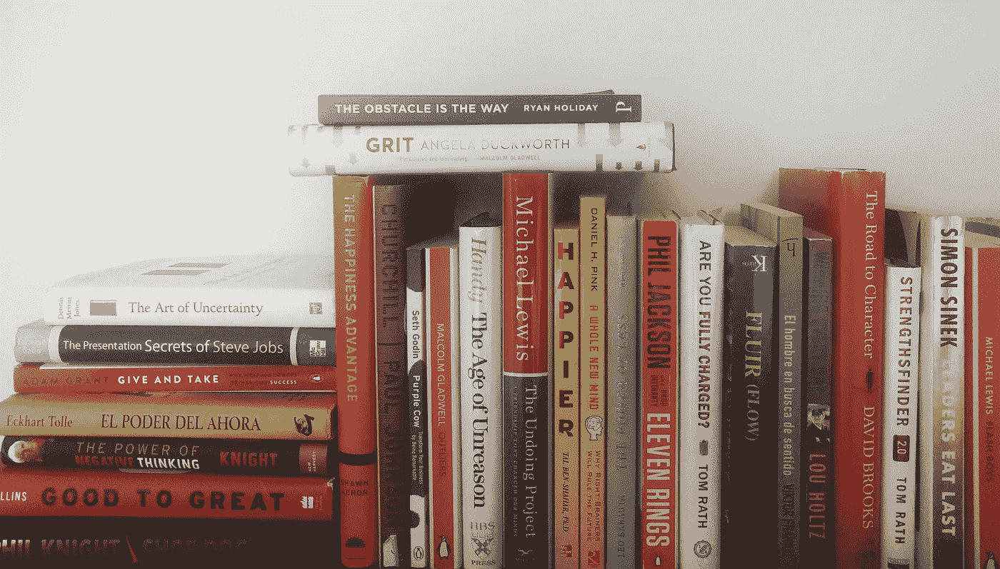

# 通过问 52 个人同样的问题，我学到了 52 条人生经验(第 1 部分，共 2 部分)

> 原文：<https://medium.com/hackernoon/52-life-lessons-i-learned-by-asking-52-people-the-same-question-part-1-of-2-9b8865c8e46f>

## ***“谢天谢地，毅力是天赋的良好替代品。”—史蒂夫·马丁*T3**

***“如果你从一本价值 20 美元的书中得到一个改变你生活的想法，那么它就是便宜货，”—赛斯·戈丁***

在我 39 岁生日那天，我给自己留了两个小时，做了一些我一直想做的事情，我坐下来，列出了我这些年来学到的教训。然而，在发表了这篇文章之后，我意识到我忽略了最重要的一课(*以及为什么今年我最终花时间去做这件事的转折点，而不是仅仅谈论去做这件事*):

与其问人们在看什么，不如问他们在读什么。

在过去的一年里，这个简单的转变让我从一个阅读的人变成了一个“读者”在这个过程中，我把我的长期目标变成了短期目标，改善了我现有的关系，并帮助我建立了一些新的关系。毕竟——没有比听别人说话更高的褒奖了。

在过去的这个周末，我花了几个小时浏览了过去一年中推荐给我的书籍和注释，下面是一些突出的引言。

# 52 本书中的 52 个教训是问 52 个人同一个问题的结果:

> ***1。"如果你要吃屎，不要一点一点地吃."***

*   本·霍洛维茨著

提醒:积极的影响取决于你如何处理消极的方面。推进去。

> **2。恐惧是接近真相的自然反应**

*   [当事情分崩离析](https://www.amazon.com/When-Things-Fall-Apart-Anniversary/dp/1611803438/ref=sr_1_1?s=books&ie=UTF8&qid=1503925924&sr=1-1&keywords=when+things+fall+apart+pema+chodron)

提醒:今天越不舒服，明天越舒服。

> ***3。“泡菜让我快乐。”***

*   [传递快乐/谢家华](https://www.amazon.com/Delivering-Happiness-Profits-Passion-Purpose/dp/0446576220/ref=sr_1_1?s=books&ie=UTF8&qid=1503925955&sr=1-1&keywords=delivering+happiness)

提醒:关注每天让你微笑的小事……多吃泡菜。

> **4*。“我已经开始相信，最重要的事情之一，就是看人。为你开门的人。给你倒咖啡的人。承认他们。尊重他们。南非祖鲁人的传统问候是“Sawu Bona”。它的意思是，“我看见你了。我努力做到这一点。”***

*   如果我能告诉你一件事/理查德·里德(与比尔·克林顿的对话)

提醒:对人好，人也会对你好。

> ***5。“在这个世界上，唯一重要的货币是你不酷时与他人分享的东西。”***

*   [胆子极大/布伦·布朗](https://www.amazon.com/Daring-Greatly-Courage-Vulnerable-Transforms/dp/1592408419/ref=sr_1_1?s=books&ie=UTF8&qid=1503926026&sr=1-1&keywords=daring+greatly)(电影《差点出名》中的台词)

提醒:要脆弱。

> ***6。“了解你对某人感觉的最简单的方法。说再见。”***

*   [鞋狗/菲尔·奈特](https://www.amazon.com/Shoe-Dog-Memoir-Creator-Nike/dp/1501135910/ref=sr_1_1?s=books&ie=UTF8&qid=1503926053&sr=1-1&keywords=shoe+dog)

提醒:一有机会就告诉别人他们对你意味着什么。

> 7。"*梦想成真的可能性使生活变得有趣。*

提醒:梦想小，成就不了大事。

“世界上最大的谎言是什么？”男孩问，完全惊讶。它是这样的:在我们生命的某个时刻，我们失去了对发生在我们身上的事情的控制，我们的生活被命运所控制。这是世界上最大的谎言。”

提醒:我们创造并控制我们的未来。

*   [炼金术士/保罗·科赫洛(两人都太棒了)](https://www.amazon.com/Alchemist-Paulo-Coelho/dp/0062315005/ref=sr_1_1?s=books&ie=UTF8&qid=1503926520&sr=1-1&keywords=the+alchemist)

> **8。"一生的特权是做你自己。"**

*   坎贝尔·约瑟夫/迈克尔·汤姆斯的智慧

提醒:做真实的自己。

> **9*。“大多数成功人士都是你从未听说过的人。他们希望这样。这让他们保持清醒。这有助于他们完成工作。”***

*   [自我是敌人/瑞恩假日](https://www.amazon.com/Ego-Enemy-Ryan-Holiday/dp/1591847818/ref=sr_1_1?s=books&ie=UTF8&qid=1503926598&sr=1-1&keywords=ego+is+the+enemy)

提醒:知道你为什么是比较容易的部分。活出你的“为什么”需要每天自我控制、自我评估和自我意识。

> ***10。“不是你宣扬什么，而是你容忍什么。”***

*   [极端所有权/ Jocko Willinks](https://www.amazon.com/Extreme-Ownership-U-S-Navy-SEALs/dp/1250067057/ref=sr_1_1?s=books&ie=UTF8&qid=1503926623&sr=1-1&keywords=extreme+ownership)

提醒:声誉建立在你的所作所为之上，而不是你的承诺。

> ***11。“我们要么让自己痛苦，要么让自己强大。工作量是一样的。”***

*   乔治·芒福德的《有意识的运动员》

提醒:积极是一种选择。

> ***12。"谢天谢地，坚持不懈是天赋的良好替代品."***

*   丹尼斯·梅里特·琼斯的《不确定的年代》(史蒂夫·马丁引用)

提醒:你比任何人都有这个优势。

> ***13。“通常，锻炼的人开始吃得更好，工作效率也更高。他们吸烟更少，对同事和家人更有耐心。他们减少了使用信用卡的频率，并说他们感觉压力更小了。锻炼是引发广泛变化的重要习惯。”***

*   查尔斯·登喜路的《习惯的力量》

提醒:把锻炼写在你日常工作清单的最上面。日子不好过的时候写两遍。

> ***14。"胜利属于犯错最少的队。"***

*   [鲍勃·奈特《负面思维的力量》](https://www.amazon.com/Power-Negative-Thinking-Unconventional-Achieving/dp/054402771X/ref=sr_1_1?s=books&ie=UTF8&qid=1503926785&sr=1-1&keywords=the+power+of+negative+thinking)

提醒:专业人士会一直做，直到他们不能做错为止。

> ***15。“不要什么都玩。让一些事情过去。你不玩的东西可能比你做的东西更重要。”***

*   菲尔杰克逊的《十一枚戒指》(摘自与塞隆尼斯·蒙克一起演奏的史蒂夫莱西)

提醒:我们对什么说“不”最终决定了我们对什么说“是”的事情做得有多好。

> ***16。“你不能选择你的家庭，但是你可以选择你的老师，你可以选择你的朋友，你可以选择你听的音乐，你可以选择你读的书，你可以选择你看的电影。事实上，你是你选择让什么进入你生活的混搭。你是你影响的总和。德国作家歌德说过，“我们是由我们所热爱的东西塑造的。***

*   奥斯汀·克莱恩的《像艺术家一样偷窃》

提醒:我们今天的决定决定了我们明天的未来。

> **17*。“增长来自于阻力。我们通过鞭策自己，找到真正超出我们能力范围的东西来学习。”***

*   [学习的艺术/乔希·怀茨金](https://www.amazon.com/Art-Learning-Journey-Optimal-Performance/dp/0743277465/ref=sr_1_1?s=books&ie=UTF8&qid=1503926878&sr=1-1&keywords=the+art+of+learning)

提醒:你可以多跑五分钟。

> ***18。"自我评估比自我意识更重要."***

*   [睁大眼睛/艾萨克·利德斯基](https://www.amazon.com/Eyes-Wide-Open-Recognizing-Opportunities/dp/0143129570/ref=sr_1_1?s=books&ie=UTF8&qid=1503926914&sr=1-1&keywords=eyes+wide+open+isaac+lidsky)

提醒:对自己要残酷地诚实。

> ***19。“我不知道历史上有哪一个案例研究描述了一个组织是如何摆脱危机的。他们中的每一个人都被领导过。”***

[——领导最后吃/西蒙·西内克](https://www.amazon.com/Leaders-Eat-Last-Together-Others/dp/1591848016/ref=sr_1_1?s=books&ie=UTF8&qid=1503926964&sr=1-1&keywords=leaders+eat+last)

提醒:人。人们。人们。

> ***20。"诚实地承认一个小瑕疵的存在可以增强你的产品的真正的美."***

*   [卖的是人丹尼尔·平克](https://www.amazon.com/Sell-Human-Surprising-Moving-Others/dp/1594631905/ref=sr_1_1?s=books&ie=UTF8&qid=1503926984&sr=1-1&keywords=the+sell+is+human)

提醒:老老实实第一第二第三。

> **21。*不要以成功为目标，你越是以成功为目标，你就越会错过成功。***

*   维克多·e·弗兰克尔《人类对意义的探索》

提醒:不要担心把事情做得很棒，担心的是在过程中变得很棒。

> **22*。“你永远不知道有人会在哪里结束。这不仅仅是建立你的声誉；这真的是为了其他人。”***

*   [给予和索取/亚当·格兰特](https://www.amazon.com/Give-Take-Helping-Others-Success/dp/0143124986/ref=sr_1_1?s=books&ie=UTF8&qid=1503927033&sr=1-1&keywords=give+and+take)

提醒:今天给你端咖啡的人可能明天就是你的老板。

> 23。"*还没数完总有更多的。*

*   [回忆录和书信选/尤利西斯·s·格兰特](https://www.amazon.com/Ulysses-S-Grant-Selected-1839-1865/dp/0940450585/ref=sr_1_1?s=books&ie=UTF8&qid=1503927073&sr=1-1&keywords=memoirs+of+selected+letters)

提醒:问题总是在我们头上更大。

> **24*。“没有人欠你一份伟大的事业。你需要自己去争取，这个过程并不容易。”***

*   好到他们无法忽视你/加州纽波特

提醒:拥有自己热爱的职业是一种特权，而不是权利。

> ***25。“永远不要低估在人生早期找到适合自己的工作的重要性。这让可能的后进生变成了快乐的战士。”***

*   [肯·罗宾逊爵士的《元素》](https://www.amazon.com/Element-Finding-Passion-Changes-Everything/dp/0143116738/ref=sr_1_1?s=books&ie=UTF8&qid=1503927188&sr=1-1&keywords=the+element)

提醒:永远不要停止尝试新事物，结识新朋友。这些点最终会连接起来。

> ***26。“我们不告诉自己，‘我永远不会写我的交响乐。相反，我们说，“我要写我的交响乐；我明天就要开始了。”***

[-艺术之战/史蒂文·普雷斯菲尔德](https://www.amazon.com/War-Art-Through-Creative-Battles/dp/1936891026/ref=sr_1_1?s=books&ie=UTF8&qid=1503927223&sr=1-1&keywords=the+war+of+art)

提醒:天天读这个。

你在看什么?请在下面的评论区告诉我，如果你喜欢到目前为止阅读的内容，请在媒体上关注我，以确保你收到第 2 部分的通知——本周四到期。

**请给它一个❤或👏所以其他人会在媒体上看到它。**

# 最后一件事:

如果你喜欢这篇文章——直接前往[**www.mikethompsonblog.com**](https://mikethompsonblog.com)并注册接收所有新文章和 2 份免费的欢迎礼物:“ **31 个激发你写作创造力的想法”** — *我作为一名新作家的小抄，因为我想出了一些关于*和 **225 个启发你写作的引语**—*—*中的 *#6。*