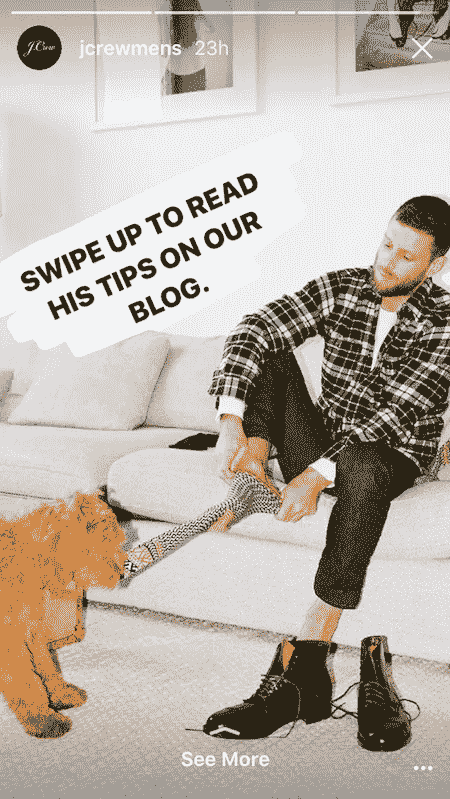
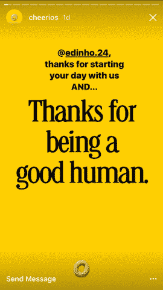
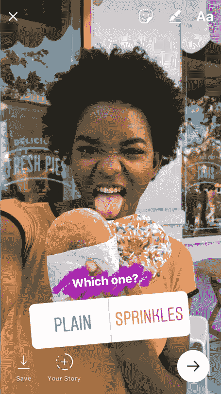
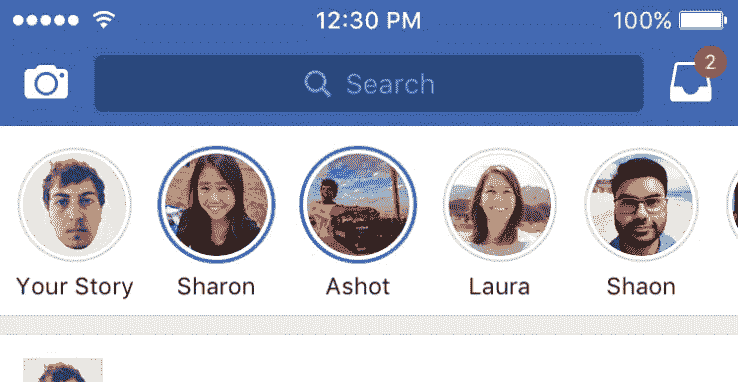
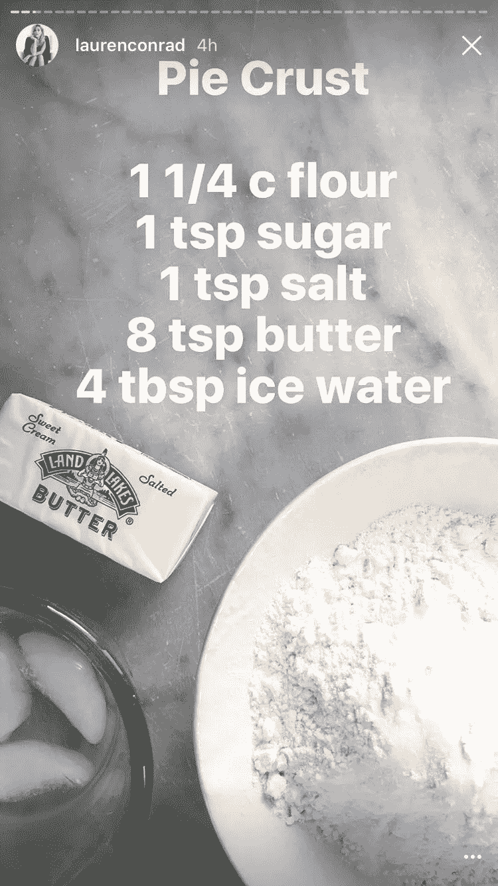

# 品牌破解 Instagram 故事的 6 种聪明方法

> 原文：<https://medium.com/hackernoon/6-clever-ways-brands-are-hacking-instagram-stories-28a16244ca0a>

脸书遏制 Snapchat 影响力的尝试显然奏效了。根据来自 L2 的一份新报告，品牌上传到 Instagram 的故事是上传到 Snapchat 的两倍多。

由 [Klear](http://www.socialmediatoday.com/social-business/new-study-shows-how-brands-are-using-instagram-stories-boost-their-messaging) 进行的另一项研究显示，45%的品牌现在每周至少使用一次 Instagram 故事。

[*Source*](http://www.socialmediatoday.com/social-business/new-study-shows-how-brands-are-using-instagram-stories-boost-their-messaging)

过去几个月，Instagram 发布了一些新功能和工具，供用户利用故事吸引更多观众。

如果你正在寻找一些聪明的方法来增加你的 Instagram 浏览量，那么现在就来看看这些来自使用 Instagram 故事的品牌的创意。

# 1.[关注最近的一篇博文](https://instapage.com/blog/how-to-use-instagram-stories)

拥有超过 10，000 名粉丝的账户提供滑动选项，可以将读者直接带到链接或登录页面。然而，这个 CTA 很小，在吸引观众的注意力方面不是很好。

因此，使用贴纸、文字和涂鸦选项来突出你的 CTA，以便追随者知道去哪里找到更多信息。

J.Crew 最近这样做了，通过创建一个三面板的预告片来展示一个关于独特男性风格的博客，可以滑动来查看完整的博客帖子。他们用一个写有文字的大涂鸦来突出他们的 CTA，这使得追随者可以很容易地访问博客。

# 2.[向你的追随者推销——带有个人色彩](https://instapage.com/blog/how-to-use-instagram-stories)

无论你是使用用户生成的内容还是仅仅标记单个的追随者，确保他们感受到来自你品牌的爱。

啦啦队通过向他们的追随者大声喊出可爱、振奋人心的信息，并在他们的帖子上贴上标签，随机发布善意的行为。不仅他们的追随者得到了额外的关注，而且这些消息也让他们脸上露出了笑容。

虽然这种方法可能不会直接带来销售，但它可以很好地展示你的品牌的独特价值，让你的客户觉得你重视他们。

# 3.[生活系列中的一天](http://www.jennstrends.com/5-creative-ways-use-instagram-stories/)

[*Source*](https://pbs.twimg.com/media/DL8w2yPW4AAyJGu.jpg)

超越“幕后”的故事，展示你的品牌当天的情况，选择“生活中的一天”系列。这使得追随者可以与你的员工或你服务的优秀客户建立个人联系。

展示你早上的例行公事、休息时的零食、下午的会议、下班后的健身活动以及与朋友或家人的晚餐的片段或照片，展示你的生活是什么样子的。

有很酷的客户要展示吗？让他们也在你的 Instagram 上讲述他们的故事。你现在可以发布过去 24 小时内用手机拍摄的照片和视频，这样你的特色客户就可以随时随地保存并向你发送更新，而不必交出你的 Instagram 密码(Snapchat 上没有这项功能)。

# 4.[从受众那里获得关于当前趋势、产品创意和赠品的反馈](http://www.jennstrends.com/5-creative-ways-use-instagram-stories/)

[*Source*](https://techcrunch.com/2017/10/03/instagram-stories-mimic-polly-with-new-polls/)

Instagram 首次推出了民意调查功能，允许粉丝对你的故事回答是或否的问题。这些不是匿名的，让您可以快速方便地看到一些客户反馈，而无需进行全面的调查。

每个可能的答案只能写 27 个字符，所以要有创意！请关注者投票选出您抽奖活动中的最佳奖品，或者他们希望看到您提供哪种产品。

你也可以针对它。问[一些愚蠢的问题和真正有趣的问题](http://www.socialmediatoday.com/news/6-instagram-poll-sticker-ideas-for-your-brand-or-business/506745/)，这样你的客户会保持参与，而不会觉得他们在进行客户调查。

# 5.[将你的 Insta 故事交叉发布到脸书，让你所有的粉丝都知道](https://techcrunch.com/2017/10/12/facebook-stories-for-pages/)

[*Source*](https://tctechcrunch2011.files.wordpress.com/2017/01/ios-stories.png?w=738)

尽管脸书的故事在 Instagram 和 Snapchat 上很受欢迎，但似乎没有人使用它们。为了应对这种情况，脸书最近允许用户在两个平台上发布他们的 Instagram 故事，以消除在两个平台上分别发布的麻烦。

在这一点上，很少有品牌使用脸书的故事来做广告。幸运的是，这意味着品牌有机会利用新的空间。有了交叉发布的能力，这个新功能就有爆发的可能，比其他人先迈出第一步可能是值得的。

# 6.举办一次 DIY 会议，展示你的专业知识或解释使用你产品的新方法

[*Source*](http://www.refinery29.com/instagram-story-tips)

这个聪明的技巧可以建立你作为思想领袖的品牌，创造你的过程的透明度，或者为你只有 24 小时时间向你学习的追随者提供即时的价值。尝试 Instagram Live(向你的关注者发送通知)或拍摄一组小片段，让人们看到你一步一步做了什么。

例如，你的餐馆可能会展示一位厨师准备晚上的特色菜，摆放食材，混合它们，展示如何烹饪它们，等等。同样的道理也适用于展示如何使用新工具的网络开发人员或创作新设计的工艺博客。

然而，你不能马上给出配方或最终结果。相反，在你的故事结束时，用 CTA 将流量导向你的网站、博客或长篇教程。

使用 Instagram 故事是以有趣、互动的方式吸引观众的有效方式。对于 Instagram 的故事，你还有什么其他的妙招或者小技巧吗？请在评论中与我们分享。

[*这个帖子最初出现在 blog.gainapp.com。*](https://blog.gainapp.com)