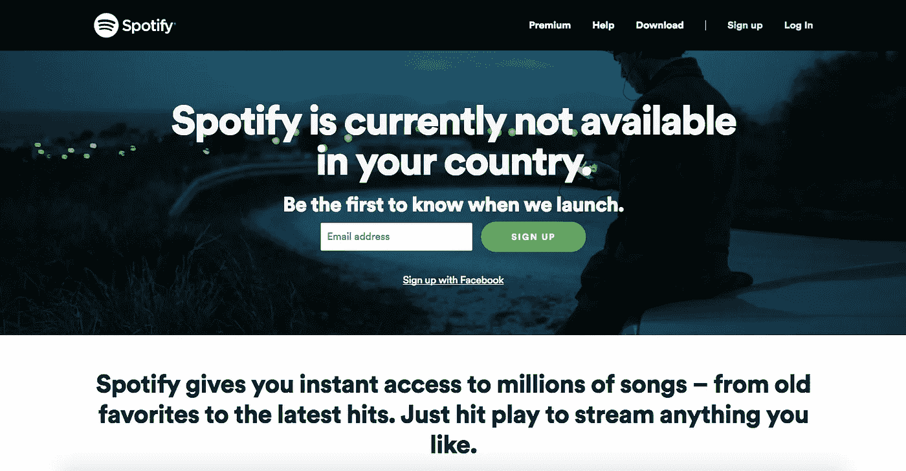
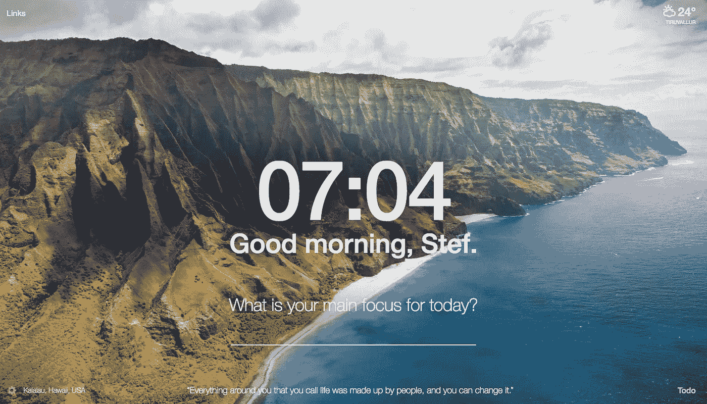
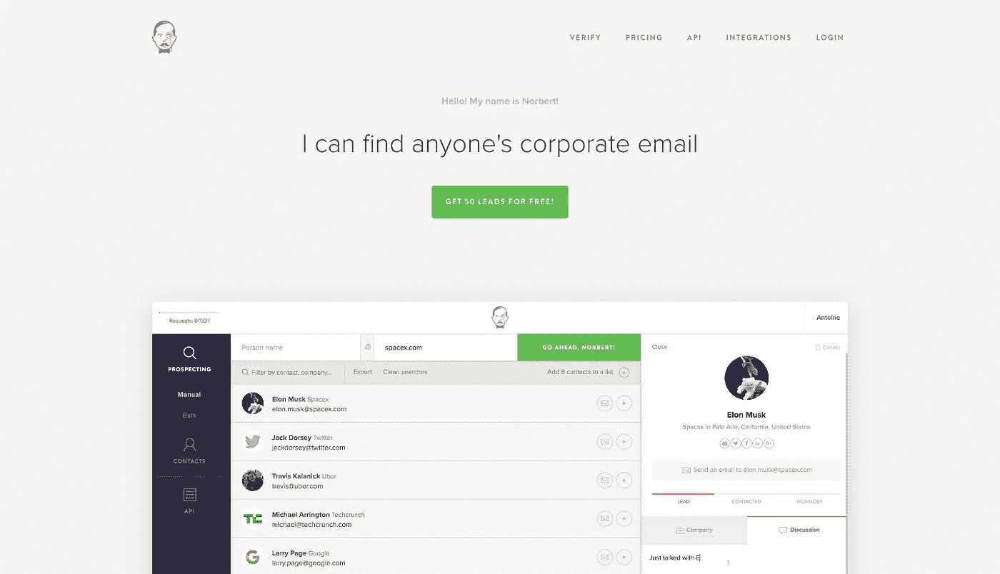
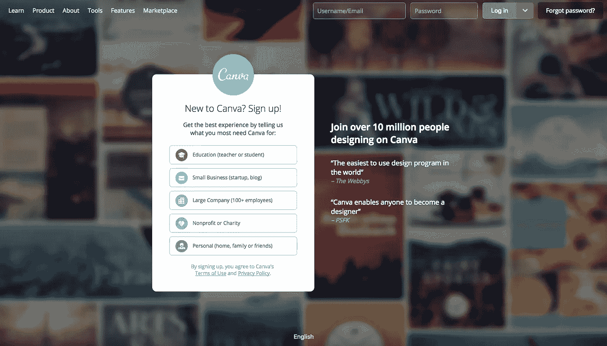
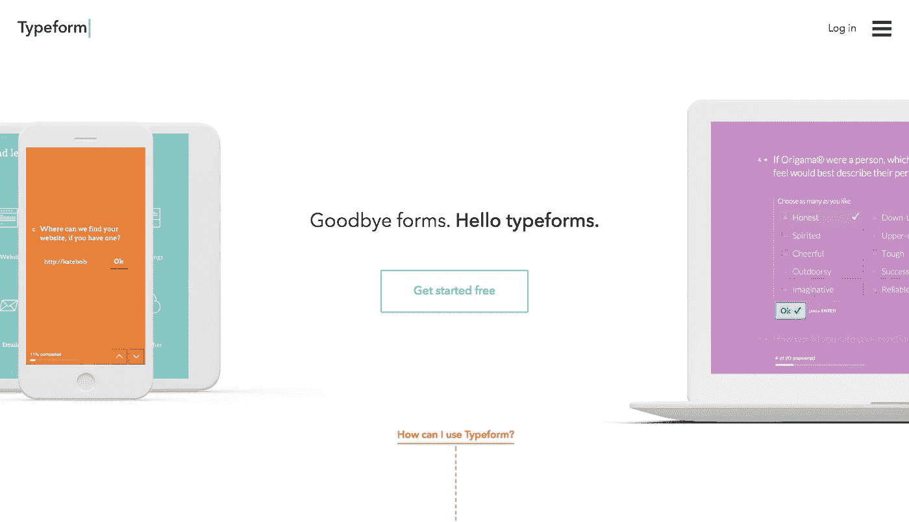
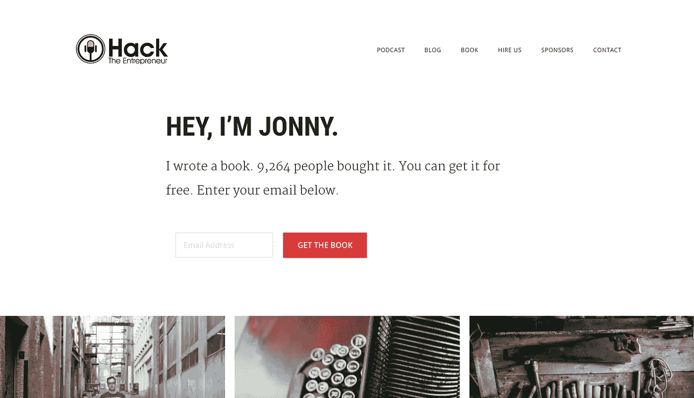

# 让你成为成功骗子的 6 个工具

> 原文：<https://medium.com/hackernoon/6-creations-that-will-make-you-a-successful-hustler-3b4af3e9da0c>

Image Source: Unsplash by [Matheus Ferrero](https://unsplash.com/@matheusferrero)

**每天醒来都是手机**，一点都不震撼。我们日复一日的循环生活方式是，为第二天早上设置闹钟，然后用 4 个小时的电话代替。

这最终会让我们的起床时间越来越远。导致他们不断地希望成为**早起者**的一员。

这转换成一个**无限循环**。当我们到达工作场所时，我们发现自己极度疲惫不堪，身材矮小，不管我们是否喜欢特定的任务或活动。

但有待揭露的事实是，骗子们确实介意同时拥有个人生活和职业生活。

到目前为止，我们所听到的关于过着忙碌生活的一切，只有**包含了事实**，比如“*像今天是最后一天一样工作，比其他人都早到，为了丰硕的未来牺牲我们的现在等等。*

一方面，大量的研究文章指出了内心幸福和心理健康的需要。另一边的“**皮条客必须这样生活**”文章和社交媒体摘录的数量引起了无法解释的骚动。

> 没有任何规则可以让我们以一种特定的方式生活，并从中获得足够的成功。

如果你对你要做的事情真的充满热情,你还是会去做，尽管也做你喜欢做的其他无聊的工作。这代表了我们所有人。

> 在这里，我们没有必要觉得自己是一个廉价或骗子，因为这是自然的，因此也是我们大多数灵魂深处的纯粹的幸福。

说够了。

现在，依靠皮条客生活中富有成效的一面，这里有每个皮条客在生活中取得成功所需的**6**24】工具。

## 首先是音乐。

## [**Spotify**](https://www.spotify.com/int/why-not-available/) **或** [**YouTube**](https://www.youtube.com/)

除了一些好的乐器或从我们最喜欢的流派中挑选的东西，没有什么能让我们保持专注。然而,**蓝斑**是音乐帮助我们更长时间保持注意力的原因。

**更多科学…**

它承担责任，而不是我们决定我们是否必须对特定的刺激做出反应。通过**浇灭**做出不相关决定的部分。改变自下而上的**唤醒水平**，并负责**影响我们的行为反应。**

史上最棒的发明！

## [气势](https://momentumdash.com/)

一款**主页继任应用**主要设计用于激励和保持我们在工作场所的注意力。打开我们的浏览器，Momentum 用一个令人振奋的图片和引文欢迎我们。

当决定和完成我们每天的一件事时，这是非常有帮助的。每天早上，我们可以致力于一项专注的任务，它会在一天的剩余时间里提醒我们。这样我们就可以**先关注优先任务**，然后再关注其余的。

## [瞧，诺贝特](https://www.voilanorbert.com/)

搜索我们真正要找的人的电子邮件地址可能是一项极其累人的任务。对于骗子来说，这是一个麻烦的问题，当他们在制作他们的**播客**、**博客**或下一个大的发布时，他们也想办法与充满价值观的人联系。

瞧，诺贝特来了。一个致力于寻找正确的电子邮件地址的工具，即使它们没有在网站上被公开提及。知道联系人的**姓名**和他们公司的**域名**名称，Voila Norbert 绰绰有余！

## 坎瓦

一个**在线图形设计平台**，可以执行你可能要求的任何视觉特技。我是一个定期和快乐的用户，而我不断为我的博客，Instagram 视觉和类似的作品。在这里，我们可以自己戴上设计师的帽子，通过传播我们与生俱来的创造力，进入创造实际有效视觉效果的领域。

这是一个简单的拖放式设计工具，有超过 100 万张照片、图片和字体可供选择。它允许轻松或免费访问大量的设计工具和选项。让我们可以创建任何东西，从博客标题到信息图表。

## [字体](https://medium.com/u/f9ec0e0e5d0?source=post_page-----3b4af3e9da0c--------------------------------)

Typeform 就是这样一个有效的免费调查创建工具。帮助我们创建令人印象深刻且**有价值的信息获取调查**。我们都使用在线表格从我们的读者、听众和客户那里获取反馈。

遗憾的是，**繁琐的调查很可能会被忽略**，这让我们更难知道他们是否走在正确的方向上，或者是否做出了我们想要的举动。

最后但同样重要的是，

## [黑掉企业家](https://hacktheentrepreneur.com/)

我们可能在世界的任何地方，这本书一定会带我们去我们想去的地方。在决定我们未来的行动方面，理清我们现有的创业困境，或者什么时候去追求真正的自由。

它包括杰出企业家的 50 个缺口，这些企业家将他们的创业引向了繁荣的事业。帮助我们找出如何启动，与失败讨价还价，并在我们的创业之旅中不再犯简单的错误。

## 快乐的欺骗我的朋友😄