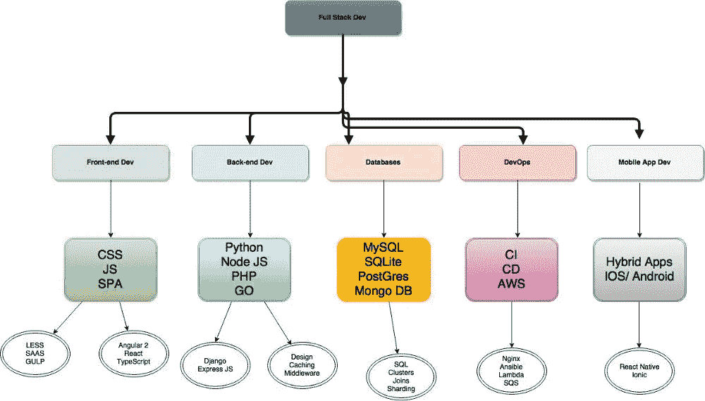
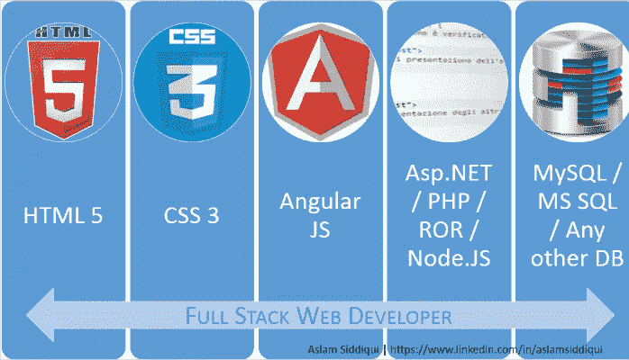
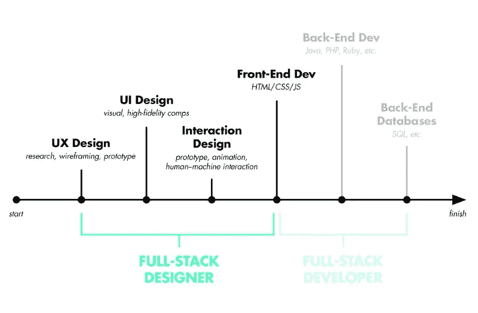

# 如何成为全栈开发人员的 6 个基本技巧

> 原文：<https://medium.com/hackernoon/6-essential-tips-on-how-to-become-a-full-stack-developer-1d10965aaead>

**如何成为全栈开发者？**作为开发者最热门的话题之一，讨论从未停止。在 LinkedIn 和脸书上，很多人把他们的工作头衔写为全栈开发者。此外，似乎“满栈”话题已经成为一种新的工作趋势。一篇关于 Medium 的文章讨论了[全栈设计师](https://medium.muz.li/what-is-a-full-stack-designer-in-2017-will-you-be-one-7933a7145fb7)得到的褒贬不一。有人认为全栈只是一个头衔，他/她应该关注的是真正的个人能力和技术。

本质上，我认为关于全栈的讨论也是一种关于 IT 行业的多面手和专家的争论，以及关于开发技能的深度和广度的辩论。

你不能鱼与熊掌兼得。虽然全栈开发人员和全栈设计人员似乎在挑战这种可能性。因为他们的横向技能树给了他们同时拥有和吃掉蛋糕的能力。还有一种说法是，万事通。所以有必要思考如何成为一个真正的全栈开发者而不是一个空头衔。

# 1.什么是全栈开发者？

简单来说，全栈开发者就是掌握多种技能，并运用这些技能独立完成一个产品的一类人。**Quora 上一个最高投票答案解释了什么是全栈开发者:**

全栈开发人员是能够处理数据库、服务器、系统工程和客户机的所有工作的工程师。根据项目的不同，客户需要的可能是移动堆栈、Web 堆栈或本机应用程序堆栈。

其实“全栈”指的是完成一个项目所需的一系列技术的集合。“堆栈”是指子模块的集合。这些软件子模块或组件组合在一起实现既定的功能，而不需要其他模块。

# 2.为什么全栈开发者一直备受争议？

如上所述，关于全栈开发人员的讨论实际上是关于技能深度和广度的辩论。尤其是在 OSCON 会议上，一名脸书工程师说他们只雇佣了一名“全栈开发人员”这个话题是对全栈开发人员的优势和劣势进行激烈讨论的结果。

**优势:**全栈开发人员参与水平技术需求，这样他/她可以用他广泛的技术非常快速地为产品做原型设计。有了充分的堆叠能力，他们就有了更广阔的视角和更积极的心态。此外，他们将对技术和产品更加敏感。所以，这种人总是可以对产品或设计有自己的看法。

从另一个方面来说，他/她可以为团队中的每个人提供帮助，大大减少团队沟通、技术对接的时间和技术成本。因此，他们中的许多人成为企业家，或者成为初创公司的技术合作伙伴。

**劣势:**正是因为横向技术发展，一些全栈开发者无法做到一技之长。他们中的大多数自称是“全栈开发者”的人对多种技能只是一知半解。至于如何让架构更适合模块化开发，那是个问题。

# 3.即便如此，还是有人问，如何成为全栈开发者？

一个合格的全栈开发人员应该具备构建应用所涉及的所有方面的功能知识和能力。

# 1)编程语言

你需要精通多种[编程](https://hackernoon.com/tagged/programming)语言，比如 JAVA、PHP、C #、Python、Ruby、Perl 等。因为您的大多数核心业务流程都需要用这些语言编写。也许并不都需要。但是你还必须掌握语言语法，并且非常熟悉如何基于一种或多种语言来构建、设计、实现和测试项目。例如，如果你选择 JAVA，那么你需要掌握面向对象的设计与开发、设计模式、基于 J2EE 的组件开发等等。

从哪里学习:Git/GitHub——你必须知道如何使用 Git 来管理和分享你的代码。

# 2)使用开发框架和第三方库

现在流行的开发语言一般都配有很好的开发框架，比如 JAVA Spring，MyBatis，Hibernate，Python Django，PHP thinkphp，yin，nodeJs express 等等。

**去哪里学** : [15 本免费 Python 电子书](https://codeburst.io/15-free-ebooks-to-learn-python-c299943f9f2c)

# 3)前端技术

前端技术在当今的项目和产品开发中变得越来越重要。除了产品特性，用户体验也是检验一个产品成功与否的标准之一。这一切都取决于前端技术的实现，所以你需要掌握一些[基本的前端技术](https://www.mockplus.com/blog/post/what-skills-are-required-for-frontend-developers/?r=trista)如 HTML5、CSS3、JavaScript，并进一步学习前端框架或第三方库如 JQuery、LESS、SASS、AngularJS 或 REACT。

**哪里学的:** [你不知道 JS](https://github.com/getify/You-Dont-Know-JS)

# 4)数据库和缓存

任何产品或项目都需要一个数据库来存储数据。作为一个全栈[开发者](https://hackernoon.com/tagged/developer)，你还需要拥有至少一两个数据库，并且知道如何与数据库交互。目前比较流行的数据库有 MySQL、MongoDB、Redis、Oracle、SQLServer 等。MongoDB 作为一种文档型数据库，在互联网产品中的应用越来越广泛。对于较大的项目，我也建议使用 MySQL 或商业 Oracle 作为后端数据库。而内存数据库(如 Redis)可用于缓存以提高系统性能。

哪里学: [MongoDB MERN 教程系列](https://www.mongodb.com/blog/post/the-modern-application-stack-part-1-introducing-the-mean-stack)， [Redis 教程](https://www.tutorialspoint.com/redis/)

# 5)基本设计能力

大多数关于全栈开发人员的文章或讨论很少涉及设计需求。但我认为设计技巧很重要，基本原型设计、UI 设计、UX 设计的[原理和技巧也需要了解。](https://www.mockplus.com/blog/post/prototype-features/?r=trista)

**哪里学:** [UX 博客](/search?q=ux)

# 6)自我要求也是成为全栈开发者的一个基本因素:

*   全球思维
*   良好的沟通技巧
*   创造力
*   好奇心
*   时间管理技巧

# 包裹

根据 Gladwell 的 10000 小时定律，要做一个全栈开发者，需要花 10 年时间掌握前端、后端、面向客户端的知识内容。因此，全栈开发者绝不是一蹴而就的。你需要做的是打好技术基础，强化核心技能，为了更多的挑战而不断学习。