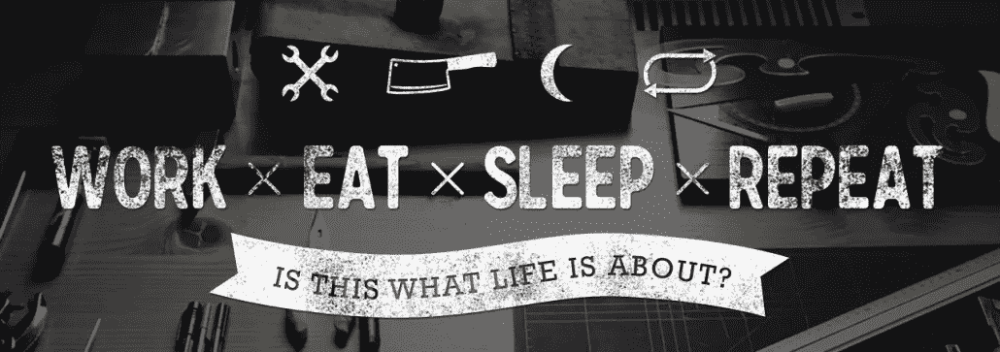

# 6 个月自由职业+全职工作的 6 课

> 原文：<https://medium.com/hackernoon/6-lessons-from-6-months-of-freelancing-working-full-time-b9da5a529406>

2015 年 12 月底，我开始了我的自由职业生涯。由于一系列奇妙的情况，我开始与墨尔本一家令人惊叹的 T4 技术公司的 [Two Bulls](http://twobulls.com/) 合作，开发他们的数字内容。

这个角色(我仍然在 weekly 工作，并且热爱这个角色)是我进入自由职业世界的第一步。从那以后，我又和几个客户合作过，同时保持了我最初的自由职业者角色，当然还有我的全职工作。

是的，我所有的自由职业都发生在朝九晚五的日常工作之外。对我来说，兼顾两者让我大开眼界，是一次持续的学习经历。以下是我从 6 个月的自由职业工作中得到的 6 个要点。

## 有条理

你需要有计划，有策略，知道自己在做什么。在任何给定的工作日，你可能只有 1 个小时来处理工作，所以你不能想你会用它来做什么。

如果可能的话，一开始就写下你一周的主要任务，这样你就能确切地知道你需要做什么，并随时准备毫不慌张地开始下一项任务。

你还需要合适的工具，我目前正在使用:

*   Gmail 让收件箱井井有条
*   [Trello](https://trello.com/) 用于跟踪项目/内容片段
*   [Hootsuite](https://hootsuite.com/) 经营社交媒体
*   [大本营](https://basecamp.com/)用于某些移动项目
*   [持续通信的松弛度](https://slack.com/)
*   [及时应用](https://timelyapp.com/)轻松跟踪我的工作时间

## 随波逐流

每周都会不一样。有些晚上有下班后的承诺，这意味着我那天不能做任何工作。有些周末我会在外面呆一整天。没有哪两天是一样的。

我花了很长时间才适应自由职业的节奏。如果你以前只做过朝九晚五的工作，那么缺乏结构是令人畏惧的。然而，一旦你放下你的假设，尽可能地拥抱工作，它会突然变得不那么可怕。

就像生活中的任何事情一样，开始是关键。当你的时间有限时，你不会花太多时间去思考，重要的是把事情做完。

## 牺牲是必要的

你知道什么对省钱最有好处吗——做第二份工作。多工作意味着拒绝机会。有时只是拒绝放松的机会。有时候拒绝出去吃饭或聚会。

> “除非意味着努力、痛苦、困难，否则世界上没有什么值得拥有或值得去做……我一生中从未羡慕过安逸生活的人。我羡慕过艰难生活的许多人，他们过得很好。”西奥多·罗斯福

发现你牺牲了什么，甚至如何牺牲，是成为自由职业者的旅程的一部分。拥抱困难，而不是逃避困难，这样你会更快乐。

## 为工作之外的生活寻找时间

与上述完全相反，你确实需要为工作之外的生活安排时间。放松、外出、锻炼的时间对保证你的大脑充电非常重要。

最重要的(也是我花了 5 个月才想出来的)是睡眠。我经常感到内疚，因为我一直睡到凌晨 12 点，然后第二天早上 6:45 又起来，重复所有的事情。这在几个月内效果很好，但是一旦你体验到每晚 8 小时睡眠带来的注意力集中、精力充沛和整体健康的好处，就没有回头路了。

为生活找时间可能很难。我个人喜欢把它安排在日程中，这样我就可以向自己保证它是重要的。

At the beach with my fiancée!

## 寻求反馈

没有人能在泡沫中工作，仅仅因为你是自由职业者并不意味着你的工作是孤立存在的。

重要的是找到时间与你的同事交流，获得对任务、流程和工作的反馈。这不仅给了你宝贵的社会投入和时间，也让你从长远来看创造了更好的工作。

至关重要的是，这也确保了你与人之间的联系。无论是其他自由职业者、咖啡店员工还是同事，能够谈论想法、获得新的见解和学习对于确保你的工作不会停滞不前非常重要。

你永远不知道一个新的联系人会在哪里得到回报，所以友好、被人了解和记住是很重要的(希望是出于正确的原因！).

## 为下一步做计划

在一份朝九晚五的工作中，你可能足够幸运，有一个职业生涯规划。你知道你目前的工作要带你去哪里，包括哪些步骤，甚至可能还有时间框架。

自由职业没有这个结构。相反，由你来决定下一步去哪里。想要一个新客户？这意味着你必须努力找到它们。想提升自己？你需要出去写一篇博客，推广一些新的东西。

在很多方面，自由职业是关于建立你自己的方向和命运。市场营销是一个变化很大的领域，有大量的角色、职位和活动要做。你选择做什么，你选择和谁一起工作，完全取决于你自己。

**如果你喜欢你读过的内容，请点击下面的绿色心脏！**

[**Christopher Phillips**](http://chrisphillips.io/)**是一名自由市场策略师，内容创作者&神奇宝贝大师，总部位于澳洲墨尔本。**

**在过去的五年里，他一直在与澳大利亚和新西兰的公司合作，将他们的营销带入生活。**

************

> **[黑客中午](http://bit.ly/Hackernoon)是黑客如何开始他们的下午。我们是 [@AMI](http://bit.ly/atAMIatAMI) 家庭的一员。我们现在[接受投稿](http://bit.ly/hackernoonsubmission)并乐意[讨论广告&赞助](mailto:partners@amipublications.com)机会。**
> 
> **如果你喜欢这个故事，我们推荐你阅读我们的[最新科技故事](http://bit.ly/hackernoonlatestt)和[趋势科技故事](https://hackernoon.com/trending)。直到下一次，不要把世界的现实想当然！**

****