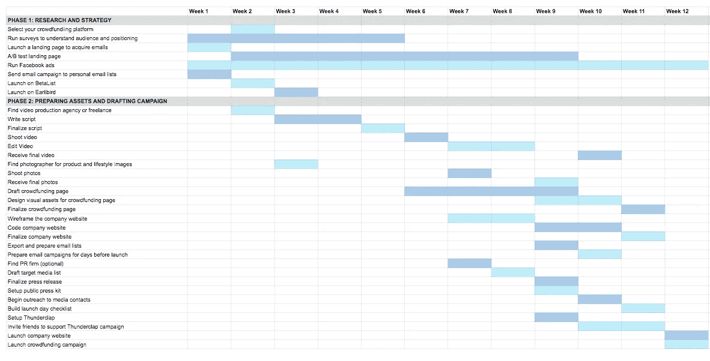

# 在不到 6 分钟的时间里，6 堂课可以改善你的创业

> 原文：<https://medium.com/hackernoon/6-lessons-that-can-improve-your-startup-in-less-than-6-minutes-16a5062ea4e9>

从无人机到产品设计、大数据到软件开发，我们的[驱动系列](http://firstmarkcap.com/driven/)涵盖了所有技术主题。我们很幸运地听到了 600 多位行业专家——从财富 500 强公司到独角兽创业公司——谈论从筹集资本到招募顶尖人才的一切事情。这是 tl。dr 介绍了迄今为止我们听到的一些最佳建议:

## **帮助你的团队成功的聊天**

一项著名的[谷歌研究](https://rework.withgoogle.com/blog/five-keys-to-a-successful-google-team/)发现，同理心是成功团队的头号驱动力。产品副总裁贾斯汀·加拉格尔说，这同样适用于完全偏远的团队——但是距离会使同理心更难培养。如果没有协同定位，那么当你挤在白板前或喝咖啡时，自然发生的互动空间就少了很多。因此，特雷罗决定培养同理心的最佳方式是简单地有意为之。他们发明了一个名为“罗杰斯先生”的概念，将随机选择的个人配对进行 15 分钟的视频聊天。没有行程，没有最终目标，只是一个认识同事的机会。最初可能有点俗气的想法已经开始流行:队友们组织游戏，在聊天时一起玩，如果他们在同一个城市，就见面，并与公司的其他人分享他们所了解到的关于同事的酷事。特雷罗发现，4 到 6 人的小组是这种练习的最佳人数:如果有人生病了，不能参加会议，或者对与陌生人 1:1 的想法不太适应，会议不会受到太大影响。

点击此处观看贾斯汀的完整演讲:

## **一份确保你实现众筹目标的文件**

[seven Sleep 的](https://eightsleep.com/) 2015 年众筹活动带来了 8000 台预购和 150 万美元的收入。他们成功的关键是在活动开始前花三个月时间准备活动的各个方面。以下是他们的发布准备计划:

seven Sleep 以周为单位跟踪进度，并将准备工作分为两个阶段: ***研究并确定针对目标受众的平台、分发和消息传递的最佳策略*** ，并使用所有这些研究来 ***准备成功活动所需的资产*** 。

联合创始人 Alexandra Zatarain 和 Matteo Franceschetti 提供了详细的八个睡眠众筹策略:

## **任何人都可以实施的筹款技巧**

> “投球就像其他任何事情一样是一种技能:你投入的时间量，练习，真的是让你成功的东西。”— Greg Marsh，KeyMe 的创始人兼首席执行官

每当投资者放弃 [KeyMe](https://www.key.me/) 时，Greg 都会要求占用他们几分钟的时间，这样他就能了解他们的担忧。他将反馈作为下次改进推销的机会。他认为这种简单的做法是 KeyMe 成功推销和筹款的唯一最有影响力的因素。

点击这里，阅读更多格雷戈[的筹款技巧。](/@FirstMark/nail-the-pitch-overcoming-the-unique-challenges-of-fundraising-for-hardware-startups-e395cd80fab4)

## **创建公司时击败科技巨头的方法**

> “当你的行业中有很多 800 磅重的大猩猩时，你需要远离它们。”—马特·图尔克，FirstMark Capital 董事总经理

[市场定位是早期创业公司的重要考虑因素。当涉及到在一个横向市场上生产产品时，像谷歌和亚马逊这样的科技巨头拥有巨大的优势:他们有实力、人才和资金来击败较小的竞争对手。显而易见的解决方案是在巨头们摇摆不定的时候摇摆不定，专注于追求一个可能不值得大公司努力的利基垂直市场。由于巨头们大多专注于 B2C，避免他们的最简单的方法之一就是追求企业。对于人工智能初创公司](http://mattturck.com/building-an-ai-startup/) [Hyperscience](http://firstmarkcap.com/portfolio/hyperscience/) 来说，这意味着将他们广泛的技术定位为数据处理复杂、特定业务问题的解决方案，特别是在拥有大型数据集的财富 1000 强公司中。

观看 Hyperscience 的完整演讲:

## **一个将** [**关闭你的顶级求职者**](/@FirstMark/always-be-closing-tactics-for-recruiting-in-demand-candidates-12613919f77d) 的电话

Gusto 不是让招聘人员打电话通知，而是召集房间里所有面试过候选人的人，作为一个小组发出邀请。他们以掌声和欢呼开始通话，然后一个接一个地走过去，每个人分享几句话，说明他们个人为什么对与那个特定的候选人一起工作感到兴奋。这听起来可能有点尴尬，但这种方法是有价值的:当团队解散，招聘人员可以与候选人讨论细节时，你的团队已经让候选人觉得自己很特别，因此更愿意接受你公司的聘用。

更多招聘热门候选人的技巧在这里。

## **一个给设计师带来优势的预测**

> “声音将会影响所有形式的数字设计。”—马克·韦伯斯特，Sayspring 的创始人兼首席执行官

超过 12%的美国家庭拥有亚马逊 Alexa，这距离最初的产品发布还不到三年。个人电脑花了 10 年时间才达到这一市场渗透率。马克说，这种快速采用意味着设计师们需要学会为语音设计，就像随着智能手机的兴起，他们必须学会为移动设备设计一样。

马克的演讲全文如下:

要从技术行业专家那里获得更多战术商业经验，[注册订阅我们的简讯](http://eepurl.com/cRvfxT)。