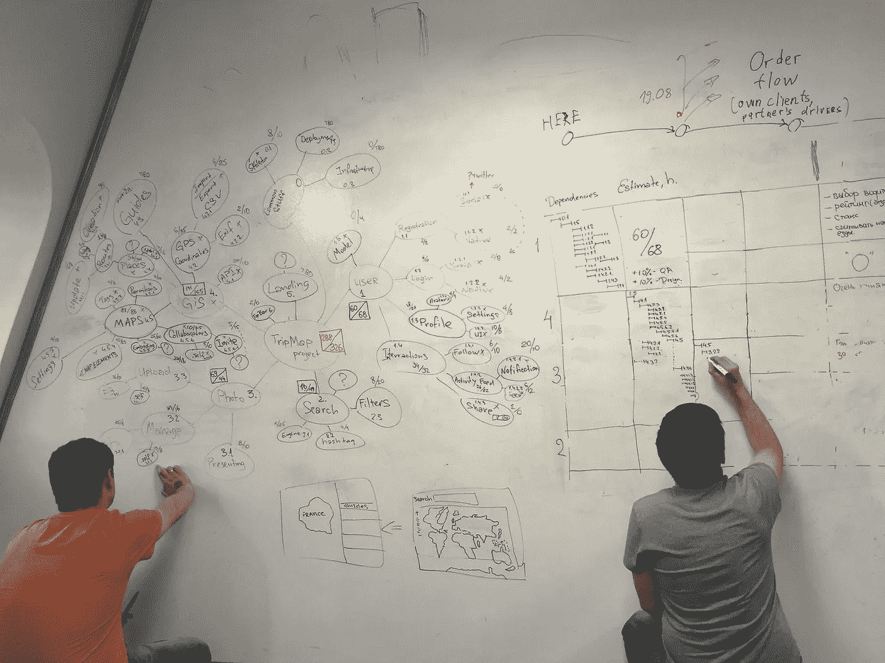

# 6 主要外包风险以及如何降低风险

> 原文：<https://medium.com/hackernoon/6-main-outsourcing-risks-and-how-to-mitigate-them-2d9c0196a122>

将您的 IT 需求外包出去有很多好处，因为它具有成本效益，并提供对特定知识和专业技能的即时访问。尽管如此，这些好处伴随着不可避免的风险。然而，有一种方法可以减轻它们的影响。怎么会？这就是我要说的。

> [这篇关于外包风险的文章最初发表在 Django Stars 博客](https://djangostars.com/blog/outsourcing-risks-and-ways-to-mitigate-them/?utm_source=medium&utm_medium=hackernoon.com&utm_campaign=6%20main%20outsourcing%20risks&utm_content=originallyposted)上。

# 风险 1。外包公司培育你的项目的能力

想到的第一个问题，实际上是风险——“公司实际上能够完成所需的任务吗？”。这里和那里的大多数公司都在吹嘘他们的“高端”技术、可能性以及我们周围几乎所有领域的专业知识。
但如何确保你选择的公司不只是另一个吹牛大王，而且有能力高效实现你设定的目标？

# 解决方案:

你需要花些时间研究。这里要考虑的事情有:

*   公司的成熟度:公司上市多长时间，平均项目规模，员工数量等…
*   过去一年长期项目/客户的数量和成功项目的数量
*   该公司的网站。如果那些人不能为自己创造有价值的东西，他们为什么要为你创造有价值的东西。
*   公司的社交媒体活动。IT 提供商愿意与社会分享其知识和内心生活是一个好迹象。
*   公司内部的知识共享流程和技术技能发展，以及公司对全球事件的参与。
*   看看公司在独立评论平台上的排名，如
*   **案例研究。其中包括客户概述、合作历史、客户希望解决的问题、出现的挑战、解决方案本身以及使用的技术堆栈。**
*   **直接从客户(现在和过去)那里获得反馈。与老客户交谈尤其重要，因为他们说实话不会有什么损失。但是，不要忘记，他们都是忙于培育项目的业务人员，响应时间可能需要一段时间。**
*   **如果可能的话，做一次现场访问来验证你的“兼容性”——你将来需要和那些人合作。直接和办公室的人讨论项目相关的话题。**
*   **要求一个用于实现某些功能的代码示例并不是一个坏主意**

**如果您对[全周期开发](https://djangostars.com/services/python-django-development/?utm_source=medium&utm_medium=hackernoon.com&utm_campaign=6%20main%20outsourcing%20risks&utm_content=full-cycledevelopment)感兴趣，请将以下内容添加到上面列出的内容中。**

**公司是否:**

*   **知道完整流程吗？**
*   **以前从零开始完成项目吗？**
*   **有自己的项目？**

****你可能也喜欢:****

** [## 为您的企业选择技术合作伙伴时您应该知道的事情

### 伟大的想法需要伟大的措施。无论你的想法有多棒，或者你有多专业，你都做不到…

djangostars.com](https://djangostars.com/blog/things-you-should-know-when-choosing-a-technical-partner-for-your-business/?utm_source=medium&utm_medium=hackernoon.com&utm_campaign=6%20main%20outsourcing%20risks&utm_content=youmayalsolike1)  [## 如何组建一个成功的开发团队

### 一个好的团队不是自然而然产生的。但是我们为什么需要一个呢？优秀的专业人士不就形成了…

djangostars.com](https://djangostars.com/blog/form-successful-development-team/?utm_source=medium&utm_medium=hackernoon.com&utm_campaign=6%20main%20outsourcing%20risks&utm_content=youmayalsolike2)  [## 如何成功地为开发团队设定任务

### 有句谚语说“去我不知道的地方，拿我不知道的东西”，通常，最讽刺的是，这…

djangostars.com](https://djangostars.com/blog/successfully-set-tasks-development-team/?utm_source=medium&utm_medium=hackernoon.com&utm_campaign=6%20main%20outsourcing%20risks&utm_content=youmayalsolike3) 

# 风险二。失控

毫无疑问，业务经理将失去对 IT 提供商外包的流程的一些控制，因为所有外包的员工都是由 IT 提供商管理的。缺乏沟通和可见性可能会导致完成项目所需的时间增加。

# 解决方案:

更多说明:

*   那是内部团队吗？
*   讨论合作的方式和项目将使用的方法
*   询问以前使用不同开发方法的经验。使用各种方法的利弊是什么？
*   确保 IT 提供商能够根据客户的需求和项目选择/创建定制的解决方案和流程
*   如果您对要选择的方法有自己的偏好，请小心；选择您不擅长的方法可能会破坏流程并导致预算超支。
*   要求项目完全透明，包括工作进度和开发人员的任务分配信息。作为一个客户，你应该可以实时访问所有与项目相关的数据和沟通工具，如问题跟踪器、代码库、沟通渠道等

# 风险 3。供应商锁定

当使用某个软件的公司变得如此依赖它，以至于糟糕的服务或价格上涨都无法说服它转向竞争对手时，就会发生供应商锁定。

# 解决方案:

*   检查在一个系统上更换开发人员的成本，或者在项目完成后雇佣另一家外包公司来支持项目。大多数公司不会用“原始的”Python、Ruby、.Net 或 Java——他们将利用开源或商业系统，如框架或应用程序。做一个小小的研究，看看找到其他发展伙伴来共同努力有多容易。
*   检查公司是否遵循编码惯例
*   整合而不是延伸。不同应用程序之间的紧密耦合使得锁定更加容易，增加了代码库的复杂性，并且使得系统的灵活性等同于该系统中最不灵活的组件。
*   保留您数据的所有权，并确保它随时可供访问
*   记录流程

# 风险 4。隐性成本

请记住，任何供应商都希望您为最初合同范围之外的工作付费。你可能会比合同建议的花费更多。

# 解决方案:

*   注意公司是如何提供估算的，他们是如何描述资金分配方式的
*   外包公司接受什么类型的合同？那些是 T&M 还是固定价格还是每个特性的固定价格还是迭代的固定价格？选择一个更适合你的
*   检查合同中是否缺少增值税和类似费用
*   尽可能清晰地定义项目需求。这将减少完成任务所需的时间，并最大限度地减少重做过程的机会

# 风险 5。信息的保密性

当一个外包公司被一个组织雇佣时，保护组织的重要数据和知识产权是至关重要的。

# 解决方案:

求一些问题和证明:

*   外包公司可以签约 NDA 吗？
*   该公司以前是否有处理敏感数据的经验？
*   成功完成金融，医疗或政府行业的项目将是一个巨大的加分

# 风险 6。地理定位

面对现实吧——地理位置很重要。这直接影响到:“与那家公司做生意有多容易？”。

# 解决方案:

请注意:

*   时区和外包公司克服时区的方法
*   距离和可达性。进行现场访问有多容易？有什么旅行问题吗？
*   可用的支付选项
*   公司注册地
*   公司持有账户的地方。在某些情况下，由于财务监控，位置很重要
*   提高对地区法律法规的认识，以便更好地规划不兼容性和允许的权衡。
*   语言障碍
*   该国政治局势的稳定不会影响公司的长期运作

> 文章由[Oleksandr shapo RDA](https://medium.com/u/5eef930686cb?source=post_page-----2d9c0196a122--------------------------------)([**ALEXANDER shapo RDA**](https://djangostars.com/blog/author/alexander-shaporda/)**)**—Django Stars 的公关经理撰写。这篇关于[外包风险](https://djangostars.com/blog/outsourcing-risks-and-ways-to-mitigate-them/?utm_source=medium&utm_medium=hackernoon.com&utm_campaign=6%20main%20outsourcing%20risks&utm_content=outsourcing%20risks)的文章最初发布在 Django Stars 博客上。
> 
> 特别分享给 [Hackernoon](https://medium.com/u/4a8a924edf41?source=post_page-----2d9c0196a122--------------------------------) 社区。

我们随时欢迎您提出问题，分享您想阅读的话题！

> 如果你觉得这篇文章有用，请点击👏下面的按钮:)

*原载于 2017 年 4 月 5 日 djangostars.com***。**

******

> *[黑客中午](http://bit.ly/Hackernoon)是黑客如何开始他们的下午。我们是这个家庭的一员。我们现在[接受投稿](http://bit.ly/hackernoonsubmission)并乐意[讨论广告&赞助](mailto:partners@amipublications.com)机会。*
> 
> *如果你喜欢这个故事，我们推荐你阅读我们的[最新科技故事](http://bit.ly/hackernoonlatestt)和[趋势科技故事](https://hackernoon.com/trending)。直到下一次，不要把世界的现实想当然！*

****