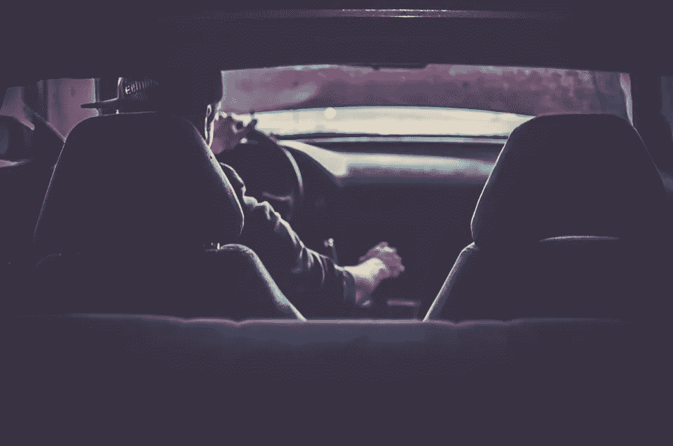

# 600 万辆这种受欢迎的游乐设施因存在伤害风险而被召回

> 原文：<https://medium.com/hackernoon/6-million-of-these-popular-rides-have-just-been-recalled-over-injury-risks-bfab44f16581>

美国国家公路交通安全管理局表示，一项重大的日产汽车召回刚刚宣布。

据[安全倡导者](http://www.thenblawgroup.com/major-nissan-recalls-impact-over-6-million-vehicles/)称，此次召回不应被忽视，因为与活动相关的问题可能会导致重大甚至致命的风险。

美国监管机构发布的官方声明显示，美国至少有 300 万辆汽车受到影响。公告显示，召回的车辆包括 2016 和 2017 款日产 Maxima，2013 至 2016 款日产 Altima，LEAF，Sentra 和 NV200，2013 至 2017 款日产 Pathfinder，2014 至 2016 款日产 NV200 Taxi，英菲尼迪 QX60 和 Q50，2014 至 2017 款日产 Rogue，2015 和 2016 款日产 Murano，雪佛兰 City Express 和 2013 款

由于这些车辆配备的乘客分类系统可能会将成年乘客归类为儿童，或者即使座椅已被占用也无法记录座椅正在被使用，因此在发生碰撞时，安全气囊系统可能无法正常工作。如果是这种情况，当座椅被成人占用时，安全气囊可能不会展开，从而导致伤害。根据撞击程度，伤害甚至可能是致命的。

该公司将联系召回车辆的消费者，但通知时间表尚未制定。如果您的车辆是雪佛兰，通用汽车公司将会与您联系，以便您了解此次召回的更多信息，但是如果您拥有一辆受此次活动影响的日产汽车，日产公司将会与您联系。

在联系到你之前，如果你还有官方召回报告中没有提到的问题，建议你亲自联系制造商。

官方召回报告，请点击[此链接](http://www-odi.nhtsa.dot.gov/owners/SearchResults?searchType=ID&targetCategory=R&searchCriteria.nhtsa_ids=16V244000&refurl=rss)。通过确保召回的车辆始终得到及时修理，确保安全并避免受伤。

> [黑客中午](http://bit.ly/Hackernoon)是黑客如何开始他们的下午。我们是 [@AMI](http://bit.ly/atAMIatAMI) 家庭的一员。我们现在[接受投稿](http://bit.ly/hackernoonsubmission)并乐意[讨论广告&赞助](mailto:partners@amipublications.com)机会。
> 
> 如果你喜欢这个故事，我们推荐你阅读我们的[最新科技故事](http://bit.ly/hackernoonlatestt)和[趋势科技故事](https://hackernoon.com/trending)。直到下一次，不要把世界的现实想当然！

