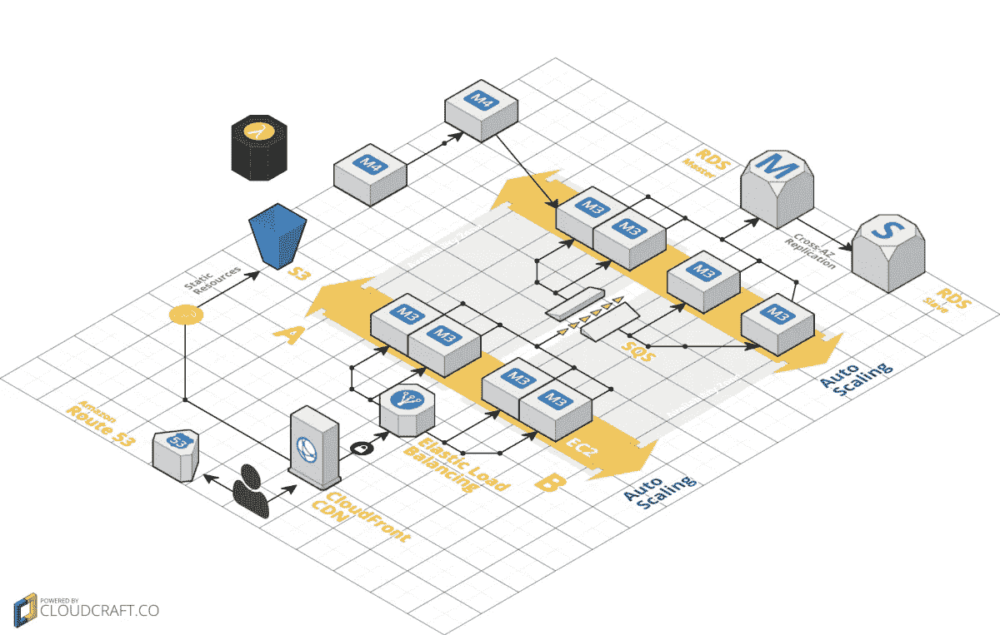

# 在 AWS 上托管 Laravel web 平台之前必须做的 6 件事

> 原文：<https://medium.com/hackernoon/6-must-do-before-hosting-your-laravel-web-platform-on-aws-35af4e8bccd8>

***感谢光临！您可能还想查看这篇关于在 AWS 上部署 Laravel 的后续文章*******或者甚至使用下面的表格下载这本书！****

*我的咨询客户经常会问，将他们的 web 应用程序移植到 Amazon Web Services 是否值得。他们期待更好的性能和可靠性，因为 [AWS](https://hackernoon.com/tagged/aws) 听起来更专业，但他们也听说过令人震惊的 AWS 账单的故事，尽管他们不知道为什么。*

*简而言之，通过以正确的方式构建你的 [web 平台](https://hackernoon.com/tagged/web-platform)，你将能够首先部署在一个更便宜的主机选项上，同时确保平稳地迁移到 AWS，保证零重构。*

*下面是一个详细的清单，它将保证你的网络平台是可移植的，并充分利用 AWS。*

# *1.配置作为环境变量*

*在审计中，我要检查的第一件事是应用程序配置是否是从环境变量中检索的。环境是你的应用可以运行的任何地方。它可以是您的开发人员的本地机器、您的测试服务器、您的试运行服务器或您的生产服务器。*

*应用程序配置是可能在不同环境之间发生变化的任何东西。*

*   *后台服务的资源句柄(数据库、缓存引擎、搜索引擎等的 URIs)*
*   *外部服务的任何凭证(密码、SSH 密钥、SSL 证书)*

## *从预定义的文件中检索您的配置…*

*…配置文件应该从环境变量中初始化。*

*在 PHP Laravel 中，这是通过在 *config* 文件夹中创建文件，并使用助手 *env()* 用环境变量初始化配置文件来实现的。*

## ***并从环境中初始化您的配置文件***

*特定于环境的配置不应该在源代码中，而应该存储在环境中。
在您的测试、试运行和生产服务器上，环境由您的部署脚本设置。*

*在开发人员的本地机器上，对于 Laravel 框架，它作为一个. env 文件存储在项目的根目录下，不应该提交给源代码库(添加到您的*)。gitignore* 文件)。*

*测试管道的配置可以存储在 *.env.testing* 文件中。*

## *嗅觉测试*

*任何测试环境的代码都是一面红旗(*ifs*production*then…*/*if*staging*then*)。当本地、生产和暂存使用不同的驱动程序时(例如，开发机器在本地存储文件，而生产服务器使用文件存储服务)，那么应该使用一个抽象层，但是它不应该与您的应用程序业务逻辑混合在代码中。
Laravel 为*存储*、*缓存*、*队列*等提供服务门面；他们的角色是抽象出文件存储、缓存、后台作业队列等是如何实现的，这样逻辑就独立于环境，你的代码也应该如此。*

*这样，相同的代码将使用一个本地 Redis 服务器来存储 web 会话，并在 AWS 上使用一个托管服务 ElastiCache。将您的代码部署到产品中时，不会有最后一刻的切换，也不会有最后一刻的错误。*

**

# *2.无状态代码*

> *无状态应用程序是一种应用程序，它不记录在一个会话中生成的数据(如有关用户设置和发生的事件的信息)，以便在与该用户的下一个会话中使用。*

*当然你的应用程序不会是无状态的！如果您构建一个 web 平台，您通常会希望您的用户在您的服务上生成尽可能多的数据。
但是它的*进程*应该是无状态的，也就是说，将用户重新部署或崩溃或负载平衡到不同的服务器不应该影响用户
这是通过仅在后端服务而不是在应用服务器上集中存储来实现的。通过将会话存储在托管 Redis 服务(如 AWS ElastiCache)中，将用户文件存储在文件存储服务(如 AWS S3)中，并在托管 AWS RDS 实例上运行数据库，可以确保在一个应用服务器上重新部署不会中断用户会话。*

*这也意味着您可以在多个应用服务器上负载平衡您的流量，并且您的用户将总是能够找到他们的文件。即使在部署失败和失去服务器后，他们也会找到它们。*

## *嗅觉测试:使用本地文件、本地内存的代码*

*PHP 应用程序将文件存储在其运行的本地服务器上是另一个危险信号。如果您在下一次重新部署时丢失了该服务器，您将丢失用户数据。这样的应用程序还不能进行扩展，也需要重构。*

## *JWT*

*对于用户会话和 API OAuth 令牌，您甚至可以在没有集中的键值存储或使用数据库的情况下处理用户会话数据。通过使用 Json Web 令牌而不是随机的 OAuth 令牌，应用程序将依靠客户机(浏览器)来存储和发送所有这些信息。数据在服务器端被加密以避免篡改，并且可以存储在 cookie 中。在这种情况下，服务器不存储任何东西(或者只存储撤销黑名单)，应用程序进程不需要共享任何东西或者调用后端服务。*

# *3.允许并发*

*现在你的应用程序是无状态的，一个直接的好处是你可以在不同的服务器上运行它的多个版本。这就是所谓的水平扩展，与垂直扩展相反，垂直扩展意味着在一台服务器上运行应用程序，并在需要时将其升级到更强大的服务器。*

*不是所有的软件都可以水平缩放(例如，对于数据库或搜索引擎来说，这是一个复杂的问题)，但是 PHP 应用程序可以通过遵循本指南中的 6 点立即水平缩放。*

*一旦您的应用程序是无状态的，下一步就是将前端代码与后台任务分开。首先，web 进程是对用户的浏览器请求立即做出响应的进程。*

*你也可能有后台工作(如发送报告、生成发票、处理数据、发送电子邮件/推送通知)。它们应该在 web 进程之外执行，即使它们也是用 PHP 编写的。*

*这些作业将由工作进程执行，因此不会阻塞 web 请求。*

*在 Laravel 框架中，使用队列 facade 和 Redis 之类的消息队列服务器，将这些阻塞任务分派到单独的服务器池。迁移到 AWS 时，可以使用托管消息队列服务 SQS。*

*警告:如果你使用 AWS SQS 来安排关键任务，你需要注意 Buffer.com[在本帖](https://stories.buffer.com/the-cronjob-that-generates-4-million-a-year-4540b0cde584)中描述的*重复消息*边缘情况。*

# *4.日志作为流，而不是文件*

*就像用户生成的文件不应该存储在您的应用服务器上一样，日志也不应该存储在本地。它们也应该被集中起来，并传输到后端服务，在那里您可以在一个地方找到来自所有应用服务器的所有日志(甚至是来自您丢失或关闭的服务器)。*

*Laravel 的 Log facade 默认情况下只将日志存储在文件中，所以您需要一个[定制配置](https://github.com/laravel/internals/issues/126)来将它们传输到 PHP 的标准错误输出中。如果您在 Docker 中运行 PHP 应用程序，那么您可以利用 AWS CloudWatch 驱动程序，将您的日志传输到一个集中的位置。*

## *嗅觉测试*

*写入生产服务器上本地文件的任何日志。*

# ***5。无重构的水平缩放***

*如果你遵循了以上几点，那么恭喜你！您的 web 应用程序已经可以伸缩了，不需要重构。*

*通过将配置从代码中分离出来，应用程序可以从更便宜的主机提供商移植到 AWS。
将阻塞任务分派给后台工作进程允许我们卸载前端并独立扩展到工作进程。
通过将我们的应用作为无状态进程运行，我们可以将我们的用户流量负载平衡到不同的服务器，并将数据存储在后端服务中。*

*这些是水平扩展的先决条件。它已经具有成本效益，因为您可以使用更小、更便宜的服务器进行扩展。*

*下一步是以经济高效的方式托管后端服务。*

# *6.利用 AWS 托管服务*

*到目前为止，我们只讨论了应用服务器(HTTP 服务器通过执行 PHP 代码来响应 web 请求)，那么后端服务、数据库、搜索引擎等等呢？*

*这就是你可以充分利用 AWS 的地方。所有这些后端服务在 AWS 上都以*托管服务*的形式存在，即一种随用随付的计费方式，不需要你维护服务器。
你要尽可能多地使用这些服务，用于数据库(AWS RDS，DocumentDB)、文件存储(S3)、会话存储(ElastiCache)、日志聚合(CloudWatch)、缓存引擎、搜索引擎(AWS Managed ElasticSearch)和负载均衡。*

# ***结论***

*那么成本效益是怎么回事呢？在实践中，托管服务的成本比运行自己的服务器要低得多。有更多的安全和规模在几个点击。在 AWS S3 上存储你的用户文件，在每月 15GB 的传输后，每月每 GB 的费用约为 0.02 美元，在此之前**是免费的**。
在 AWS ElasticSearch 托管服务上托管您的搜索引擎对于较小的实例是**免费的**。
以此类推。*

*更重要的是，它们将花费更少的时间来设置，几乎没有时间来维护，并让你晚上睡得更好。*

**莱昂内尔是总部位于伦敦的初创公司 Wi5 的首席技术官，也是《面向未来的工程文化课程* *的作者。你可以在*[*https://getlionel.com*](https://getlionel.com)上联系他*