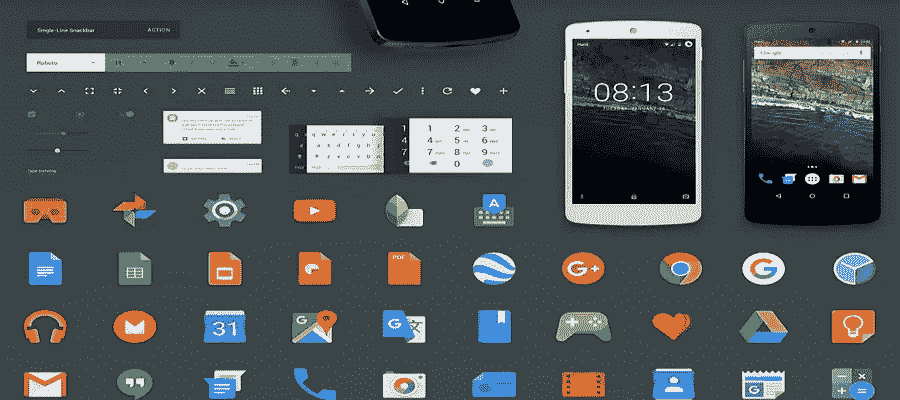
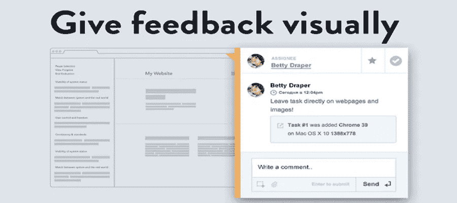

# 让你成为一名优秀的 UI 设计师的 6 个必须知道的 GUI 设计原则

> 原文：<https://medium.com/hackernoon/6-must-know-gui-design-principles-to-make-you-an-excellent-ui-designer-4643dadf8459>

GUI 设计已经成为用户界面设计的最佳选择。然而，尽管图形用户界面不可预测的流行，很少有应用程序有好的界面设计并符合图形用户界面设计原则。此外，很难用专业知识和现有的文档来解释什么是优秀和直观的操作界面。下面是 8 个 **GUI 设计原则**。

# 1.更了解你的用户。

GUI 设计原则之一是应用程序应该能够反映用户的思想和行为特征。开发者应该先了解人们，才能充分了解他们的用户，了解两者之间的共性。通过识别比死记硬背更容易学习。普通人只能记住大约 2000 到 3000 个单词，但能识别超过 50000 个单词。因此，最好让用户记住按键，而不是提供一个列表或数据值供用户选择。

# 2.小心不同的理解角度。

许多设计师可能会不知不觉地陷入“视角”的陷阱，比如 T4 的图标设计或者软件的整体设计。这是 GUI 设计原则之一，要求设计者考虑用户的观点，让用户更好地理解图形 UI 设计。

# 3.让 UI 设计更犀利。

终端用户通常不清楚应用程序的 GUI。一个有效的解决办法就是开发、使用、储备词表，让 App 更犀利。应用程序的一些条款含糊不清或不一致，引发了许多用户的不满。因此，GUI 设计技巧之一要求清晰的 UI 设计。

# 4.符合您的设计。

一个好的 GUI 设计应该遵循并符合他们的设计，以及其他一些已经取得成功并被普遍接受的应用程序的设计。在编写商业 App 软件时，GUI 设计原则中的这一条，要求设计师尽可能多地为用户提供符合优秀设计的设计。

# 5.提供视觉[反馈](https://www.mockplus.com/blog/post/5-simple-questions-to-ask-when-looking-for-user-feedback/?r=cherry)。

如果您曾经在等待程序执行完成时盯着鼠标或沙漏，那么您可以体会到缺乏视觉反馈所导致的沮丧感。你的用户需要知道他们要等多久才能结束程序的执行。根据 GUI 设计原则之一，当完成程序执行需要 7 到 10 秒以上时，用户一般希望得到消息框或进度指示器的提示。

# 6.提供音频反馈。

警报声通常被认为是一种环境噪声。GUI 设计也是如此。然而，当有必要提醒用户即将发生的严重问题时，音频反馈是有用的。例如，当程序的多一个操作可能导致数据丢失时，给出警告的音频反馈是必不可少的。这是 GUI 设计原则之一，因此也建议用户应该被允许在 GUI 设计中禁用音频反馈，除非出现问题并且必须处理。

以下是更多文章:

[设计提示:千万不要使用黑色](https://www.mockplus.com/blog/post/10-design-tip-never-use-black/?r=cherry)

[打造华丽 UI 的 7 条法则](https://www.mockplus.com/blog/post/90-7-rules-for-creating-gorgeous-ui/?r-cherry)

[如何在网页设计中运用色彩](https://www.mockplus.com/blog/post/100-how-to-use-color-in-web-design/?r=cherry)