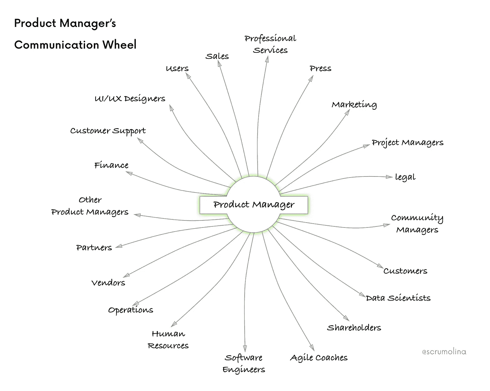
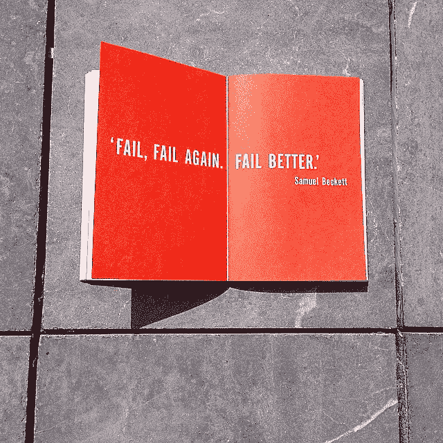

# 6 个行之有效的想法会让你成为更成功的项目经理

> 原文：<https://medium.com/hackernoon/6-proven-ideas-that-will-make-you-a-more-successful-pm-fc35c2c4cbeb>

作为产品经理，我们负责各种各样的事情。从在没完没了的会议上与无数方沟通，到对待办事项进行优先排序和添加功能，希望我们正在开发的产品能够脱颖而出并大放异彩。当我们专注于创建一个程序时，很容易忘记一些核心要点，这些要点为我们的产品和背后的整个团队增加了价值。

# 1.数据是新的石油

你永远不会有足够的数据。你永远不会完全知道谁是你的客户。句号。

**产品是一个趋势产业**，随着客户的需求和期望不断变化。客户在发展，他们使用的产品也在发展。还是反之亦然？

我们的责任是从可靠的数据中学习。除了从我们产品的用户那里收集到的有价值的数据之外，诸如**当地趋势、法律、新闻甚至天气状况等外部因素也能极大地影响与产品相关的决策。**

团队对谁是他们的客户的认知也可能不同。收集到的数据可能会因个人认知而有不同的解释。优秀的产品经理容忍并接受观点的多样性。将多样性作为探索一组新数据的机会，这些数据可能会让你有有价值的发现。

> *我们在用数据做正确的事情吗？是的，如果你正在解决客户的问题。*

印度的 e-tail Flipkart 使用基于实时数据的预测，根据客户过去的兴趣和行为模式定制他们的主页。Flipkart 知道没有两个人是相同的，所以他们偶尔会问一些简单的问题，帮助机器[学习](https://hackernoon.com/tagged/learning) [技术](https://hackernoon.com/tagged/technology)更好地理解用户并提供更好的建议。凭借这一惊人的功能，电子商务平台真正学会了不断提供客户喜爱的更好的用户体验。正如来自 Flipkart 的 Ram Papatla 在他的[产品管理节](https://medium.com/u/fba4ae2167da?source=post_page-----fc35c2c4cbeb--------------------------------) 2017 主题演讲中分享的那样:*“我们倾向于高估技术在短期内的影响，而低估长期的影响”。*

# 2.移情过度

每隔一段时间，每个人都有理解和分享感受的问题。在商业中，缺乏同理心随处可见——在产品团队和利益相关者中，但最重要的是在客户方面。

> 专注于你的客户，其他一切都会水到渠成。

所有需要做的就是**观察实际用户使用你的产品的时候。**给孩子，老人，或者你随机遇到的人。我们假设我们知道什么对我们的用户最好，但是这个练习可能证明我们是错的。这是一个发现和解决我们可能会忽略的问题的机会。

与为主流人群开发相比，在产品开发中考虑极端偏差的代价更高。感同身受的产品经理为所有用户开发产品，而不管他们在统计上属于哪一类。好的项目经理**不会将用户视为自己需求和习惯的克隆，而是关注实际用户和他们的需求**。“移情应该是每个产品管理工具包的一部分”，建议来自谷歌的[里奥赤坂](https://medium.com/u/5b93233d448d?source=post_page-----fc35c2c4cbeb--------------------------------)。

> 观察一个孩子、一个老人或随机使用你的应用程序的人并学习

这就是同时管理公司优先事项和产品成为挑战的地方。改善需要时间。你不能过度同情，也不能过度忍耐。像你的客户一样不耐烦，但要与你的愿景保持一致，以减少干扰。

促进同理心通常意味着逆水行舟。成为所有利益相关者的传播者——从领导层到开发团队和产品社区——但也要听取他们的反馈。优先考虑正面和负面的反馈，并执行。赢得你的信任全在于坚持不懈。另一方面，信任可能不会给你权威，但绝对会给你影响力。

# 3.易访问性产生了连锁反应

近五分之一的美国用户和七分之一的欧盟用户有残疾。然而，无障碍方面的困难远不止于残疾。

我们的用户可能是一手抱着孩子，一手拿着我们产品的父母。他们可能理解语言有困难，或者他们把眼镜忘在车里了。或者他们在地铁站用慢速手机访问您的应用程序，而那里的互联网接入很差。

尝试在不完美的环境下使用您的产品。很有可能你会为每个用户找到改进应用程序的方法。在开发时考虑可访问性将会对所有用户产生积极的影响。*一个小小的改变就能产生特大的影响*来自谷歌[*里约赤坂*](https://medium.com/u/5b93233d448d?source=post_page-----fc35c2c4cbeb--------------------------------) 。

谷歌地图是一个展示可访问性效果的成功产品的极好例子。凭借巧妙的设计和简单的问题，谷歌地图帮助残疾人报告和记录轮椅可以到达的兴趣点。这种方法变得如此受欢迎，以至于问题扩展到其他领域，最终在基于位置的信息收集和评级的所有领域创造了来自“主流用户”的大量贡献。

# 4.迅速失败(但要衡量)

直到你推出产品，客户才获得任何价值。价值必须可以衡量，收入只是衡量产品成功价值的一个标准。正如 Shopify 的克里斯·朗所指出的:“如果你不衡量价值，你怎么能创造更多的价值呢？”。或者根本不建造更多。

失败是一种非常有用的价值形式。**你越快碰壁，你就越快知道你的产品、团队或组织中需要改进的地方**。

衡量你的团队文化的价值和衡量产品价值惊人的相似。关键区别在于**指标**。为了创造更多的价值，你必须知道你衡量的是什么。如果我们考虑团队文化的价值，我们必须考虑该文化支持和不支持什么，以便衡量随着时间的推移所实现的价值。团队文化通过相互协作和透明来传递价值。

**直到感觉到结果并获得用户(无论是客户还是团队成员)的反馈，变革才会产生价值。从表面上看，在所有情况下，价值都是随着时间推移而衡量的。**

我们衡量价值的频率取决于我们的生产力。目标是缓慢地、增量地增加价值。拥抱小实验，不管它们有多冒险，目标是改善而不是成功。在产品开发、团队文化或组织结构调整方面，努力追求持续改进，而不是完美。

# 5.拥抱挑战

让你的周围充满挑战性的任务，但更重要的是让你的周围充满挑战性的人。征服两者后的感觉是无法形容的。将自己推向极限，尤其是在不舒服的环境中，有助于你发现自己隐藏的能力。*“产品管理是关于建立关系的”*正如 Audible 的 [Rebekah Mueller](https://medium.com/u/eb5b952f9e57?source=post_page-----fc35c2c4cbeb--------------------------------) 在 2017 年 PMF 上所说。

> 产品管理就是建立关系

冲突、责备、个性冲突和促进竞争都对工作环境有害。拿出智慧和毅力来迎接挑战性的情况和相关的人。**挑战自己，与有挑战性的人打交道，你肯定会对结果感到惊讶！**

# 6.改善你的氛围

产品经理的价值可以通过维系团队的强大而健康的关系来衡量。友善待人，在与你共事后让每个人都感觉良好并受到尊重。来自 Snapchat 的 Krassi Hristova 建议说: *“让别人感受到你的影响力”。帮助同事壮大自己的影响力。你们都在一起，不要低估著名的三剑客格言。您的领导力直接影响产品、团队和整个组织的成功。*

> *产品经理的价值可以通过维系团队的牢固健康的关系来衡量。*

别忘了庆祝成就。认可你和团队取得的每一个小胜利。从长远来看，在工作环境中传播良好的氛围会赢得你的信任和尊重。不要犹豫**大惊小怪**。让我们听听**不劳而获。**

# 回到现实…

成功的团队塑造和构建成功的产品，但这并不像听起来那么简单。人类行为似乎很容易理解，但是在真实的工作环境中很难掌握 T21。

最后，**成功的产品经理** …

*   测量、优先排序和使用数据
*   理解并分享他人的感受
*   重视极限用户
*   冒失败的风险并从中吸取教训
*   不害怕挑战性的任务和人
*   建立关系

你将如何塑造自己未来的领导形象？以人类的智慧思考并执行！

> ***感谢您的持续关注。如果你喜欢这篇文章，请给它一个掌声，并填写我的💚带着喜悦:)***