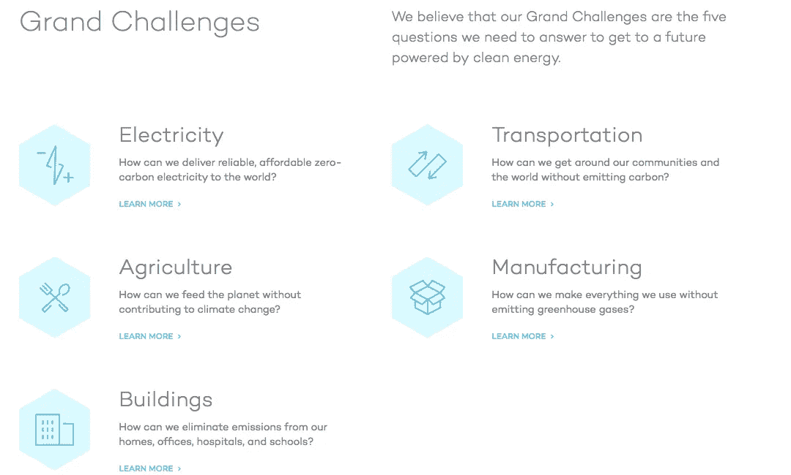
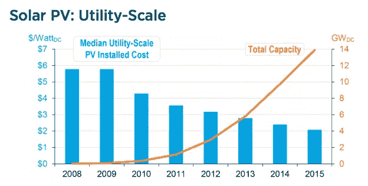
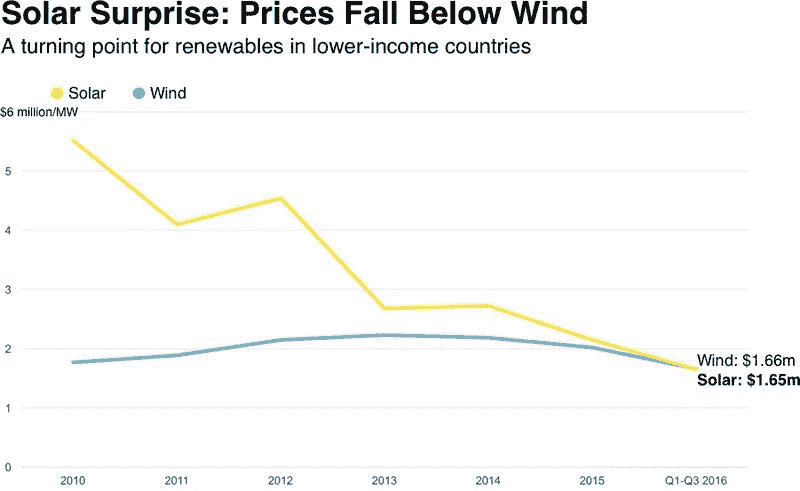
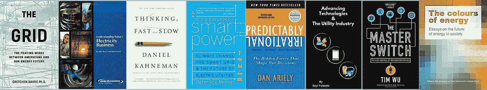

# 为什么奥巴马(和你)应该关注清洁技术的 6 个理由和 8 本书。

> 原文：<https://medium.com/hackernoon/6-reasons-and-8-books-why-obama-and-you-should-focus-on-cleantech-65d64b91ddb>

奥巴马的[科学文章](http://science.sciencemag.org/content/sci/early/2017/01/06/science.aam6284.full.pdf) [PDF]很值得一读。如果你还没有读过，只要点击链接就可以得到一个关于气候对话目前进展和未来发展的很好的总结。我的总结是:

> 根据大量的科学记录，我们早就知道，采取行动减缓气候变化的紧迫性是实实在在的，不容忽视。近几年来，我们还看到，采取行动的经济理由和不采取行动的经济理由一样清楚，清洁能源的商业理由正在增加，而且无论联邦政府的短期政策如何，清洁能源部门的趋势都可以持续下去。

奥巴马是第一位在科学杂志上写文章的总统，他选择了一个非常有争议的话题。我不关心你的政治，就像你不应该关心我的一样，但是我关心的，我认为你也应该关心的，是我们继续以我们目前的方式处理我们的星球所固有的不确定性。当人们说气候变化的“风险”时，它给人的印象是我们可以测量并给这种影响赋值。我看到的是不确定性，因为我们并不真正了解我们的持续行动对气候的负面影响的程度。所以我选择继续努力。我认识到这也是一个机会。一个大的。

我看到的是一个对社会和经济产生影响的机会，在一个[万亿美元的行业](https://eresearch.fidelity.com/eresearch/markets_sectors/sectors/sectors_in_market.jhtml?tab=learn&sector=55)工作，这个行业不会很快有任何发展。对于一个已经取得如此巨大成就的人来说，除了削弱我们的能源未来之外，任何事情都是在低估他的遗产。是的，我要把奥巴马叫出来，现在他有时间了！原因如下。

1.  产业规模:如上所述，全球能源产业价值数万亿美元。[据麦肯锡](https://www.mckinseyenergyinsights.com/sectors/global-energy-demand/)称，清洁技术行业预计将在此基础上再增加几个 T。美国刚刚给了[5 亿美元给联合国气候变化基金](http://www.bbc.co.uk/news/world-us-canada-38661259)，这是之前承诺的一部分。比尔·盖茨和他的伙伴们刚刚承诺用他们的[突破风险基金向清洁技术投资 10 亿美元。我实际上认为承诺的规模太小了。对奥巴马来说，为该基金再筹集几十亿美元并运营它并不为过。它汇集了他对创业、创新、技术和社区影响的热爱。](http://www.b-t.energy/ventures/)

Image courtesy: Breakthrough Ventures. [http://www.b-t.energy/ventures/](http://www.b-t.energy/ventures/)

**2。能源系统与其他核心系统的相互关系**:能源系统与其他所有主要系统都有联系，例如健康、食物、水，在系统的等级体系中，能源系统可能被认为是最重要的。没有能源，我们就不能利用水来转化我们的食物，没有食物，我们就有健康问题。反之则不然。引用克林顿基金会前首席执行官的话，

> *“地球气候是一个系统，由我们的大气、海洋、陆地和人类社会的子系统组成。”“系统思维”将结果视为系统各要素之间相互作用的结果，并认识到系统通常包含其自身成功的原因，这一点至关重要，也包含其自身失败的原因。* [*同样，“系统问题”是源于系统各要素相互作用的问题，其特点是与周围的其他变量高度关联和相互依赖。*](https://www.clintonfoundation.org/blog/2014/09/19/how-systems-thinking-can-impact-climate-change)

***3。情况紧急**:气候总是在变，这不是重点(也是为什么叫气候)。关键是，科学证据表明，事情发生的速度比过去快得多。不管是不是人为造成的，变化的速度应该是个问题。中国人有句谚语说，种一棵树的最佳时间是 20 年前。第二好的时机是现在的。*

***4。颠覆、创新和技术可能性**:发生在通常保守的能源行业的颠覆程度令人震惊。随着[纳米电网——单一单位需求和能源生产](https://www.linkedin.com/pulse/quick-guide-nanogrids-minigrids-seyi-fabode)——成为世界上许多地方的第一选择和首选，这些地方的发电基础设施一直低于需求，但正在赶上消费者的需求。*

**

*[Image courtesy Breakthrough Ventures](http://www.b-t.energy/landscape/)*

*非经合组织国家的太阳能价格有史以来第一次低于风能；这发生在电价高于美国的经济体。*

*

Image Courtesy Bloomberg New Energy Finance* 

***5。趋同**:在我看来，这是奥巴马进入这一行业的最佳时机，主要原因是因为正在发生在****建筑环境*** (能够以迄今为止不可能的规模管理能源的建筑材料) ***能源行业*** (太阳能价格最终与化石燃料持平)， ***交通*** (特斯拉和其他电动汽车开始获得某种程度的采用) ***技术和软件*** (人工智能:谷歌和仓库节能) ***家庭和有意识的消费者*** ，以及 ***技能要求*** 。 行业现在需要的是布道者、运营者和社区开发者的结合。**

****6。孩子们:如果他需要另一个理由呢？奥巴马像所有父母一样，关心他的孩子。我们不太确定我们的行为会如何影响我们留给他们的地球。让他的技能和影响力在能源行业发挥作用，是他能够影响他们未来的唯一真正方式之一。由于他也喜欢阅读，这里有一个书单，可以让他了解美国电力行业的过去、现在和未来，这将成为全球电力行业的代表。****

## **让奥巴马(和你)成为电力行业专家的书**

****

1.  **格雷琴·巴克:这本书被比尔·盖茨选为 2016 年他最喜欢的书之一，对美国电力行业的现状进行了透彻的分析。这是一位人类学家写的，是对美国电力工业的文化、技术和发展的透彻研究。**
2.  **Bob Shiverley 和 Jon Ferrer 著 [**【了解电力行业**](http://amzn.to/2jjE3em) **】:这是一本参考书，你可以拿起来直接通读。考虑到电力行业的快速变化，作者目前正在更新版本。****
3.  **丹尼尔·卡内曼:为什么我在这里放了一本关于决策的书？因为这本书最清楚地解释了为什么我们会这样思考和做决定。可以预料，理性的个人在看到自己行为的负面后果后，会改变策略，做出对自己最有利的决定。卡尼曼说，事实并非如此，因为我们不是理性的代理人，而是被我们认知中的自动和深思熟虑的因素所控制，这些因素有时可能会出错。这是一个必须阅读的人谁想要了解人类，并影响决策和政策制定，因为我们努力实现一个更好的能源未来。**
4.  **彼得·福克斯·彭纳(Peter Fox Penner):这本书比我读过的关于电力行业的大多数其他书籍更深入、更详细地探讨了电力行业的商业模式。这本书还试图预测或建议一些新的商业模式，为行业正在看到的范式转变。**
5.  **丹·艾瑞里的《可预见的非理性》:在体验过一点生活并读过《思考的快与慢》之后，你会同意我们人类是非理性的代理人。丹·艾瑞里在他的书中表明，我们在可预测的方面是不理性的。这是好事。它帮助我们模拟人类行为的可能性，即使我们保持非理性；这是我们在处理人民和国家的利益冲突时必须具备的技能，因为他们都受到继续不对气候变化采取行动的影响。**
6.  **[**总开关**](http://amzn.to/2j73Nww) 作者 Tim Wu:公用事业行业往往被比作电信行业。随着行业的数字化步伐加快，这种描述变得越来越贴切。在《总开关》中，Tim Wu 描述了工业如何成为“信息网络”,并随着它们在“生命周期”中的进一步发展而陷入创新和破坏。这本书表明，捆绑(大垄断)和拆分(新贵创业公司打破大垄断)的过程是循环的。电视和电信经历了这些转变，这本书解释了同样的事情将如何发生在公用事业行业。**
7.  **[**推进技术&公用事业**](https://www.amazon.com/dp/B01MSA22OO) :考虑到我在这个行业思考和工作的时间，我不得不把我的书列入这个清单。它概述了为什么公用事业行业的技术变革停滞不前，哪些技术突破将产生一些影响，以及该行业(以及在其中工作的人)应该如何最好地应对这种变化。**
8.  ****:在 36 篇深思熟虑、发人深省的文章中，来自世界各地的专家对该行业的未来有着不同的看法，他们分享了他们对我们作为一个社会需要做些什么的看法，以确保我们为世界各地的人类提供安全、稳定和价格最优的能源。****

********

****Storm cloud image from Al Gore presentation at SXSW 2015.****

****随着怀俄明州等州提出法案，停止可再生能源的销售，清洁技术产业现在需要的是一个已经掌握了问题的范围，并有技能、影响力和能力来团结人们(因为我们需要一支军队)并激发我们有机会扭转我们对气候变化的影响的希望。比如说，某个人做这件事，不是因为钱，而是为了事业，他可能是一家风险投资公司的首席执行官。奥巴马恰好符合这个要求。如果他决定这样做，考虑这篇文章我的工作申请加入他的团队！****

*****我和我的团队通过* [*【哈珀·雅各布斯】*](http://harperjacobs.com)*&Asha Labs**的公共事业咨询公司向能源和科技公司提供产品营销。并买* [*40 半显(启动)课*](http://www.amazon.com/dp/B01MQSYHNH) *。在这里* *报名参加我的博学者月刊* [*，我保证你会喜欢的。*](https://www.getrevue.co/profile/seyifabo?utm_campaign=Issue&utm_content=forwarded&utm_medium=email&utm_source=Seyi+Fabode)****

## ****如果你喜欢这篇文章，请点击下面的心。这有助于其他人看到这个故事，也有助于我知道你想看到我写更多(我们都需要一些验证:)。****

************************

> ****[黑客中午](http://bit.ly/Hackernoon)是黑客如何开始他们的下午。我们是这个家庭的一员。我们现在[接受投稿](http://bit.ly/hackernoonsubmission)并乐意[讨论广告&赞助](mailto:partners@amipublications.com)机会。****
> 
> ****如果你喜欢这个故事，我们推荐你阅读我们的[最新科技故事](http://bit.ly/hackernoonlatestt)和[趋势科技故事](https://hackernoon.com/trending)。直到下一次，不要把世界的现实想当然！****

********