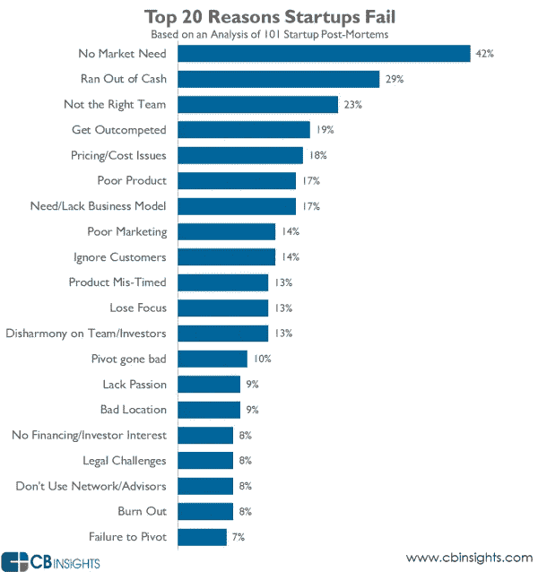
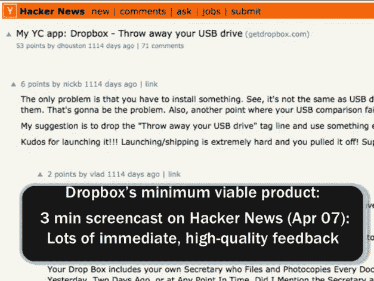

# 不在 MVP 之前组建团队的 6 个理由

> 原文：<https://medium.com/hackernoon/6-reasons-not-to-build-team-before-mvp-bd69c94c687d>

许多人在开始创业时会拖延。我第一次创业没有开始的原因之一就是**找团队。**

我专注于寻找开发人员来帮助我构建“一个令人惊叹的 iPhone 应用程序”，你知道这种感觉吗？

谢天谢地，在接下来的 5 次创业后，我改变了主意，我明白了，专注于寻找**核心团队而不是** [**打造 MVP 是愚蠢的。**](http://brainhub.eu/blog/2015/12/24/what-is-mvp/)

读完这篇文章后，你会有 6 个强烈的理由首先建立一个 MVP，甚至在考虑建立一个团队之前，以及使用什么工具来正确地完成它-受到其他创始人的启发。

所以我们就直入主题吧，好吗？

这篇文章将概述为什么在为你的新企业建立核心团队之前，最好先建立一个超级简单的 MVP。

# 为什么你应该首先建立一个 MVP，然后建立一个核心团队

# #1 检验你的想法

构建一个最小可行的产品就是测试你的解决方案是否被任何人需要，以及潜在客户想要你构建什么。

所以**测试，测试，测试** …

测试后，当你看到潜在客户对解决你试图解决的问题感兴趣时——试着找一个团队、开发人员或外包你的 MVP。

即使你**根本没有任何技术技能**，你也可以[创造一个 MVP。看看我上一篇博文中的 5 种方法。](http://brainhub.eu/blog/2015/12/24/what-is-mvp/)

构建一个你都没有测试过的东西是没有意义的，对吧？

这一过程非常简单:

*   **向潜在客户展示你的想法**
*   **从他们那里收集反馈——他们有你想要解决的问题吗？找出他们真正需要的东西。**
*   **3 次测试/分析你的想法**
*   现在- >打造一个 MVP

# #2 建立团队需要时间

找到合适的人来实现你的想法可能需要很长时间。你可以一直并行下去。使用**帕累托 80/20 法则**，将 80%的精力放在创建 MVP 和收集客户反馈上——只留下 20%去寻找合适的团队成员。

在没有团队成员的情况下，不开始构建你的 MVP 是浪费时间。即使你发现一些人有兴趣与你合作，你也不能保证他们是合适的人选。

根据 CBInsights 的调查， **42%的创业公司失败了，因为没有市场需求**。

**始终关注问题№1**

Dropbox 和它的首席执行官兼创始人德鲁·休斯顿就是一个很好的例子。他在 2007/2008 年以单人玩家的身份创建了 Dropbox。他没有等其他人加入他的行列，而是申请成为 YC 组合投资公司的独立创始人，并进入了公司——Dropbox 仍然是 YC 组合投资公司最成功的创业公司。他做的第一个 MVP 是在 Hackernews 上的一个 3 分钟的截屏视频

# **#3 弄清楚你想造什么**

首先你从一个想法开始。当你构建你的产品并从客户那里得到反馈的时候，这个想法总是在变化的。

你越早开始收集顾客的反馈，你就能越快找到适合市场的产品。

MVP 是在开始构建产品之前收集反馈的最便宜的方法。这是找出你的客户需要什么和你应该为他们做什么的最便宜的方法。

记住，**你的产品是给顾客的，不是给你的。**

不知道如何收集顾客的反馈？试试这些[收集可操作的用户反馈的 6 种聪明方法](http://marketingbeforefunding.com/2012/11/07/collecting-user-feedback/)作者 [Misha Abasov](https://twitter.com/misha_abasov)

# #4 寻找最好的联合创始人

建立一个有 MVP 的核心团队要容易得多。你需要**向你的联合创始人/团队成员推销**，就像你向投资者推销一样。

想象一下，你有两个创始人。两人想法相同。

**创始人 1** 正在告诉你整个愿景，以及如果你加入他的团队，他想要建立什么。

创始人 2 告诉你这个愿景，但是已经展示了第一个工作原型(一个神奇的 MVP)。

你选择谁？

说书人还是执行者？

[https://brain hub . eu/blog/WP-content/uploads/2016/02/idea-multiplier-execution . jpg](https://brainhub.eu/blog/wp-content/uploads/2016/02/idea-multiplier-execution.jpg)

# #5 获得资助

它会为你赢得资本。

可以拿给天使投资人、加速器、种子基金等看。在没有团队的情况下建立一个有效的 MVP 是对你投资的一个很好的点。

你展示了你的坚持=我相信这个想法，并将尽一切努力实现它。

前微软风险投资总监兼创业顾问/创始人 Mukund Mohan 举了几个例子，说明你需要多大的吸引力/付费客户才能得到微软风险投资这样的加速器的重视。

> 如果你是一家 B2B 初创公司，预计在 36 个月内会有 5000 名付费客户，要获得种子资金，你需要有 5 到 10 名客户进行种子融资(越多越好)，至少有 2 到 5 名客户加入种子计划。
> 
> Mukund Mohan / [阅读更多](http://bestengagingcommunities.com/2013/02/09/how-much-traction-is-enough-to-get-seed-funded-or-to-get-into-an-accelerator/)

另一件事是，没有 MVP，你就没有东西可卖…

这就引出了下一点…

# #6 开始销售

这甚至比拥有一个产品更重要。我强烈建议每个初创公司在完成 MVP 后立即开始销售。如果您可以证明您可以仅通过简单的 MVP，即您解决客户问题的方案进行销售，那么

*   **你可以在想成为你核心团队一员的人中进行选择**
*   **你证明了用你的 MVP 构建一个产品是有意义的**
*   **你得到了资助**

如果你不知道如何在一家初创公司做销售，你可以阅读这本由 Greg Skloot 撰写的技术初创公司销售和营销指南。

# 结论

如果你已经是一个创始人或者打算在 near feature 创业，你大概会经历先建 MVP 还是核心团队的困境？

希望，作为阅读这篇文章的结果，你现在知道为什么我认为你应该**首先构建一个最小可行的产品**。无论你决定用什么策略从你的第一批客户那里收集反馈，也就是说无论你计划打造什么样的第一个 MVP，**只管去做**，不要过多考虑先打造团队。

祝你转化率高！🙂

*原载于 2016 年 2 月 9 日*[*brainhub . eu*](https://brainhub.eu/blog/2016/02/09/6-reasons-not-to-build-team-before-building-mvp/)*。*

> [黑客中午](http://bit.ly/Hackernoon)是黑客如何开始他们的下午。我们是这个家庭的一员。我们现在[接受投稿](http://bit.ly/hackernoonsubmission)并乐意[讨论广告&赞助](mailto:partners@amipublications.com)机会。
> 
> 如果你喜欢这个故事，我们推荐你阅读我们的[最新科技故事](http://bit.ly/hackernoonlatestt)和[趋势科技故事](https://hackernoon.com/trending)。直到下一次，不要把世界的现实想当然！

