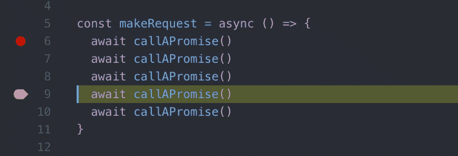

# JavaScript Async/Await 背弃承诺的 6 个原因(教程)

> 原文：<https://medium.com/hackernoon/6-reasons-why-javascripts-async-await-blows-promises-away-tutorial-c7ec10518dd9>

👉这篇文章已经更新并重新发布，[在这里阅读最新版本](https://dev.to/gafi/7-reasons-to-always-use-async-await-over-plain-promises-tutorial-4ej9)

NodeJS 从 7.6 版开始支持异步/等待。我相信这是自 2017 年以来 JS 最大的一项增加。如果你还没有尝试过，这里有一堆理由和例子说明为什么你应该立即采用它，并且永远不要回头。

# 异步/等待 101

对于那些以前从未听说过这个话题的人，这里有一个简单的介绍

*   Async/await 是一种编写异步代码的新方法。以前异步代码的替代方法是回调和承诺。
*   Async/await 实际上只是建立在承诺之上的语法糖。它不能用于普通回调或节点回调。
*   Async/await 就像 promises 一样，是非阻塞的。
*   Async/await 使异步代码的外观和行为更像同步代码。这是它的全部力量所在。

# 句法

假设有一个函数`getJSON`返回一个承诺，这个承诺用某个 JSON 对象来解析。我们只想调用它并记录那个 JSON，然后返回`"done"`。

这就是你如何用承诺来实现它

这就是异步/等待的样子

这里有一些不同之处

1.  我们的函数前面有关键字`async`。`await`关键字只能在用`async`定义的函数中使用。任何`async`函数都隐式返回一个承诺，承诺的解析值将是函数中的任何值`return`(在我们的例子中是字符串`"done"`)。
2.  上述观点暗示我们不能在代码的顶层使用 await，因为它不在`async`函数中。

3.`await getJSON()`意味着`console.log`调用将等待，直到`getJSON()` promise 解析并打印它的值。

# 为什么更好？

## 1.简洁明了

看看我们没写多少代码！即使在上面这个虚构的例子中，很明显我们节省了大量的代码。我们不必编写`.then`，创建一个匿名函数来处理响应，或者给一个我们不需要使用的变量起一个名字`data`。我们也避免嵌套我们的代码。这些小优势很快就会累积起来，这在下面的代码示例中会变得更加明显。

## 2.错误处理

Async/await 使得用同一个构造处理同步和异步错误成为可能。在下面这个有承诺的例子中，如果`JSON.parse`失败了，那么`try/catch`不会处理，因为它发生在一个承诺中。我们需要在 promise 上调用`.catch`并复制我们的错误处理代码，这将(希望)比生产就绪代码中的`console.log`更加复杂。

现在看一下带有 async/await 的相同代码。`catch`块现在将处理解析错误。

## 3.条件式

想象一下下面的代码，它获取一些数据，并根据数据中的值决定是应该返回数据还是获取更多的细节。

光看这个就让人头疼。很容易迷失在所有的嵌套(6 层)、括号和返回语句中，这些语句只需要将最终结果传播到主承诺。

当用 async/await 重写时，这个例子变得更加易读。

## 4.中间值

您可能发现自己处于这样一种情况:调用一个`promise1`，然后使用它返回的内容调用`promise2`，然后使用两个承诺的结果调用一个`promise3`。您的代码很可能是这样的

如果`promise3`不需要`value1`，那么将承诺嵌套变平一点就很容易了。如果你是那种无法忍受这种情况的人，你可以将两个值 1 & 2 包装在一个`Promise.all`中，避免更深的嵌套，就像这样

为了可读性，这种方法牺牲了语义。除了避免嵌套承诺之外，`value1` & `value2`没有理由一起属于一个数组。

有了 async/await，同样的逻辑变得简单而直观。这让你想知道，在你努力让承诺看起来不那么可怕的时候，你本可以做些什么。

## 5.错误堆栈

想象一下，一段代码在一个链中调用多个承诺，在链的某个地方抛出了一个错误。

从 promise 链返回的错误堆栈没有给出错误发生在哪里的线索。更糟糕的是，这是误导；它包含的唯一函数名是`callAPromise`,完全没有这个错误(尽管文件和行号仍然有用)。

然而，来自 async/await 的错误堆栈指向包含错误的函数

当您在本地环境中开发并在编辑器中打开文件时，这不是一个很大的优势，但是当您试图理解来自生产服务器的错误日志时，这非常有用。在这种情况下，知道错误发生在`makeRequest`比知道错误来自`then`之后的`then`之后的`then`要好…

## 6.排除故障

最后但并非最不重要的一点是，使用 async/await 的一个致命优势是它更容易调试。调试承诺总是如此痛苦，原因有二

1.  不能在返回表达式(无体)的箭头函数中设置断点。

Try setting a breakpoint anywhere here

2.如果您在一个`.then`块中设置了一个断点，并使用了调试快捷方式，如单步调试，调试器将不会移动到下一个`.then`，因为它只“单步执行”同步代码。

有了 async/await，您不需要太多的 arrow 函数，并且您可以像正常的同步调用一样单步执行 await 调用。

# 最后

Async/await 是过去几年中添加到 [JavaScript](https://hackernoon.com/tagged/JavaScript) 中的最具革命性的特性之一。它让你意识到什么是语法混乱的承诺，并提供了一个直观的替代。

# 关系

对于使用这个特性，你可能会有一些合理的怀疑，那就是它使异步代码变得不那么明显:我们的眼睛学会了每当我们看到回调或`.then`时识别异步代码，你的眼睛需要几个星期来适应新的迹象，但是 C#拥有这个特性已经很多年了，熟悉它的人知道这是值得的，这是一个小的、暂时的不便。

在 twitter 上关注我 [@imgaafar](https://twitter.com/imGaafar)

