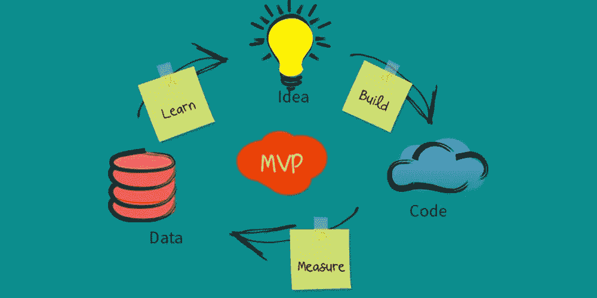
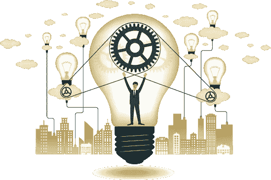
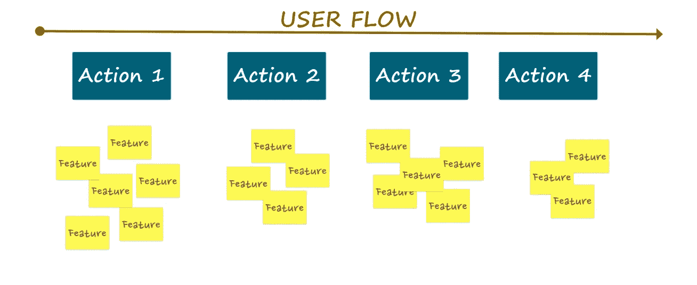
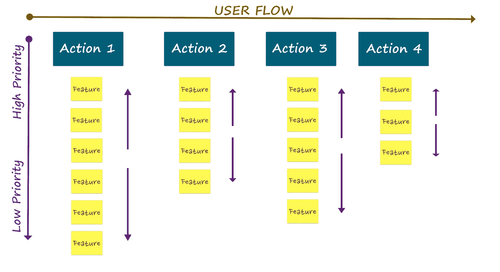
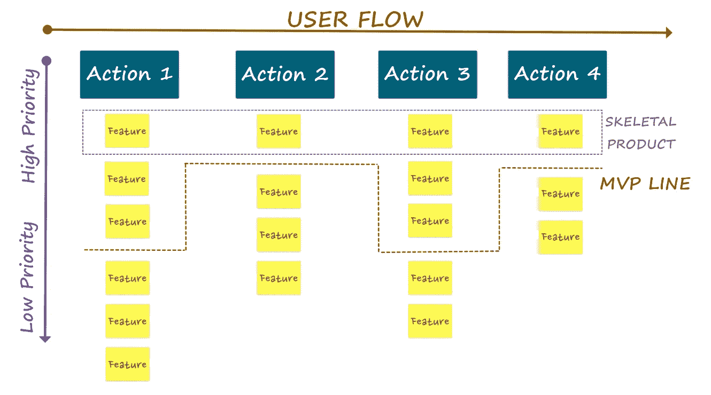
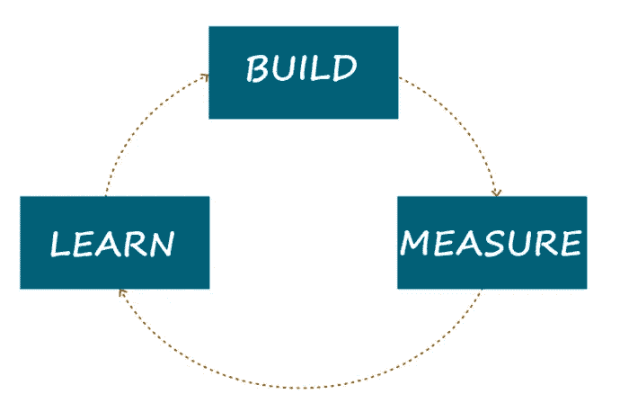

# 完成制定 MVP 的 6 个基本阶段

> 原文：<https://medium.com/hackernoon/6-steps-to-develop-mvp-35a0516d553c>

> [**什么是 MVP？**](https://hackernoon.com/creating-mvp-for-startups-how-to-use-money-efficiently-f3639e90a062) **这是一个最小可行的产品，具有“足够的功能来收集关于产品及其持续开发的有效知识”MVP 非常适合直接检查你的想法，而无需花费太多的时间和金钱。**

# **如何打造自己的 MVP？**

即使 MVP 更多的是一个产品原型，也需要大量的准备。MVP 的整个概念是测试你的想法，并确定什么可行，因此，你必须研究你的目标受众，确定他们的需求，并确保 MVP 满足这些需求。如果一切都做得正确，将来你就可以更容易地完成你的产品并将其推向市场。

通常，MVP 是分几个步骤开发的，我们将逐一介绍。

# 第一步。研究你的市场

你的想法可能很棒(如你所想)，但有时它并不符合市场需求。因此，在开始任何大的工作(如预算和时间规划)之前，首先要确保人们会对你的产品感兴趣。你甚至可以进行调查——你掌握的信息越多，你成功的机会就越大。同样，不要忘记你的竞争对手——他们提供什么，你如何脱颖而出？

# 第二步。定义你的想法

最重要的问题是:你的产品对用户有什么价值？它如何改善他们的生活，为什么他们想使用它？

在这一点上，你应该对你产品的主要价值有一个清晰的概念。因为 MVP 就是把这些价值观介绍给人们，所以首先概述它们，然后基于它们开发你的 MVP。

# 第三步。思考流程设计

确定用户需要完成的确切步骤，换句话说:描述客户将如何使用应用程序，从步骤 1 开始——打开应用程序，到最后一步(购买、交付等)结束。).考虑用户流量很重要，因为它可以帮助你不遗漏任何东西，并确保你的用户保持满意。此外，不要忘记命名流程的步骤，这将使进一步的工作容易得多。

# 第四步。列出项目功能

首先，坐下来列出你想在你的产品中看到的所有特性。不要害羞，把你想要的东西都放在那里，清单必须是一个完整和完美的产品愿景。

现在，既然你正在开发一个 MVP，再看一下列表，划掉所有不重要的特性。MVP 意味着你将有适当数量的功能来测试和使用产品，但不包括额外的功能(也就是说，花哨的设计或附加功能可以等等)。

在这一点上，重要的是不要忘乎所以，优先考虑你的功能，把重点放在基本的功能上。

# 第五步。打造你的 MVP

一旦你确定了关键特征并了解了市场需求，你就可以组装你的 [MVP](https://dashbouquet.com/mvp-calculator) 。记住，原型并不意味着质量差或一般。你的产品还是要让用户满意。因此，它必须易于使用，有吸引力，最重要的是，符合主要用户的需求。

# 第六步。分析并重复

在推出你的 [MVP](https://dashbouquet.com/mvp-calculator) 之后，分析一切，从用户反应到产品本身(它是否真的有竞争力，它被市场接受的程度如何)。此时，来自用户的反馈是你成功的关键。它将帮助你决定下一步添加哪些功能，你的产品是否会流行，等等。

当构建 MVP 时，永远记住:不要让它过于复杂，倾听你的用户。你是在为他们开发这个产品，所以不要跟着你的直觉走，不要害怕问人们他们想要什么，然后给他们。

[*德米特里·武科写的*](https://www.linkedin.com/in/dmitrybudko/\)

*想了解更多信息？* [*查看此处*](https://dashbouquet.com/blog)