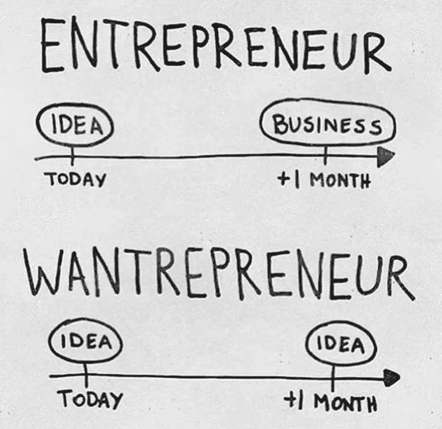

# 想出了一个很棒的商业点子？接下来呢？

> 原文：<https://medium.com/hackernoon/6-steps-to-validating-your-startup-idea-d3ba64187bf>

## 验证你的商业想法的 6 个步骤

CREDIT: Pinterest

你脑子里有百万美元的[生意](https://hackernoon.com/tagged/business) [想法](https://hackernoon.com/tagged/idea)却不知道**如何**进行？投入时间、金钱和精力是否值得？

这个问题困扰着许多企业家，并阻止他们实现他们的商业想法。这背后的原因是缺乏有见地的在线数据来指导一个人通过这些步骤。这就是我写这篇博客的动力所在。

在这个博客中，如果你有一个伟大的新的商业想法，你会弄清楚**做什么，如何做，何时做以及为什么要做**事情。

CREDIT: Imgrum

上图区分了一个[**want repreneur**](https://www.quora.com/What-is-a-wantrepreneur)和 [**企业家**](https://www.quora.com/What-is-an-entrepreneur) 。男人们不要再做一个 [**想要的人**](https://www.quora.com/What-is-a-wantrepreneur) 想一个新的商业想法，做一系列的练习或验证，然后决定是否推进这个商业想法，并以此为基础做生意。如果你有一个好的商业想法，你可以采取以下 6 个步骤:

## **1。** [**探究为什么并定义世卫组织**](/@jneeraj0807/first-step-to-validate-your-business-idea-e24d357768ee) **:**

第一步是思考商业理念背后的原因。为什么你会突然想到这个商业想法？它试图解决的问题是什么？深入发现实际问题并陈述出来。

每个人都存在这个问题吗？还是只有你？定义其存在的**细分市场。那些人就是你的 [**目标客户**](https://en.wikipedia.org/wiki/Target_market) 。通过与他们交谈来确认问题的存在。不管他们有没有经历过？如果是**多久**一次？如果你不能清楚地想到它试图解决的问题，或者你的 [**目标客户**](https://en.wikipedia.org/wiki/Target_market) 不认为它是一个真正的问题，要么改变你的 [**目标客户**](https://en.wikipedia.org/wiki/Target_market) 或者想出一个新的问题来解决。**

****举个例子:**我写这篇博客是为了解决 [**企业家**](https://www.quora.com/What-is-an-entrepreneur) **【世卫组织】在验证他们的商业** **想法时所面临的**问题(为什么)。我问我的哥们，他们是否面临过这个问题？这真的是个问题吗？**(问题验证)********

**如果你想分享你的想法并得到志同道合者的反馈:**加入 Pushstart 社区:[https://www.pushstart.in/](https://www.pushstart.in/)

## **2。搜索现有解决方案:**

搜索现有解决方案。搜索互联网，与朋友、同事等讨论。检查解决方案的实施效果如何，是否解决了问题，如果是，效率如何？如果你找不到任何已实施的解决方案，探索其背后的**为什么**。在你发现**为什么**之前，不要进行下一步。

**例如:**我在网上搜索解决方案，但找不到任何有效解决问题的方案。我浏览了许多博客、文章、网站，但是每一个**都缺乏最基本的东西**，即结构化的、用户友好的和全面的框架**(无效的实现)**。

## **3。定义什么:**

这是你想出解决方案的步骤。构建您的解决方案取决于上述步骤的结果。想想你的解决方案会采取什么形式，会是一个产品吗？服务？产品的主要特点是什么？在这个阶段，只需考虑解决手头问题所必需的特性。记下特性**以及为每个特性定义的原因**。创建一个**你的产品**外观的基本布局，嵌入关键功能。为变化做好准备，因为下一步包括走出去探索市场。

**举个例子:**我想好了，首先我要写一篇博客。我在这里定义了我的产品。随着时间的推移，当我得到越来越多的反馈时，我将塑造我的产品之旅。

## **4。做市场调查:**

在你想通了**和**之后，走出你的舒适区，走出去探索那里的市场。这是整个过程中最重要的一步，因为它决定了产品成功的实用性。

与你的 [**潜在客户**](http://www.burstcreative.com.au/graphic-design/potential-customers/) 交谈，向他们推销你的商业理念，向他们展示 [**线框**](http://www.experienceux.co.uk/faqs/what-is-wireframing/) ，询问他们愿意为此支付多少钱？他们是否会推荐给他们的朋友/亲戚？

检查你的**竞争对手**、他们的 [**市场份额**](https://en.wikipedia.org/wiki/Market_share) 、市场份额、产品，并与你的进行比较。与初创企业创始人、投资者交谈，听取他们的建议和反馈。

还要分析技术、政府规章制度、投资和你所在领域的其他限制的现在和未来趋势。

经过这一步，你会对你的产品应该是什么有一个更清晰的概念。整合在此步骤中获得的所有反馈，以形成**目标。**

## **5。弄清楚怎么做:**

在经历了上述所有阶段之后，你已经基本上搞清楚了所有的事情。剩下的一件事就是弄清楚**怎么做。**

你有上述阶段的要求，在这一步把它们都写下来。弄清楚**初始资金的多少和如何**、如何**构建产品的**和**世卫组织**、如何**赚钱的**、产品时间表的**什么**。(基本搞清楚需要的能力和时间)。

*如果你被困在某个地方想不出该怎么做，你可以在这里* *加入我们的社区* [*，与其他企业家讨论你的问题。*](https://www.pushstart.in/)

## **6。构建和测试:**

直到现在我们还没有建造任何东西。这是我们开始构建产品的步骤。我们在这里建立 [**MVP**](https://en.wikipedia.org/wiki/Minimum_viable_product) 。构建，在真实客户身上测试，学习和迭代。有很多方法可以构建和测试一个 [**MVP**](https://en.wikipedia.org/wiki/Minimum_viable_product) 。你可以在网上找到很多文章，选择最适合你的技术。这一步标志着商业理念验证阶段的结束。

这里我想引用一点:**“分阶段构建，早发布，早学习”。**

非常感谢

到此为止，我将关闭一周。我对博客的技术细节的建议和反馈持开放态度。另外，你可以加入我的群组“ [**PushStart**](https://www.pushstart.in/) ”来**验证你的商业想法**。你可以在这里评论分享你的想法。我对我下一篇博客的内容有点困惑，我想你们可以帮助我。:p

我从 [Nir Eyal](https://medium.com/u/295258f6269d?source=post_page-----d3ba64187bf--------------------------------) 、 [Eric Ries](https://medium.com/u/d2f31bf094c6?source=post_page-----d3ba64187bf--------------------------------) 、 [Dan Norris](https://medium.com/u/788f1003728f?source=post_page-----d3ba64187bf--------------------------------) 、 [Sangeet Paul Choudary](https://medium.com/u/97681fc2dd9d?source=post_page-----d3ba64187bf--------------------------------) 、 [steve blank](https://medium.com/u/16b8f3e95f9b?source=post_page-----d3ba64187bf--------------------------------) 、 [Sujan Patel](https://medium.com/u/809f90c2de5d?source=post_page-----d3ba64187bf--------------------------------) 、 [Dan Pedersen](https://medium.com/u/6f9214a674fa?source=post_page-----d3ba64187bf--------------------------------) 、 [Erik Devaney](https://medium.com/u/c3940e449b62?source=post_page-----d3ba64187bf--------------------------------) 、 [Derek Andersen](https://medium.com/u/d96759966e3c?source=post_page-----d3ba64187bf--------------------------------) 以及 [Matter](https://medium.com/matter) 的博客中获得了写这篇文章的动力 [任务](https://medium.com/the-mission)、[、 **Mashable** 、](http://mashable.com/)[、 **Techcrunch** 、](https://techcrunch.com/)、、[、**、【Inc.com】、**、](http://www.inc.com/)[、**、**、](http://www.theverge.com/)、**、**、**、有线**、、**。**

另外，如果你喜欢你刚刚阅读的内容，请点击绿色的“**推荐**图标来**喜欢**这个资源，**在 **Twitter 或脸书**上分享**它，这样其他人也可以偶然发现它。

您可以随时通过[**【Linkedin】**](https://www.linkedin.com/in/jneeraj0807)[**Twitter**](https://twitter.com/jneeraj0807)[**脸书**](https://www.facebook.com/jneeraj0807) 或以上 [**邮箱**](http://0807jneeraj@gmail.com) 联系我本人。**在 [**媒体**](/@jneeraj0807) 上关注我**，以便在未来访问更多此类博客。

> [黑客中午](http://bit.ly/Hackernoon)是黑客如何开始他们的下午。我们是 [@AMI](http://bit.ly/atAMIatAMI) 家庭的一员。我们现在[接受投稿](http://bit.ly/hackernoonsubmission)并乐意[讨论广告&赞助](mailto:partners@amipublications.com)机会。
> 
> 如果你喜欢这个故事，我们推荐你阅读我们的[最新科技故事](http://bit.ly/hackernoonlatestt)和[趋势科技故事](https://hackernoon.com/trending)。直到下一次，不要把世界的现实想当然！

