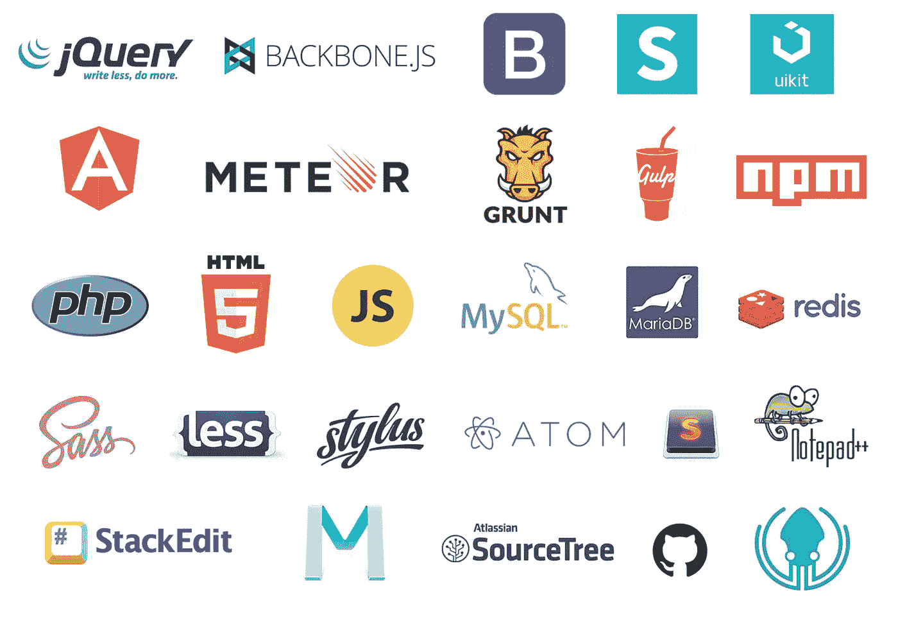

# 67 个有用的工具、库和资源，为您的 web 开发人员节省时间

> 原文：<https://medium.com/hackernoon/67-useful-tools-libraries-and-resources-for-saving-your-time-as-a-web-developer-7d3fb8667030>

在本文中，我不会谈论 React、Angular、Vue 等大型前端框架，也不会谈论 Atom、VS Code、Sublime 等已经流行的代码编辑器，我只想分享一个我认为有助于加速开发人员工作流程的[工具](https://hackernoon.com/tagged/tools)列表。

有些人可能已经看到了其中的大部分，但我很高兴如果有人发现一些新的和有用的东西。

这个列表包含了许多不同的资源，所以我将它们分组。

# Javascript 库

[**Particles.js**](http://vincentgarreau.com/particles.js/) —用于在网页上创建漂亮的浮动粒子的库

[**Three.js**](https://threejs.org/) —用于在网页上创建 3d 对象和空间的库

[**full page . js**](https://alvarotrigo.com/fullPage/#firstPage)**—轻松实现整页滚动功能**

**[**Typed.js**](http://www.mattboldt.com/demos/typed-js/) —打字机效果**

**[**waypoints . js**](http://imakewebthings.com/waypoints/)—当你滚动到一个元素时触发一个功能**

**[**highlight . js**](https://highlightjs.org/)—web 的语法高亮显示**

**[**Chart.js**](http://www.chartjs.org/) —只用 [javascript](https://hackernoon.com/tagged/javascript) 制作漂亮的图表**

**[**即时点击**](http://instantclick.io/)——显著加快网站加载时间，在鼠标悬停时预加载资源**

****—另一个图表库****

****[**Motio**](http://darsa.in/motio/#!introduction) —一个基于精灵的动画和平移库****

****[**动画效果**](http://git.blivesta.com/animsition/)—CSS 动画页面过渡的 Jquery 插件****

****[**Barba.js**](https://github.com/luruke/barba.js) —流畅的页面过渡****

****[**twenty twenty**](http://zurb.com/playground/twentytwenty)——一种视觉差异工具，用于发现差异****

****[**Vivus.js**](https://github.com/maxwellito/vivus#vivusjs) —一个在 SVG 上制作绘图动画的库****

****[**Wow.js**](http://mynameismatthieu.com/WOW/) —滚动时显示动画****

****[**scroll ine . js**](https://github.com/anthonyly/Scrolline.js)—查看您已经滚动了多少，直到页面结束****

****[**velocity . js**](http://velocityjs.org/)——非常快速流畅的 javascript 动画****

****[**卷轴上的动画**](http://michalsnik.github.io/aos/)——相当简单明了****

****[**handlebars . js**](http://handlebarsjs.com/)—Javascript 模板****

****[**jInvertScroll**](http://www.pixxelfactory.net/jInvertScroll/)—视差滚动****

****[**一页滚动**](https://github.com/peachananr/onepage-scroll)——又一个一页滚动库****

****[**Parallax . js**](https://github.com/wagerfield/parallax)—对智能设备的方向做出反应的视差引擎****

****[**type ahead . js**](http://twitter.github.io/typeahead.js/)—搜索完成****

****[**drag dealer . js**](http://skidding.github.io/dragdealer/)—蛮酷的拖库****

****[**Bounce.js**](http://bouncejs.com/) —制作超酷的 CSS3 动画****

****[**page piling . js**](https://github.com/alvarotrigo/pagePiling.js)—一页滚动****

****[**Multi scroll . js**](https://github.com/alvarotrigo/multiscroll.js)**—将一个网站多重滚动成两个垂直滚动面板******

******[**Favico.js**](http://lab.ejci.net/favico.js/) —动态图标******

****[**Midnight.js**](http://aerolab.github.io/midnight.js/) —动态切换固定标题****

****[**Anime.js**](http://animejs.com/) —动画库****

****[**键码**](http://keycode.info/) —获取被按下按钮的 javascript 键码****

****[**可排序**](http://rubaxa.github.io/Sortable/) —拖动&放下****

****[**flex datalist**](http://projects.sergiodinislopes.pt/flexdatalist/)—自动完成****

****[**slide out . js**](https://slideout.js.org/)—移动应用的滑出式导航菜单****

****[**Jquerymy**](http://jquerymy.com/#/) —使用 jquery 的双向数据绑定****

****[**Cleave.js**](http://nosir.github.io/cleave.js/) —键入时格式化内容****

****[**页面**](http://smalljs.org/client-side-routing/page/) —单页面应用的客户端路由****

****[**selectize . js**](http://selectize.github.io/selectize.js/)—添加标签的混合选择框****

****[**漂亮的选择**](http://hernansartorio.com/jquery-nice-select/) —用于创建漂亮选择框的 Jquery 库****

****[**系绳**](http://tether.io/) —有效地连接绝对定位的元素****

****[**shepherd . js**](https://github.com/HubSpot/shepherd)—引导用户使用你的应用****

****[**工具提示**](https://github.com/HubSpot/tooltip) —名字本身就说明了一切****

****[**选择 2**](https://select2.github.io/) —选择框的 Jquery 替换****

****[**IziToast**](http://izitoast.marcelodolce.com/) —轻松实现 js 通知****

****[**IziModal**](http://izimodal.marcelodolce.com/) —易于实现的 js 模态****

# ****CSS 库/设计材料****

****[**animate . CSS**](https://daneden.github.io/animate.css/)—动画库****

****[**平面 UI 颜色**](https://flatuicolors.com/) —简单有效的主色列表****

****[**Material design lite**](https://getmdl.io/index.html)**—基于 Google 的 Material design 框架******

******[**Materialui.co**](https://www.materialui.co/)—材料设计框架的众多资源******

****[**Colorrrs**](https://www.webpagefx.com/web-design/random-color-picker/) —随机颜色生成器****

****[**节分隔符**](https://tympanus.net/Development/SectionSeparators/) — Css 节分隔符****

****[**面漆**](http://topcoat.io/) —框架****

****[**创建肯·伯恩斯效果**](https://www.kirupa.com/html5/ken_burns_effect_css.htm) —使用 css3 动画制作肯·伯恩斯效果****

****[**DynCSS**](http://www.vittoriozaccaria.net/dyn-css/) —给 CSS 添加函数，使其动态化****

****[**魔幻动画**](https://www.minimamente.com/example/magic_animations/)——名字本身就说明了一切****

****[**CSS spin**](https://webkul.github.io/csspin/)—CSS 微调器集合****

****[**羽化图标**](https://feathericons.com/) —图标****

****[**离子图标**](http://ionicons.com/) —图标****

****[**字体牛逼**](http://fontawesome.io/) —图标****

****[**字体生成器**](http://brandmark.io/font-generator/) —组合多种字体，创建混合字体****

****[**开/关开关**](https://proto.io/freebies/onoff/) —在 css 中创建开/关开关，适用于检查或单选按钮****

****[**UI 套件**](https://getuikit.com/) —框架****

****[**引导**](http://getbootstrap.com/) —框架****

****[**基础**](http://foundation.zurb.com/) —框架****

****[**小部件**](https://niceverynice.com/little-widgets/) — Html 模板集合****

# ****有用的产品/链接****

****[**封装链接**](http://capsulelink.com) —将链接组合、保存并作为一个整体发送****

****[**<head>cheat sheet**](https://github.com/joshbuchea/HEAD)—可以放入< head >标签的所有内容的列表****

****[**Ghost**](https://ghost.org/) —基于 node.js 的简单博客平台****

****[**什么运行**](https://www.whatruns.com/)——Chrome 插件，发现什么技术被用来建立一个网站****

****[**学习任何东西**](https://learn-anything.xyz/learn-anything)——分解某个主题的强大思维导图****

****这是我个人已经使用了一段时间的一些工具/框架/库的列表。****

****欢迎在[**Twitter**](https://twitter.com/ognjengt)**上联系我，并在那里分享你的一些发现。******