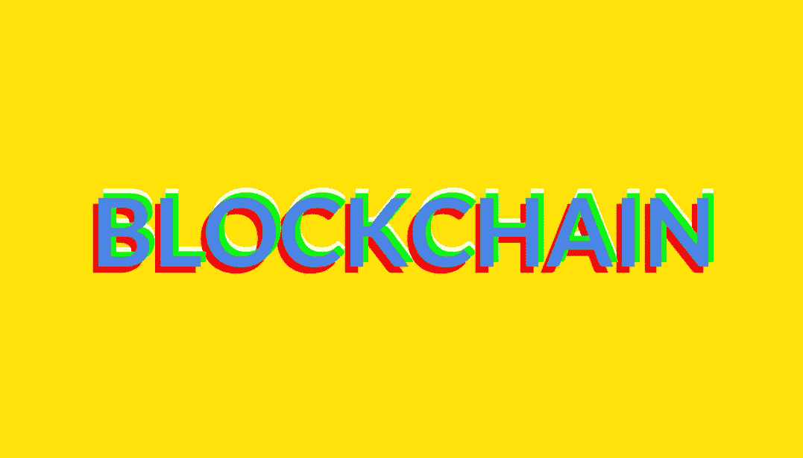

# 7 个值得关注的区块链颠覆者

> 原文：<https://medium.com/hackernoon/7-blockchain-disruptors-to-watch-bb09192916a3>

## 区块链初创公司、开源项目和组织正在探索技术的未来。

“[区块链]之于比特币，就像互联网之于电子邮件:一个巨大的电子系统，你可以在其上构建应用程序，”[金融时报](https://medium.com/u/edb4c644ad37?source=post_page-----bb09192916a3--------------------------------)，[2015 年](https://www.ft.com/video/2be94381-66dc-3320-a292-6a1cde0a3d5f)的科技记者[Sally Davies](https://medium.com/u/f53af03b578e?source=post_page-----bb09192916a3--------------------------------)说。

她补充道，“货币只是其中之一，”她指的是比特币，区块链谈论最多的网络之一。另一个著名的是以太坊。

今天，无论是在金融科技领域还是其他领域，似乎都有一股专注于区块链技术的活动、项目和创业热潮。

但是像亚马逊、谷歌和脸书这样的科技巨头在哪里呢？

以太坊[的联合创始人 Joseph Lubin](https://medium.com/u/d626b3859bc9?source=post_page-----bb09192916a3--------------------------------) 认为，大部分大型科技公司都没有即将到来的区块链计划或对这一领域的兴趣。

“甲骨文才刚刚开始他们的区块链之旅，”[他在](http://fortune.com/2017/10/30/google-amazon-apple-ethereum-blockchain/) [Quartz](https://medium.com/u/7f1a35bb87fb?source=post_page-----bb09192916a3--------------------------------) 的*上说今年十月*接下来会发生什么。*“苹果似乎很大程度上漠不关心，毫无察觉；谷歌正在进行投资，但不清楚他们是否有很多活动在进行；亚马逊，我们还没有看到那么多，所以我们会看到。”*

《石英》的主编凯文·德莱尼向鲁宾施压，“你认为区块链理工大学有推翻其中一些的风险吗？。"

“是的，我完全可以想象一个分散的亚马逊，”卢宾回答道。“我们已经看到了碎片。它们并不都是相互关联的。他们还没有完全成熟，但我可以想象一个由许多不同角色的不同演员组成的开放平台。”

卢宾还表示，脸书也可以做到这一点:“我们可以建立分散的平台，提供同样的服务。”

那么，在区块链空间里，谁值得关注呢？以下是我喜欢的七名区块链球员。你最喜欢的球员有哪些？

# 状态

[Status](https://medium.com/u/fbf3ec9c4a40?source=post_page-----bb09192916a3--------------------------------) ( [status.im](https://status.im/) )是一个创新项目，引入了一个基于以太坊区块链的去中心化浏览器。该平台旨在成为第一个完全基于点对点技术的移动以太坊客户端。开源移动平台充当了基于以太坊的去中心化应用(或 DApps)和服务的网关。据该公司称，基础产品可以访问加密信息、智能合同、数字货币等。

公司[最近宣布](https://blog.status.im/1m-bounty-new-coo-ex-google-and-more-announced-at-devcon3-7c3ed1386a24)一个新的首席运营官，长期*谷歌人*纳比尔·纳格迪，他以前领导谷歌地图和谷歌航班产品。

“作为一个爆炸性的新生产品类别的一部分，地位和以太坊生态系统正处于一个转折点，”Nabil 在 [Medium](https://medium.com/u/504c7870fdb6?source=post_page-----bb09192916a3--------------------------------) 上说道。

> 幸运的是，有一个异常活跃的社区正在将区块链和以太坊推向一个更大的舞台。

Status 的联合创始人卡尔·贝内特(Carl Bennetts)说:“Status 完全致力于实现去中心化。”。“我们意识到存在挑战，还有许多工作要做，但我们的目标仍然是为所有人创造一个以太坊供电的世界。”

Status 总部位于瑞士楚格。

# 块堆栈

开源项目 [Blockstack Inc](https://medium.com/u/6c20f6cd99d6?source=post_page-----bb09192916a3--------------------------------) 是一个新的去中心化应用互联网——在本地运行，没有远程服务器——用户拥有他们的数据。借助 Blockstack，用户可以获得数字密钥，从而拥有自己的身份。他们在本地登录应用程序，无需远程服务器或身份提供商。它的存储系统允许用户携带自己的存储提供商并控制他们的数据，加密并在应用程序之间轻松共享。该平台使用比特币和其他加密货币进行简单的点对点支付。

[block stack 的联合创始人兼首席执行官](/@muneeb/the-next-wave-of-computing-743295b4bc73)[穆尼布·阿里](https://medium.com/u/8dd3ab013f82?source=post_page-----bb09192916a3--------------------------------)在 Medium 上的一篇帖子中说:“下一波计算将会大规模脱离云计算。

> 分散计算是一个巨大的趋势，但却没有得到应有的关注；它可能会产生比桌面和云革命更大的经济、社会和政治影响。

Blockstack 是一家位于纽约州纽约市的公益公司。

# 起源

[出处](https://medium.com/u/2cac22865e2f?source=post_page-----bb09192916a3--------------------------------)([provenance.org](https://www.provenance.org/))正在利用区块链建立材料和产品的可追溯系统。这是一个用于安全存储信息的数据系统，本质上是可审计、不可更改和开放的。该公司正致力于开发一个开放的可追溯性协议——任何人都可以用它来追踪任何东西的来源，从咖啡豆到一卷织物。

该公司创始人兼首席执行官[施巧灵·贝克](https://medium.com/u/a90190fd553d?source=post_page-----bb09192916a3--------------------------------)在接受[数字货币集团](https://medium.com/u/a6be2334cd52?source=post_page-----bb09192916a3--------------------------------) [采访](https://insights.dcg.co/women-in-blockchain-jessi-baker-provenance-67c70330d9a7)时告诉 [Meltem Demirors](https://medium.com/u/6cf31b9735f9?source=post_page-----bb09192916a3--------------------------------) “出处正在解决我们所购买的东西信息严重缺乏的问题。

> 我们生活在信息和高度互联的时代，但作为消费者，我们仍然与产品的来源和经历脱节。

出处总部设在英国伦敦。

# 殖民地

[Colony](https://medium.com/u/d3a386f7b02e?source=post_page-----bb09192916a3--------------------------------)([Colony . io](https://colony.io/))是一个面向开放组织的操作系统。该公司正在以太坊和区块链上建立基础设施，旨在改造组织和公司的工作和协作方式。该平台承诺使人力资源和项目管理更加公开、公平和高效。

“通过显著降低劳动力市场交换机制的交易成本，以及人们合作所需的信任，Colony 带来了一种新的‘公司性质’，”Colony 联合创始人杰克·杜罗斯告诉 [比特币杂志](https://medium.com/u/da165ee059da?source=post_page-----bb09192916a3--------------------------------)。

> 我们将殖民地视为未来组织的基础设施。我们认为基础设施应该是可靠和公正的；一个组织不应该依赖另一个组织的存在或允许来运作。

Colony 总部位于英国伦敦。

# 波尔卡多特

TechCrunch 最近宣布,Polkadot([Polkadot . io](https://polkadot.io/))筹集的资金突破了 1.4 亿美元大关，以连接私人和公共区块链。TechCrunch 解释说，该平台作为“多个区块链之间的交换和翻译平台，在区块链以太坊开发的创意人员一直在寻找这些平台，以建立大量新的项目和基础设施”。

在我看来，这一切都是为了建立一个“知识共享空间”，人们可以在这个基础上进行 21 世纪的社会实验；对等技术公司的创始人加文·伍德说:“在这个词的两种意义上，它都应该尽可能地自由。

# SLOCKIT

[slock . it](https://medium.com/u/e0abbf7216d5?source=post_page-----bb09192916a3--------------------------------)([slock . it](https://slock.it/))在物联网(IoT)和区块链技术的交汇处运营。该公司的使命是通过*通用共享网络*项目——或 USN，开发共享经济的未来基础设施。这个新平台是一个开放源代码的基础设施，可以在其上部署区块链应用程序模块，这将使第三方能够轻松地将任何对象装载到 USN 上，而无需“请求许可”。

该公司的联合创始人兼首席执行官 Christoph Jentzsch 表示:“有了 USN，出租公寓和办公室将完全自动化，智能物体将按需出租，闲置车辆将获得新的生命。

“在这种情况下使用区块链技术的主要优势是从根本上简化了用户的旅程:*打开应用程序>在附近找到一个对象>支付费用>使用它*，”联合创始人兼首席运营官[斯蒂芬图阿尔](https://medium.com/u/1998e2015f47?source=post_page-----bb09192916a3--------------------------------)解释道。“所有东西都只有一把钥匙(你的智能手机)，由于明智地使用了安全押金，无需注册或登录。”

该公司位于德国米特韦达。

# 公民的

[民间:自给自足的新闻](https://medium.com/u/af0892caae93?source=post_page-----bb09192916a3--------------------------------)([joincivil.com](https://joincivil.com/))，一个去中心化的新闻制作平台，[最近宣布从区块链风险制作工作室](https://www.prnewswire.com/news-releases/civil-announces-5-million-in-funding-from-consensys-300542605.html) [ConsenSys](https://medium.com/u/6c7078bf7b01?source=post_page-----bb09192916a3--------------------------------) 获得500 万美元的资金。这个位于区块链的平台使记者之间能够建立直接联系，并将保护记者免受审查和知识产权纠纷的影响，同时大大限制误传。

“在 Civil 的自治市场中，读者可以直接赞助新闻编辑室，记者合作经营自己的出版物，”一份新闻稿称。“读者可以订阅 Civil 托管的出版物，并将使用 Civil 的加密货币或 *CVL* 代币来赞助个人记者、调查和故事，为新闻的收集和传播创造一种新的合作模式。”

此外，Civil 的独立新闻顾问委员会将海外平台，以确保公平，客观，专业的标准。

“通过为新闻人物——作家、编辑、摄影师、事实审查员——提供经济激励和治理结构，Civil 为新闻业提供了一种新的商业模式，”Civil 创始人[马修·艾尔斯](https://medium.com/u/ae7cb78d51a?source=post_page-----bb09192916a3--------------------------------)说。

> 我们的目标是为新闻业创造一个自给自足的全球市场，不受广告、假新闻和外界影响的影响。

Civil 总部位于纽约布鲁克林。