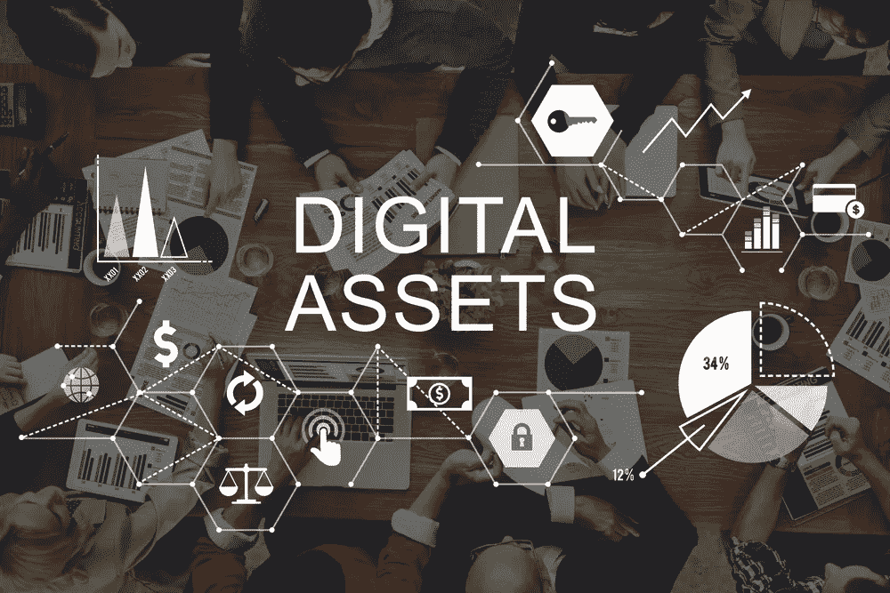

# 选择数字资产管理权的 7 个考虑因素

> 原文：<https://medium.com/hackernoon/7-considerations-to-choose-digital-asset-management-right-718922fd1232>

数字资产是具有巨大价值的持久力量。他们是新经济的燃料，因为各种组织都在努力实现日益数字化的驱动。随着数字资产海洋的不断扩大，以最佳方式管理每种类型的数字内容比以往任何时候都更加重要。

如今的组织投入了大量精力来提供响应迅速、个性化和引人入胜的体验。数字内容在这里扮演着非常重要的角色。并且， [**数字资产管理(DAM)解决方案**](https://pimcore.com/en/products/data-manager/digital-asset-management) 正在成为组织管理不断增长的内容量、简化和自动化流程以提高效率和质量的战略重点。

数字资产管理通过管理所有渠道的全渠道品牌和富媒体内容来支持解决方案(web 内容管理、电子商务和活动管理)。

它还有助于存储、访问、分发、再利用和货币化数字内容。事实上，一个好的大坝直接有助于底线。

组织认识到这一事实。他们希望转变其数字资产管理解决方案，以提高营销和销售绩效，从而获得更高的投资回报。

但是，这取决于他们的资产有多大，分布有多广，以及他们需要做多少整合。

在选择任何**大坝解决方案**之前，组织必须做出明智的决定。他们必须选择一个非常适合其结构的解决方案。此外，它还必须使他们能够快速采用该解决方案并获得业务收益。

> **Pimcore** 是一个屡获殊荣的面向 PIM、DAM、WCM 和商业的整合开源平台。想知道 Pimcore 的 DAM 平台能帮到你什么， [**试试这里的免费演示**](https://www.pimcore.org/en/resources/try) 。

# **以下是选择大坝平台时需要考虑的 7 个关键因素:**

**实施** —数字资产管理在提高活动和渠道中的品牌一致性方面发挥着关键作用。它服务于组织内外的许多角色。因此，它必须支持在管理全球或本地版本的资产、跨渠道的各种资产呈现以及与关键接洽系统的集成方面实现更大程度的自动化。

**集成** —数字资产管理解决方案应该与组织的现有基础设施很好地集成。对于创造性的工作流和批准、协作和版本控制来说应该是容易的。您的 DAM 解决方案还必须允许您利用与营销活动管理、营销自动化和营销技术平台的深度集成来提高营销灵活性。

**管理** — It 应该提供更深入的功能，以更低的成本和更少的麻烦高效地管理各种内容。因为，DAM 是您的营销和销售团队的创意创新实验室。它必须减少搜索资产所花费的时间，简化审批流程，便于与外部利益相关方更好地协作，并提供更好的当前状态可见性。

**基础设施** — DAM 应该兼容现有的以及现代的基础设施(如云和移动性)，这样从长远来看可以避免不必要的成本。下一代 DAM 系统必须利用云和移动性，使所有团队在需要时随时随地更容易地访问和共享。

**安全性** —它必须提供强大的安全性、元数据和工作流功能，以及支持或添加 *n 个*资产的可扩展性。

**富媒体功能** —如今，富媒体是批量创建的。DAM 解决方案应该为音频、视频和图像提供强大的支持(具有格式转换功能以及图像和富媒体的预览和编辑功能),以支持当今快速响应的跨频道数字体验。

**采用**—DAM 平台必须易于被内部和外部团队采用(使用基于角色的可访问性)，以便尽快实现业务价值。它必须使团队能够更好地重用资产，避免重复工作和返工，并减少已创建但从未使用过的数字资产的数量。

**底线是**:这与您选择什么样的数字资产管理平台无关。但更重要的是，DAM 解决方案如何让您围绕整个资产周期创造价值——改善协作、强化品牌、加速活动和提高投资回报率。此外，提供您一直追求的令人惊叹的客户体验。