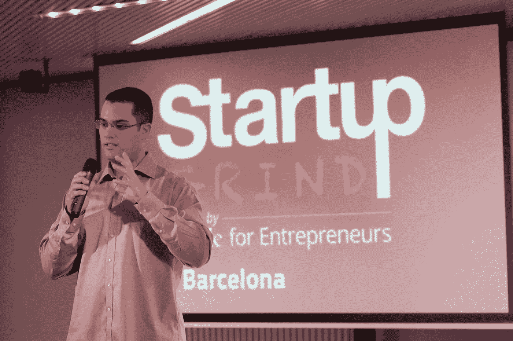
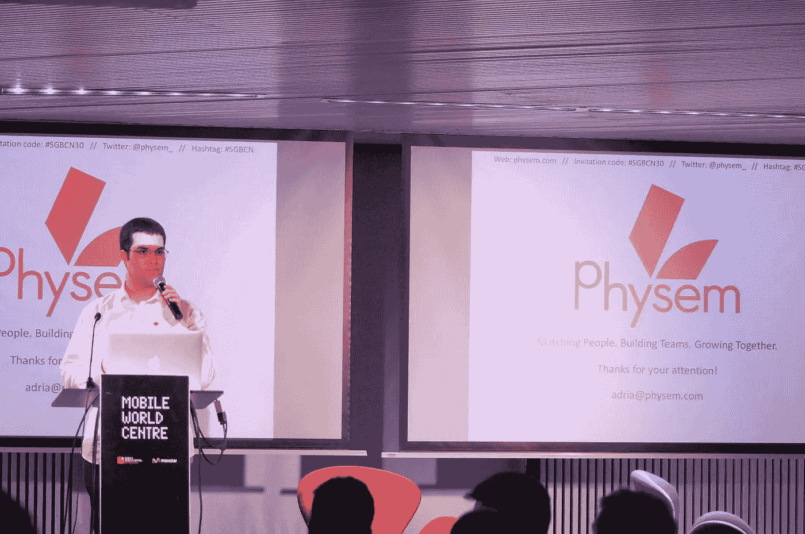
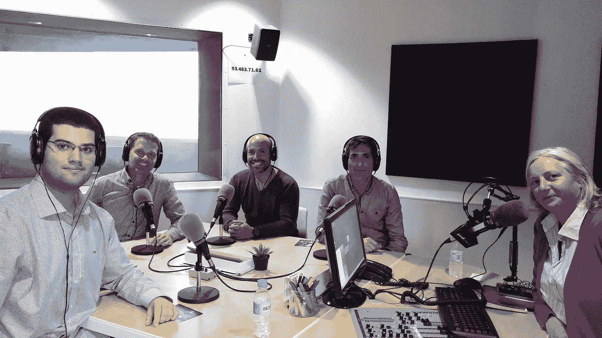
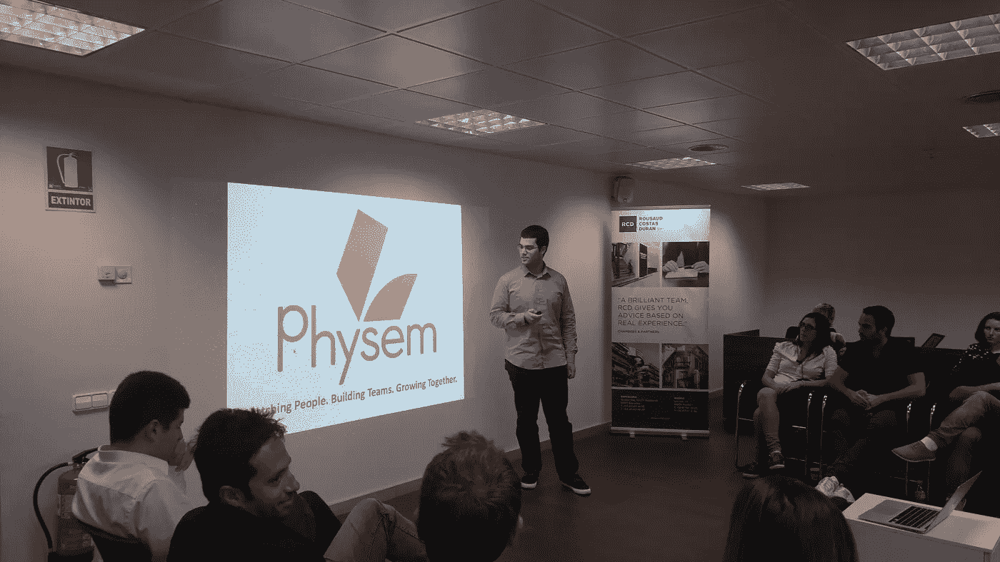

# 作为一个初创公司的创始人，我学到的关于公开演讲的 7 课

> 原文：<https://medium.com/hackernoon/7-lessons-i-learned-about-public-speaking-as-a-startup-founder-ff6b9ff9d138>

…这样你就可以避免我的错误

## 1.务必要很早到达。仅仅及时是不够的。

及时到达就足够了，对吗？

我完全错了，而且我是吃了苦头才知道的…

今年早些时候，在我为初创公司 Grind Barcelona 做的第一次主题演讲中，我匆忙赶到，离上台不到两分钟。

我汗流浃背，迷失方向，在去那个地方的路上摔倒在街上(在这个过程中伤了一只手和一个膝盖)，紧张，我感到一种令人窒息的压力。

这导致了我有史以来最糟糕的开始，一场濒临彻底失败的演讲。

吸取的教训:养成至少提前 20 分钟到达目的地的习惯。

## 2.总要有一个后备的个人故事。

我们都喜欢听故事，没有什么比好故事更能吸引我们的注意力了。

我总是听到这种说法，但从未真正体验过，就像我在第一点的启动研磨中做的第一次演示一样。

这是迄今为止我做过的所有演讲中最糟糕的开始，尽管我之前已经有过一些经验。

我在舞台上完全瘫痪了，头脑一片空白，从那一刻的尴尬中近乎惊恐发作。

我深吸一口气，告诉自己投降不是一个选项。

然后我就开始自动讲述我的企业家故事，就像我亲身经历的一样。在谈了一两分钟后，我平静下来，我开始再次感到强大和舒适，在演讲的每一秒钟，我的信心都在增长。

它以与初创公司 Grind Barcelona community 的惊人问答达到高潮，后来在活动的网络部分继续进行。

我仍然记得那次特别的演讲，那是我最糟糕的开始，同时也是我最好的结束之一。

**经验教训:总要有一个你能快速回忆起来的个人故事，以防你得了舞台麻痹，发现自己头脑一片空白，濒临崩溃或惊恐发作。**

## 3.使用对你有利的肢体语言。

在第二点可怕的开始经历后，我开始寻找解决办法，这样它就不会再发生了。

我在控制我的肢体语言中发现了这一点，并把它用在我的优势上。

一开始我持怀疑态度，但是因为练习力量体式非常简单容易，所以我试了一下。

发生的情况是，你的睾丸激素水平上升(提高表现)，你的皮质醇水平下降(压力荷尔蒙)。另外，当你做的时候感觉很好(即使开始的时候有点奇怪)。

现在，力量姿势已经成为一个稳定的姿势，不仅是为了准备公开演讲，也是在我的日常生活中。

在巴塞罗那初创公司 Grind Barcelona 的第二个主题演讲中，我站在大厅的后面(谨慎地做)，高举双臂，试图拓展自己，占据尽可能多的空间。

这是我第二次在 Startup Grind，我的演讲开始得非常顺利，没有任何负面情绪。

当这是不可能的，我不能从座位上站起来时，我所做的就是尽可能地扩展我的胸部和加宽我的肩膀。这个姿势没有那么有力，但它是一个很好的第二选择。

学到的经验:找到一种适合你的方法来解决演示中的问题。我发现我的解决方案是利用身体语言来为我所用。

## 4.总是做一个简短的陈述。

这是我在第一次创业营销竞赛中犯的最明显的错误:准备一份根据我被分配的时间进行调整的演示文稿。

给了我 5 分钟时间，我做了一个 5 分钟的陈述。一切看起来都很正常，直到我被叫上台，遥控器坏了。

当我给她一个信号时，组织者迅速在电脑上找了一个人来换幻灯片。

在我的演示中没有任何误差，这种分心足以扼杀我的演示节奏，当我到达 4 分钟的标记时，我不得不匆忙完成最后的幻灯片。

**经验教训:在简短的演示(2-3 分钟)结束时，至少要留出 30 秒，一般的演示(4-7 分钟)要留出 1-2 分钟，较长的演示(8-15 分钟)要留出 3-4 分钟。**

幸运的是，尽管我犯了这个错误(以及其他错误)，但我最终赢得了最具创新性的初创企业奖。

## 5.让每一天都成为你真正的练习。

我有一件事要坦白:在上台之前，我从来没有练习过演讲。

嗯，至少不是每个人都会告诉你应该总是这样做。

我没有在镜子前或与你熟悉的人一起为每次演讲做具体练习，而是每天向我遇到的每个人推销我的创业公司，这是我真正的练习。

我讨厌做重复的事情，我喜欢认识新的人，所以通过将这两者结合起来，我发现了练习和提高我的表达技巧的完美方法，那就是向我遇到的几乎每一个陌生人推销。

这也教会了我要时刻准备着，并允许我通过频繁尝试不同的策略来更快地改进我的推销，这样我就可以分析什么最有效(对谁有效)以及什么需要调整。

**经验教训:找到你自己的方法来提高你的推销和演讲技巧，一种对你有效并且你喜欢做的方法，因为你会经常这么做。**

## 6.个性化赢得胜利。

我在第一次公开演讲中犯的另一个错误是，我认为我可以把科技企业家和风险投资者作为目标受众。

我错了。

一年前，我在方正研究所的一次活动中做了一个非常成功的简短推介(组织者要求我做一个即兴推介)，之后我分析了为什么我在活动结束后获得了如此大的观众反响以及如此多的问题和会面要求。

我发现了两个原因:

*   讲故事。我的演讲是围绕我的个人故事展开的。
*   连接。由于我和我的观众之间有如此多的相似之处，我在不知情的情况下成功地给了他们一个能引起强烈共鸣的机会。

不久之后，我又在另一个活动中做了 1 分钟的演讲，我特别设计了这个活动来吸引来宾(巴塞罗那科技生态系统中的关键人物)的注意力。

我和他见面两周后。

**经验教训:养成习惯，尽可能多地收集关于你的听众的信息，这样就更容易与他们联系。如果你的目标是一个关键人物，确保你的演讲尽可能具体，以引起她的注意，并安排一次会议。**

## 7.为 d*ck 投资者做好准备。

今年早些时候，Physem 是巴塞罗那的 10 家初创公司之一，被选中与一位来自巴黎的法国投资者私下会面，该投资者代表了欧洲一家大型风险投资公司。

这家风险投资公司只有一年的投资经验，但它是我见过的最傲慢、最混蛋的风险投资公司，有严重的自我控制问题，完全缺乏礼貌，完全不知道什么是尊重。

背景:上午的会议开始得很晚(不管是出于什么原因，我不记得了)，风投做了一个(太长的)介绍性陈述(几个月前在网上发布)，中途停了一下，会议结束了，进入了下午。

有趣的是，每次演讲后，他给企业家的风险投资反应和“反馈”都变得越来越积极，而与演讲本身无关。

我的猜测是，他越来越饿了，这有助于增加他不太理想的个性特征，因为他在第三次投球后显然无法表现得专业。

对我来说不幸的是，我是第二个最后做演示的人。

为了向你展示他的反应水平，以下是他反对我的观点的两个理由:

*   他认为自己没有理由使用该应用程序(该应用程序的目标是千禧一代/Z 代)。
*   如果这个行业的其他人(包括过去的他自己)都以某种方式做事，我们应该适应并朝着同样“成熟”的方向前进。

如您所见，没有必要再进一步阐述这些荒谬的反对意见。尽管如此，我还是尽了最大努力回应他的疑问，澄清我的想法。

他的反应是什么？用一张疯狂的脸挑衅性地打断我的回应，当着所有人的面大喊大叫并攻击我。

当时我有两个选择:

*   反击并公开揭发他(我之前研究过他，所以很容易)。
*   就在这里结束问答，不要把更多的时间浪费在无聊、无用的讨论上。

我选择了第二个方案。尽管让他尴尬，让他无言以对可能很有趣，但不值得让自己降到他的水平。

幸运的是，有真正关心并希望帮助企业家成功的投资者。

在我的最后一次演讲(目前为止我做得最好的一次)中，在巴塞罗那 2016 年全球电子商务峰会期间，来自公众和投资者的反馈非常棒，非常有用和有建设性，特别是来自 Startupbootcamp 导师 Marc Wesselink(顺便说一下，是他选择并邀请我在峰会上进行推介)。

经验教训:d*ck 投资者不值得你浪费时间，只要确保你认识的每一个企业家都意识到这一点，这样他们就不会浪费时间，最终，我们可以摆脱他们。而且记得反其道而行之，让创业社区知道谁是好的投资人。

顺便说一句，如果你是阿姆斯特丹的初创企业创始人，我强烈推荐你[马克·韦赛林克](https://medium.com/u/68040b6a7895?source=post_page-----ff6b9ff9d138--------------------------------)既是投资者又是导师。

.

喜欢阅读吗？请点击💚帮助传播消息。我很感激！

.

阿德里亚·埃尔南德斯

> [黑客中午](http://bit.ly/Hackernoon)是黑客如何开始他们的下午。我们是 [@AMI](http://bit.ly/atAMIatAMI) 家庭的一员。我们现在[接受投稿](http://bit.ly/hackernoonsubmission)并乐意[讨论广告&赞助](mailto:partners@amipublications.com)机会。
> 
> 如果你喜欢这个故事，我们推荐你阅读我们的[最新科技故事](http://bit.ly/hackernoonlatestt)和[趋势科技故事](https://hackernoon.com/trending)。直到下一次，不要把世界的现实想当然！

