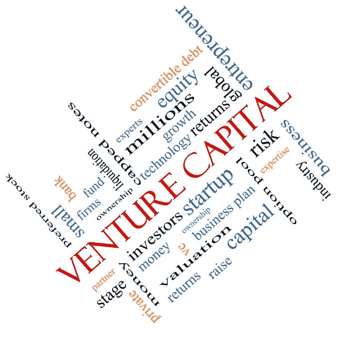

# 我作为风险投资基金经理的第一年学到的 7 个教训

> 原文：<https://medium.com/hackernoon/7-lessons-learned-in-my-first-year-as-a-venture-capital-fund-manager-d8dec9172cf1>

一年前，当我筹集我的第一笔风险投资基金时，我不可能告诉你在最初的 12 个月里我会学到什么。从某种程度上来说，这是一种学徒业务。你从实践中学习，从和专家一起实践中学习。这有助于在挑选赢家时完善你的判断和品味。在我看来，你可以通过为有经验的风投工作，或者和他们一起投资来获得学徒经验。我没有机会为风险投资公司工作，所以我筹集了自己的基金，并通过与他们一起投资向最优秀的人学习。

在[深空风险投资](http://deepspacevc.com/)投资的头 12 个月里，我学到了很多。我主要是从错误中学习，从一些花时间给我指路的伟大导师那里学习。有些导师是我在酒吧偶然遇到的，并与之交谈了 15 分钟的人(克里斯·萨卡在 NOLA 的[碰撞](https://collisionconf.com/))，有些是有兴趣帮助我的投资者。下面是我第一年学到的一些经验的总结。

***我投资初创公司第一年学到的 7 条重要经验:***

# **1)** **你可以从创始人那里学到很多关于如何成为一个好的投资人/合伙人/董事会成员的知识。**

去年，创始人是我最好的资源。当创始人和投资者聚在一起分享他们在一段关系中对彼此的期望时，就会出现一种有益的对话。创始人可以告诉你他们在寻找什么样的合作伙伴，当你进入竞争激烈的投资环境时，这变得非常重要。

# **2)痴迷于向每一个人学习，关于每一件事。**

如果你停止学习，哪怕是一秒钟，你都会被你的盲点所伤害。你的盲点是什么？你还不能知道。我不断识别新的，我识别不知道的东西的速度，远远超过我学习的速度(也许那是个人问题？).但是我可以接受这两个边界之间的差值(想象一个线图)，因为我可以向专家寻求帮助。我绝对害怕我所谓的“不明身份的未知”，你也应该害怕。

# **3)说“不”就可以了，赶紧去做。**

对于创始人(或投资者)来说，没有什么比徘徊不前、不高效地说“不”更浪费时间的了。如果你把创始人晾在一边，那么坏事就会发生。从他们的角度考虑一下，如果 30-40 个投资者稍微拖一拖他们，就会浪费一个创始人几周甚至几个月的时间。这不公平。

# 不要犹豫承认自己缺乏经验或知识。

[初创公司](https://hackernoon.com/tagged/startup)的生态系统，当然是在种子阶段，是一个非常开源的环境。你周围的许多人都想帮助你成功，包括创始人、其他投资者、加速器、导师、律师等。他们提供帮助的动机来自于他们需要看到生态系统的成长，所以要利用这一点。向他们寻求建议，问很多问题。

# **相信你的直觉，在它被你周围的人影响之前。**

希望你有好的品味，相信你的直觉，这是个好建议。如果你的品味很差，那么我想你最终会发现的，希望代价不高，但很可能是这样。我还不能说我有好的或坏的品味，因为我没有任何证据(没有退场——一年内)。当我感觉到自己在挑选赢家方面的好坏时，我会向你汇报。

# 与其他投资者建立关系，即使你必须先买通他们(参与交易)。

我从其他伟大的投资者那里学到了很多，我会向任何人推荐，去接触一些伟大投资者参与的交易，这样你就有机会直接向他们学习。从长远来看，花一小部分投资资本，与更好的投资集团达成更多交易，可能会有回报。

# 你做任何事都必须变得高效。

早期，我试图与几乎所有人进行面对面的介绍会议。显然效率不高。我想在见他们之前尽可能多地了解一家企业，目的是不浪费他们或我的时间。效率低下导致错失赢家。错过一个赢家，可能是你筹集下一个基金或成为一次性基金经理的区别！

[在 Twitter 上关注我@hazesyah](https://twitter.com/hazesyah)
[联系深空创投](http://deepspacevc.com/)

> [黑客中午](http://bit.ly/Hackernoon)是黑客如何开始他们的下午。我们是 [@AMI](http://bit.ly/atAMIatAMI) 家庭的一员。我们现在[接受投稿](http://bit.ly/hackernoonsubmission)，并乐意[讨论广告&赞助](mailto:partners@amipublications.com)机会。
> 
> 如果你喜欢这个故事，我们推荐你阅读我们的[最新科技故事](http://bit.ly/hackernoonlatestt)和[趋势科技故事](https://hackernoon.com/trending)。直到下一次，不要把世界的现实想当然！

