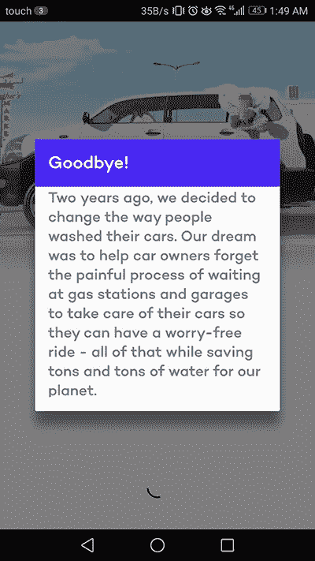
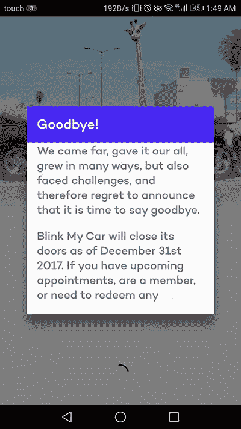

# 8+从眨眼我的车的失败中吸取的教训。

> 原文：<https://medium.com/hackernoon/7-lessons-to-be-learned-from-blink-my-cars-failure-f77972e255a2>

[**眨眼我的车**](http://blinkmycar.com/) (BMC)是一家黎巴嫩[初创公司](https://hackernoon.com/tagged/STARTUP)在贝鲁特提供按需洗车服务；一个很有希望的前提。在推出短短两年后，Blink My Car 宣布将停止运营。

眨眼我的车做得很好。提供优质的服务，建立一个真正好的品牌，吸引当地和地区投资者的注意，同时也为我们的星球做了一件好事，节约了水资源。

看到一家有前途的黎巴嫩初创企业走进死胡同，确实令人难过。但这也是从他们的故事中学到一些东西的好机会。

PS。我不知道关闭的真正原因。以下仅仅是我和其他创业者的一些观察和学习机会。

以下是我们可以从这家初创公司的故事中学到的八条经验:

大笔投资并不能保证成功。许多企业家认为投资是隧道尽头的光。这是他们成功所需要的！大多数企业家把他们的失败归因于缺乏投资。仅在 6 个月前，BMC 的种子基金让他们获得了 120 万美元，这是大多数黎巴嫩企业家梦寐以求的数额。作为一名黎巴嫩企业家，这个数字可能会让你往返月球。你以后会意识到，有些挑战比你拥有的钱更艰难。
***更新*** *:通过内幕消息澄清如下。虽然 BMC 筹集了 120 万美元，但这家初创公司在关闭前没有花光所有资金。在公司决定明智的决定是停止运营之前，只使用了大约 20 万美元。* ***红利教训*** *:尊重你的投资人，不要因为你有钱就烧钱！*

名人和广告不会成就一笔成功的生意。
BMC 在向目标市场展示他们的品牌方面做得很好。他们的第一个视频广告迅速走红。这个概念很棒。每个人都喜欢他们。然而，这似乎并没有转化为客户。许多创业公司的一个常见错误是相信广告能给他们带来商业的牵引力；有些人在他们的问题上砸了很多广告费。不管用。
***更新*** *:通过内幕消息澄清如下。这里提到的广告活动是利用创始人的资源、关系和技能，以几乎零成本启动和完成的。* ***额外收获第二课*** *:建立一个有价值的人脉网络，想出创造性的方法，以尽可能低的成本产生有影响力的活动。*

**环保？谁在乎呢。BMC 声称每次洗涤可节约 250 升水。厉害！但在现实世界中，谁在乎呢？顾客通常不关心你的产品是否环保或对社会负责。人们会购买你的产品，因为它对他们有益，而不是因为它对环境有益。对社会和环境负责应该是锦上添花，而不是蛋糕上的面糊。**

**改变人们的习惯并不容易。无论是你使用公共交通的方式，还是你点餐的方式，甚至是购买食品杂货的方式，所有试图改变这些习惯的企业都必须进行大量积极的宣传活动，并致力于创造性的“增长黑客”策略，以说服潜在客户采用他们的服务。你可能习惯于在周末去村子的路上洗车，或者让大楼的看门人把车送到加油站，或者干脆忽略它，直到你忘记灰尘下面是什么颜色。无论你的习惯是什么，改变它都是困难的。试图改变人们习惯的生意并不容易。**

出色的客户服务大有裨益。
眨眼我的车就有了忠实粉丝！他们的客户服务达到了国际标准。有一次，在我提出一个小小的投诉后，我甚至收到了一封来自首席执行官的个性化电子邮件。不管你的产品是什么，如果没有优质的客户服务，它就没有多大价值。一些科技巨头，如亚马逊、易贝和 Zappos，就是建立在这个前提上的。

顾客可能会妥协一件事，而不是所有事。
没有什么是完美的。这就是为什么有竞争力的企业可以满足不同的需求和优先事项。BMC 希望迎合那些珍惜时间的人，因此愿意为上门的快速便捷服务支付额外费用。

服务企业建立在三个因素之上，速度/便利、价格和质量。就像你最喜欢的超级英雄或电子游戏角色一样，你不能得到一切，这也没关系。但是，有了 BMC，我发现三者都妥协了。

我试着闪了一下我的车。所以下面是基于单一的个人经历。

*价格—* 不用说，BMC 服务的定价很高。洗车的平均市场价格的 2 到 3 倍。但是，保险费是干什么用？

*速度？—* 从我下单的那一刻起，直到我拿到钥匙，我总共等了 2 个小时。任何一个把车开到洗车场的人都知道，即使在繁忙的日子里，也要比这少得多。便利，他们的主要价值主张，在我的情况下完全缺乏。

*质量？*—BMC 是一项移动服务，他们的工具自然非常有限。他们使用了一种手持真空吸尘器，这种吸尘器远不如真的吸尘器有效。他们使用化学喷雾而不是喷水，这也限制了汽车可以获得的清洁程度，而且只有一个人在你的汽车上工作，这限制了速度和对细节的关注。你明白了。它不如真品干净。

我会愿意妥协以上的一个，可能是两个。我可以接受超快的、不太干净的服务，或者超干净的、不太快的服务。但是为缓慢的、低于标准的清洁服务支付额外费用？没什么意义。

免责声明:这是一次性事件，可能不代表他们的一般做法。

试图解决 10 个人的问题并不能解决你自己的问题。
BMC 没有试图解决“没有足够的人使用我们的汽车清洗服务”的问题，而是推出了摩托车清洗服务。现在不得不面向两个细分市场，这可能只会让他们在自己的坑里挖得更深。

BMC 还推出了一些很棒但很不相关的服务，从带你的车去年检(担心我这周不得不去年检)到支付你的年度注册费。很明显这不再是眨眼的问题了。

试图解决更多的问题，过早地瞄准更多的市场，只会冲淡你的业务发展和营销努力。

**知道何时该说再见。承认失败是一项艰难的工作。说再见需要勇气。眨眼我的车做得如此优雅，而仍然是我们所知道的伟大品牌。知道结束了就不要一直拖着生意。**

