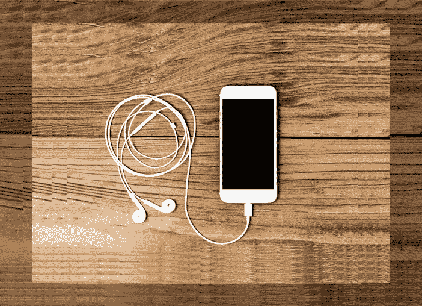
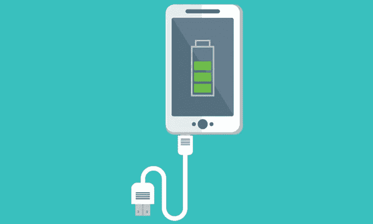
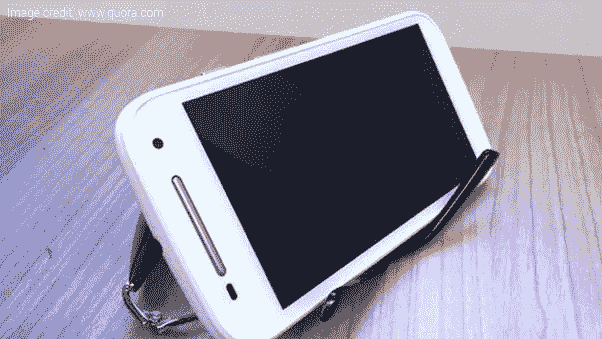
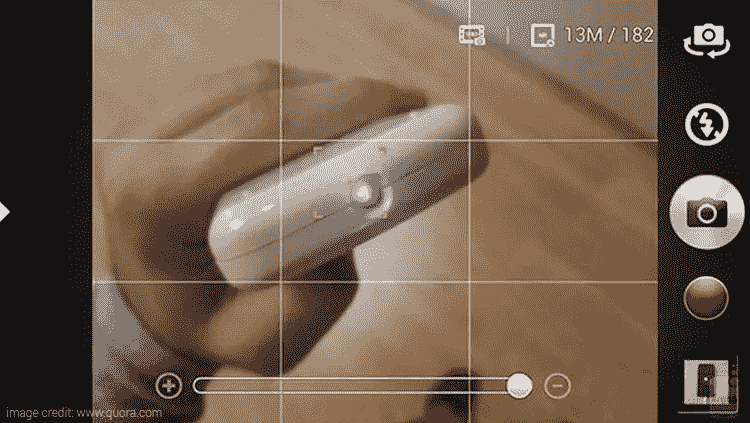
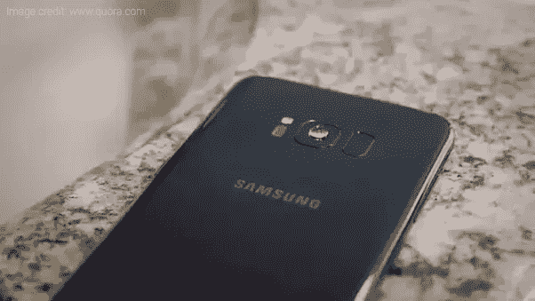
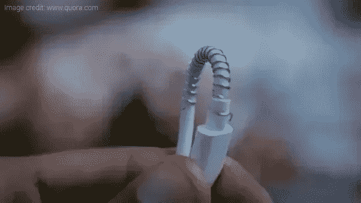

# 7 个令人震惊的智能手机黑客

> 原文：<https://medium.com/hackernoon/7-mind-blowing-smartphone-hacks-688a8108b965>

[Pricekart.com](https://www.pricekart.com)

如今，智能手机已经发展到了前所未有的高度。总有一天，一项新技术会被引入，它会比我们想象的更早出现在智能手机中。我们现在使用的手机具有指纹锁屏、前后摄像头、双摄像头、红外发射器、心率监测器等功能。

市场上大多数智能手机都是用户友好型的；因此，它不需要强大的学习曲线来解锁功能。然而，有一些事情你可能不知道你的手机能为你做什么。

即使你是一个精通技术的人，你可能也没有意识到与智能手机相关的每一个技巧和黑客行为。在这个故事中，我们收集了一些非常有用的智能手机技巧，你可以用它们来解决日常生活中的常见问题。我们开始吧。

## **1。** **加倍充电速度**

虽然一些最新的智能手机预装了快速充电功能，但仍有一些用户认为移动充电是一种痛苦。我们大多数人都知道，在关机状态下给智能手机充电会加快电池充电过程。

然而，你可以让你的设备一直开着，充电速度仍然可以翻倍。只需将智能手机调成飞行模式。它将停止您的设备的网络访问，并提高充电速度。

[Pricekart.com](https://www.pricekart.com)

## **2。** **在你的安卓手机上获得一个回收站**

与台式电脑和笔记本电脑不同，一旦你删除了智能手机上的文件，它就永远消失了。你可能需要一个特殊的数据恢复程序来恢复丢失的文件。但现在不是了。

您可以在 Android 手机上激活一个类似于我们在 Windows PC 或笔记本电脑上使用的回收站。只需下载一个名为 [Dumpster](https://play.google.com/store/apps/details?id=com.baloota.dumpster&hl=en) 的应用程序，它有能力在错误或匆忙的情况下保护文件删除过程。所有文件都存储在应用程序中，你可以在方便的时候删除或恢复。

毫无疑问，建议保持手机的存储空间干净，以加速手机的性能。您可以从垃圾箱中删除不需要的文件，节省宝贵的存储空间，并加快您的 [Android 手机](https://www.pricekart.com/mobile/android-mobiles-price-list)的速度。

[Pricekart.com](https://www.pricekart.com)

## **3。** **用智能手机摄像头当眼镜**

对于一个近视的人来说，把眼镜忘在家里当然是危机。不戴眼镜，他/她将不能清楚地看到远距离范围内的任何东西。因此，他/她将不得不接受他人的帮助，尤其是在通勤时。

在这种情况下，你可以使用智能手机的摄像头，看到你可视区域以外的东西。只需使用智能手机相机的变焦功能，就可以获得周围环境的对焦图像。

## **4。** **神奇的夜灯**

频繁停电仍然是发展中国家的一个主要问题。由于我们的智能手机，我们不必在这种情况下寻找蜡烛和应急灯，因为我们有内置的手电筒。尽管如此，手电筒发出的光通常是强烈的和集中的，这可能会伤害你的眼睛。

为了避免这种情况，你可以在智能手机的手电筒上放一瓶水。你被保了险。你的神奇夜灯准备好了。

## **5。** **检查你的遥控器**

当你的遥控器不起作用时，你有没有感到沮丧？你并不孤单。当从高处跌落或电池耗尽时，遥控器经常发生故障。

您可以使用智能手机摄像头[检测遥控器的红外信号](https://sony-paa-pa-en-web--paa.custhelp.com/app/answers/detail/a_id/167978/~/how-to-test-if-a-remote-control-is-sending-an-infrared-%28ir%29-signal.)。将遥控器的一端对准摄像机镜头，然后按遥控器上的按键。如果控制器正在工作，它将传输红外光，这将在智能手机的屏幕上可见。

## **6。** **获得 5 倍变焦相机**

如今，市场上大多数智能手机都配有微距镜头。尽管如此，智能手机相机的变焦效果不如数码单反相机或数码相机。

虽然市面上有各种手机相机配件来提高变焦能力，但你可以在家里免费获得 5 倍变焦功能。只需在你的智能手机相机镜头上滴一滴水(参考图片)，你将立即获得 5 倍变焦。

## **7。** **破解拯救和弦免受伤害**

和弦断开是大多数智能手机用户面临的常见问题。耳机、电源线、数据线、OTG 线和其他和弦在使用时很可能会损坏。

大部分时候，电缆的导线接触不良都是在端部。您可以在电缆末端拉出一个弹簧来保护电缆末端。

这些小技巧可以让你以不同寻常的方式使用你的智能手机。希望我们在这里提到的技巧能对你的日常生活有所帮助。